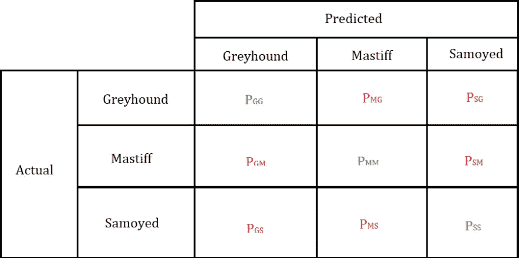

# 评估分类机器学习模型的指标(中等水平的学习者)

> 原文：<https://medium.com/analytics-vidhya/evaluating-metrics-for-classification-machine-learning-models-learners-at-medium-level-c956a8b8d889?source=collection_archive---------11----------------------->


这个题目是给那些对机器学习有一些基础知识的人看的。

在进入主题之前，让我告诉你一些事情。我们现在将看到的指标将从二进制分类的角度进行讨论。因此，首先，试着对这些概念有一个清晰的理解，这样之后你就可以理解我下一篇关于**多标签和多类别分类的评估指标的博客了(**你可以理解这是什么多标签和多类别分类以及当我讨论它们时的事情)**。**

**二元分类** :-二元分类意味着只有两类({0 或 1}、{男性或女性}、{是或否})。)在标签里。

在深入研究指标之前，您需要建立自己的分类模型。

现在，我将为您建立一个模型。

```
import pandas as pd
from sklearn.datasets import make_classification
from sklearn.model_selection import train_test_splitfrom sklearn.tree import DecisionTreeClassifierX,y = make_classification(n_samples=200,n_features=10,random_state=20)X_train,X_test,y_train,y_test = sklearn.model_selection.train_test_split(X,y,random_state = 43)model = DecisionTreeClassifier()
model.fit(X_train,y_train)
```

目前，我们有一个模型。

现在我们来学习一些分类指标。

为了理解分类标准，你需要理解叫做**混淆矩阵**的基本东西

**混淆矩阵** :-混淆矩阵是一个将传达你的模型对数据的正确和错误预测的矩阵。


让我们来理解什么是积极的和消极的，

让我们考虑预测给定图像是苹果**还是橘子**的问题陈述。我们以苹果为+ve 样本，橘子为-ve 样本(或者你也可以反过来考虑)。假设我们有 40 个苹果(+ve)样本和 10 个桔子(-ve)样本。假设我们的模型正确预测了 40 +ve 样本中的 35 个，正确预测了 10 -ve 样本中的 5 个。

在上图中，

**TP(真阳性)**:被真正预测为阳性的阳性。 **FP(假阳性)**:被错误预测为阳性的阴性。 **FN(假阴性)**:被错误预测为阴性的阳性。 **TN(真否定)** :-真正被预测为否定的否定。

所以现在，TP(真阳性)= 35，FP(假阳性)= 5，FN(假阴性)= 5，TN(真阴性)= 5。(先把这个事情搞清楚)。

没看懂的再读一遍。

到目前为止，你研究了二分类情况下的混淆矩阵。

让我们看看多类分类的情况。



如果你看到上面的图片，

Pgg 表示我们的模型正确地将**灰狗**预测为**灰狗**的预测数量。Pmg 代表我们的模型预测的数量**灰狗**为**獒**。Pgm 代表我们模型预测的数量**獒**为**灰狗**(现在试着理解其他术语 Psg，Pmm，Psm，Pgs，Pms，Pss)。

我们需要以这样一种方式构建我们的模型，即对角线元素(TP & TN)应该总是尽可能高。

```
from sklearn.metrics import confusion_matrix
print(confusion_matrix(y_test,y_pred))
```

现在，你可以自信地说"**我知道混淆矩阵😎**”。

现在让我们深入研究一下指标😉。

在此之前，完善建模和预测(浏览上面的代码片段)。

1.  **accuracy_score** :-当+ve 和-ve 样本数量相等时，使用此指标。该指标将表明测试数据集中有多少样本被正确分类。我们可以仅从混淆矩阵中计算准确度分数。

accuracy _ score =(TP+TN)/(TP+TN+FP+FN)

```
from sklearn.metrics import accuracy_score                                
print(accuracy_score(y_test,y_pred)
```

2.**精度** :-当我们的+ve 和-ve 样本数量不相等时，可以使用此指标。该指标将说明实际+ve 值中预测的+ve 值有多准确(请再次阅读以了解)。我们只能从混淆矩阵计算精度。但是，问题是 precision 将只考虑假阳性，并给出关于假阳性的效率，而不考虑假阴性。

*   让我们用 **P** 来表示精度(为了将来的目的)。

精度(P) = TP / (TP + FP)

```
from sklearn.metrics import Precision_score
print(precision_score(y_test,y_pred))
```

3.**回忆一下** :-这个指标会说，在预测的+ve 值中，有多少+ve 值被正确预测(再读一遍)。我们可以从混淆矩阵中计算召回率。召回的问题是，它将只处理假阴性，并且只给出关于假阴性的效率，而不考虑假阴性。

*   让我们用 **R** 来表示召回(为了将来的目的)

召回(R) = TP / (TP + FN)

```
from sklearn.metrics import recall_score
print(round(recall_score(y_test,y_pred),2))
```

4. **F1 分数:-** F1 分数是一个可以精确计算和召回的分数。F1 分数是精确度和召回率的调和平均值。F1 分数分数是通过考虑假+ves 和假阴性来给出效率的东西。F1 得分可以定义为“**精确度(P)和召回率(R)的调和平均值**”。

F1 得分= 2*P*R / (P + R)

```
from sklearn.metrics import f1_score
print(round(f1_score(y_test,y_pred),2))
```

注 :-我们可以看看 F1 分数，而不是分别看精确度和召回率，F1 分数既有精确度也有召回率。每当我们有不平衡的数据集时，我们需要查看 F1 分数，而不是 accuracy_score。

我们将在另一个博客中讨论 ROC_AUC 分数，因为你需要对一些事情有所了解才能进行研究。所以我们会在另一篇博客里深入了解 ROC_AUC。

# 结论:-

*   到目前为止，我们所研究的是重要的概念，也有助于你理解多类和多标签分类，其中相同的东西的精度，召回，和事情得到重复的一些不同的实现根据他们。
*   当我们有了平衡的数据集时，准确性就会显现出来。如果我们有不平衡的数据集，将会看到 F1 分数。

___________________________________________________________________

再次提醒一下，我接下来的两篇博客将讨论多标签多类别分类的 **ROC_AUC** 和**评价指标。**

跟我来:-【http://medium.com/@iamvishnu.varapally】T4

快乐学习！😁