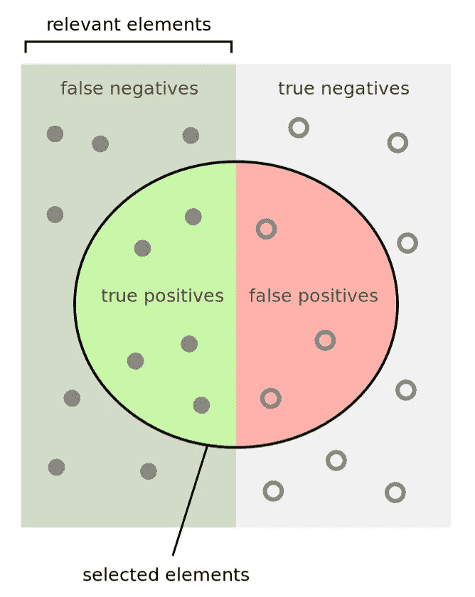
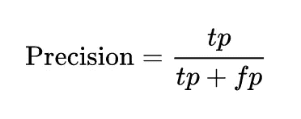
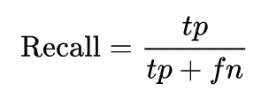
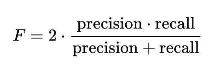
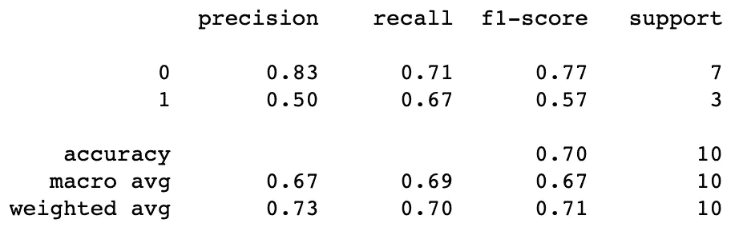

# 评估 ML 模型:精确度、召回率、F1 和准确度

> 原文：<https://medium.com/analytics-vidhya/evaluating-ml-models-precision-recall-f1-and-accuracy-f734e9fcc0d3?source=collection_archive---------4----------------------->

## 使用这些度量来确定模型是否有效



[上一篇文章](/@chris.the.data.scientist/why-accuracy-is-a-misleading-metric-in-machine-learning-3939fd37b942)我们讨论了准确性如何成为衡量人工智能模型性能的误导性指标。

那么我们应该用什么指标来代替准确度呢？精度、召回和 F1。

# 我们的例子

我们将解释与同一个例子相关的准确度、精确度、召回率和 F1，并解释每个例子的优缺点。

**举例:**

> 我们已经建立了一个模型来预测哪些公司可以存活 3 年以上。下面是对 10 家不同公司的预测。

1 =幸存
0 =失败

```
### Tabular Format ###
'''
Company No. 1 | 2 | 3 | 4 | 5 | 6 | 7 | 8 | 9 | 10
            --------------------------------------
Actual:     1   1   0   1   0   0   0   0   0   0 
Predicted:  1   1   1   0   1   0   0   0   0   0
''' ### In Python ###
y_true = [1, 1, 0, 1, 0, 0, 0, 0, 0, 0]
y_pred = [1, 1, 1, 0, 1, 0, 0, 0, 0, 0]
```

# 准确(性)

> 模型预测正确值的实例的百分比。(又名。预测公司成功或失败的正确案例百分比)

```
### Python ###y_true = [1, 1, 0, 1, 0, 0, 0, 0, 0, 0]
y_pred = [1, 1, 1, 0, 1, 0, 0, 0, 0, 0]from sklearn.metrics import accuracy_score
accuracy_score(y_true, y_pred)
>>> 0.7
```

乍一看，这似乎是一个很好的成功衡量标准，因为该模型实际上在大多数时候是正确的。但要看上下文。

如果你用这个模型来选择投资的公司，你的 4 笔投资中会有 50%亏损。在这种情况下，准确性不是评估模型的好指标。

# 精确



> 从检索到的所有实例中检索到的相关实例的比例。又名。预测成功的公司中正确预测的数量。

您可以为以下两种情况计算此指标:I)模型预测的情况`1`，以及 ii)模型预测的情况`0`。见下文，但积极的情况是最相关的例子。

```
### Python ###from sklearn.metrics import precision_scorepositive = precision_score(y_true, y_pred, pos_label=1)
print(positive)
>>> 0.5negative = precision_score(y_true, y_pred, pos_label=0)
print(negative)
>>> 0.8333333333333334
```

如果我们坚持选择投资公司的相同背景，那么 precision(对于正面案例)实际上是评估该模型的一个很好的指标。

你会知道不要投资模型推荐的公司，因为你知道它只有 50%的正确率

# 回忆



> 检索到的相关实例占检索到的相关实例总数的比例。又名。该模型发现了所有成功公司的百分之多少。

同样，相关的实例可能是`0`或`1`案例，但我们将在这里计算两者。

```
from sklearn.metrics import recall_scorepositive = recall_score(y_true, y_pred, pos_label=1)
print(positive)
>>> 0.6666666666666666negative = recall_score(y_true, y_pred, pos_label=0)
print(negative)
>>> 0.7142857142857143
```

这里我们看到，在成功的公司中，这个模型发现了 67%。在回忆中，我们不考虑我们错误预测了多少公司会成功，只是我们发现了那些会成功的公司。

如果环境正在进行投资，我们可能不会使用回忆来评估我们的模型。除非我们是一家风险投资公司，进行大量的小额投资，潜在的回报是 1000 倍，我们不想错过任何可能成功的公司。

# 子一代



> F1 是精确度和召回率的调和平均值。

F1 兼顾了精确度和召回率。

我认为这是一个保守的平均值。例如:
0.5 和 0.5 的 F1 = 0.5。
1 和 0.5 的 F1 = 0.66。
1 和 0.01 的 F1 = 0.02。

同样，我们可以对正反两种情况都进行计算。

```
### Python ###from sklearn.metrics import f1_scorepostive = f1_score(y_true, y_pred, pos_label=1)
print(postive)
>>> 0.5714285714285715negative = f1_score(y_true, y_pred, pos_label=0)
print(negative)
>>> 0.7692307692307692
```

当精确度和召回率都很重要时，我们通常使用 F1。在我的现实生活中，他们经常这样做。

# 结论

在我让你走之前，我们可以用这个 sklearn 报告同时打印所有分数。

```
### Python ###from sklearn.metrics import classification_reportreport = classification_report(y_true, y_pred)
print(report)
```



总之，背景总是重要的。这通常需要仔细的思考，领域知识和对你想要达到的目标的理解。