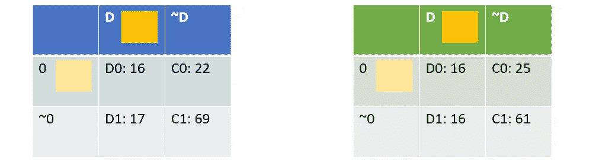

# 评估基础第一部分:混淆矩阵不再混淆

> 原文：<https://medium.com/analytics-vidhya/evaluation-basics-part-i-no-more-confusion-for-confusion-matrix-dfb9c1307656?source=collection_archive---------19----------------------->

## 本文解释了什么是混淆矩阵以及如何使用它。

艾米丽·莫特在 [Unsplash](https://unsplash.com/) 上的照片

评估是机器学习的重要组成部分。评估结果告诉我们特定的机器学习算法执行得有多好。评估还有助于解释为什么特定的模型具有特定的行为，并提供改进性能的方向。

在这个系列中，我们将重点关注对[分类任务](https://en.wikipedia.org/wiki/Statistical_classification) s 的评估。也就是说，根据给定的历史观察，确定某些实例属于哪个类。我将解释几个评估指标的概念以及它们在 Python 中的应用。以下是这一系列的路线图:

*   第一部分:混淆矩阵。
*   第二部分:准确度、召回率、精确度、f1 分数。
*   第三部分:软指标:ROC 曲线、精确召回曲线、ROC-AUC 等。
*   第四部分:ML 性能可视化
*   第一部分:混淆矩阵
*   第二部分:准确度、召回率、精确度、f1 分数
*   第三部分:软指标:ROC 曲线、精确召回曲线、ROC-AUC 等。
*   第四部分:ML 性能可视化

# 介绍

如果这是第一次碰到混淆矩阵，顾名思义，它可能会令人迷惑。因为存在如此多的相关术语和公式，如果你打开维基百科，你很可能会迷路。

简而言之，混淆矩阵是分类问题的一个评估[度量](https://en.wikipedia.org/wiki/Evaluation_of_binary_classifiers)。但是为什么我们需要一个混淆矩阵呢？

以下是本文将要讨论的内容。

*   动机
*   用二加一的步骤做一个混淆矩阵。
*   多课评价呢？
*   混乱矩阵告诉我们什么？
*   下一步是什么？

# 动机

简而言之，混淆矩阵是分类问题的一个评估[度量](https://en.wikipedia.org/wiki/Evaluation_of_binary_classifiers)。但是为什么我们需要一个混淆矩阵呢？让我们考虑下面的例子:

这是一个典型但简单的分类任务。我们有一些图像作为输入。我们的目标是预测这些图像属于哪一类(狗或猫)。此外，我们有一些与每个图像相关联的“真实标签”。

评估的任务是告诉模型性能有多好。经验法则是:预测标签与“真实标签”匹配得越多，性能就越好。

评估本例中的性能非常简单。我们只有十个实例需要评估。而且模型只做了一个错配。(看看你能不能找到那个。)一点也不差。

但是评估并不总是这么容易。想象一下，如果我们有成百上千个实例，如果您手动尝试，找出这种不匹配将会非常繁琐。混乱矩阵来了。

混淆矩阵帮助我们做脏活，告诉我们什么时候发生了不匹配。为了更好地理解混淆矩阵是如何工作的，让我们试着创建一个。

> "没有事实，只有解释。"
> 
> ―弗里德里希·尼采

> **重要提示:**所谓的“真标签”未必是真的。因为这里的“真实标签”可能是通过手动标记或从其他模型创建的。有些情况下，某些带有猫标签的图片并不是真的关于猫的。例如，图像非常模糊，以至于贴标签的人弄错了。但不管是真的假的，我们还是需要这样的标签作为参考来入手。**没有真正的标签，只有参考文献**

# 用 2+1 的步骤做一个混淆矩阵。

## 步骤 1:为了清晰起见，重命名真实标签和预测标签

根据我的经验，这种混淆通常是因为无法区分真实列和预测列之间的标签。也就是说，真实标签和预测都使用“猫”和“狗”作为类名，我们不知道我们是在谈论地面真实还是预测。为了避免这种混淆，让我们给它们重新命名。

在这里您可以看到,“狗”和“猫”标签在真实标签中被重命名为“D”和“C ”,而在预测标签中分别被重命名为“1”和“0”。

此外，我使用了颜色代码来可视化标签，以便您可以轻松地发现不匹配实例的位置。

我还增加了另一个栏目“组合”。所以，现在我们有 2*2 种不同的组合:D0，D1，C0，C1。在组合中:D1，C0 是正确的预测，而 D0 和 C1 是不匹配的。

## 第二步:计算数字，并填写表格

D1，D0，C1，C0 的号码是 4，1，0，5。让我们把它们填在下表中。)

注意:这里，我们使用维基百科中的格式(即真实标签在上面，预测标签在左边。).

混淆矩阵#1

我们完了。我们有混淆矩阵。耶。😀

> **温馨提示:**标签的顺序并不重要，即我们可以选择[“狗”、“猫”]或[“猫”、“狗”]。然而，传统上我们更喜欢真实标签和预测标签的顺序一致，以便对角线条目指示正确的预测。

这里有一个例子。在左边的混淆矩阵中，我们选择了[“C”、“D”]和[“0”、“1”]，因此对角线上的条目表示正确的预测。但是，右边的混淆矩阵没有这样的性质。

混淆矩阵#2(左)，混淆矩阵#3(右)

## 步骤#2+1:“判断正误”“零件号”

这一步不是强制性的，但是可能有用。对于二进制分类，我们可以将类名改为

*   真实标签中的“T”和“F”(代表“真”和“假”)
*   预测中的“P”和“N”(代表“正”和“负”)。

所以，现在当看到“T”或“F”时，你知道我们在谈论真正的标签，而“P”和“N”表示预测。

但是哪个是哪个呢？“T”代表“狗”还是“猫”？理论上来说，没关系。但是按照惯例，“T”和“P”通常被分配给焦点组。

姑且武断地把“狗”群体作为焦点群体；那么，“猫”类就会变成“非狗”类。(“非狗”这个名字听起来可能很奇怪，但现在请耐心听我说)。现在，我们可以更新标签表，如下所示:

新命名下的混淆矩阵本质上是一样的。

混淆矩阵#4

同样，如果我们挑“猫”类作为焦点类，那么真标签中的“猫”和“狗”就会分别变成“T”和“F”。而预测标签中的“猫”和“狗”会变成“P”和“N”。

> **温馨提示:**“T/F”和“P/N”的名称来源于医学试验。例如，在冠状病毒检测中:“P”表示检测到病毒，“N”表示没有检测到病毒，“T”表示样本中确实存在病毒，“F”表示样本中不存在病毒。
> 
> 然而，对于一般的二进制分类任务，不要过度解释标签的含义。“T”和“P”只是表示哪个是焦点组，即 dog 是阳性的，只是因为我们选择它作为焦点组。

# 多级评价

将二元类评价转化为多类评价是很简单的。我们仍然可以分两步创建多类评估的混淆矩阵。让我们考虑下面的例子:

现在我们又有了一个叫“兔子”的班级。我们仍然可以做同样的事情。

*   步骤#1:将真实标签的“狗”、“猫”、“兔子”重命名为“D”、“C”、“R”，而将预测标签重命名为“0”、“1”、“2”。(请注意，我们在预测标签中交换了狗和猫的名称，但您可以很容易地看出这不是问题。)
*   第二步:计算所有组合的数量。总共有 3*3=9。即 D0、D1、D2、C0、C1、C2、R0、R1、R2。

混淆矩阵#5

然而，这一次“T/F”和“P/N”标签不能直接用于多级评估。走查测试是将多类分类任务转化为一个对所有的问题。即，一次选择一个类别作为焦点组，而将其余的类别重新标记为非焦点组，那么该任务就变成了二元分类任务。分别对所有单独的子类执行二元分类任务。这种设置听起来可能没有必要，但仍然有一些用途。在这篇文章中，我们不会详细讨论“一对其余”的分类。

# 混乱矩阵告诉我们什么？

混淆矩阵的使用有点类似于[列联表](https://en.wikipedia.org/wiki/Contingency_table)。就像在统计学课上一样，你将使用混淆矩阵回答以下问题。(在混乱矩阵#5 中。)

*   当模型预测为“狗”而它们实际上是“狗”时，测试集中有多少事件？(回答:3，检查 D0)
*   测试集中有多少事件当模型预测为“猫”但实际上却是“狗”？(答案:2，检查 D1)
*   有多少事件被预测为“狗”？(答案:5，检查 D0+C0+R0)
*   有多少事件实际上是“猫”？(ANS: 2，查 C0+C1+C2)
*   这个模型做出了多少次正确的预测？(ANS: 6，查 D0+C1+C2)

这就是困惑的基本作用。印象不深？我同意。很多时候，我们无法通过观察混淆矩阵来判断性能有多好。考虑以下对两个分类器的评估，您能说出哪个模型的性能更好吗？

混淆矩阵#6(左)，混淆矩阵#7(右)

TBH，我不能一眼看出哪个型号更好。

*   有太多的条目了。如果有更多的子类，那就更令人应接不暇了。
*   混淆矩阵中的数字没有标准化，这使得使用不同的测试集来一致地比较模型性能变得困难。

混淆矩阵最适合用于二进制评估。下面的混淆矩阵会清楚得多。(通过将“狗”子类作为焦点组，并将“猫”和“兔”子类组合为“非狗”类，我们现在有了二元类评估。这是一对其余的策略。)而且我觉得左边的型号性能更好。

混淆矩阵#8(左)，混淆矩阵#9(右)

# 下一步是什么？(第二部分预告)

好消息是，我们不仅仅有混淆矩阵作为评估工具，您将在本系列的后续部分中看到。例如，对于上述测试集，我们将对给定的指标进行以下评估:

*   精度:0.6048 与 0.6356
*   精度(在“狗”级):0.5714 对 0.3902
*   回忆(在“狗”类中):0.4848 比 0.5
*   f1-分数(在“狗”级):0.5246 比 0.4384

因此，总体而言，右边的分类器具有更高的准确性，但在狗子类中，左边的分类器具有更高的精确度和 f1 值。

# 外卖食品

*   我们将演练如何为二元类和多类评估创建混淆度量。
*   对于二进制类，我们可以对真实标签和预测标签使用“T/F”和“P/N”约定。但是这种约定不适用于多类评估(除非我们使用 one-vers-rest 策略)。
*   我们可以使用类似于[列联表](https://en.wikipedia.org/wiki/Contingency_table)的混淆矩阵。
*   混淆矩阵可能不是评估的最佳选择。但这是理解其他更广泛使用的度量标准的良好开端，如准确度、精确度、召回率等。

我希望你喜欢这篇文章。

如果混淆矩阵不再迷惑你，你赢了。敬请关注本评测系列的以下帖子。