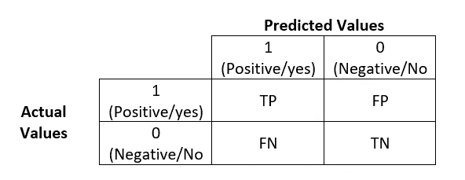
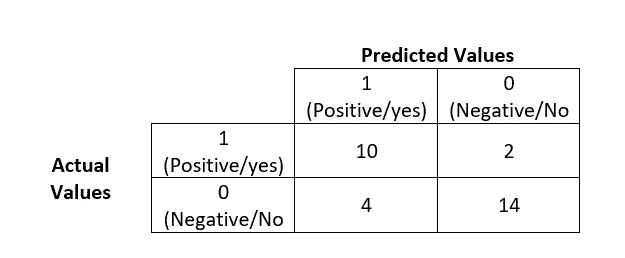

# 机器学习模型的评估标准

> 原文：<https://medium.com/analytics-vidhya/evaluation-criteria-for-machine-learning-models-ce04692cc3e3?source=collection_archive---------3----------------------->

数据科学涉及到在我们甚至接近说我们有一个工作的机器学习模型之前进行多种活动。它涉及数据分析(也称为探索性数据分析，也称为 EDA)，从数据集中的给定特征中创建有意义的特征(也称为特征工程)，然后在“清理”的数据集上应用机器学习模型。

随着像 R/Python 这样的工具和语言的出现，我们可以毫不费力地在清理后的数据集上应用机器学习算法，我想困难的部分是知道哪种算法应用于哪种问题，更困难的部分是确保应用的算法是准确的。

在本文中，我们将查看一些可用于检查机器学习算法准确性的评估指标，并了解哪种评估指标适用于哪种问题。

**什么是评估指标**

在监督学习下，我们有两种类型的业务问题

分类——输出应符合预期类别之一。例如，客户是否会流失，社交媒体帖子是积极的、消极的还是中性的等等。

回归—其中输出是一个连续变量。例如基于过去的数据预测商店在这个冬天的销售额等。

逻辑回归用于分类问题，线性回归用于回归问题。然而，有像决策树，KNN 等算法。这可以应用于分类和回归。此外，由于有如此多的集成技术和超参数可用，检查应用于数据集的模型的准确性甚至更加重要。

正如我们在引言部分所讨论的，由于像 R/Python 这样的语言和市场上可用的无数工具，在数据集上应用机器学习算法已经变得很容易。一个数据科学家的工作不能仅仅通过对数据应用 ML 算法来完成，一个好的数据科学家应该使用不同的标准来评估他/她的算法。

**不同类型的评估指标**

**回归:**在这一节中，我们将看看应该应用于评估回归算法优劣的评估指标

在我们进入回归模型的评估度量之前，让我们看看术语“误差”。正如我们所见，回归涉及预测连续变量，因此误差是“实际期望值与 ML 模型预测值的差异”

**平均绝对误差(MAE):** 预测值与实际值的绝对差值的平均值。取绝对值是为了消除负值的影响

MAE =绝对值(实际值-预测值之和))

该指标仅提供了误差大小的概念，但没有方向的概念(我们所说的方向是指它不会告诉您是预测过度还是预测不足)

**均方误差(MSE):** 预测值与实际值之差的平方。

MSE =的平方(实际值-预测值之和)

就像 MAE 一样，这个度量标准也提供了误差大小的概念，但没有方向的概念

**均方根误差(RMSE):** 预测值与实际值之差的平方根。由于 MSE 值的平方，实际和预测的 b/w 差异的输出看起来非常大，因此在 RMSE 平方根中将单位转换回原始值。

RMSE =的平方根(实际值-预测值之和的平方)

这一指标再次提供了误差大小的概念，但没有方向的概念

**R square:** 到目前为止，我们已经看到这些评估指标提供了误差大小，但是我们如何知道多少误差值是可接受的呢？我们需要一些基线模型进行比较，因此我们将基线模型作为平均值，即预测值是所有值的平均值

r 平方= 1 — MSE(模型)/ MSE(基线模型)

均方差越小，预测越好；因此，从 1 中减去它，使得该值在 0 和 1 之间，即不适合完全适合

R square 提供了一组预测值与实际值的拟合优度，因此可以对所有线性回归模型进行计算

**调整后的 R 平方:**到目前为止，我们已经看到 R 平方是预测值的拟合优度，这意味着 R 平方的值越高，预测模型越好，但是 R 平方有一个问题。

在模型中添加新特征后，R 平方值总是增加(或保持不变),因为您在模型中添加的任何特征都会随机或逻辑地对预测值产生一些影响，因此 R 平方不断增加，我们会陷入模型变得越来越好的陷阱。

因此，为了解决这个问题，调整后的 R 平方对于每个特征的添加都惩罚 R 平方值。

调整后的 R 平方= 1-(1-R 平方)[(n-1)/(n-k+1)]

其中 n =值的数量，k =特征的数量

分母中包含 k 总是会降低整体值，因此，如果特征不重要，调整后的 R 平方值会降低。当你有更多的变量时，总是计算调整后的 R 平方，这样你就不会陷入增加 R 平方值的陷阱

**分类:**在本节中，我们将了解应该应用于评估分类算法优劣的评估指标

在我们进入不同的评估指标之前，让我们借助混淆矩阵来看几个基本术语。混淆矩阵是预测类别/值与实际类别/值的表格表示

二元分类情况下的混淆矩阵如下所示

混淆矩阵

TP =真正值，即实际值为正，模型预测值也为正

FP =假阳性，即实际值为正，但我们的模型预测值为负

FN =假阴性，即实际值为负，但我们的模型预测值为正

TN =真负值，即实际值为负值，模型预测值也为负值

**准确性** —它是所有预测中正确预测的数量。精确度可以从混淆矩阵中导出，例如，如果混淆矩阵基于您的 ML 模型如下所示

这里的准确率是:10 + 14(正确预测的数量)/ 10+14+2+4(总预测的数量)，结果是 80%

所以，我们可以说你的模型给出了 80%的准确率

现在，我们什么时候可以使用准确性:

可用于二进制和多类问题

适用于每类中的观测值数量相等的情况

适用于所有预测和预测误差同等重要的情况

**AUC-ROC** —称为受试者工作特征(ROC)曲线下面积。它是在不同概率阈值下计算的真阳性率(TPR)和假阳性率(FPR)的图，以预测类别标签。现在我们来看看更多的细节:

真阳性率(TPR) = TP/ TP + FP

假阳性率(FPR) = FP/ FP + TN

让我们看看什么时候应该使用这个评价标准:

用于平衡类的二元分类问题，即当两个二元类的观察值大致相等时(是/否)

提供不同阈值的模型摘要

可用于比较不同阈值的两种模型

**精度** —这是 ML 模型在所有实际阳性结果(Tue 阳性+假阳性)中正确预测阳性结果(真阳性)的数量

精度= TP/ TP + FP

精度值越高越好。因此，当您的模型不能承受假阳性时，精度应该用作评估标准。例如，假设您有一个检测癌症(癌症= 1)的 ML 模型，在这种情况下，您的模型检测到某人患有癌症仍然是没问题的，因为进一步的测试将提供正确的结果，但如果出现假阳性则是灾难性的，即您的模型没有检测到癌症，而患者患有癌症

**回忆** —这是所有预测阳性结果(真阳性+假阴性)中正确预测结果(真阳性)的数量

召回= TP/ TP + FN

召回值越高越好。因此，当你的模型不能承受假阴性时，回忆应该作为一个评估标准。例如，假设您有一个 ML 模型来检测有罪(有罪= 1)，在这种情况下，识别某人有罪而她/他不有罪是灾难性的

**F1 得分** —它是精确度和召回率的调和平均值

F1 = 2 / [1/召回率 x 1/精确度]

什么时候我们应该使用这个评价标准:

当精确度和召回率对您的输出都很重要时

用于具有不平衡类别的二元分类问题(当“是”或“否”的值与其他值相比非常小时，例如信用卡交易中的欺诈)

总之，有许多评估标准来检查您的 ML 算法的准确性，以便您可以根据可用的超级参数来微调您的算法。