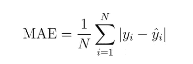
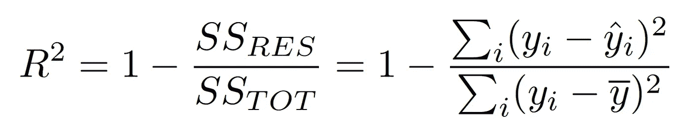
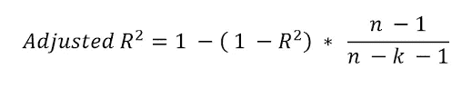

# 回归算法的评估指标(以及它们在 Python 中的实现)

> 原文：<https://medium.com/analytics-vidhya/evaluation-metrics-for-regression-algorithms-along-with-their-implementation-in-python-9ec502729dad?source=collection_archive---------4----------------------->

*本文主要关注用于评估回归算法的评估指标及其在 Python 中的实现。在本文结束时，您将熟悉回归算法的评估指标以及它们在 python 中的实现。*


模型的评估是建立有效的机器学习模型的最重要的部分。在进入正题之前，我们先了解一下什么是回归算法。

## 什么是回归算法？

回归算法属于监督机器学习算法。回归算法基于输入要素预测连续值。例如:基于房屋特征(卧室数量、房屋大小、位置、房龄、装修年份)的房价预测。

## 什么是评估指标？

评估指标用于衡量机器学习算法的质量。不同类型的算法有许多评估指标。我们将讨论回归的评估标准。

## 机器学习回归算法的评估标准；

1.  绝对平均误差
2.  均方误差
3.  均方根误差
4.  r 分数
5.  调整后的 R 分数

# 平均绝对误差

**平均绝对误差**是实际值和预测值的绝对差之和的平均值。平均绝对误差对异常值不敏感。当您在解决回归问题并且不希望异常值在预测中扮演重要角色时，应该使用 MAE。如果您知道数据的分布是[多峰](https://en.wikipedia.org/wiki/Multimodal_distribution#:~:text=In%20statistics%2C%20a%20Multimodal%20distribution,in%20Figures%201%20and%202.)的，这可能会很有用。

让我们看看平均绝对误差的公式:



平均绝对误差公式

让我们分解这个公式:

yᵢ =预测值

yᵢ帽=实际价值

这里(yᵢ - yᵢhat)是误差值，误差的绝对值被用来去除任何负号。

让我们看看使用 python 实现平均绝对误差的部分。设 X_train，y_train 为训练数据，X_test，y_test 为评估我们模型的测试数据。

MAE 值较小的模型比 MAE 值较大的模型性能更好。

```
# Importing all necessary libraries
from sklearn.linear_model import LinearRegression
from sklearn.metrics import mean_absolute_error# Initializing the model and fitting the model with train data
model = LinearRegression()
model.fit(X_train,y_train)# Generating predictions over test data
predictions = model.predict(X_test)# Evaluating the model using MAE Evaluation Metric
print(mean_absolute_error(y_test, predictions))
```

# 均方误差

**均方差**是实际值和预测值之差的平方和的平均值。

当数据集包含异常值或意外值(过高或过低的值)时，MSE 最有用。因此，应该考虑到，如果我们的模型做出一个非常糟糕的预测，MSE 会放大误差。

当单个错误的预测会破坏整个模型的预测能力时，即当数据集包含大量噪声时，MSE 是最没有用的。

MSE 的单位是垂直轴或 y 轴上绘制的任何东西的平方。因为函数中取了误差的平方。

大的 MSE 值意味着数据值广泛分散在数据的平均值周围，而小的 MSE 值意味着数据值紧密分散在平均值周围。即具有小 MSE 值的模型具有更好的性能。

让我们看看均方差的公式:


均方误差公式

误差的平方(yᵢ-yᵢhat)对于消除任何负号是必要的，并且也给予大的差异更多的权重。

让我们看看使用 python 实现均方误差的部分。设 X_train，y_train 为训练数据，X_test，y_test 为评估我们模型的测试数据。

```
# Importing all necessary libraries
import numpy as np
from sklearn.ensemble import RandomForestRegressor
from sklearn.metrics import mean_squared_error# Defining our own MSE function
def own_mean_squared_error(actual, predictions):
    return ((predictions - actual) ** 2).mean()# Initializing the model and fitting the model with train data
model = RandomForestRegressor(
               n_estimators = 100,
               criterion = 'mse'
        )
model.fit(X_train,y_train)# Generating predictions over test data
predictions = model.predict(X_test)# Evaluating the model using MSE Evaluation Metric
print(mean_squared_error(y_test, predictions))
print(own_mean_squared_error(y_test, predictions))
```

# 均方根误差(RMSE)

**均方根误差**与均方误差相同，但在评估模型时考虑了 MSE 的根。RMSE 对虚假数据(即异常值)的存在更为敏感。当存在较大误差时，RMSE 最有用，这些误差会显著影响模型性能。从那以后，RMSE 对较大的误差赋予较高的权重。

RMSE 是评估模型的常用评估指标。与 MSE 不同，均方根误差在纵轴或 y 轴上绘制了相同的数量单位。因为 MSE 值的平方根在 RMSE。

让我们看看均方根误差的公式:


均方根误差公式

没有可用于计算均方根误差的内置函数。让我们通过定义自己的函数来研究均方根误差的实现部分。设 X_train，y_train 为训练数据，X_test，y_test 为评估我们模型的测试数据。

```
# Importing all necessary libraries
import numpy as np
from sklearn.ensemble import RandomForestRegressor
from sklearn.metrics import mean_squared_error# Defining RMSE function
def root_mean_squared_error(actual, predictions):
    return np.sqrt(mean_squared_error(actual, predictions))# Initializing the model and fitting the model with train data
model = RandomForestRegressor(
               n_estimators = 100,
               criterion = 'mse'
        )
model.fit(X_train,y_train)# Generating predictions over test data
predictions = model.predict(X_test)# Evaluating the model using RMSE Evaluation Metric
print(root_mean_squared_error(y_test, predictions))
```

**注:**对于 sklearn 版本≥ 0.22.0，sklearn.metrics 有一个平方为 kwarg 的 mean_squared_error 函数(默认值为 True)。将平方值设置为 False 将返回 RMSE 值。

```
# For sklearn versions >= 0.22.0
print(mean_squared_error(y_test, predictions, squared = False))
```

# r 分数

r 得分也称为决定系数，用于衡量模型与给定数据集的拟合程度。它表示预测值与实际值的接近程度。

让我们看看这个公式，以便更好地理解:



r 公式

让我们分解这个公式，看看每一项:

SSᵣₑₛ =残差平方和

SSₜₒₜ =总平方和

R 值的范围从-∞到 1。R 值为负的模型表示最佳拟合线的表现比平均拟合线差。

让我们看看 R 评估指标的实现:

```
# Importing all necessary libraries
from sklearn.linear_model import LinearRegression
from sklearn.metrics import r2_score# Initializing the model and fitting the model with train data
model = LinearRegression()
model.fit(X_train,y_train)# Generating predictions over test data
predictions = model.predict(X_test)# Evaluating the model using R² Evaluation Metric
print(r2_score(y_test, predictions))
```

*R 指标的主要缺点是，随着模型输入特征数量的增加，R 值也会增加，而与增加的特征相对于输出变量的重要性无关。即，即使添加的特征与输出变量没有相关性，R 值也会增加。*

# 调整后的 R 分数

调整后的 R 是 R 的修改形式，其惩罚新的独立变量或预测值的增加，并且仅在新的独立变量或预测值增强模型性能时增加。

让我们看看调整后的 R 的公式:



调整后的 R 公式

让我们分解这个公式，看看它的每一项:

R:这是 R 分数

n:数据集中的样本数量

k:预测值的数量

没有仅计算调整后 R 的内置函数。让我们来看看调整后 R 的实现部分:

```
# Importing all necessary libraries
from sklearn.linear_model import LinearRegression
from sklearn.metrics import r2_score# Defining the adjusted R² function
def adjusted_r2_score(actual, predictions, num_pred, num_samples):
    n = num_samples
    k = num_pred
    r2 = r2_score(actual, predictions)
    adjusted_r2 = 1 - ((1-r2) * ((n-1)/(n-k-1)))
    return adjusted_r2# Initializing the model and fitting the model with train data
model = LinearRegression()
model.fit(X_train,y_train)# Generating predictions over test data
predictions = model.predict(X_test)# Evaluating the model using Adjusted R² Evaluation Metric
num_samples = X_test.shape[0]
num_predictors = X_test.shape[1]
adjusted_r2_score(y_test, predictions, num_predictors, num_samples)
```

**注:**调整后的 R 将始终小于或等于 R 得分。

上述评估指标是评估回归算法最常用的 5 种评估指标。

> 如果你喜欢这篇文章，请跟我来。如果您发现公式、代码或内容中有任何错误，请告诉我。
> 
> 你可以在 [LinkedIn](https://www.linkedin.com/in/venugopalkadamba) 、 [GitHub](https://github.com/venugopalkadamba) 找到我

[](https://github.com/venugopalkadamba) [## 韦努·戈帕尔·卡丹巴

### 学生👨‍🎓和 Python 程序员。venugopalkadamba 有 22 个可用的存储库。在 GitHub 上关注他们的代码。

github.com](https://github.com/venugopalkadamba) [](https://www.linkedin.com/in/venugopalkadamba) [## 韦努·戈帕尔·卡丹巴

### 在世界上最大的职业社区 LinkedIn 上查看 Venu Gopal Kadamba 的个人资料。

www.linkedin.com](https://www.linkedin.com/in/venugopalkadamba) 

# 谢谢大家！