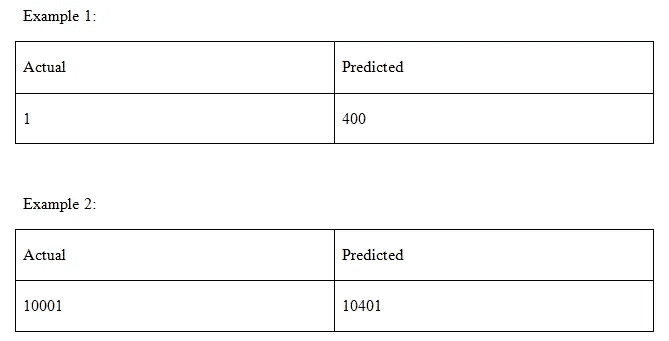

# 回归问题的评估标准

> 原文：<https://medium.com/analytics-vidhya/evaluation-metrics-for-regression-problems-343c4923d922?source=collection_archive---------8----------------------->


克里斯·利维拉尼在 [Unsplash](https://unsplash.com?utm_source=medium&utm_medium=referral) 上的照片

嗨，今天我们要学习回归问题的评估标准。评估指标非常重要，因为它们告诉我们，我们的模型有多精确。

在我们开始评估技术之前，获得一些直觉是很重要的。


线性回归

在上图中，我们可以看到我们绘制了一条线性曲线，但是这条曲线并不完美，因为有些点位于直线之上，有些点位于直线之下。

那么，我们的模型有多精确呢？

评估指标旨在解决这些问题。现在，不浪费时间，让我们跳到评估指标&看看评估技术。

有 6 种评估技术:

1.平均绝对误差

2.均方差

3.均方根误差

4.均方根对数误差

5.r 平方

6.调整后的 R 平方

现在，让我们逐一讨论这些技术。

## 米（meter 的缩写））平均绝对误差

这是最简单也是最广泛使用的评估技术。它只是实际值和预测值之差的平均值。

下面，是平均绝对误差的数学公式。


绝对平均误差

Scikit-Learn 是一个很棒的库，因为它几乎拥有我们在数据科学之旅中需要的所有内置函数。

下面是实现平均绝对误差的代码

```
from sklearn.metrics import mean_absolute_errormean_absolute_error(y_true, y_pred)
```

这里，“y_true”是真实目标值，而“y_pred”是预测目标值。

# 米（meter 的缩写））均方差

另一种评估技术是均方误差。它取误差平方的平均值。这里，误差是实际值和预测值的差值。

下面是均方差的数学公式。


均方误差

我敢肯定，在看了上面的数学函数后，你会想到实现。但是，不要担心，有一个内置的函数叫做‘均方误差’。

下面是代码:

```
from sklearn.metrics import mean_squared_errormean_squared_error(y_true,y_pred)
```

这里，y_true 是真实值& y_pred 是预测值。

上述函数的一个问题是它改变了单位。为了避免这个问题，我们将使用另一种技术，称为均方根误差

# R.均方根误差

均方根误差是目前正在使用的另一种技术。首先，它解决了上述技术中的问题。

它求误差的平方，然后求总平均函数的平方根。下面是数学函数，它将使事情变得更清楚。


均方根误差

下面是计算均方根误差的代码。

```
from sklearn.metrics import mean_squared_errorimport numpy as npmse = mean_squared_error(y_true,y_pred)rmse = np.sqrt(mse)
```

在这里，你可以看到，我们没有任何特殊的函数来计算 RMSE，而是使用 MSE，取它的平方根。

但是等等，这种方法是有局限性的。

让我们看下面的例子。



在例 1 中，我们可以看到误差非常大。实际值是 1 &预测值是 401。

在示例 2 中，我们可以看到，如果我们将实际值与预测值进行比较，预测值给出了一个不错的结果。

对于例 1 和例 2，误差是 400，但实际上，例 2 中的 ML 模型给出了更好的结果。但是，根据 RMSE 的说法，错误是一样的。

因此，为了解决这个问题，我们使用了另一种类似但经过修改的方法，这将在下面讨论。

## R.均方根对数误差

这项技术的数学功能如下所示。


均方根对数误差

现在，如果我们以 RMSLE 中的上述情况为例，那么，例 1 的 RMSLE 大于例 2。因此，RMSLE 解决了发生在 RMSE 的问题(均方根误差)

这种方法实际上缩小了值&因此，它避免了上述错误。

下面是实现它的代码

```
from sklearn.metrics import mean_squared_log_errornp.sqrt(mean_squared_log_error( y_true, predictions ))
```

这里，“y_true”是实际的目标变量，而“predictions”是预测的目标变量。

## r 平方

现在，我们来看另一种称为 R 平方的技术，其实际名称是相对平方误差。

这种方法有助于我们计算相对误差。这项技术有助于我们根据它们的均方误差来判断哪种算法更好。

R 平方方法的数学公式如下。


r 平方

如果 x >1，这意味着分子的 MSE 大于基线模型的 MSE，这又意味着新模型比基线模型差。

R 的平方越高，模型越好。

下面是实现 R 平方评估技术的代码

```
from sklearn.metrics import r2_scoresklearn.metrics.**r2_score**(*y_true*, *y_pred)*
```

这里，“y_true”是真实的目标变量，而“y_pred”是预测的目标变量

看完，看完上面那一段，你可能真的会对这些评价指标印象深刻。但是等等，这种技术是有局限性的。

局限性在于，添加更多要素后，R 平方值要么增加，要么不变。不管特征如何影响模型。

为了克服这一限制，有另一种称为调整的 R-平方的评估技术，这将在下面讨论。

## 调整后的 R 平方

数学公式如下所示。


调整后的 R 平方

这里，n:样本数& k:特征数。

scikit 上没有内置函数——学习计算调整后的 R 平方，但我们可以找到 R 平方&只需计算调整后的 R 平方。

好了，以上是回归问题最常用的 6 个评估指标。

但是，在模型训练之前有很多因素要做，如数据清洗、数据可视化、数据分析、缺失值处理、异常值处理等。

在不久的将来，我会就所有这些话题发表博客，在此之前敬请关注。