# 使用 Python 评估机器学习模型中的度量

> 原文：<https://medium.com/analytics-vidhya/evaluation-metrics-in-machine-learning-models-using-python-fb6199450fba?source=collection_archive---------4----------------------->

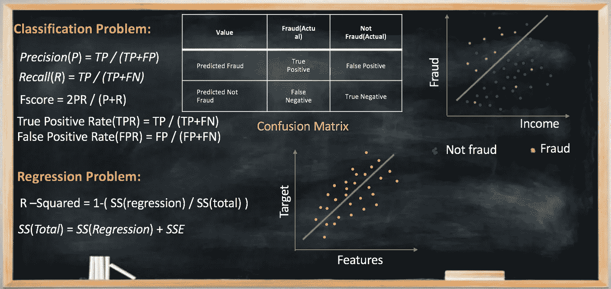

我们将尝试在不同的误差指标上评估我们的机器学习模型。在评估模型时，我们需要记住，如果我们的数据集是不平衡数据集的经典例子，那么它应该不受类别不平衡的影响。我们将在接下来的博客中处理典型的不平衡数据集示例。下面列出了一些流行的评估指标。

**对于分类问题:** 1。混乱矩阵
2。精度/召回
3。F1 比分
4。ROC 曲线下面积(AUC — ROC)
5。科恩的卡帕

**对于回归问题:** 1。均方根误差(RMSE)
2。R 平方/调整的 R 平方

让我们试着按顺序理解它们。

# 混淆矩阵:

这个矩阵代表了模型的准确性。混淆矩阵是一个 N×N 矩阵，其中 N 是被预测的类的数量。让我们以信用卡公司的两类问题为例，该公司希望使用您必须构建的算法来检测欺诈。可能的两个类别将是其**欺诈**或**非欺诈**交易**。**

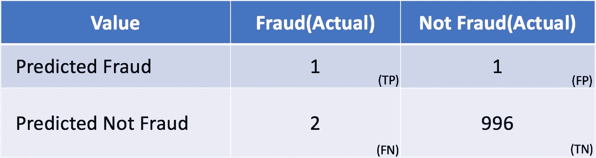

**图:混淆矩阵**

在这里，
**真阳性(TP)** = 1 即实际**欺诈**同时也预测**欺诈
假阳性(FP)** = 1 即实际**不欺诈**但预测**欺诈**
**假阴性(FN)** = 2 即实际**欺诈**但预测**不欺诈【T38**

模型的准确率由
**给出准确率=(TP+TN)/(TP+TN+FP+FN)** 在上面的矩阵中，我们已经计算了所有评估案例中真阳性和真阴性的比例。

# 精确度/召回率:

**精度**:正确预测与该类预测总数的比率。它回答了所有被预测为属于“欺诈”类的值，正确的百分比是多少？ ***精度*(*P*)=*TP/(TP+FP*)** 在我们上面的矩阵例子中，精度是=(1)/(1 + 1)=1/2=0.5

**回忆:**它是正确预测的数量与类的实际实例总数的比率。它回答了类“X”的所有实例的问题，我们正确预测的百分比是多少？
***召回*(*R*)=*TP/(TP+FN)*** 我们上面矩阵例子中的召回是=(1)/(1+2) = 1/3 =0.34

假设在信用欺诈数据集上实现了两个模型:模型 1 和模型 2，其中 0 表示不欺诈，1 表示欺诈。以下是观察结果:

模型 1 能够比模型 2 更好地正确预测`0`【非欺诈】。因此，模型 1 具有更少的假阳性，从而具有更高的精度

模型 2 能够比模型 1 更好地正确预测`1`【欺诈】。因此，模型 2 具有较少的假阴性，从而具有较高的召回率。

这被称为**精确-召回权衡。**选择精确还是召回完全取决于业务需求，反之亦然。在这种情况下，我们应该更加关注召回。由于欺诈如果未被发现，将会给企业带来损失，因此通过进行额外的监控或手动验证，可以将预测非欺诈对欺诈的影响降至最低。

精确度指标更重要的一个例子是推荐系统(youtube 播放列表推荐、TED X 推荐)、股票预测、房价等。
召回指标更重要例子是疾病预测、恐怖分子预测、欺诈案件、贷款拖欠者。

# F1 分数:

如果我们希望在一个模型中既有好的精度又有好的回忆，该怎么办呢？
在这种情况下，我们使用 F1 评分。它只不过是精确和回忆的调和手段。
**F1 得分= 2PR / (P+R)** 我们上面矩阵例子中的 F1 得分
F1 得分=(2 * 0.5 * 0.34)/(0.5+0.34)= 0.34/0.84 = 0.40
在你的阶级分布不均匀的时候更有用。

# ROC 曲线下面积(AUC — ROC):

ROC 曲线是灵敏度(也称为真阳性率)和(1-特异性)(也称为假阳性率)之间的图。 **真阳性率(TPR) =** TP / (TP+FN)
**假阳性率(FPR) =** FP / (FP+FN)

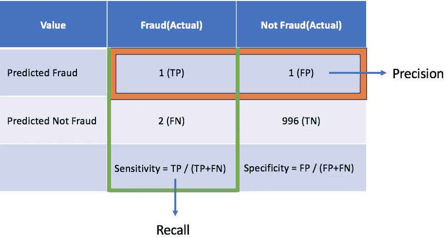

**图:混淆矩阵**

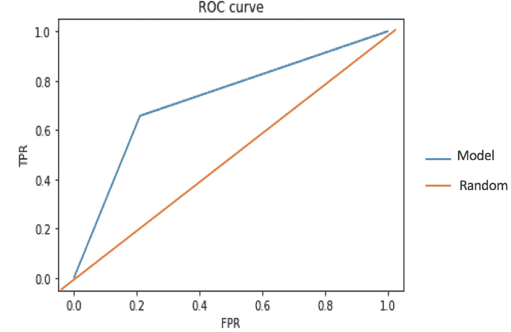

**图:Roc 曲线**

曲线下的面积越大，模型越好。随机线表示模型的随机预测，0.5 被认为是最坏的情况。所以我们曲线应该在随机模型线之上，这样模型才会好。

P *对于上述矩阵的分类问题 ython 实现可以在这里探讨。*[*Github _ link _ for _ class ification _ matrix*](https://github.com/ManojSingh0302/machineLearning/blob/master/foundations_Course/Ensemble/Excercise_2/Ensembling_Code%20ALong.ipynb)

# 科恩的卡帕:

这是一种将观察到的准确性与预期的准确性(随机机会)进行比较的度量。让我们试着借助矩阵来理解。

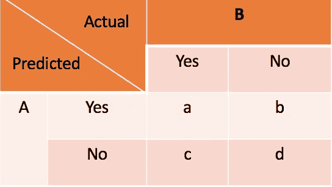

图:科恩的卡帕矩阵

```
kappa is defined as**K = (Po - Pe) /(1- Pe)**Where, **Po = Observed Accuracy
Pe = Expected Accuracy**Po simply is number of instances that were classified correctly. From above matrix we can ‘a’ and ‘d’ were classified correctly.Po = (a+d) / (a+b+c+d)Pe  = Probability by random chance
    =  P (yes) or P (no) 
    = (Classifier classifies it as yes) * (Actual yes) + 
      (Classifier classifies it as no) * (Actual no)

 Pe = [(a+b)/(a+b+c+d)] * [(a+c)/(a+b+c+d)] + [(c+d)/(a+b+c+d)] *                 [(b+d)/(a+b+c+d)]
```

如果观察到的精度值比预期的精度好，那么这个模型就是好的。

# 均方根误差(RMSE):

它用于回归问题。它遵循一个假设，即误差是无偏的，并遵循正态分布。它由下面的公式给出。
其中 N 是观测值的总数。

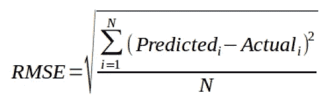

图:RMSE

注 1)对于更多样本，使用 RMSE 重建误差分布被认为更可靠。
2)受离群值影响较大。与平均绝对误差相比，RMSE 给出了更高的权重，并惩罚大的误差。

# R 平方/调整后的 R 平方:

在 AUC-ROC 中，我们了解到我们的模型应该比随机机会的准确性更好，因此这里我们有一个基准来比较我们在分类问题中的模型，但是在回归模型的情况下，当 RMSE 降低时，模型性能提高，但是我们仍然没有基准来比较它。这就是我们需要 **R 平方/调整 R 平方的原因。**测量回归模型中直线的拟合优度。
R 平方始终介于 0 和 100%之间。
让我们再了解一些术语，以便更好地理解 R 平方。

**误差平方和(SSE):** 无非就是残差平方和。

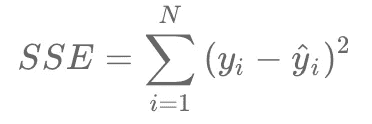

**图:SSE**

***易* :** 实际值
**y^i:** 预测值

**总平方和(SST):** 无非是实际值(*)和我们数据集的均值(***y*ˇ*I***)的平方差。*

*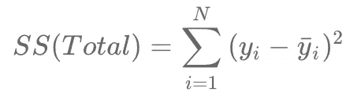*

***图:SST***

***回归平方和** ( **SS(回归)**):是预测值( *y* ^ *i* )与均值(*y*ˇ*I*)的平方差。*

*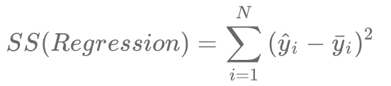*

***图:SS(回归)***

*我们可以观察如下，
***SS* ( *总计* )= *SS* ( *回归* ) + *SSE****

***R 平方**现在定义为:*

*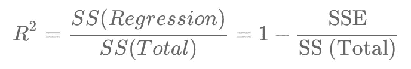*

***图:R 平方公式***

*R 平方值越高，模型越好。具有所有正确预测的最佳模型会给出 R 平方为 1。R 平方的问题是，可以通过添加更多数量的独立变量(特征)来人为地提高它，尽管它们可能是不相关的。但是，在向模型中添加新要素时，R 平方值要么增加，要么保持不变。R-Squared 不会因添加对模型没有任何价值的要素而受到惩罚。因此，R 平方的改进版本是**调整的 R 平方**。*

*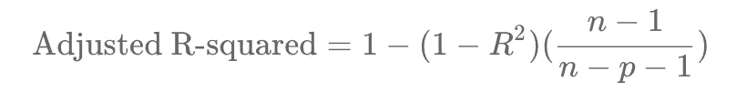*

***图:调整后的 R 平方公式***

*其中，
n =数据点的数量
p =特征/独立变量的数量
**注:R 平方告诉您模型与数据点的拟合程度，而调整后的 R 平方告诉您特定特征对模型的重要性。***

*P *ython 对上述矩阵进行线性回归的实现可以在这里探讨。*[*github _ link _ for _ regression*](https://github.com/ManojSingh0302/machineLearning/blob/master/foundations_Course/linearRegression/Excercise_2/RentBike-Code-Along.ipynb)*

*因此，无论何时您构建一个模型，本文都应该帮助您弄清楚这些参数是如何评估误差度量的，以及您的模型表现得有多好。*

*我希望这个博客对你有用。如果您认为我遗漏了任何重要的细节，或者您对此主题有任何其他问题或反馈，请留下评论或给我发电子邮件。*