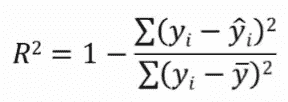

# 评估指标:回归

> 原文：<https://medium.com/analytics-vidhya/evaluation-metrics-regression-9fdf3e89541f?source=collection_archive---------26----------------------->

你将如何评价你的回归模型？


# **什么是机器学习中的模型评估？**

*   模型评估是检查我们的模型准确与否的过程。
*   Scikit-learn 库提供了不同类型的评估指标，我们可以使用这些指标来检查模型性能。
*   我们也可以基于我们的数据集和领域需求来实现我们自己的评估指标。

# **常用回归评估指标:**

1.  平均绝对误差
2.  均方误差
3.  均方根误差(RMSE)
4.  r 平方

# **1。平均绝对误差(MAE):**

*   用于检查我们的模型**有多不准确**。
*   **MAE =绝对误差之和/样本数量**
*   绝对误差=实际数据和预测数据之间的绝对差异。
*   下图显示了 2 个不同模型的预测值和各自的绝对误差。


**计算两个模型的 MAE:**

MAE_Model_2 = 32996.03 / 5 = 6599.20

MAE_Model_4= 16670.90 / 5 = 3334.18

使用 **scikit-learn** 也可以达到同样的效果:

```
from sklearn.metrics import mean_absolute_error
print(mean_absolute_error(actual, prediction))
```

> ***注:***
> 
> MAE_Model_4 低于 MAE_Model_2，因此我们可以说用于预测 prediction_4 的模型更好。
> 
> **该指标未能惩罚预测中的大误差，因为它使用了实际数据和预测数据之间的简单差异。**

# 2.均方差(MSE):

*   用来检查**我们的模型**有多不准确。
*   MSE 比 MAE 更苛刻。MAE 简单地测量预测值和实际值之间的距离，其中 MSE 是距离的平方。
*   **MSE =误差平方和/样本数量**
*   平方误差=实际数据和预测数据之间的平方差。
*   下图显示了 2 个不同模型的预测值和各自的平方误差。


**计算两个模型的 MSE:**

MSE _ Model _ 2 = 412552977.70/5 = 82510595.53

MSE _ Model _ 4 = 177061670.31/5 = 35412334.06

使用 **scikit-learn** 也可以达到同样的效果:

```
from sklearn.metrics import mean_squared_error
print(mean_squared_error(actual, prediction))
```

> **注:**
> 
> MSE 惩罚较大的错误，减少小错误的影响。
> 
> **例:误差小于 1，平方时会收缩。另一方面，如果该误差大于 1，对其求平方会使其对总误差的贡献更大。**

# 3.均方根误差(RMSE):

*   用来检查**我们的模型**有多不准确。
*   这其实就是 MSE 的平方根。
*   **RMSE = sqrt(误差平方和/样本数)**

**计算两个模型的 MSE:**

RMSE _ 模型 _2 = sqrt(82510595.53) = 9083.53

RMSE _ 模型 _4= sqrt(35412334.06) = 5950.82

使用 **scikit-learn** 也可以达到同样的效果:

```
from sklearn.metrics import mean_squared_error
print(np.sqrt(mean_squared_error(actual, prediction)))
                       or
print(mean_squared_error(actual, prediction, squared=False))
```

> **注:**
> 
> **RMSE _ Model _ 4 的 RMSE 小于 RMSE_Model_2。**
> 
> **RMSE 是误差的标准差。换句话说，这是检验误差传播的一种方法。**
> 
> **RMSE 值越低表示拟合度越好。**

# 4.r 平方:

*   用于检查我们的模型有多准确。
*   r 平方解释了输入变量的方差在多大程度上解释了输出变量的方差。
*   因此，如果模型的 R 平方是 0.50，那么大约一半的观察到的变化可以用模型的输入来解释。
*   r 平方值的范围从 0 到 1，通常表示为 0%到 100%的百分比。
*   计算 R 平方的公式:

这里，

y =实际值，y_hat =预测值，y_bar =实际值的平均值



r 平方公式


> **注:**
> 
> **R 平方的局限性在于，它不会告诉你你选择的模型是好是坏，也不会告诉你数据和预测是否有偏差。**

# 创建您自己的评估指标:

*   梅，MSE 和 RMSE 使用绝对误差和平方误差。
*   这里，我们无法区分 n 个样本中，有多少预测值低于拟合线，有多少预测值高于拟合线。
*   此外，如果目标变量的值范围很大，那么上述指标也将无法显示真实情况。在这种情况下，我们应该使用百分比差异，而不是简单的差异。
*   例如，如果实际值是 10，预测值是 15，那么我们可以说它是差预测，但如果实际值是 1000，预测值是 1015，那么我们可以说它是好预测，即使差异是相同的。在第一种情况下，差异为 **50%** ，而在第二种情况下，差异为 **0.5%**

# **总结:**

为机器学习模型选择合适的评价指标是非常重要的。

最常用的评估指标是 MAE、MSE、RMSE 和 R 平方。

一个人也可以实现自己的评估指标。

