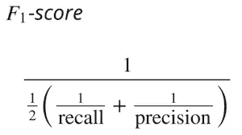

# 即使是模特也需要通过测试！—第二部分

> 原文：<https://medium.com/analytics-vidhya/even-models-need-to-pass-tests-part-2-540318f1d272?source=collection_archive---------10----------------------->

> **注:**这篇博客是**博客的续篇，即使是模特也需要通过测试——第一部分。**建议先浏览一下那个博客，以便更好地了解这个博客。

 [## 即使是模特也需要通过测试！—第一部分

### 我们经常想知道为什么考试或测验在学校或大学进行，为什么我们不能学习概念并继续前进…

medium.com](/gdg-vit/even-models-need-to-pass-tests-part-1-79734875611d) 

在上一篇博客中，我们了解了机器学习中遇到的不同类型的问题，即回归和分类，机器学习模型如何工作，以及我们所说的“评估机器学习模型”到底是什么意思。我们了解到，评估模型是提高模型准确性的必要条件。我们还讨论了一些最重要的指标，这些指标用于评估为回归问题构建的机器学习模型。

在这篇博客中，我们将讨论一些用于评估为分类问题建立的机器学习模型的度量标准。

有各种各样的问题需要我们进行分类。例如:给定的图片是猫还是狗，这个人是否患有癌症，或者这个人是否会活下来。您可能已经意识到，所有这些任务都容易受到预测值的影响。想象一下，如果你的模型预测这个人没有癌症，但实际上这个人有，或者你预测这个人不会活下来，但这个人活了下来。因此，建立准确的模型势在必行。

我们如何确保模型是好的？我们使用评估指标来评估这些模型。首先，我们将讨论一些统计术语，如真阳性、真阴性、假阳性和假阴性，因为这些术语对于理解精确度、召回率和 F1 分数等评估指标是必要的，这些也将在本博客中讨论。

> **在这篇博客中，我将使用肿瘤是恶性还是良性的分类(二元分类)来正确理解统计术语。**

## **真阳性**

给定肿瘤的图像，如果模型预测**肿瘤是恶性的，并且实际上肿瘤也是恶性的**，则它被认为是真阳性或 TP。因此，如果任何模型预测目标为“1 ”,而实际上，目标也为“1 ”,则称为真阳性。

正如您在上面的代码中所看到的，如果预测值和实际值都是“1”，那么只有真阳性的数量才增加 1。

## 正确否定

给定肿瘤的图像，如果模型预测**肿瘤是良性的，并且实际上肿瘤也是良性的**，则它被认为是真阴性或 TN。因此，如果模型预测目标为“0 ”,而实际上目标也为“0 ”,则称为真阴性。

正如你在上面的代码中所看到的，如果预测值和实际值都是‘0’，那么只有真负数的数量增加了 1。

换句话说，如果你的模型正确地预测了正类，那么它被称为真正，如果你的模型正确地预测了负类，那么它被称为真负。这些是**正确分类的值**。因此，模型预测的真正值和真负值的数量越多，模型就越好。

## 假阳性

给定肿瘤的图像，如果模型预测**肿瘤是恶性的，但实际上肿瘤是良性的，**它被认为是假阳性或 FP。因此，如果模型预测目标为“1 ”,但实际上目标为“0 ”,则称为假阳性。

正如您在上面的代码中所看到的，如果预测值为“1”，而实际值为“0”，那么误报的数量就会增加 1。

## 假阴性

给定肿瘤图像，如果模型预测**肿瘤是良性的，但实际上肿瘤是恶性的**，则认为是假阴性或 FN。因此，如果模型预测目标为“0 ”,但实际上目标为“1 ”,则称为假阴性。

正如您在上面的代码中所看到的，如果预测值为“0”，而实际值为“1”，那么假阴性的数量就会增加 1。

换句话说，如果你的模型错误地预测了阳性类别，那么它就是一个假阳性。如果您的模型错误地预测了负类，则它是一个假阴性。这些是错误分类的价值观。我们希望这些值的数量尽可能少。错误预测的数量越少，模型就越好。

> 我会告诉你如何不费力地记住这些术语。我们以真正或 TP 为例；TP 可以分解为 T(第一部分)和 P(第二部分)。永远记住第二部分代表预测值，第一部分表示预测是否正确。

因此，对于 TP，P 表示预测值为正或“1 ”, T 表示是，这是一个正确的预测。不是很好记吗？让我们再举一个例子:对于 FN，N 表示预测值为负或“0”，F 表示不，这不是一个正确的预测，这意味着预测值应该是“1”。

## 不同的分类评估标准

## **精度**

准确性是机器学习中使用的最直接的评估指标之一。**定义为正确预测数除以预测总数**。例如:如果该模型在 100 次中有 90 次正确地将肿瘤分类为恶性或良性，则其准确度将为 90%。

我们将如何定义 TP、TN、FP 和 FN 的准确性？我将为您分解步骤:为了表示正确预测的总数，我们将使用之前讨论过的术语 TP 和 TN。为了表示预测的总数，我们将使用所有 4 项，因为它也应该包括错误分类的值(FN 和 FP)。

## 准确性是一个好的评估指标吗？

让我们考虑一些情况，在这些情况下，准确性不是评估模型的好指标。假设我们有一个数据集，其中正类和负类的数量之间存在巨大差异，或者换句话说，数据集是不平衡的或者具有倾斜的目标。当我们在这样的数据集上训练模型时，它不会看到该类的足够多的示例，该类的数量较少。会出现的情况是，在预测目标的同时，总是会预测到人数较多的那一类。

例如，设想用于将肿瘤分类为恶性或良性的数据集具有 90 幅肿瘤为良性的图像，而只有 10 幅肿瘤为恶性的图像，或者换句话说，数据集具有倾斜的目标。由于阴性或“0”类比阳性或“1”类多(差值为 80 %),因此在执行预测时，由于没有足够的恶性图像可供模型用来训练自身，因此它将总是预测该类为阴性或“0”。当我们计算这种模型的精确度时，精确度仍然是 90%。模型好吗？不，不是，因为这个模型没有将任何肿瘤归类为恶性。我们可以得出结论，即使准确率为 90%，模型也没用。

因此，为了解决这类问题，推荐使用其他指标，如精确度、召回率和 F1 分数。

## 精确

**精度是指当我们的模型在预测标签为正或‘1’时，它实际上是正的次数。**换句话说，当我们的模型预测，是的，肿瘤是恶性的，在这些中，有多少肿瘤实际上是恶性的。

让我们推导出精度公式。我们将再次使用 TP、FP、TN 和 FN。为了表示模型做出的正面预测的数量，拆分的第二部分应该是 P；因此，我们将使用 TP 和 FP。为了表示有多少预测实际上是积极的，分裂的第一部分应该是 T；因此，我们将使用 TP。因此，精度公式为:

**精度公式**

假设我们在前面讨论的相同数据集上建立一个新模型，并且我们的模型正确地识别了 90 个良性肿瘤中的 85 个和 10 个恶性肿瘤中的 7 个。因此，我们成功地从 100 幅图像中识别出了 92 幅。因此，精确度为 0.92 或 92%。但是，在这 100 个样本中，5 个良性肿瘤被错误分类为恶性，3 个恶性肿瘤被错误分类为良性。因此:

TP = 7

TN =85

FP = 5

FN = 3

精度= 7 / (7 + 5) = 7 / 12 = 0.583

这意味着当我们的模型试图识别恶性肿瘤时，它的正确率为 58.3 %。尽管准确率为 92 %，但 precision 告诉我们，该模型是不合适的，因为正确预测恶性肿瘤的概率非常小。

## 回忆

召回意味着在实际上是正面的标签中，有多少标签被我们的模型正确预测。换句话说，在实际上是恶性的肿瘤中，有多少恶性肿瘤是由模型正确预测的。

让我们推导出回忆的公式。为了表示实际阳性的总数，我们将使用 TP 和 FN。为了表示有多少预测实际上是积极的，分裂的第一部分应该是 T；因此，我们将使用 TP。因此，召回的公式为:

**回忆公式**

以“精度”部分讨论的同一个例子为例:

回忆= 7 / (7 + 3) = 7 / 10 = 0.7

## 精确度与召回率

对于一个“好”的模型，精确度和召回率都应该很高。在上面的例子中，我们可以看到召回值很高，但是精度值没有召回高。我们的模型产生相当多的假阳性，但假阴性较少。在这种问题上，很少有假阴性是可取的，因为你不想说病人没有患癌症。那会更有害。但是我们确实有假阳性，这也不好。

模型预测的大多是一个概率，我们预测的时候一般会选择 0.5 作为阈值。我们并不总是选择阈值为 0.5；我们可以根据情况改变它。根据阈值的不同，精确度和召回率的值可能会有很大的变化。

如果对于我们选择的每个阈值，我们计算精度和召回值，我们可以在这些值集之间创建一个图。这个图被称为精确回忆曲线。通过观察这条曲线，我们可以选择一个合适的阈值。随着阈值的改变，FP、TP、TN 和 FN 值的数量也改变。因此，选择正确的阈值是必须的。精确度和召回率的范围都是从 0 到 1，值越接近 1 越好。精确度和召回率的值都很高是非常不可能的；因此，我们使用另一个称为 F1 分数的指标来评估模型。

## **F1 比分**

F1 分数结合了精确度和召回率。它被定义为精确度和召回率的调和平均值。如果我们用 P 表示精确度，用 R 表示召回率，F1 分数将表示为:

我们可以看 F1 的分数，而不是单独看精度和回忆。F1 值的范围也是从 0 到 1，F1 值越接近 1，模型越好。当处理具有倾斜目标的数据集时，我们应该关注 F1 而不是准确性。

## 结论

在这篇博客中，我们看了一些基本的统计术语，如真阳性、真阴性等。这对于理解所有可用于分类的评估度量是必不可少的。我们还讨论了一些用于评估模型的重要指标，如准确度、精确度和召回率。

为了更好地理解这些术语，您可以自己在任何数据集上训练模型，计算训练好的模型的精度、召回率和 F1 值，并根据计算值判断该模型是好是坏。如果模型没有给出好的结果，您可以使用其他算法或调整所用算法的超参数。

在下一篇博客中，我们将看看其他一些常用的重要评估指标。

如果你喜欢这个博客，请鼓掌！

> 在 LinkedIn 上与我联系:[www.linkedin.com/in/chanakya-vivek-kapoor-a04496167](http://www.linkedin.com/in/chanakya-vivek-kapoor-a04496167)

## **有用资源**

[https://developers . Google . com/machine-learning/crash-course/class ification/precision-and-recall](https://developers.google.com/machine-learning/crash-course/classification/precision-and-recall)

[https://www . analyticsvidhya . com/blog/2020/09/precision-recall-machine-learning/](https://www.analyticsvidhya.com/blog/2020/09/precision-recall-machine-learning/)

[https://deepai . org/machine-learning-glossary-and-terms/precision-and-recall](https://deepai.org/machine-learning-glossary-and-terms/precision-and-recall)