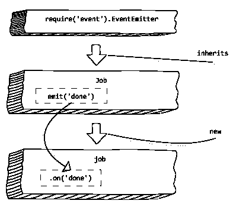

# 节点中的事件发射器。射流研究…

> 原文：<https://medium.com/analytics-vidhya/event-emitters-in-node-js-d93084441974?source=collection_archive---------7----------------------->


NodeJS 徽标。来源:维基百科

如果您曾经在浏览器上使用过 JavaScript，您会意识到用户的交互有多少是通过事件完成的——鼠标点击、键盘按压等等。

> 节点'**中的许多对象发出**事件来引起'**观察者'**或**' T5 '**监听器**对象的注意，以便执行某个功能。这里，该函数被称为“**事件处理程序****

一个例子是:每当用户点击按钮时，程序员想要执行一个函数(一段代码)。在本例中，发出了一个单击事件。

这个架构可以通过位于*事件*模块中的*事件发射器*类来实现。

# 代码

这里，我们将发出一个‘scream’事件，然后为它编写一个侦听器。

首先，你必须 *require()* 这个 *events* 模块，然后像这样使用它:

```
const events  = require('events')
const eventEmitter = new events.EventEmitter()
```

让我们创建一个每当事件被发出时都会被执行的函数。换句话说，让我们编写一个事件处理程序

```
const myEventHandler = function() {
console.log("I sense a scream")
}
```

现在，我们将**将**这个处理程序连接到我们的**事件发射器**

```
eventHandler.on('scream' , myEventHandler)
```

上面写的代码说**在**a’**scream**事件上，函数 *myEventHandler* 将被执行。

现在让我们发出**尖叫**事件

```
eventHandler.emit(‘scream’)
```

运行你的代码，你会在屏幕上看到“我感觉到一声尖叫”的字样。

# 步伐



来源:微软 dev 283 x‘NodeJS 入门’课程。章节:介绍事件发射器

1.  *要求事件*模块
2.  创建*事件发射器*的实例
3.  用*创建一个观察器(事件监听器)。on(eventName，eventHandler)*
4.  用 *emit()* 发出一个事件，并执行观察器中的事件处理程序。

# 自定义事件发射器

我们可以通过创建一个从 *EventEmitter* 类继承的类来编写定制的事件发射器。

例如，让我们编写一个事件发射器，每当事件被激发/发射时给出时间

```
const EventEmitter = require('events')
class Job extends EventEmitter{}job  = new Job()job.on('done' , function(timeDone) {
console.log('Job was done at ' + timeDone)
})job.emit('done', new Date()job.removeAllListeners() //remove all observers
```

# 多个事件触发器

事件也可以被多次触发。为此，多次运行' *emit()'* 。

让我们重用第一个例子中的代码

```
const events  = require('events')
const eventEmitter = new events.EventEmitter()const myEventHandler = function() {
console.log("I sense a scream")
}eventHandler.on('scream' , myEventHandler)
eventHandler.emit(‘scream’)
eventHandler.emit('scream')
```

运行代码，你会看到“我感觉到一声尖叫”打印了两次

# 仅执行一次观察者代码

在某些情况下，无论事件发出多少次，您都希望事件处理程序只运行一次

为此，可使用功能 *emitter.once.* 它与 *emitter.on 具有相同的参数。*

```
const events = require('events')
const EventEmitter = new events.EventEmitter()EventEmitter.once('scream' , function() {
console.log(" I sense a scream ")
})EventEmitter.emit('scream')
EventEmitter.emit('scream')
```

因此，“我感觉到一声尖叫”将只印一次。

# 模块化事件

在真实世界的项目中，事件发射器类文件和事件发射文件被分离到它们自己的模块中

因此，这允许我们在不改变模块代码本身的情况下改变模块行为

*job.js*

```
const EventEmitter = require('events')class Job extends EventEmitter {
 constructor() {
 super()
 this.on('start', ()=> {

  this.process()
 })
 }

  process() {
 this.emit('done' , ()=> {
 console.log('completed!')
 })
 }
}module.exports = Job
```

如果创建了*作业*的实例，那么已经创建了一个观察者( *this.on(..))*如果发出“开始”事件，它将执行一个名为 *process()* 的功能

现在让我们创建另一个模块， *executed.js*

```
var Job = require("./job")
var job = new Job() job.on('done', ()=> {
console.log('completed on ' + new Date())
})job.emit('start');
```

首先，我们实现了一个观察者，并为“完成”事件编写了一个事件处理程序。接下来，我们发出' *start* '事件。根据 *job.js* 发出“开始”事件执行一个名为“ *process()* 的函数，该函数发出一个“完成”事件。“done”的观察者代码现在执行其事件处理程序。

你需要花一些时间来理解事件发射器的概念，但是读一两遍就能正确理解了。

今天到此为止。谢谢你留下来！

呆在家里拯救世界