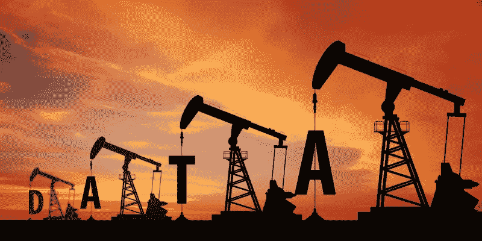
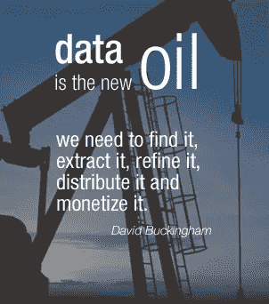
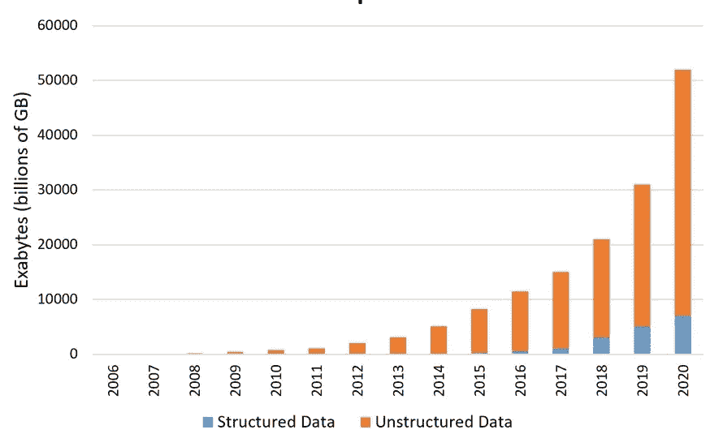

# 听说过新石油吗？—是数据！

> 原文：<https://medium.com/analytics-vidhya/ever-heard-of-new-oil-its-data-bd1eafce2ff3?source=collection_archive---------13----------------------->

> ***数据是新油。它很有价值，但如果不提炼，就不能真正使用。必须把它变成气体、塑料、化学物质等。创建一个有价值的实体，推动盈利活动；因此，必须对数据进行分解和分析，使其具有价值。*** *-* 克莱夫·亨比

几个世纪以来，石油一直是世界经济的宝贵资源，但随着时间的推移，这一概念已被取代。银行、立法者、营销者、社交媒体用户、广告商、社会学家、医生、太空科学家等。每天产生数万亿的数据，现在已经成为数字时代的石油。

一个对数据的真实性、质量和价值不了解或了解不多的人可能不同意，但直接参与信息管理的个人知道，如果数据是可靠的、经过验证的、真实的、可持续的和准确的，数据价值数十亿。

对于石油储量不断减少的世界来说，开采石油已经变得困难和昂贵。相比之下，数据可用性和生产取决于指数曲线。谷歌、脸书、亚马逊和微软等处理数据的数字巨头在 2017 年第一季度的利润总额高达 250 亿美元。与炼油相比，数据挖掘更具成本效益。对于那些负责控制石油流动的人来说，他们已经确立了自己作为世纪主宰的地位，就像几十年前石油工业家曾经做的那样。

大数据是一种全新的商品，可以大量获得。由于储存、处理、修改、使用和再利用的方式，它的生产率要高得多。数据，至少不会像石油在上个世纪带给这个世界的那样，造成物理上的干扰和破坏。数据为经济创造价值，并在教育、医疗保健和商业智能方面为人类带来好处，并有助于减少饥饿以应对气候的剧烈变化。

说那些拥有数据的人可以控制一个国家的经济发展，这并不荒谬。此外，数据提供情报。它可以被解释并转换成对多种商业广告和长期目标有价值的信息。例如，从服装店收集的客户数据可用于通过向客户推荐他们选择的产品来改善下次的客户体验。医生可以从他的病人那里收集数据，这些数据随后可以匿名化，并输入到一些机器学习程序中，以提供帮助更多人的见解。

我们来对比一下数据和石油的增长。

石油和数据的增长对比

不仅是 AWS，阿里巴巴，优步等，一些数字产业巨头也通过数据管理和信息分析获得收入。正如人们常说的，数据将作为核心资产成为数字产业最自然的资源。新的经济模型依赖于数据收集、处理、挖掘和见解提取。数据科学和大数据相关材料的范围不断扩大，这清楚地向世界宣布，数据持有者和收集者将成为数字世纪的下一个大亨。

《硅谷的历史》作者*2016***皮耶罗·斯卡鲁菲**曾说过:

> ***“石油和数据的区别在于，石油的产品不会产生更多的石油(不幸的是)，而数据的产品(无人驾驶汽车、无人机、可穿戴设备等)会产生更多的数据(你通常开车去哪里，你开得多快/多好，谁和你在一起，等等)。”***