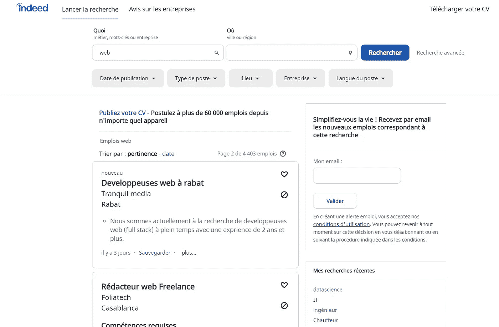
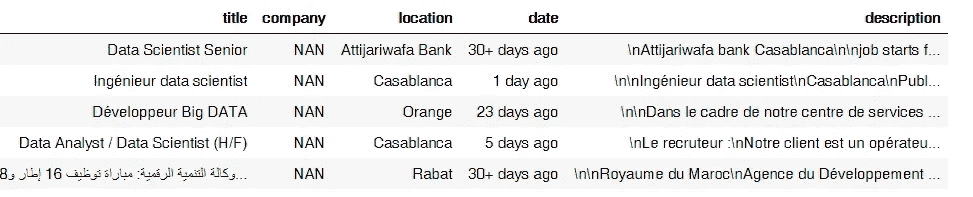

# 每个数据科学家都需要了解这一点

> 原文：<https://medium.com/analytics-vidhya/every-data-scientist-needs-to-learn-this-4632e3a2e275?source=collection_archive---------18----------------------->

## 这项技能将为你打开一个充满新的可能性的世界


[摇滚猴子](https://unsplash.com/@rocknrollmonkey?utm_source=medium&utm_medium=referral)在 [Unsplash](https://unsplash.com?utm_source=medium&utm_medium=referral) 上的照片

曾经有过这个惊人的数据科学项目的想法，你在网上查找你需要的数据，但遗憾的是无处可寻？不幸的是，并不是所有你需要的数据集都在网上。那么，你应该怎么做呢？放弃你的想法回到 kaggle？不要！一个真正的数据科学家应该能够收集自己的数据！

# 什么是网络抓取，为什么要学习？

网络是最大的数据来源，至少在过去的 20 年里，它是人类知识的真实档案。网络抓取是从网络上提取数据的艺术，作为一名数据科学家，它是一个如此方便的工具，并打开了许多冷却项目的大门。

**请注意，一些网站禁止抓取，如果你抓取太频繁或恶意，可能会禁止你的 IP 地址。**

# **我们怎么刮？**

有两种方法来抓取网页。

**基于请求的抓取**:通过这种方法，我们将向网站的服务器发送一个请求，服务器将返回页面的 HTML，这与你在谷歌浏览器上点击“查看页面源代码”时找到的内容相同，你现在可以通过按下 **ctrl+u** 来尝试一下。然后，我们通常会使用一个库来解析 HTML 并提取我们想要的数据。这种方法简单，轻量级，非常快，但是它并不完美，有一个缺点可能会阻止你使用它，事实上，现在大多数现代网站都使用 JavaScript 来呈现他们的内容，即:直到 JavaScript 执行后，你才能看到页面的内容，而请求方法无法处理。

**基于浏览器的抓取**:要执行 JavaScript，我们需要一个完全成熟的浏览器，这就是这个方法的目的，我们将模拟一个浏览器，导航到我们想要的页面，等待 JavaScript 执行，我们甚至可以通过点击按钮、填写表格等方式与页面进行交互，然后只需查看 HTML 状态并提取数据。这种方法非常灵活，你几乎可以抓取任何你想要的网站，但是它比仅仅发送一个请求要慢得多，而且占用大量资源。

# 用硒刮任何东西:

Selenium 是广泛用于 web 自动化的库，但是实际上您也可以使用它来进行抓取！基本上，任何人类可以手动完成的任务，您都可以用 selenium 来模拟，您可以创建一个在发生某些事情时执行特定操作的机器人，或者您可以让 selenium 浏览网页并为您收集数据，这就是我们在本文中将要做的。

为了解析 HTML，我们将使用美丽的汤。

为了进一步阅读，这里有关于[硒](https://selenium-python.readthedocs.io/)和[美汤](https://www.crummy.com/software/BeautifulSoup/bs4/doc/)的文档链接

# 演示:刮真的工作

让我们来做一些练习，这个演示的目标是从给定的搜索查询中抓取作业，并将它们保存在 csv 文件中。

更确切地说，我们感兴趣的是:

*   职称
*   工作地点
*   发布报价的公司
*   工作说明
*   职务发布的时间

这里有一个到样本[工作页面](https://ma.indeed.com/viewjob?jk=8fb003e7a434a0c5&tk=1elgb9sfbstbv800&from=serp&vjs=3)的链接，这里有[项目代码](https://github.com/tariqmassaoudi/IndeedScraping)

首先让我们导入所需的库:

```
from bs4 import BeautifulSoup
from webdriver_manager.chrome import ChromeDriverManager
import pandas as pd
from selenium import webdriver
from selenium.webdriver.chrome.options import Optionschrome_options = Options()
chrome_options.add_argument("--headless")
```

*   漂亮的汤是用来和 HTML 交互的
*   熊猫出口 csv
*   web 驱动程序是实际的浏览器，我们将使用 chrome，并将其配置为在**无头模式**下运行，这意味着它将在后台运行，我们将无法看到浏览工作页面的浏览器，这是可选的，如果您想查看浏览器，您可以删除它！

首先要做的是获得实际的工作页面，lucky 的确有搜索功能，你所要做的就是导航到:

"https://ma.indeed.com/jobs？q =数据+科学家&start=10 "



您将获得与数据科学相关的作业的第二页，因此您可以指定更改 **q** 参数的搜索查询和更改 **start** 参数的页码。请注意，我使用的是 Indeed 的摩洛哥门户网站，但这将适用于任何国家。

我们将实现两个功能，一个是助手功能，导航到提取 HTML 的 URL，并将其转换为我们可以与之交互的漂亮的 Soup 对象，另一个是提取工作页面的链接:

```
def toSoup(url):
    driver.get(url)
    html = driver.page_source
    soup = BeautifulSoup(html, 'lxml')
    return soupdef getPageUrls(query,number):
    url="[https://ma.indeed.com/emplois?q=](https://ma.indeed.com/emplois?q=)"+str(query)+"&start="+str(((number-1)*10))
    soup=toSoup(url)
    maxPages=soup.find("div",{"id":"searchCountPages"}).text.strip().split(" ")[3]
    return maxPages,[appendIndeedUrl(a["href"]) for a in soup.findAll("a",{"class":"jobtitle turnstileLink"})]
```

现在我们有了 URL，让我们实现一些功能来从工作页面中提取我们想要的内容:

```
def paragraphArrayToSingleString(paragraphs):
    string=""
    for paragraph in paragraphs:
        string=string+"\n"+paragraph.text.strip()
    return stringdef appendIndeedUrl(url):
    return "[https://ma.indeed.com](https://ma.indeed.com)"+str(url)def processPage(url):
    soup=toSoup(url)
    title=soup.find("h1",{"class":"icl-u-xs-mb--xs icl-u-xs-mt--none jobsearch-JobInfoHeader-title"}).text.strip()
    CompanyAndLocation=soup.find("div",{"class":"jobsearch-InlineCompanyRating icl-u-xs-mt--xs jobsearch-DesktopStickyContainer-companyrating"})
    length=len(CompanyAndLocation)
    if length==3:
        company=CompanyAndLocation.findAll("div")[0].text.strip()
        location=CompanyAndLocation.findAll("div")[2].text.strip()
    else:
        company="NAN"
        location=CompanyAndLocation.findAll("div")[0].text.strip()
    date=soup.find("div",{"class":"jobsearch-JobMetadataFooter"}).text.split("-")[1].strip()
    description=paragraphArrayToSingleString(soup.find("div",{"id":"jobDescriptionText"}).findAll())
    return {"title":title,"company":company,"location":location,"date":date,"description":description}def getMaxPages(query):
    url="[https://ma.indeed.com/emplois?q=](https://ma.indeed.com/emplois?q=)"+str(query)
```

这里我们使用 HTML 属性如“class”或“id”来定位我们想要的信息，您可以通过检查页面来决定如何选择您需要的数据

以下是 title 属性的示例:


我们可以看到标题是一个“h1”，我们可以使用它的类来选择它

最后，让我们实现一个函数来运行获取所有的作业，并将它们保存在 csv 文件中。

请注意，我们正在获取最大页数，这样当我们到达最后一页时，爬虫就会停止。

```
def getJobsForQuery(query):
    data=[]
    maxPages=999
    for number in range(maxPages):
        maxPages,urls=getPageUrls(query,number+1)
        for url in urls:
            try:
                page=processPage(url)
                data.append(page)
            except:
                pass
        print("finished Page number: "+str(number+1))
    #Save the data to a csv file
    pd.DataFrame(data).to_csv("jobs_"+query+".csv")
```

现在让我们刮数据科学工作:

```
driver = webdriver.Chrome(ChromeDriverManager().install(),options=chrome_options)
getJobsForQuery("data scientist")
```

结果如下:



报废工作的样本

# 结论

在这篇文章中，我们了解了网络抓取，为什么它对每个有抱负的数据科学家都很重要，以及这样做的不同方法，我们已经将它应用于抓取工作。

如果你设法来到这里，恭喜你。感谢阅读，我希望你喜欢这篇文章。如需个人联系或讨论，请随时通过 [LinkedIn](https://www.linkedin.com/in/tariqmassaoudi/) 联系我。