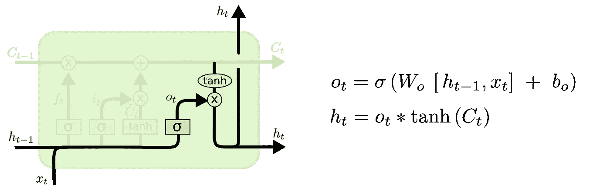
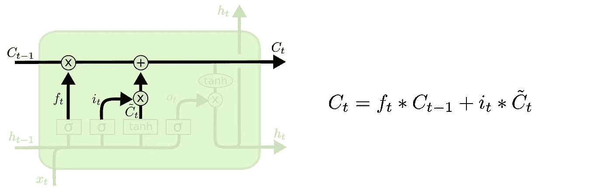
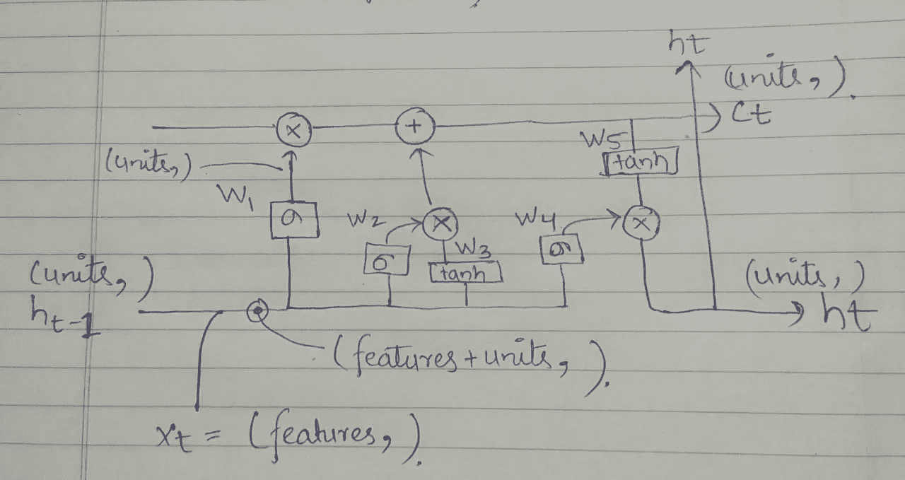

# 关于喀拉斯的 LSTMs，你需要知道的一切

> 原文：<https://medium.com/analytics-vidhya/every-thing-you-need-to-know-about-lstms-in-keras-6f1e95a4d114?source=collection_archive---------20----------------------->

# 介绍

LSTMs 存在了很长时间，但由于其在 NLP 中的工作而变得流行，即 Seq2Seq 模型导致了神经机器翻译(例如:语言翻译器和聊天机器人)。我在理解 LSTMs 时的挣扎(感谢 Keras 对文档中一些术语的糟糕解释)促使我为那些正在经历类似阶段的人写这篇博客@_@。我向你保证这不会很难！

此外，这个博客还与 LSTMs 的工作方式有关。

# 结构


鸣谢:科拉在 LSTM 的博客。

首先要注意的是，与其他神经网络不同，LSTM 以时间步长接收输入，每个时间步长都有一个输出，即 Ht-1，Ht，Ht+1，这就是所谓的隐藏状态，我们通常将最后一个隐藏状态称为**输出。**



隐藏状态

还有一点需要注意的是单元状态，在每个时间步都有一个单元状态**。**看下图就知道什么是细胞状态了。



细胞状态 Ct。

为了了解数学和更多关于为什么使用这些单元状态和隐藏状态的信息，我建议你去浏览我在最后引用的链接。

# 在 Keras 实施

## 输入应始终为形状(批量大小、时间步长、要素)

```
input = Input(shape=(time_steps,features))
lstm = LSTM(units=10)
output = lstm(input)
```

关于“单位”的论点有一个普遍的误解(甚至我一开始也有)，大多数人一开始认为单位是指我们 LSTM 中细胞的数量，但事实并非如此。

参数“units”实际上决定了 LSTM 的输出形状，这意味着所有隐藏状态和单元格状态的形状都是(units，)。

lstm 单元的数量由我们在输入层给出的输入形状自动决定。

数据流:



不同位置的数据形状

*Ht-1* 的形状为**(单位，)**，我们将它作为参数**‘单位’**输入。

*Xt* 的形状为**(数量特征，)**， *Ht-1 和 Xt* 串联，新形状变为**(单位+数量特征，)**。

所有权重 W1、W2、W3、W4 的形状将为**(单位，单位+数量 _ 特征)**。

W5 的形状= **(单位，单位)**

并且偏置 B1、B2、B3、B4、B5 将是形状**(单位，)。**

矩阵乘法后:W *[特征数量，单位]

**(单位，单位+数量 _ 特征)*(单位+数量 _ 特征)，**

形状=(单位，)

> **在最后一步**我们只会得到最终的输出，即隐藏状态

## 2.返回序列

当参数 **return_sequences** 设置为真时，lstm 将输出每个时间步的隐藏状态列表，而不是最后一个时间步的隐藏状态。默认设置为**假**。

```
input = Input(shape=(time_steps,features))
lstm = LSTM(units=10,return_sequences=True)
output = lstm(input)
```

输出形状将为(时间步长，单位)

## 3.返回状态

当 return_state 在参数中设置为 True 时，lstm 将输出最后一个时间步长的 hidden_state 和 cell_state。不幸的是，我不知道有什么方法可以让我们在每个时间步长得到 cell_state。

我打赌你知道两者的形状。-).

```
input = Input(shape=(time_steps,features))
lstm = LSTM(units=10,return_state=True)
hidden_state,cell_state = lstm(input)
```

## 4.返回状态，返回序列

```
input = Input(shape=(time_steps,features))
lstm = LSTM(units=10,return_state=True)
all_hidden_states,hidden_state,cell_state = lstm(input)
```

参考资料:

[http://colah.github.io/posts/2015-08-Understanding-LSTMs/](http://colah.github.io/posts/2015-08-Understanding-LSTMs/)