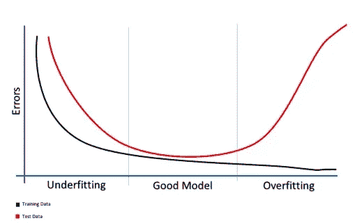
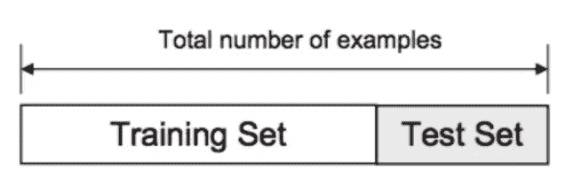
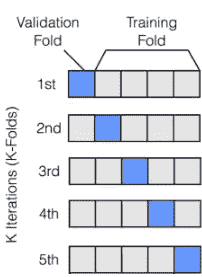
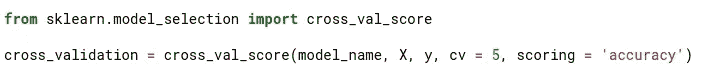
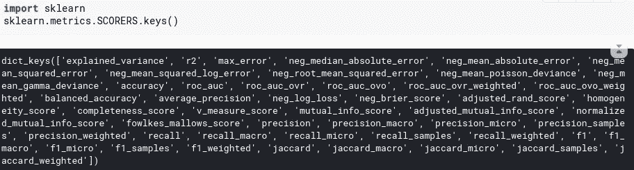
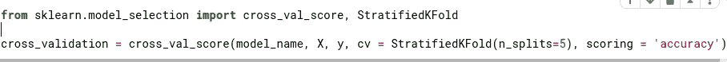

# 关于交叉验证的一切

> 原文：<https://medium.com/analytics-vidhya/everything-about-cross-validation-b22682230f55?source=collection_archive---------27----------------------->

资料来源:联合国人类住区规划署

想要确保你的 **ML(机器学习)**模型**精确地适合**并且在读取世界数据时工作良好？

你来对地方了！！

在这篇文章中，我们将试图涵盖为什么，什么和如何交叉验证！让我们用一些代码来弄脏我们的手。

**过拟合**:在训练集上完全拟合，但在测试集上表现不佳的模型。这意味着模型将很好地学习训练数据，但不会对看不见的样本进行归纳。奥卡姆剃刀理论简单地说就是不要试图把可以用简单得多的方式解决的事情复杂化。换句话说，最简单的解是最普遍的解。一般来说，每当你的模型不服从奥卡姆剃刀时，很可能就是*过拟合**。*

**

*来源:谷歌图片*

*问**:为什么**我应该使用交叉验证？
Ans: **交叉验证(CV)** 是建立你的机器学习模型的第一步，也是最重要的一步。如果你要建立模型，首先拆分你的数据！如果你有一个好的交叉验证，那么你的验证/测试数据将是你的训练/真实世界数据的一个好的代表。毕竟，我们都希望建立**好的** **机器学习模型**。*

***代码**:导入交叉验证包。*

**

*Kaggle 笔记本*

*问:**什么是**交叉验证，如何为我的模型实现？回答:我们都需要这个答案，如上所述，CV 有助于通过根除过度拟合的问题来改进你的模型。*

*根据我们提供的数据集，我们可以使用各种类型的 CV。
**①**。 **k 倍 CV
2。分层 k 倍 CV
3。基于保持的验证
4。遗漏 CV
5。群体 k 倍 CV***

*CV 将训练数据分成几个部分，即训练和验证。我们在训练部分训练模型，在验证/测试部分测试模型。*

**

*来源:谷歌图片*

***k 重 CV**——我们可以把数据分成 k 个不同的相互排斥的集合。这叫 **K 折 CV** 。*

**

*我们使用 scikit-learn 的 KFold 将数据分成 k 个相等的部分。每个样本被赋予一个从 0 到 k-1 的值。*

**

***参数**:*

1.  ***model_name** :给出你当前用数据拟合的模型的名称。*
2.  ***X** :这通常代表你的独立变量，这些是被分析过程的输入。*
3.  ***y** :代表因变量，是给定数据集的输出。*
4.  ***cv** :交叉验证，数字代表 k 的值*
5.  ***评分**:这代表我们想要用来确定我们的模型的参数。回归和分类有多种评分方法，您可以使用此**代码**检查所有方法:*

**

*2.**分层 k 折叠**:交叉验证的下一个重要类型是分层 k 折叠。如果您的二元分类数据集有 90%的正样本，只有 10%的负样本，您不希望使用随机 k 倍交叉验证。
该方法保持每个折叠中标签的比例不变。所以每一次折叠，你都会有相同的 90%阳性和 10%阴性样本。因此，无论你选择什么样的指标来评估，它都会给出相似的结果。
很容易将代码从随机 k 重交叉验证修改为分层 k 重交叉验证，代码:*

**

*卡格尔。*

*3.**基于保持的验证:**假设我们的数据集非常大，那么你应该怎么做？假设你有一百万个样本。5 重交叉验证意味着在 80 万个样本上训练，在 20 万个样本上验证。根据我们选择的算法，对于这种规模的数据集，训练甚至验证可能非常昂贵。在这些情况下，您可以选择基于**拒绝的验证。**该验证通常与**时间序列数据一起使用。***

*在许多情况下，我们不得不处理小数据集，而创建大验证意味着丢失大量数据供模型学习。在这些情况下，我们可以选择一种 k 重交叉验证，其中 k=N，N 是数据集中的样本数。这意味着在所有的训练中，我们将对除 1 以外的所有样本进行训练。这种交叉验证的折叠数与数据集中的样本数相同。*

*在本文中，我们讨论了通常应用于数据集的主要交叉验证。*

*希望您在为您的模型创建自己的交叉验证时会发现它很有用。如果你愿意，请在 [Medium](/@lokeshrth4617) 和 [GitHub](https://github.com/Lokeshrathi/) 上关注我，以获得更多关于机器学习和数据科学的更新。*