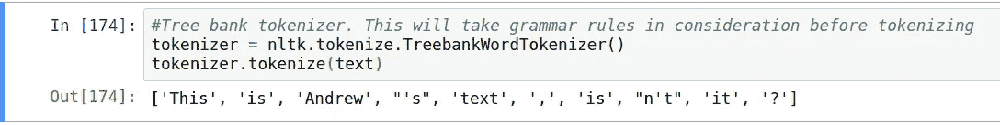
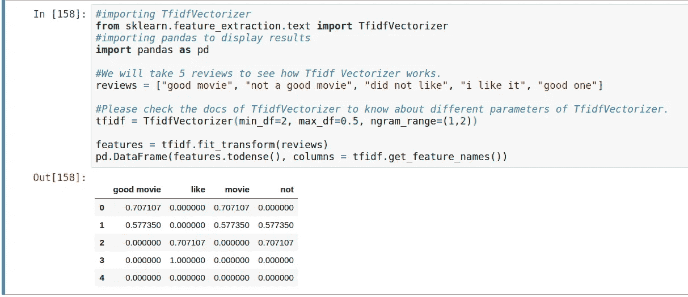

# NLP 入门所需的一切

> 原文：<https://medium.com/analytics-vidhya/everything-to-get-started-with-nlp-3ccfbb7405a2?source=collection_archive---------6----------------------->

帕特里克·托马索在 [Unsplash](https://unsplash.com/s/photos/words?utm_source=unsplash&utm_medium=referral&utm_content=creditCopyText) 上的照片

这是一个由三篇文章组成的系列。我将详细介绍以下主题:

***本文:***

1.  NLP 的概述、历史和困难。
2.  主要应用。
3.  工作原理:标记化、规范化和特征提取(BOW、TFIDF)。

[***第二篇***](/@ajeet.singh.ec14/sentiment-classifier-using-tfidf-3ffce3f1cbd5?sk=cd23d564be7a9b6cef3504657cfe2cd9)***:***

1.  如何做一个情感分类器？

[***第三篇:***](/@ajeet.singh.ec14/nlp-libraries-and-pretrained-models-94c9a53a295a?sk=f45c6cb78399e55b30eaf0ed7b647515)

1.  NLP 库概述，包括 Spacy，NLTK。
2.  这些库的优缺点。
3.  如何使用这些库。
4.  NLP 预训练模型概述。

不浪费任何时间，让我们开始吧…

## **什么是 NLP？**

NLP 代表自然语言处理。这是一个关注人类语言和计算机之间互动的研究领域。它是计算机科学、人工智能和计算语言学的融合。

NLP 是人工智能的一个子领域，专注于使计算机能够理解和处理人类语言，使计算机更接近人类对语言的理解。

## NLP 的客场之旅

***初始公里数***

在最初的日子里，大多数 NLP 任务使用手工编码的规则。例如，用于词干的语法规则或启发式规则。正如所料，这是一个非常繁琐的过程，精确度非常低。

***几百公里后***

后来在 1980 年到 1990 年之间，研究人员开始使用机器学习算法来完成 NLP 任务。他们试图利用大量现实世界的数据来学习早期手工编码的规则。但是由于他们没有当今先进的计算机，这种方法和精确度是有限的。

***后来上路***

然后，随着计算机处理的进步，科学家们能够以更好的方式利用数据。他们专注于统计模型，该模型根据每个输入要素的实值权重做出概率决策。这种模型给出了概率上的答案，因此可以考虑不止一种选择。

## 为什么 NLP 很难或者不容易？

> 如果你是人类，那么你可以理解下面的陈述试图传达的意思，但是如果你不是，但你仍然理解，那么 NLP 正在以其想象的最佳状态工作。

> 维拉科利昨晚大搞破坏。他几乎把所有的球都击出了公园。

从这则新闻声明中我们能理解什么？

对我们人类来说，这意味着什么是非常明显的。我们知道 Virat Kohli 是一名击球手，他打得非常出色，在与对手的比赛中得分很多。这里的公园指的是体育场。

但是计算机不像人类那样工作，它们将无法解读字里行间的含义。对他们来说，肆虐意味着 Virat Kohli 带来的灾难，公园意味着*公园*而不是体育场。

现在，这就是 NLP 的真正含义:

> *NLP 是一个适合计算机的健身程序，他们正在跟随并试图达到人类力量的水平。*

基于这种表现，研究人员正在改进这个项目。

## 自然语言处理的主要应用

以下是自然语言处理的一些最常见应用的列表。

1.  机器翻译
2.  语音识别
3.  拼写检查
4.  语言生成
5.  聊天机器人
6.  情感分析

# 工作中的 NLP

[布雷特·乔丹](https://unsplash.com/@brett_jordan?utm_source=unsplash&utm_medium=referral&utm_content=creditCopyText)在 [Unsplash](https://unsplash.com/s/photos/robot-working?utm_source=unsplash&utm_medium=referral&utm_content=creditCopyText) 上的照片

为了理解 NLP 是如何工作的，让我们试着做一个执行情感分析的系统。情感分析是一项文本分类任务。我们将试图知道给定的文本是否引发积极或消极的情绪。

对于一个拥有一家餐馆并想知道顾客有多开心的人来说，评论的情感分析是非常重要的。同样，这项任务在许多不同的领域都非常重要。

> 注意:这是 NLP 的一个非常基本的例子，但是我希望它能给你一个在 NLP 世界里事情如何进行的要点。

# 用例

我们将尝试为电影评论制作一个情感分类器。也就是说，我们会尝试根据评论中的标记词将评论分为正面或负面。

**让我们看一个正面和负面评价的例子。**

***阳性:***

> 这部电影非常好。它充满了惊喜和乐趣。角色处于最佳状态。

***否定:***

> 这部电影伤害了我的期望。我对这位导演有更高的期望。不是好电影。

让我们正式写出我们的输入和输出

***输入*** :评论文本。
***输出*** :情绪类别:积极或消极。

> 注意:输出的类别可以更多，比如稍微正的，但是为了便于理解，我们只取了两个。

在将数据输入 ML 算法之前，我们必须做一些预处理。我们将通过例子来理解不同的预处理步骤。所以抓紧了。这会很有趣的。

# 文本预处理

> *最重要的一步。*

从广义上来说，我们在文本预处理中有两个主要步骤:

1.  **清理文本:**既然情感是由标记词决定的，比如*美好*、*不好*、*大方向*、*奇妙*而不是由 *my、his、her、w* e 这样的词来决定，那么就尽量去掉对我们的分类器没有任何影响的词。我们称这些词为停用词。
2.  **特征提取:**由于评论是字符串格式的，而大部分机器学习算法都是以数字特征作为输入，我们必须以某种方式将评论转换成数字特征。

# 1.清理文本

以下是大多数 NLP 任务必须完成的基本且最重要的清洁步骤。
1。记号化
2。令牌规范化
3。进一步正常化
让我们一个一个来看。

## **1。标记化**

首先，我们想把输入序列分成单独的记号。可以将标记视为语义处理的一个有用单元。或者简单地说，将文本分成有意义的小段。

有三种非常著名的标记化方法。

*   空白标记符。
*   使用标点符号。
*   用语法来标记。

让我们看看如何使用它们以及它们的局限性。我们将使用 Python 的 NLTK 库。

空白标记符

空白标记符

**问题:**这里的 ***呢？*** 是一个不同的令牌，如果比较的话，就不会与 ***it*** 相同。但是 ***它*** 和 ***它呢？*同**有相同的意思。所以我们想把它们合并在一起。就像把它们看成一样东西。

让我们尝试使用标点符号。

使用标点符号。

**问题:** ***s*** ， ***isn，******t***意义不大。让我们试着根据英语的一些语法规则来标记。

TreebankTekenizer

在这里你可以看到 ***吗？*** 不在那里。我们所知道的**T5 它 T7 和**T9 它呢？** 两者意思相同，所以这个记号赋予器只给出 ***它*** 作为输出**

现在你知道了三种类型的记号赋予器，你可以选择任何一种。我更喜欢第三个。

## **2。令牌规范化**

看看这些单词对

*   狼，狼
*   说话，说话
*   踢，踢

这些词可能看起来不同，但实际上表达了相同的意思。因此，两者只有一个表示将是非常有益的。这同样适用于同一个词的任何数量的变体。

为此，我们可以进行标记规范化。我们将使用编码来理解它，但是首先要有一些理论来理解它。

基本上有两个非常著名的过程来进行令牌规范化。

1.  ***词干化:***T22 去除和替换后缀以获得单词词根形式的过程，该词根形式称为*词干*。通常指砍掉后缀的试探法。
    举例: ***波特的词干分析器。***
    最古老、最著名的英语词干学家。连续应用 5 条规则。它在不规则的形式上失败，产生非文字。但是在实践中仍然有效。
2.  ***词汇化:***
    通常是指运用词汇和词法分析，把事情做得恰到好处。它返回一个单词的基本形式或字典形式，这个单词被称为一个*词条* 示例: ***WordNet Lemmatizer。***
    使用 WordNet 数据库查找词条。不是所有的形式都减少了。

词干化和词汇化的比较。

词干化和词汇化的比较

现在让我们使用 Python 的 NLTK 执行同样的操作

波特·斯特梅尔

**问题:*脚*** 没有转换成 ***脚*** 。还有就是像***wolv******football***这样的非词。

WordNet 词条解释器

**问题:*谈*谈**不转换成**谈*谈*谈**。同样 ***跳闸*** 不转换。

> 我们需要尝试*词干*和*词汇化*，并选择哪一个最适合我们的任务。我们也可以一个接一个的申请。有效性将取决于产出。

## 3.进一步规范化

我们可以做的其他一些标准化工作有:

1.  规范化大写字母:
    ***Us*** 和 ***us*** 如果两者都是代词，就会是 **us** 。
    **美国**和**美国**也可以是国家。现在，如何知道它是一个国家还是一个代词是很棘手的。
    我们可以对此使用启发式方法:
    1。句子的小写开头，因为句子通常以大写字母开头。
    2。标题中的小写单词。
    3。保留句中词不变。因为如果在句中有一个大写的单词，那么它可能是一个命名的实体。
2.  处理缩略词
    同一个缩略词可以有多种写法。比如***eta******e . t . a .******e . t . a .***都是预计到达时间的缩写。所以最好将所有的表单转换成一个单一的表单。
3.  移除*停用词*
4.  移除符号
5.  还有更多…

# 2.特征抽出

照片由[米卡·鲍梅斯特](https://unsplash.com/@mbaumi?utm_source=unsplash&utm_medium=referral&utm_content=creditCopyText)在 [Unsplash](https://unsplash.com/s/photos/number?utm_source=unsplash&utm_medium=referral&utm_content=creditCopyText) 上拍摄

既然我们已经预处理了文本，并且文本是归一化标记的形式，我们将从文本中提取特征，以馈入任何机器学习算法。

对于这个任务，我们将对文本进行矢量化处理。简单地说，我们将把每个记号转换成向量。对于这一过程，有三种著名的方法，它们各有优缺点。我们将一个接一个地看到他们三个。

## **1。袋字(蝴蝶结)**

在 BOW 中，我们统计了文本中所有标记的出现次数。这种方法的动机是我们寻找一些标记词，如*优秀的*和*令人失望的*，这有助于区分积极和消极的评价。在对出现次数进行计数后，我们将得到一个针对整个文本以及每个单独单词的特征向量。让我们看一个非常小的实际弓矢量化的可视化表示。

对于这个例子，我们将采用三个电影评论:

*   好电影
*   不是一部好电影
*   不喜欢

弓

从表中可以看出，我们对课文中的每个单词都进行了计数。请注意，计数始终可以大于 1。每一行将作为相应电影的向量。每一列是相应单词的向量表示。

**这种方法的问题**

*   由于它是一个蝴蝶结表示，我们失去了词序。
*   计数器没有正常化

## **2。N-grams 的 BOW**

失去词序的问题可以通过 n 元语法来解决，其中 n 是非零正数。
让我们来看看我们所说的 n 元语法是什么意思:
1 元语法:代币。例如:商品、电影等。
2-gram: Token pairs。例子:好电影，没有，等等。
以此类推……

现在让我们看看它是什么样子。我们将采取与 BOW 相同的三个审查。我们还将包括 2 克。

用 N-grams 打保龄球

现在我们保留了一些使用 2-gram 的单词排序。和上一种情况一样，每一行对应一篇电影评论。请注意，在上表中，我们已经删除了停用词(过于频繁的 n-gram)。

**n-gram 表示的问题**

1.  太多的功能:我们只为 3 个小评论添加了 2 克，我们得到了 9 个功能，如果我们有数百个评论和数千个令牌会怎么样。如果我们只添加了 2 个字母，在这种情况下，特征的数量将会以百万计。
2.  计数器未标准化

**解决太多特征的问题**
由于特征可能太多，我们可以基于它们在我们的语料库的文档中的出现频率来移除一些 n 元文法。

*   高频 n-grams
    冠词、介词等。例子:***等。***
*   ***低频 n-grams:错别字，罕见的 n-grams
    我们不需要它们，因为它们很可能过度拟合。因为低频 n-gram 对于我们未来的分类器来说是一个非常好的特征，它可以看到 n-gram 并给出输出。我们不想要这样的依赖。***

## ***3.TF-IDF[术语频率-逆文档频率]***

***正如我们在前面的案例中看到的，我们有一些高低频 n 元语法必须删除。除此之外，我们还有中频 n-gram。由于我们处理大量数据，中频 n 元语法也可能是一个非常高的数字。***

> ****我们将尝试确定在手头的任务中，哪些中频 n-grams 比其他的*更有用。***

***【TFIDF 背后的动机:***

> ***频率较小的 n 元语法可能比其他语法更有鉴别能力，因为它们可以捕捉评论中的特定问题。
> 比如在某个酒店的评论中，有一个关于 wi-fi 的问题，这是一个很大的问题，但在每个评论中并不常见。因此，我们希望提取在一个文档中更常见而在其他文档中较少出现的 n 元语法。以便他们能够强调某些特定问题。***

***对于这个任务，我们可以使用 **TF-IDF 矢量化**。***

*****TF-IDF:更好的 BOW**
我们可以用 TFIDF 值替换 BOW 向量中的计数器。然后按行规范化结果。这样我们将解决简单弓形向量的非标准化问题。***

***所有这些都可以使用 Python 内置的 [TFIDFVectorizer](https://scikit-learn.org/stable/modules/generated/sklearn.feature_extraction.text.TfidfVectorizer.html) 来完成。我给了你 TFIDF 的精华。要了解公式和理论，请访问维基百科关于 [TF-IDF](https://en.wikipedia.org/wiki/Tf%E2%80%93idf) 的文章。***

***现在让我们看看用 Python 实现 TF-IDF 矢量化。***

******

***TFIDF***

***在输出中，您可以看到对于 ***评论*** 列表中的每个电影评论，我们有一个行，其中的 tfidf 值对应于列中的特性。***

> **接下来的[文章](/@ajeet.singh.ec14/sentiment-classifier-using-tfidf-3ffce3f1cbd5?sk=cd23d564be7a9b6cef3504657cfe2cd9)用内嵌代码块实现了完整的 python。您可以从那里复制试用的代码。**

# ****特征提取概要:****

**1.我们以鞠躬的方式做了一个简单的反特征。
2。我们还可以添加 n-grams。
3。我们可以用 TF-IDF 值替换计数器。**

# **制作情感分类器**

**现在我们已经提取了特征，我们可以将这些特征输入到任何分类机器学习模型中。虽然*任何*都是一个相对的术语，总会有一些约束。对于我们的例子，我们的特征是非常长的稀疏向量(很多零)，所以使用决策树模型将花费大量的时间，并且给出非常低的准确度。对于长稀疏向量表现非常好的一个模型是**逻辑回归**。这是一个线性分类模型，训练速度非常快。**

**我们将在下一篇文章中介绍编码。**

**如果你喜欢这篇文章，那么你可以想按多少次拍手按钮就按多少次。还有，你可以在[**LinkedIn**](https://www.linkedin.com/in/singhajeet23/)**上联系我，或者在**[**GitHub**](https://github.com/AjeetSingh02)**上关注我。****

## **让我们进一步移动到[下一个](/@ajeet.singh.ec14/sentiment-classifier-using-tfidf-3ffce3f1cbd5?sk=cd23d564be7a9b6cef3504657cfe2cd9) …**

****