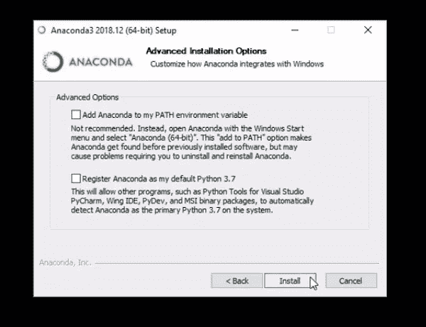

# 关于在 Windows、Linux 和 Mac 上设置 Python 的所有信息

> 原文：<https://medium.com/analytics-vidhya/everything-you-ever-wanted-to-know-about-setting-up-python-on-windows-linux-and-mac-5b669274df54?source=collection_archive---------4----------------------->

你是不是很纠结要不要在机器上安装 Python？这实际上是我在数据科学初学者中看到的一个非常普遍的问题。安装在理论上似乎很简单，但实际上事情可能会变得有点棘手。

当我试图在我的 Linux 和 Windows 机器上设置 Python 时，我个人遇到了各种各样的障碍。boom 之前安装似乎运行顺利！关于兼容性的问题。或者某个依赖关系缺失的另一个问题。


如果您曾经在尝试在您的机器上安装 Python 时遇到过这种麻烦——这篇文章就是为您准备的。我不得不访问几个论坛和网站来找出我哪里出错了。这不是一次很好的经历。所以我决定整理所有的东西，把它们放在一个地方给你。

# 数据科学的重要工具

数据科学家的工具箱真的会让你大吃一惊，因为工作的不同方面可能需要多种工具。然而，有些工具比其他工具更重要(或更广泛使用)。以下是每位数据科学家，无论是初学者还是有经验者，都需要的一些必备工具:

1.  **Python:** Python 是数据科学领域使用最广泛的编程语言。
2.  **熊猫:**说到数据处理和分析，没有什么能打败熊猫。
3.  **NumPy:** NumPy 引入了支持大型多维数组和矩阵的函数。
4.  Matplotlib: Matplotlib 是 Python 中最流行的数据可视化库。
5.  Scikit-Learn: 就像 Pandas 的数据操作和 matplotlib 的可视化一样，Scikit-Learn 是构建模型的 Python 领导者
6.  **Jupyter Notebook:**Jupyter Notebook 是一个非常有用的执行数据科学实验的 IDE。

最棒的是，所有这些工具都默认带有 Miniconda/Anaconda！

# 什么是蟒蛇和迷你蟒蛇？

当你学习数据科学时，Anaconda 是一个非常重要的软件。它让我们可以安装几乎所有的库/工具，这些库/工具是我们在 Python 的数据科学之旅中需要的。它有一个非常简单的界面，让我们只用几行代码就能完成大多数数据科学任务。

Minoconda 是 Anaconda 的缩小版。如果你的电脑没有足够的磁盘空间，这是一个轻量级版本，也是一个不错的选择。

# 在 Linux 上安装 Python 的步骤

Linux 是数据科学社区中广受欢迎的平台。就我们执行的数据科学任务而言，它提供了巨大的灵活性。但是这里有一个小小的警告——在 Linux 上安装软件可能相当棘手！如果您是 Linux 初学者，这一点尤其正确。

下面是在 Linux 上设置 Python 和流行的数据科学工具的步骤。

您可以从以下链接下载 Miniconda:

```
[https://docs.conda.io/en/latest/miniconda.html](https://docs.conda.io/en/latest/miniconda.html)
```

你可以选择安装程序的 **Linux** 版本，建议的 Python 版本应该是任何高于 **Python 3.5 的版本。**

**第二步:安装 Miniconda**

现在您已经下载了 Miniconda 文件，下一步是在您的系统中安装它。为此，首先转到下载文件的目录:

```
cd directory_name
```

然后，为了启动安装脚本，使用带有 Miniconda 文件名的 bash 命令:

```
bash miniconda_file_name
```

如果要求确认，只需按回车键继续。


看到许可条款后，一直按 enter 键，直到它要求接受条款。然后键入“是”接受条款。然后，它会要求您选择安装位置:


您可以给出一个单独的位置，或者按 enter 键选择默认位置。我通常更喜欢默认选项，除非我的主驱动器有空间问题，然后我会给出备用安装位置。

在这之后，过程相当简单，因为你只需要说“是”并按下回车键。请记住，安装可能需要一些时间，所以当您的机器努力安装所有东西时，请随意喝杯咖啡！

一旦您完成了前面的步骤，您将被要求打开另一个终端来激活 Miniconda 安装。打开一个新的终端窗口，然后我们可以继续下一步。

**第三步:创建一个新环境**

一个环境基本上就是你的“工作空间”。你可以随意设置。多酷啊。

您可以选择在您的环境中应该使用哪个版本的 Python 库，这基本上会帮助您更好地控制您的数据科学工作流。

> *现在，Miniconda 中环境的好处是它* ***允许您创建多个这样的环境。*** *您可以管理多个独立的环境，每个环境负责一个单独的任务！*

让我用一个例子来解释一下。假设我们正在使用一个最先进的框架(比如用于自然语言处理的 PyTorch-Transformers ),我们需要所有最新版本的相关库。这就是环境派上用场的地方。

我们可以让新的设置**与更简单的设置**共存，在更简单的设置中，我们有一个旧的遗留项目，我们被迫使用我们的项目所需的某些版本的库。

您可以使用以下命令创建环境:

```
conda create -n av python=3 anaconda
```

“av”是环境的名称(您可以给它取任何想要的名称)。而 python=3 就是我们要用的 python 版本。

要检查环境是否已成功创建，请键入以下命令:

```
conda env list
```

这将为我们提供系统中当前安装的环境列表。

**第四步:激活新环境**

现在，要开始使用您创建的新环境，请键入以下命令:

```
source activate av
```

为了确保在活动环境中一切正常，我们可以使用以下命令查看安装在该环境中的库列表:

```
conda list
```

上面的命令应该会给出如下输出:


一旦您使用完一个环境，并且想要停用它，您可以使用:

```
source deactivate av
```

现在设置已经完全完成，是时候检查一切是否如预期的那样工作了。我们进行下一步吧！

**第五步:启动 Jupyter 笔记本**

是时候启动我们的 Jupyter 笔记本了:

```
jupyter notebook
```

这将在浏览器中启动 Jupyter 笔记本:


接下来，您只需点击“新建”并选择“Python 3”即可开始使用 Python 3 笔记本:


很简单，不是吗？

恭喜你！现在，您已经成功地在系统上安装了 Anaconda。由于 Anaconda 默认附带 Python 和所有数据科学库，如 Pandas、Numpy、Scikit-Learn 等。现在，您的系统中也具备了所有这些功能！

**如果你仍然有疑问或者在任何一个步骤被卡住，这里有整个安装过程的视频:**

# 在 macOS 上安装 Python 的步骤

macOS 的安装步骤与 Linux 的安装步骤非常相似。他们俩有着相同的痛击**终端**。唯一的区别是您需要下载的 Miniconda 安装文件。

您可以从以下链接下载 macOS 版 Miniconda:

```
[https://docs.conda.io/en/latest/miniconda.html](https://docs.conda.io/en/latest/miniconda.html)
```

这次你必须选择**MAC OS“bash installer”**，建议的 Python 版本应该是任何高于 **Python 3.5 的版本。**

一旦你下载了上面的文件，你只需要按照 Linux 安装步骤中的**步骤 2 到 5** ，这就足够让你开始了。

**观看下面的视频，获得在 macOS 上安装 Python 的完整演示:**

# 在 Windows 上安装 Python 的步骤

让我们来看看在 Windows 上安装 Python 和其他数据科学库的步骤。

您可以从以下链接下载 Anaconda:

```
[https://www.anaconda.com/distribution/](https://www.anaconda.com/distribution/)
```

你可以选择 **Windows** 版本的安装程序，建议的 Python 版本应该是任何高于 **Python 3.5 的版本。**

现在你会看到两种选择——32 位**和 **64 位**安装程序。选择一个与您的系统兼容的(如果您不确定，请右键单击“我的电脑”查看)。**

**第二步:安装 Anaconda**

下载完安装文件后，转到“下载”文件夹，双击该文件。将会打开一个新的安装窗口:


然后单击“下一步”，这将带您到许可协议。单击“我同意”接受它:


然后，它会询问您是只为该用户安装该软件，还是为系统的所有用户安装该软件。这完全是你的选择。我通常选择“推荐”选项:


现在，您可以选择安装该软件的位置:


现在，在下一个窗口中，您将获得几个“高级选项”。您现在可以取消选中这两个选项，然后单击 Install。这一步可能需要一些时间:



安装完成后，您可以单击“下一步”:


您可以跳过 Microsoft Visual Code 的安装:


然后单击完成:


瞧啊。Python 已经为您准备好开始分析数据和构建机器学习模型。

**第三步:启动 Jupyter 笔记本**

为了确保一切安装正确，我们将打开一个 Jupyter 笔记本。为此，首先进入开始菜单，搜索“Jupyter”:


点击“Jupyter 笔记本”选项，这将在浏览器中打开笔记本:


现在，您只需点击“新建”并选择“Python 3”即可开始使用 Python 3 笔记本:


**这里有一个视频，详细介绍了如果你喜欢通过视觉形式学习，如何在 Windows 上安装 Python:**

# 结束注释

这就是在所有流行的平台上安装 Python 的全部内容。我在这里的目的是让您熟悉安装过程，并消除您可能有的任何疑问。

如果你仍然面临任何问题，请在下面的评论区告诉我，我很乐意帮助你！

*原载于 2019 年 8 月 13 日*[*https://www.analyticsvidhya.com*](https://www.analyticsvidhya.com/blog/2019/08/everything-know-about-setting-up-python-windows-linux-and-mac/)*。*