# 评估分类模型的 7 种方法

> 原文：<https://medium.com/analytics-vidhya/everything-you-need-about-evaluating-classification-models-dfb89c60e643?source=collection_archive---------7----------------------->

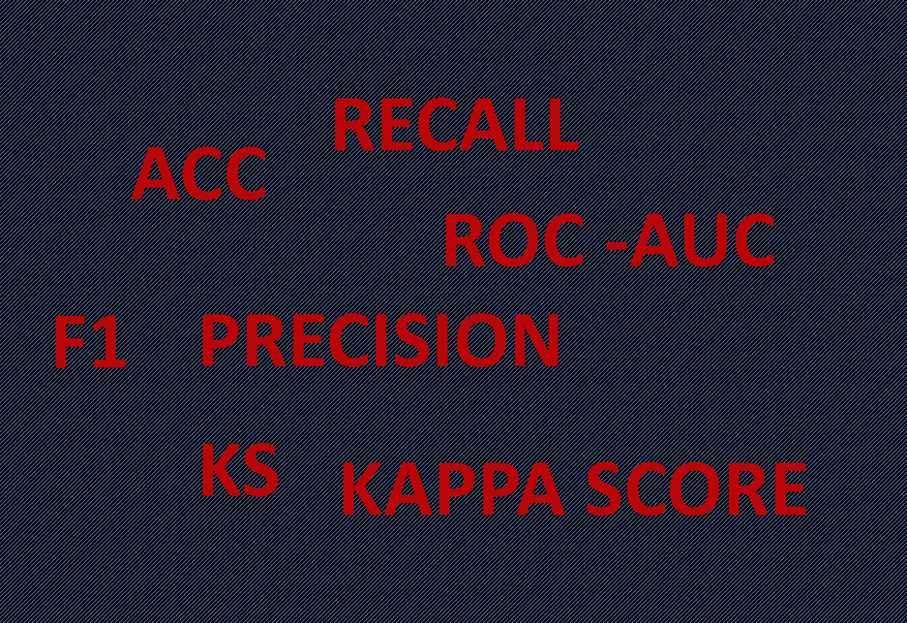

分类模型广泛应用于各种场景。在这篇文章中，不仅会讨论准确性或 f1 评分，还会提到 KS 和 Kappa 评分。7 不同的评价方法如下。让我们深入了解它们！

1.  准确(性)
2.  精确
3.  回忆
4.  子一代
5.  AUC-ROC
6.  偷杀/抢杀
7.  Kappa 评分

# 准确(性)

准确度是计算预测正确的百分比。一般来说，在大多数情况下都可以使用。

然而，当目标超级不平衡时，使用精确度是错误的。例如，在欺诈检测中，99.99%的交易是好的，只有 0.01%是坏的。如果我们简单地假设 100%的用户是好的，那么准确率可以达到 99.9%，这意味着准确率不是一个评估性能的好指标。

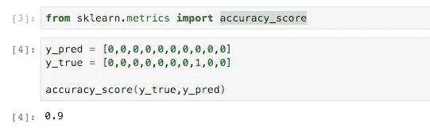

# 精确

精确度也称为阳性预测值和特异性。计算精度的方法如下。

如果预测中有 3 个阳性(“1”)，其中 2 个是正确的(真阳性，即 TP)，则精度为 66.6% (2/3)。在这里，无论有多少个 0 是正确的或不正确的，精度都不会受到它们的影响。

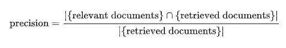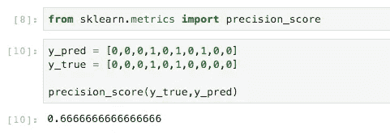

# 回忆

同样，回忆被定义为“成功检索到的相关文档的分数”，它也被称为敏感度。

例如，10 个标签(基本事实)是肯定的(“1”)，其中 3 个被预测为肯定的，那么召回率是 30%。用例可以是在医院，医生更关心是否所有潜在的新冠肺炎病例都被诊断出来。甚至有些情况下假阳性(FP)并不重要，因为有第二轮或第三轮测试。

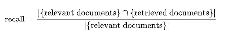

要注意的是，查全率和查准率并不仅仅可以用于二元分类问题。它们也可以用于多类建模，这将在未来深入讨论。你也可以在 scikit-learn 中快速查看如何操作[ [点击此处](https://scikit-learn.org/stable/modules/generated/sklearn.metrics.precision_recall_fscore_support.html) ]。

# 子一代

上面讨论了召回率和精确度。F-measure 是一种同时关注两个指标的方法。公式如下:

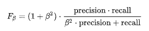

如果查全率和查准率同等重要，F1 将如下使用。

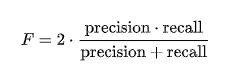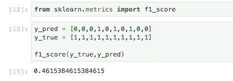

# AUC-ROC

AUC-ROC 代表“ROC 曲线下的面积”就是用各种阈值(默认阈值为 0.5)来衡量分类模型。值的范围是从 0 到 1。特别是，公式中使用的术语如下。

TN:真阴性

TP:真阳性

FN:假阴性

FP:假阳性

TPR(真阳性率)=召回率= TP / (TP + FN)

FPR(假阳性率)= 1-精度= FP /(FP + TN)

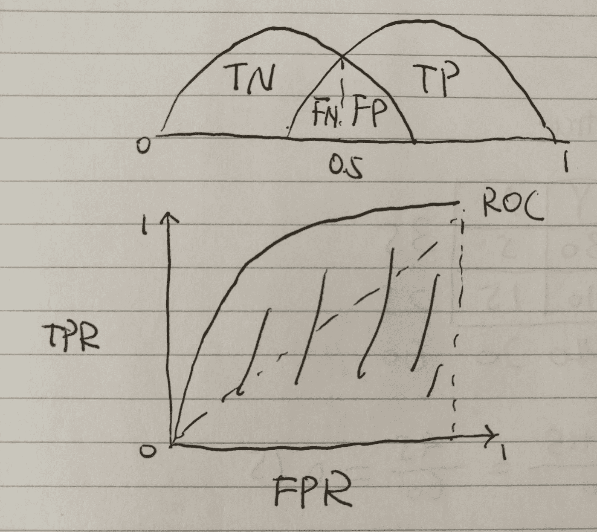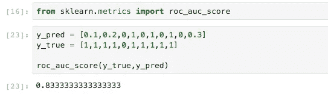

# 偷杀/抢杀

KS(Kolmogorov–Smirnov 检验)是一种评估指标，用于比较两个样本是否来自同一分布。此外，KS 还广泛用于银行业的风险管理和欺诈检测。

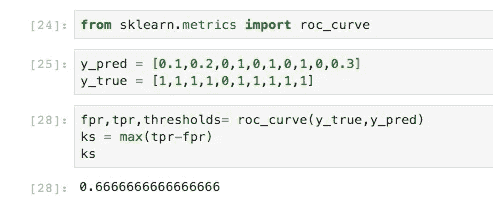

在图中，KS 可以解释为 2 类的最大余量(红蓝线代表两类的累积概率)。如果差距足够大，我们可以说分类模型可以很好地区分两个类别。

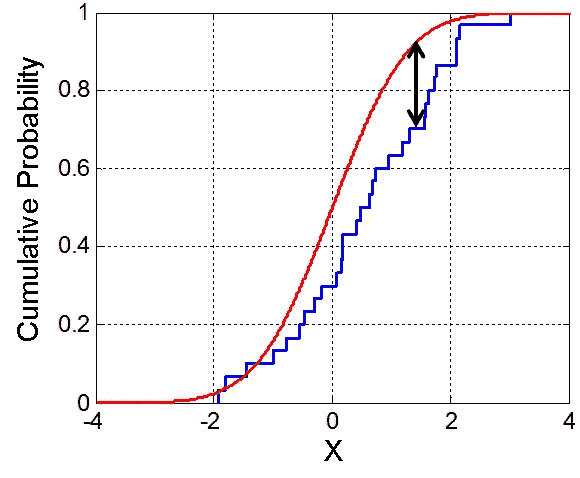

图片来自维基

# Kappa 评分

Kappa 评分是衡量区间信度的指标。换句话说，我们想知道“真正的准确性”并降低不确定性水平。比如有 2 个类，2 个类的比例相同，那么通过随机猜测得到正确答案的概率很大。在同样的情况下，如果有超过 10 门课，相对来说，通过随机猜测得到正确答案要困难得多。

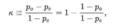

在上面的公式中，Po 是观察到的一致，Pe 是机会一致的假设概率。仍然不知道它是如何工作的？让我们看一个例子。Po (75%)与准确度相同。然后，我们需要计算一下，我们有多幸运能正确地得到 Y (35/60)和 N (25/60)(我们也可以理解为难度的高低)。

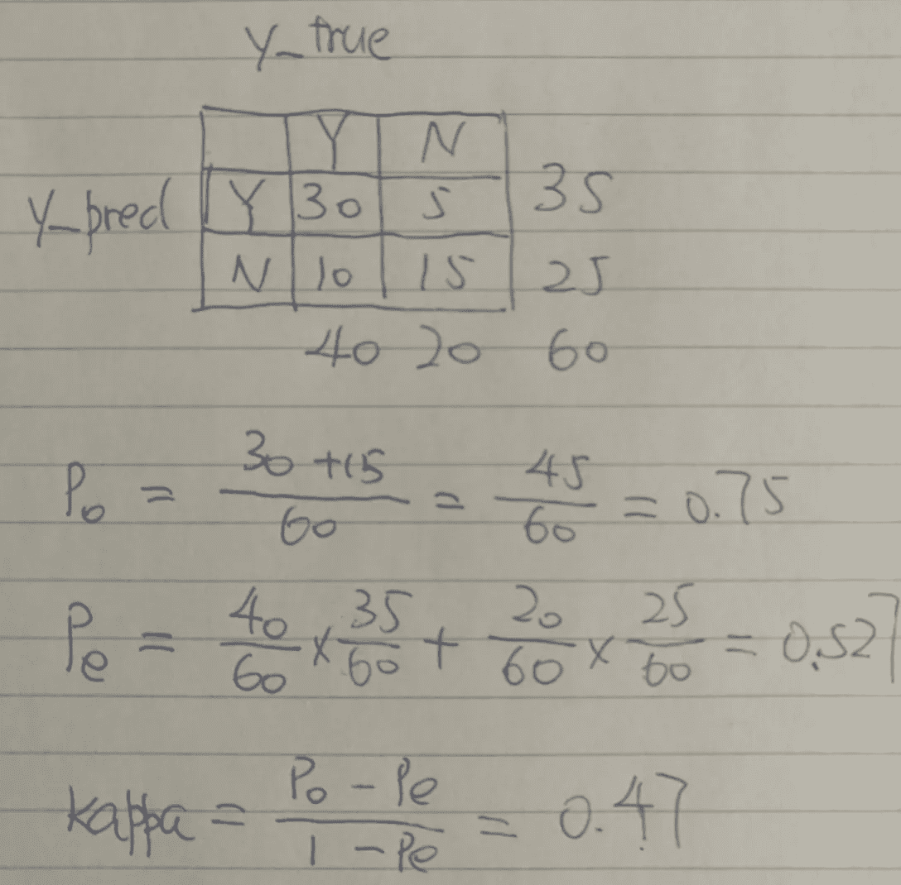

在实际操作中，我们不需要一步一步地手动计算 Kappa 分数。而是可以直接从 sklearn 导入 cohen_kappa_score。

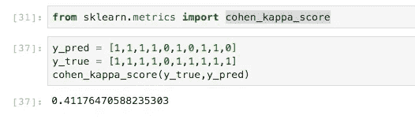

此外，加权 kappa 评分可用于评估有序多类分类模型。

感谢阅读。希望这 7 个评价指标能给你一个评价分类模型的总体思路。

# 参考

[https://en.wikipedia.org/wiki/Precision_and_recall#Recall](https://en.wikipedia.org/wiki/Precision_and_recall#Recall)

https://en.wikipedia.org/wiki/Cohen%27s_kappa

[https://en . Wikipedia . org/wiki/Kolmogorov % E2 % 80% 93 Smirnov _ test](https://en.wikipedia.org/wiki/Kolmogorov%E2%80%93Smirnov_test)