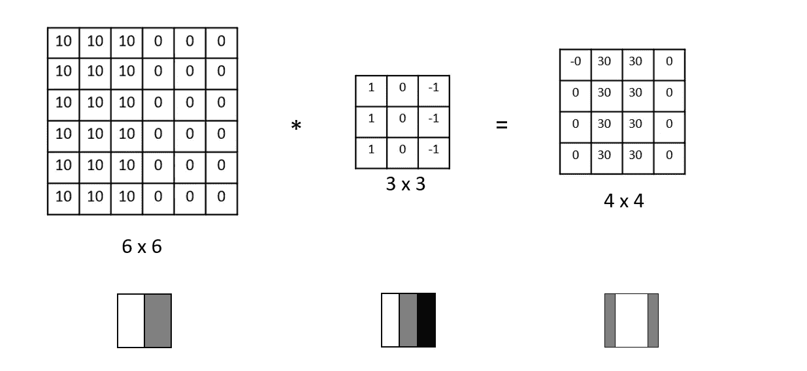

# 关于卷积神经网络(CNN)你需要知道的一切

> 原文：<https://medium.com/analytics-vidhya/everything-you-need-to-know-about-convolutional-neural-networks-cnns-3a82f7aa29c5?source=collection_archive---------3----------------------->

不确定？看文章！

# 为什么我们需要卷积神经网络？

当像**多层感知器**这样的传统神经网络用于计算机视觉任务时，由于输入(平面化图像)的大尺寸和随后添加的多个互连的密集层，它们具有**太多的可训练参数**。在接受展平的输入时，它们还会**忽略图像的空间信息**。这就是卷积神经网络的用武之地！

# 使用 CNN 的优势

*   与传统的多层感知器相比，它们使用更少的参数。
*   它们具有**局部不变性**和**复合性。**

**局部不变性**允许我们将图像分类为包含特定对象，而不管**中**对象出现在图像的什么位置。**另一方面，组合性**允许网络**在网络更深处学习更丰富的特征**。我们一会儿会学到更多。

# 什么是卷积？

根据定义，卷积运算是两个矩阵的**元素乘法，之后是求和**。

卷积的一个简单例子

在上面给出的例子中，我们**将**一个 **3x3 矩阵**(过滤器/内核)与 **6x6 矩阵**(输入/图像)进行卷积。对于每个卷积，我们取矩阵的元素乘积，对它们求和，并将它们放入结果矩阵**的一个单元中**(输出)。计算过程如图所示。我们一会儿将学习步幅和填充。

gif，显示过滤器如何在输入要素图中移动以生成输出要素图

上面显示的 gif 说明了过滤器在输入特征图上的**移动。让我们以边缘检测滤波器为例来更好地理解这一点。**

下面给出了一个用于检测**垂直边缘**的 3×3 滤波器的例子。

垂直边缘检测滤波器

该滤镜对图像上突然发生的**强度值变化**非常敏感。这一特性使其能够检测垂直边缘，这就是为什么 4x4 输出在原始图像中存在垂直边缘**的地方具有高亮度值。**

现在我们已经了解了卷积的工作原理，让我们看看卷积滤波器、非线性激活、池化和反向传播的组合如何产生能够自主学习滤波器的**卷积网络**，这些滤波器能够**检测和提取图像中出现的高级和低级特征**。

# 卷积神经网络的构建模块

下面给出了在构建能够执行复杂计算机视觉任务的传统 CNN 中起关键作用的层。

*   卷积层(CONV)
*   活化层
*   汇集层(池)
*   全连接层
*   批量标准化(BN)
*   辍学

当这些层以一定的顺序排列时，就形成了一个卷积神经网络(如下所示)

典型 ConvNet 架构示例

# 1.卷积层(CONV)

卷积层由具有特定宽度**和高度**的 **K 个可学习滤波器**组成(几乎总是相同的，因为它们是正方形)。

对于 ConvNet 的**输入**，每个滤镜的**深度**等于图像中的**通道数(例如 RGB 图像中的 3)，如下所示。**

卷积层，具有可学习的过滤器和偏差

在上面给出的 gif 中，我们使用了**两个 3x3 滤镜**并将它们与一个 **7x7 大小**的 **RGB 图像**(有 3 个通道)进行卷积，补零等于 1(我们稍后会了解这一点)。可学习的参数是两个滤波器中的 **3x3x3x2** (54)权重，以及**两个偏置项**(每个滤波器一个)。我们使用的**过滤器数量(K)** ，**控制**输出量**的**深度**。在这种情况下，K=2，因此输出体积的深度也是 2。**

我们将滤波器的每一层与输入体积的每一层进行点积(因为我们确保它们具有相同的深度)，然后将每个元素(以及偏置项)相加，并将输出附加到输出体积中。跨距值是 2，所以我们跳过两个像素(我们稍后会了解这一点)。

这些维度是不是有点混乱？在我们了解用于确定它们的简单公式之前，让我们先了解一下**步幅和填充**。

## 进展

跨距是一个决定**如何在输入音量中移动过滤器**的值。例如，2 的步幅**值意味着我们**在每一步跳过 2 个像素**。这将使输出尺寸低于输入尺寸(下采样)，如下所示。**

显示步幅值为 2 的示例

此图说明了当 S=2 时，我们如何在执行卷积运算时跳过两个像素(沿 x 轴两个像素，沿 y 轴两个像素)。

## 填料

假设我们希望输出体积的大小与输入体积的大小相同，也就是说，我们不想进行下采样。实现这一点的一种方法是通过**零填充**(用零填充图像的边界)，以便输出音量的大小与输入音量相匹配。这种类型的填充(用 P 表示)称为“相同”填充，如下所示。

填充(P) = 1 的零填充

上面解释的术语(步幅、填充和过滤器大小)的值不是任意设置的。我们遵循一套确定各种维度的规则。我们来看看规则。

**使用的符号:**

1.  输出量由以下因素决定:

上面的等式显示了输出的维度如何依赖于输入的**维度、滤波器大小、填充和步幅值**。

2.为了构建一个有效的 CONV 层，下面的等式应该**总是**给出一个**整数值**

该值应该是整数

# 2.活化层

激活层**不完全是“层”**，因为它**没有任何可训练参数**。在卷积层之后使用它来增加非线性，以便 CNN 可以学习复杂的非线性函数。像 **ReLU** 、eLU、或者漏 ReLU 这样的激活函数，都是在 ReLU 引领下流行使用的(w.r.t 流行度和结果)。在这一层中，输出维度与输入维度相同。ReLU(校正线性单位)函数如下所示:

ReLU 函数

**ReLU** 功能是**使用最广泛的**激活功能。主要是因为与其他激活功能不同，它**不会同时激活所有的神经元**。从上面给出的公式中，我们可以注意到，它将所有的负输入转换为零，神经元没有被激活。实际上，ReLU 的收敛速度比 tanh 和 sigmoid 激活函数快六倍。

# 3.汇集层(池)

汇集层用于逐渐**减小输入体积的空间大小**(高度和宽度)(来自前一层)。执行**下采样**是一种**简单**的方式，有助于**减少**可训练参数的**数量，有助于**控制过拟合**。有两种主要类型的池:最大和平均池。**

最大池和平均池

## 最大池化

Max pooling 只是取**特征图**的**每个面片**中的**最大值**。通过提供表示的抽象形式**，这样做是为了**防止过度拟合**。它还**通过减少可学习参数的数量来降低计算成本**。**

## 平均池

平均池只是取特征图中每个面片的**平均值。它将所有值都考虑在内，并将其传递到下一层，这意味着所有值都用于要素映射和生成输出。**

# **4。全连接层(FC)**

全连接层由**堆叠的神经元**组成，这些神经元**全连接**到**前一层**中的所有**激活**。这些层与传统多层感知器中使用的层相同。

CONV 层的展平输出被传递到 FC 层

**这些层**通常在接近 ConvNet 末端的**处被发现，并被用于**优化目标**，例如类分数(在分类问题中)。**

# 5.批量标准化(BN)

批量标准化层在激活层之后应用，并用于在将给定输入量的激活值传递到网络中的**下一层**之前**标准化**。

上面给出了**归一化输入**的方程式。ε被设置为较小的值(以防止被零除)

计算**小批量**的平均值和方差的公式，用于标准化输入。

批处理规范层在**减少**历元**的数量**训练网络**方面极其有效，即它有助于**更快**和**更稳定的训练**。它还有助于**减少内部协变量偏移**(网络中各层输入分布的变化)。**

# 6.脱落层

脱落层**是 ConvNet 的一种正则化形式**，因为它旨在以测试精度为代价，通过提高测试精度来防止过拟合。

对于我们的训练集中的每个小批量，丢弃层(具有我们设置的概率 p)**随机断开网络架构中从前一层到下一层的输入**。

p=0.5 时的辍学

Dropout 确保多个冗余节点在出现类似输入时激活。这有助于我们的模型更好地概括。

综上所述，我们来看看 **AlexNet** ，这是 Alex Krizhevsky 在 2012 年设计的一款非常著名的 ConvNet。它遵循:

**->池- > Conv- >池- > F.C- > Softmax** 种流。Softmax 用于生成类别概率。

AlexNet

在下一篇文章的**中，我们将了解更多关于 **CNN 架构**的内容，比如上面展示的 AlexNet。**

CNN 报道到此结束。希望这篇文章有助于提高你的理解。

这篇文章的内容是互联网上各种来源的信息的混合体，结合了我对它们的理解。

参考资料:

*   Adrian rose Brock——使用 Python 进行计算机视觉的深度学习

 [## 用于视觉识别的 CS231n 卷积神经网络

### 目录:卷积神经网络非常类似于以前的普通神经网络…

cs231n.github.io](https://cs231n.github.io/convolutional-networks/) 

如果你喜欢这篇文章，请给它鼓掌，并确保在评论中留下任何反馈/建议/问题:)