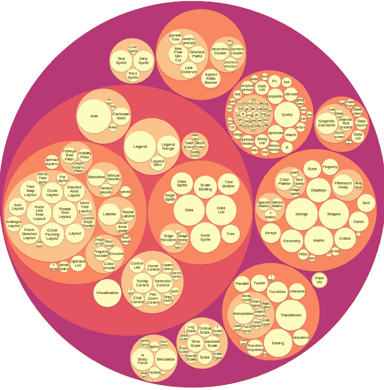
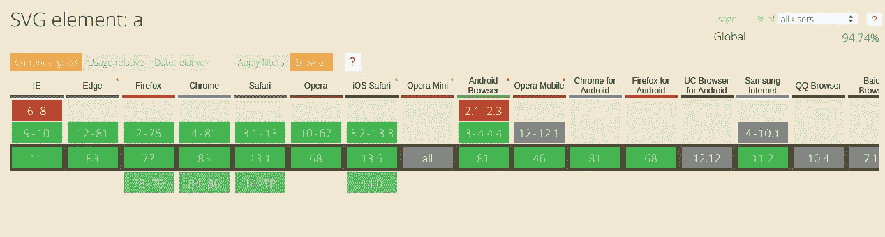

# 关于 D3 你需要知道的一切。射流研究…

> 原文：<https://medium.com/analytics-vidhya/everything-you-need-to-know-about-d3-d62949252b8b?source=collection_archive---------35----------------------->

几个月前，我开始了一个需要数据可视化的项目，我需要确定使用哪个库。有成千上万的 JS 库可供使用。我终于得出了用 D3 的结论。但不是在大量的调查之后。

以下是我学到的东西。

## D3 是什么？JS？

D3.js 被认为是一个数据可视化库，这些类型的库是数据图形化表示的工具。它们使用图表或图形等元素来展示数据之间的关系，并简单地向用户显示重要信息的趋势和模式。

> “D3 将强大的可视化和交互技术与数据驱动的 DOM 操作方法相结合”——D3 . js

这个特定库实现这一点的方式是利用最新的 web 标准，包括 SVG(可缩放矢量图形—以 XML 格式定义基于矢量的图形)、HTML(超文本标记语言)和 Canvas API(这是一种使用 JS 动态绘制图形的方法)。

D3，或 DDD，实际上代表数据驱动文档。

这与现代 JS/TS 框架通过单向或双向绑定将数据绑定到视图的方式非常相似。本质上，这意味着当你在 HTML 中创建一个元素时，你绑定了你想要关联到它的数据，当数据改变时，它所附加的元素会对这些改变作出反应，反之亦然。

## 为什么有这么多支持？

1.  **执照**

它是开源的，如果你想把它作为你产品的一部分来发布，这是很好的选择。如果你不知道一个库是开源的，这意味着这个库可以免费使用，可以被修改和重新发布。

2. **GitHub 项目**

 [## d3/d3

### 用 SVG、Canvas 和 HTML 赋予数据生命。:bar _ chart::chart _ with _ upward _ trend::tada:—D3/D3

github.com](https://github.com/d3/d3) 

在撰写本文时，D3。JS 项目有 92.2K 颗星，而另一个流行的数据可视化库 ChartJS 有 49.3K 颗星。所以它被很多人支持和使用。

自从 10 年前开始以来，它已经发布了几个版本，现在仍在维护，最新的版本是 2020 年 4 月的 v5.16。

目前有 0 个 bug 打开，但他们已经关闭了 299 个。

3.**兼容性**

由于 D3 利用了最新的 web 标准，这意味着跨浏览器兼容性是基于您使用的元素的。例如，如果您使用 SVG 来绘制使用 D3 的数据可视化。JS 只要 SVG 存在，它就会得到支持。

正如你在下面看到的，像 SVG 这样的最新网络标准在大多数浏览器上都得到了支持。

4.**学习**

这可能是我用过的文档最完整的库之一，API 都有很好的解释，每个都有例子。

[https://github.com/d3/d3/blob/master/API.md](https://github.com/d3/d3/blob/master/API.md)

这个库也有 100 个外部教程，有无穷无尽的资源。

[https://github.com/d3/d3/wiki/Tutorials](https://github.com/d3/d3/wiki/Tutorials)

https://bost.ocks.org/mike/

## 你能用它做什么？

很多！

D3 提供的 API 是巨大的。它们使您能够绘制可视化并制作动画，以及计算将数据塑造成不同视图所需的数据结构。我最喜欢的几个包括层次，和弦布局和四叉树。

在这里看一下完整的名单:【https://github.com/d3/d3/blob/master/API.md 

## 你如何使用它？

在我看来，D3 有两副面孔。一方面，您可以利用它的 API 来格式化您的数据，以您喜欢的任何可视化方式来表示，并让您的 JS/TS 框架处理绘图方面。例如，如果你使用 Angular/React/Vue.js，你可以在数据被 D3 处理后绑定到你的 HTML 模板，让 Angular/React/Vue.js 处理动画/样式等。

另一方面，如果你正在使用 Vanilla JS，你可以利用 D3 的动画、缩放、样式和选择 API 来绘制可视化，以及绑定已经被 D3 的 API 操纵的数据。

## 摘要

我在 D3 上读到的最常见的一篇文章说，这是一个势不可挡的库，人们真的很难捡起来。但是现在已经实现了 D3.js，我可以说最难的部分是理解它是如何工作的。然而，一旦你理解了 D3 的两面性，那就简单多了。然后你需要做的就是决定你想用哪种方式来使用 D3，然后飞机从那里出发。