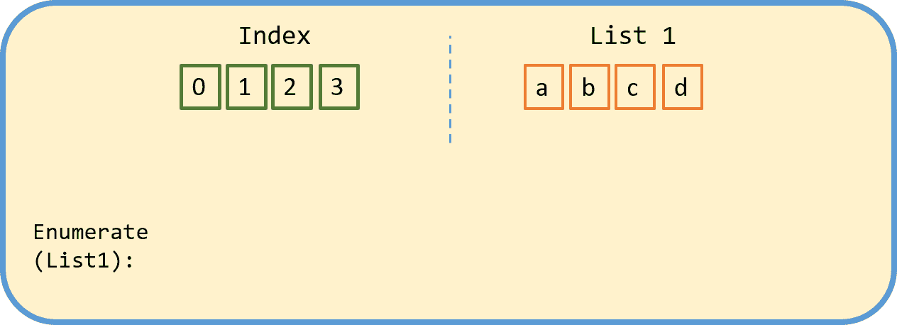

# 关于 enumerate()您需要知道的一切

> 原文：<https://medium.com/analytics-vidhya/everything-you-need-to-know-about-enumerate-a49a7fd0d756?source=collection_archive---------1----------------------->

## 权威指南

## 使用 python 的枚举函数永远改变你的循环方式

第一次接触 python 中的循环通常是从循环一个基本序列开始的。为此，您将学习的函数之一是 range 函数。range 函数返回一系列数字，并使用…