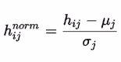
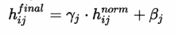

# 正规化:批量正规化和退出

> 原文：<https://medium.com/analytics-vidhya/everything-you-need-to-know-about-regularizer-eb477b0c82ba?source=collection_archive---------5----------------------->

## 批量归一化和丢弃作为正则化器来克服深度学习模型中的过拟合问题。

[来源](https://towardsdatascience.com/why-so-many-data-scientists-are-leaving-their-jobs-a1f0329d7ea4)

您是否遇到过导致过度拟合的大型数据集？

过度拟合的原因之一是网络中的大权重。网络权重较大的网络可能是网络不稳定的标志，在这种情况下，输入的微小变化会导致输出的巨大变化。这个问题的解决方案是更新学习算法，以鼓励网络保持较小的权重。这就是所谓的正规化。

在本文中，我们将发现权重正则化如何帮助更快地训练网络，减少过度拟合，并通过深度学习模型进行更好的预测。

下面提到了用于正则化的一些技术

*   批量标准化
*   脱落层

先说批量归一化，

## 批量标准化

批处理规范化是一种提高人工神经网络的速度、性能和稳定性的技术，也称为批处理规范。想法是以这样的方式标准化每一层的输入，使得它们具有平均激活输出零和单位标准偏差。

**为什么我们要将输入标准化？**

假设我们有 2D 数据，X1 和 X2。X1 特征在 200 到-200 之间具有非常宽的分布，而 X2 特征具有非常窄的分布。左图显示了具有不同范围的数据的方差。右图显示数据位于-2 到 2 之间，并且正态分布，平均值和单位方差为 0。

[来源](https://padhai.onefourthlabs.in/)

本质上，通过归一化来缩放输入使误差表面更接近球形，否则它将是一个非常高曲率的椭圆。有一个高曲率的误差曲面意味着我们采取了许多不一定是最佳方向的步骤。当我们缩放输入时，我们减少曲率，这使得像梯度下降这样忽略曲率的方法工作得更好。当误差表面是圆形或球形时，梯度指向最小值。

[来源](https://www.oreilly.com/library/view/fundamentals-of-deep/9781491925607/ch04.html)

[来源](https://mc.ai/a-way-to-improve-gradient-descent-stochastic-gradient-descent-with-restarts/)

**为什么叫批量归一化？**

在批量标准化中，正如我们对输入进行标准化一样，我们也对所有层的激活进行标准化，因此，在每一层，我们的平均值和单位标准偏差均为 0。

这就是我们如何使所有层的激活正常化。

最终活化层将是，

在参数γ和β与网络的其它参数一起被学习的情况下，它也将对损耗有所贡献，因为 h_final 取决于γ和β，这也将对损耗有所贡献。

现在，如果γ(gamma)变为σ(标准差),β(beta)变为μ(均值),则等式变为:

σ = 1 且μ = 0，那么我们可以说，

因此网络在两个方向上都具有灵活性，

*   如果归一化有助于减少误差损失，则输入为(γ)γ= 1 和(β)β= 0。
*   否则，可学习的参数γ和β将以这样一种方式学习，即总损失将减少。

**批处理规范化作为一个正则化器是如何工作的？**

所以我们计算的是小批量的平均值和标准差，而不是整个数据。因此，在每一层，我们添加噪声，噪声具有非零均值和非单位方差，并且是为每一层随机生成的。然后将它添加到批量归一化层之后，以故意将协变量转换引入激活，它充当正则化子。因此，在信息较少的情况下，网络必须预测正确的标签。也使模型更加健壮。

**合奏法:**

**Ensemble** 学习通过组合几个模型来帮助提高机器学习结果。集成方法是一种元算法，它将几种机器学习技术结合到一个预测模型中，以减少方差(bagging)、偏差(boosting)或改善预测。

**辍学的想法**

用数据上的大参数训练一个深度神经网络可能导致*过拟合*。

*能否在同一数据集上训练多个不同配置的神经网络，并取这些预测的平均值？*

[来源](https://giphy.com/explore/yes-we-can)

但是已知具有不同模型配置的神经网络的集成可以减少过拟合，但是需要训练和维护多个模型的额外计算费用。

所以在图片中出现了*退出层*，

通过在训练期间随机删除节点，可以使用单个模型来模拟具有大量不同的网络架构。这被称为 dropout，它提供了一种计算上非常便宜且有效的正则化方法来减少过拟合并改善泛化误差。

[来源](https://padhai.onefourthlabs.in/)

在训练期间，一定数量的层输出以一定的概率 p 被丢弃。这具有使该层看起来像并且被视为像具有不同数量的节点和与前一层的连通性的层的效果。在中，训练期间对层的每次更新都是用所配置层的不同视图来执行的。

**结论**

1.  批量归一化将从分散到异常值的梯度正则化，并在小批量的范围内向共同目标流动(通过归一化它们)。导致学习过程的加速。
2.  辍学是神经网络中的一种正则化方法，有助于减少神经元之间的相互依赖学习。

> 引用说明:本文的内容和结构基于四分之一实验室 PadhAI 的深度学习讲座。

如果你有任何反馈让我改进，或者如果你想分享任何想法或经验，请随意评论。

你想要更多吗？在 [LinkedIn](https://www.linkedin.com/in/aditi-kothiya/) 和 [GitHub](https://github.com/Aditi81) 上关注我。