# 关于 Scikit-Learn 的最新更新(Python 实现)您需要知道的一切

> 原文：<https://medium.com/analytics-vidhya/everything-you-need-to-know-about-scikit-learns-latest-update-with-python-implementation-b8ef38f03c98?source=collection_archive---------20----------------------->

# 介绍

Scikit-learn 是一个 Python 库，当我们[构建机器学习模型](https://courses.analyticsvidhya.com/courses/applied-machine-learning-beginner-to-professional?utm_source=blog&utm_medium=everything-you-should-know-scikit-learn)时，我们都不可避免地会求助于它。我已经用这个奇妙的库建立了无数的模型，我相信你们也一定有过。

毫无疑问——scikit-learn 提供了具有易读语法的便捷工具。在众多流行的 Python 库当中，scikit-learn 与 Pandas 和 NumPy 并列第一。这三个 Python 库为机器学习管道的各个步骤提供了完整的解决方案。


我喜欢 scikit-learn 提供的干净、统一的代码和函数。一旦我们掌握了一种技术，使用其他技术就变得非常容易。优秀的文档是锦上添花，因为它使许多初学者能够在构建机器学习模型方面自给自足。

scikit-learn 背后的开发人员推出了一个新版本(v0.22)，其中包含一些重大更新。我将在本文中为您解开这些特性，并通过 Python 代码展示其中的内容。

*注:想从头开始学习 Python 吗？* [*这个免费课程*](https://courses.analyticsvidhya.com/courses/introduction-to-data-science?utm_source=blog&utm_medium=everything-you-should-know-scikit-learn) *就是完美的起点！*

# 目录

1.  了解 sci kit-了解
2.  Scikit-Learn 简史
3.  sci kit-了解 v0.22 更新(使用 Python 实现)

3.1-堆积分类器和回归器

3.2 —基于排列的特征重要性

3.3 —对 ROC-AUC 的多类支持

3.4 —基于 kNN 的插补

3.5 —树木修剪

# 了解 sci kit-了解

这个库是建立在 SciPy(科学 Python)库的基础上的，在使用 scikit-learn 之前需要安装这个库。它在一个许可的简化 BSD 许可下被许可，并在许多 Linux 发行版下被分发，鼓励学术和商业使用。

总的来说，scikit-learn 在幕后使用以下库:

*   **NumPy** : n 维数组封装
*   科学计算库
*   **Matplotlib** :绘图库
*   **iPython** :交互式 Python(用于 Jupyter 笔记本支持)
*   符号数学
*   熊猫:数据结构、分析和操作

最近，scikit-learn 将其功能和软件包重组为六个主要模块:

1.  **分类:**识别物体属于哪一类
2.  **回归:**预测与对象相关联的连续值属性
3.  **聚类:**用于对未标记的数据进行分组
4.  **降维:**减少要考虑的随机变量的数量
5.  **模型选择:**比较、验证和选择参数和模型
6.  **预处理:**特征提取和归一化

scikit-learn 提供了执行所有步骤的功能，从预处理、模型构建、选择正确的模型、超参数调整到解释机器学习模型的框架。

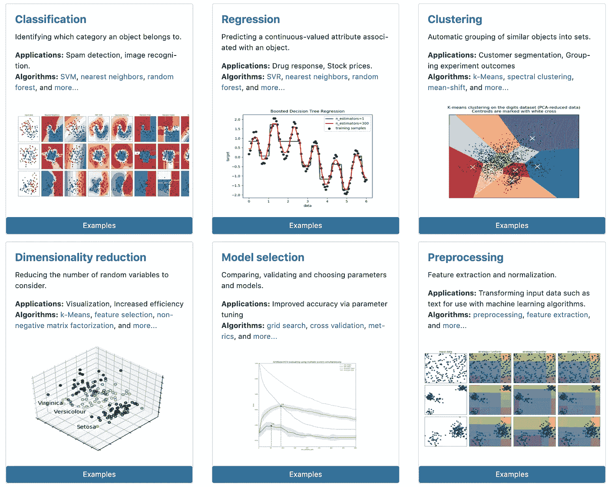

*Scikit-learn 模块(来源:Scikit-learn 主页)*

# scikit-learn 简史

Scikit-learn 自 2007 年以 sci kit . learn 的名字成立以来已经走过了漫长的道路。这里有一个很酷的琐事要告诉你——sci kit-learn 是由 David Cournapeau 发起的谷歌代码之夏项目！

这是由法国计算机科学和自动化研究所的 Fabian Pedregosa、Gael Varoquaux、Alexandre Gramfort 和 Vincent Michel 接手并重写的，其首次公开发布发生在 2010 年。

从那时起，它添加了许多功能，并经受住了时间的考验，成为跨语言和框架的最受欢迎的开源机器学习库。下面的信息图由我们的团队制作，展示了所有 scikit-learn 功能及其版本号的简要时间表:

上面的信息图显示了从 2010 年到 2019 年作为实现 ML 算法的公共库成立以来的特性发布

如今，Scikit-learn 正在被全球各地的组织使用，包括 Spotify、JP 摩根、Booking.com、Evernote 等。你可以在这里找到[完整的列表和评价](https://scikit-learn.org/stable/testimonials/testimonials.html)我相信这只是这个库受欢迎程度的冰山一角，因为将会有许多大大小小的公司在原型模型的某个阶段使用 scikit-learn。

scikit-learn 的最新版本是 v0.22，目前有 20 多个活跃的贡献者。v0.22 向其武库中添加了一些优秀的特性，为一些主要的现有痛点提供了解决方案，以及一些在其他库中可用但经常导致包冲突的新特性。

我们将在这里详细介绍它们，并深入探讨如何用 Python 实现它们。

# sci kit-了解 v0.22 更新

除了错误修复和性能改进，这里还有一些包含在 scikit-learn 最新版本中的新特性。

## 1.堆叠分类器和回归器

堆叠是更高级的集成技术之一，由机器学习竞赛获胜者在 [DataHack](http://datahack.analyticsvidhya.com/?utm_source=blog&utm_medium=everything-you-should-know-scikit-learn) & Kaggle 上流行。我们先试着简单了解一下它的工作原理。

> *堆叠是一种集成学习技术，它使用来自多个模型(例如，决策树、KNN 或 SVM)的预测来构建新模型。*

该模型用于对测试集进行预测。下面是我从这篇关于集合学习的[优秀文章](https://www.analyticsvidhya.com/blog/2018/06/comprehensive-guide-for-ensemble-models/?utm_source=blog&utm_medium=everything-you-should-know-scikit-learn)中摘录的一个简单堆叠集合的分步解释:

1-列车组分为 10 个部分:

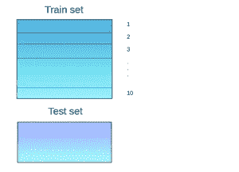

2-基础模型(假设决策树)适用于 9 个部分，并对第 10 个部分进行预测。对列车组的每个部分都这样做:

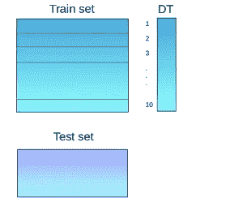

3-基础模型(在这种情况下，决策树)随后适用于整个训练数据集

4-使用此模型，对测试集进行预测:

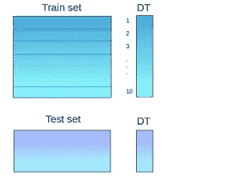

5-对另一个基本模型(比如 KNN)重复步骤 2 到 4，得到训练集和测试集的另一组预测:

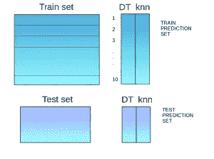

6-来自训练集的预测用作构建新模型的特征:

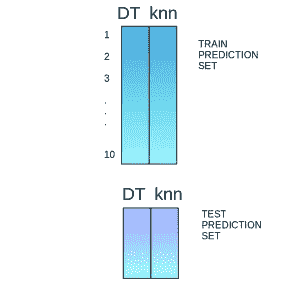

7-此模型用于对测试预测集进行最终预测

*mlxtend* 库提供了一个 API 来实现 Python 中的堆栈。现在，sklearn 可以用它熟悉的 API 做同样的事情，这非常直观，你将在下面的演示中看到。根据您的用例，您可以导入*stacking regressor*&*stacking classifier*:

## 2.基于排列的特征重要性

> *顾名思义，这项技术通过*置换*每个*特性*并捕捉性能下降，提供了一种为每个特性分配*重要性*的方法。*

但是这里的置换是什么意思呢？让我们用一个例子来理解这一点。

假设我们试图预测房价，并且只有两个功能可以使用:

*   LotArea —(房屋的平方英尺面积)
*   YrSold(出售年份)

测试数据只有 10 行，如下所示:

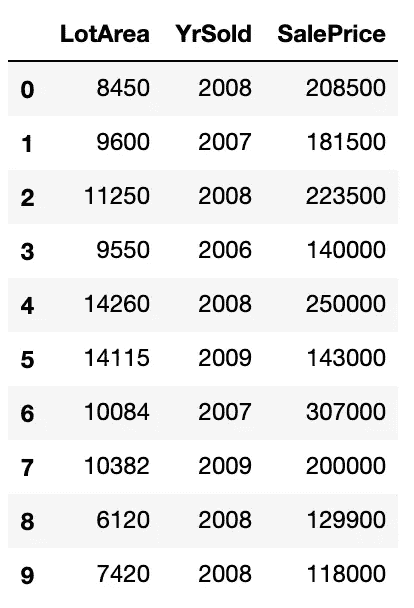

接下来，我们拟合一个简单的决策树模型，得到 R 平方值为 0.78。我们选择一个特性，比如说 LotArea，然后调整它，保持所有其他列不变:

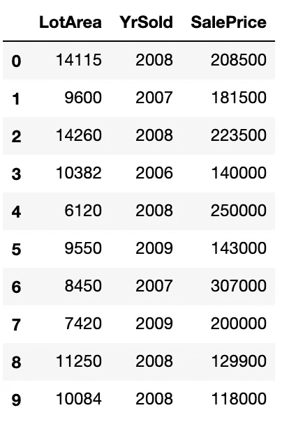

接下来，我们再次计算 R 平方，结果是 0.74。我们取两者之差或比值(0.78/0.74 或 0.78–0.74)，重复上述步骤，取平均值来表示 LotArea 特性的重要性。

我们可以对所有其他特性执行类似的步骤，以获得每个特性的相对重要性。由于我们在这里使用测试集来评估重要性值，因此只有有助于模型更好地进行概化的要素才会表现得更好。

早先，我们不得不从头开始实现它，或者导入 ELI5 之类的包。现在， **Sklearn 有一个内置的工具来处理基于排列的特征重要性**。让我们深入代码，看看如何将它可视化:

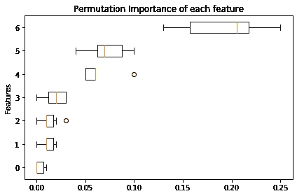

正如你在上面的方框图中所看到的，有 3 个特性比其他 4 个相对更重要。您可以在任何模型上尝试这种方法，这使得它成为一种模型不可知的可解释性技术。你可以在这里阅读更多关于这个机器学习可解释性概念[。](https://www.analyticsvidhya.com/blog/2019/08/decoding-black-box-step-by-step-guide-interpretable-machine-learning-models-python/?utm_source=blog&utm_medium=everything-you-should-know-scikit-learn)

## 3 —对 ROC-AUC 的多类支持

二元分类的 ROC-AUC 分数非常有用，尤其是在涉及到[不平衡数据集](https://www.analyticsvidhya.com/blog/2017/03/imbalanced-classification-problem/?utm_source=blog&utm_medium=everything-you-should-know-scikit-learn)时。然而，到目前为止还没有对多类分类的支持，我们必须手动编码来做到这一点。为了使用 ROC-AUC 分数进行多类/多标签分类，我们需要首先对目标进行二值化。

目前，sklearn 支持两种策略来实现这一目标:

*   一对一:计算每对类别的成对 ROC AUC 分数的平均值(average='macro') 
*   一个与其余:计算每个类别相对于所有其他类别的 ROC AUC 得分的平均值(average='weighted') 

```
from sklearn.datasets import load_iris from sklearn.ensemble import RandomForestClassifier from sklearn.metrics import roc_auc_score X, y = load_iris(return_X_y=True) rf = RandomForestClassifier(random_state=44, max_depth=2) rf.fit(X,y) print(roc_auc_score(y, rf.predict_proba(X), multi_class='ovo'))
```

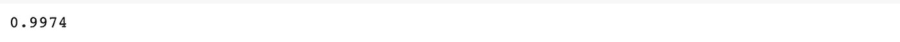

此外，还有一个新的绘图 API，可以非常容易地绘制和比较不同机器学习模型的 ROC-AUC 曲线。让我们来看一个快速演示:

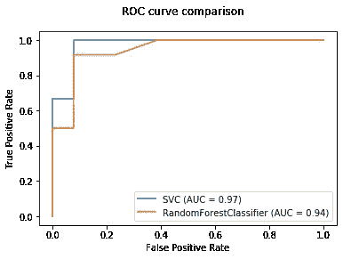

上图中，我们对比了两种不同的机器学习模型，分别是支持向量分类器&随机森林。同样，您可以绘制更多模型的 AUC-ROC 曲线，并比较它们的性能。

## 4-基于 kNN 的插补

在基于 kNN 的插补方法中，使用与缺失值的属性最相似的给定数量的属性来插补属性的缺失值。**对缺失值使用 kNN 背后的假设是，基于其他变量，一个点的值可以由与其最接近的点的值来近似。**

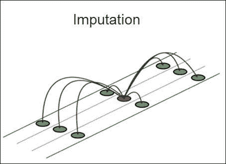

使用距离函数来确定两个属性的相似性。以下是使用 kNN 的一些优点:

*   k-最近邻可以预测定性和定量属性
*   不需要为具有缺失数据的每个属性创建预测模型
*   考虑数据的相关结构

Scikit-learn 支持使用欧几里德距离方法的基于 kNN 的插补。让我们来看一个快速演示:

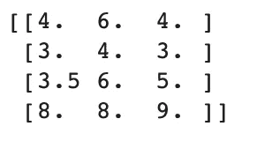

你可以在这里全面了解 kNN 的工作细节[。](https://www.analyticsvidhya.com/blog/2018/03/introduction-k-neighbours-algorithm-clustering/?utm_source=blog&utm_medium=everything-you-should-know-scikit-learn)

## 5 —树木修剪

基本上，修剪是一种我们用来减少[决策树](https://www.analyticsvidhya.com/blog/2016/04/complete-tutorial-tree-based-modeling-scratch-in-python/?utm_source=blog&utm_medium=everything-you-should-know-scikit-learn)大小的技术，从而避免[过度拟合](https://www.analyticsvidhya.com/blog/2020/02/underfitting-overfitting-best-fitting-machine-learning/?utm_source=blog&utm_medium=everything-you-should-know-scikit-learn)。这也扩展到其他基于树的算法，如[随机森林](https://www.analyticsvidhya.com/blog/2018/12/building-a-random-forest-from-scratch-understanding-real-world-data-products-ml-for-programmers-part-3/?utm_source=blog&utm_medium=everything-you-should-know-scikit-learn)和[梯度提升](https://www.analyticsvidhya.com/blog/2015/09/complete-guide-boosting-methods/?utm_source=blog&utm_medium=everything-you-should-know-scikit-learn)。这些基于树的方法提供了参数，如`min_samples_leaf`和，以防止树过度拟合。

修剪为控制树的大小提供了另一种选择。 [XGBoost & LightGBM](https://www.analyticsvidhya.com/blog/2017/06/which-algorithm-takes-the-crown-light-gbm-vs-xgboost/?utm_source=blog&utm_medium=everything-you-should-know-scikit-learn) 将修剪集成到了他们的实现中。然而，Scikit-learn 中早就应该有一个手动修剪树的特性了(R 已经提供了一个类似的工具作为 *rpart* 包的一部分)。

在其最新版本中，Scikit-learn 提供了这种修剪功能，使得一旦树被构建，在大多数基于树的估计器中控制过度拟合成为可能。关于如何和为什么修剪的细节，你可以阅读 Sunil 的这篇优秀的关于基于树的方法的教程。现在让我们来看一个快速演示:

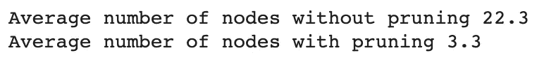

# 结束注释

scikit-learn 包是构建机器学习模型的终极工具库。这是第一个专注于机器学习的图书馆，所有新人都依赖它来指导他们完成最初的学习过程。即使作为一个老手，我也经常发现自己用它来快速测试我脑海中的一个假设或解决方案。

正如我们刚刚看到的，最新版本肯定有一些重大升级。使用我在本文中提供的基础进行探索和试验绝对是值得的。

你试过最新的版本了吗？请在下面的评论区与社区分享您的想法。

你也可以在分析 Vidhya 的 Android 应用上阅读这篇文章

*原载于 2020 年 2 月 10 日*[*【https://www.analyticsvidhya.com】*](https://www.analyticsvidhya.com/blog/2020/02/everything-you-should-know-scikit-learn/)*。*