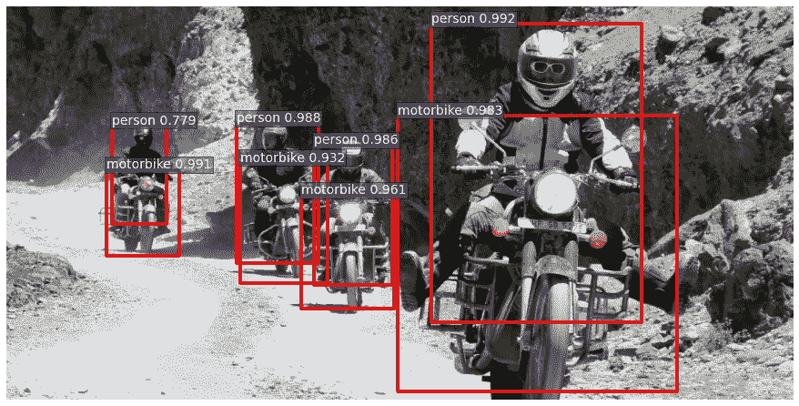
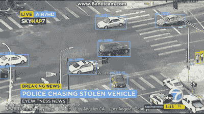
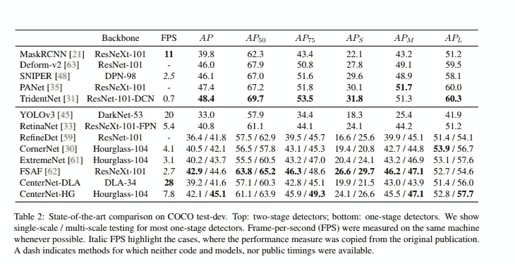
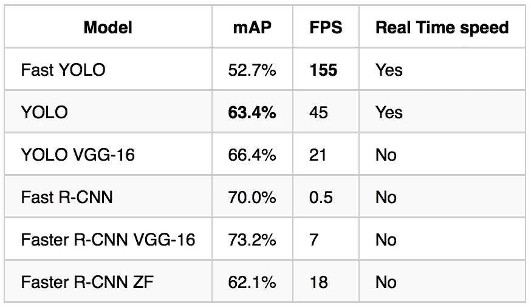
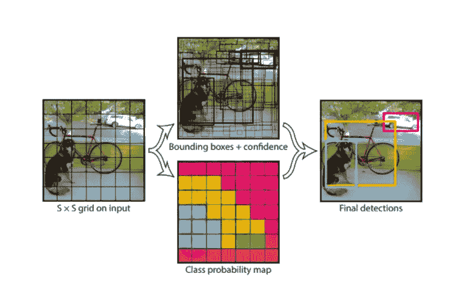
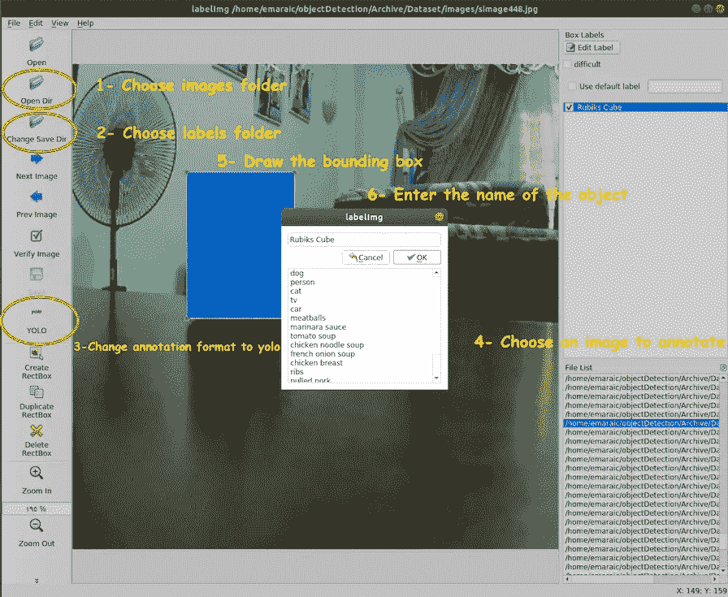
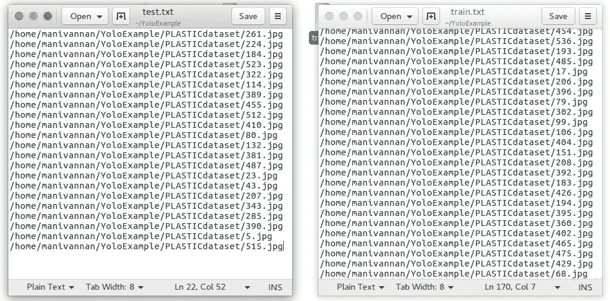

# 使用 YOLOv3 训练自定义对象检测器模型所需的一切

> 原文：<https://medium.com/analytics-vidhya/everything-you-need-to-know-to-train-your-custom-object-detector-model-using-yolov3-1bf0640b0905?source=collection_archive---------0----------------------->

在这篇博客中，我们将学习如何使用 [Darknet](https://pjreddie.com/darknet/) 框架在自定义数据集上训练 [YOLOv3](https://pjreddie.com/darknet/yolo/) 。之后，这将有足够的关于物体检测的知识，你可以根据你的需要和游戏来调整它。



我们将使用下面的方法从 A 到 Z。(为了更好地理解，请确保您遵循了每一步。)

> **什么是物体探测？**
> 
> **可用的物体检测算法**
> 
> **为什么是 YoloV3？**
> 
> **图像标注**
> 
> **安装**
> 
> **最后，训练模型。**

**什么是目标检测，为什么它会受到如此多的关注？**

对象检测是一种计算机视觉技术，用于定位图像或视频中的对象实例。对象检测算法通常利用机器学习和深度学习来产生有意义的结果。当人类观看图像或视频时，我们可以在瞬间识别并定位感兴趣的对象。物体检测的目标是使用计算机复制这种智能。

用例层出不穷，无论是**追踪物体**、**视频监控**、**行人检测**、**异常检测**、**人数统计**、**自动驾驶汽车**还是**人脸检测**，不胜枚举。



**物体检测算法:**

这些是工业中用于对象检测的一些常见模型架构。

*   **更快的 R-CNN**
*   **YOLO(你只看一次)**
*   **SSD(单发多盒防守器)**

还有更多像 R-CNN，Fast R-CNN，Mask R-CNN(是的他们是不同的)。我们必须根据我们的需求来决定使用哪一种，每一种都有其优缺点。



我不会在这里深入讨论每一个具体的算法，如果你想知道更多，请在评论区告诉我。但是对于你的基本理解，请看下图。



YOLO——你只看一次



YOLO 是如何运作的？我们把一幅图像分割成一个 SxS 网格，在每个网格中我们有 m 个边界框。对于每个边界框，网络输出该边界框的类概率和偏移值。具有高于阈值的分类概率的边界框被选择并用于定位图像内的对象。

所有其他对象检测算法都使用区域来定位图像中的对象。网络不会看到完整的图像。取而代之的是图像中包含物体的概率较高的部分。**或【只看一次】是一种与 [**基于区域的算法**](http://ai.stanford.edu/~tianshig/papers/nips09-sceneObject.pdf) 有很大不同的物体检测算法。在 YOLO，单个卷积网络预测边界框和这些框的类别概率。**

****如果你想深入 Yolo，看看各层是如何工作的，可以参考这份官方的** [**研究论文**](https://pjreddie.com/media/files/papers/YOLOv3.pdf) **。****

# **YOLO 的优势和劣势**

*   **YOLO 比其他物体检测算法快几个数量级(每秒 45 帧)。**
*   **YOLO 算法的局限性在于它会与图像中的小对象进行斗争，例如，它可能很难检测到一群鸟。这是由于算法的空间限制。**

****数据收集和标注****

**现在我们已经有了关于对象检测和 Yolo 的基本信息，让我们进入最繁琐的任务，即**获取用于训练和测试的数据。**如果你不想弄乱数据处理部分你可以使用来自 [**这里的**](https://github.com/tahaemara/yolo-custom-object-detector/tree/master/python/Dataset) **的魔方图片和标签。****

**如果你想在你自己的数据集上训练模型，你可以从 [Kaggle](https://www.kaggle.com/datasets) 获取图像和标签。对于 Yolo 中的培训，注释需要在。txt 格式。如果您有 XML 格式的注释，您可以将它们更改为 Yolo。txt 格式使用这个 [**脚本**](https://github.com/mukundsharma1995/yolov3-object-detection/blob/master/xml_to_txt.py) 虽然不完美但是解决了目的。只要换 19 号线和 26 号线，你就可以走了。**

**如果这个脚本不起作用，你可以试试我在其他 [**博客**](https://github.com/ManivannanMurugavel/YOLO-Annotation-Tool/blob/master/convert.py) **上找到的脚本。****

**Yolo 的注释文件类似于:**

> **0 0.332853 0.575862 0.210375 0.489655**

**注释过程为每个图像生成一个文本文件，其中包含每个对象的对象类别号和坐标，每个对象的每一行都是这种格式“(对象 id)(x-中心)(y-中心)(宽度)(高度)”。坐标值(x、y、宽度和高度)相对于图像的宽度和高度。**

**如果你从谷歌或任何其他来源下载图像，你需要一个工具来注释图像， [**LabelImg**](https://github.com/tzutalin/labelImg) 工具将解决这个问题，因为它安装起来既快又容易。**

## **使用 LabelImg 注释图像的步骤:**

1.  **创建一个包含图像的文件夹，并将其命名为“图像”。**
2.  **为注释文件创建一个文件夹，并将其命名为“标签”。**文件夹“图像”和“标签”必须在同一目录下。****
3.  **打开标签应用程序。**
4.  **点击“打开目录”,然后选择图像文件夹。**
5.  **点击“更改保存目录”并选择标签文件夹。**
6.  **在工具栏"保存"按钮的正下方，单击" PascalVOC "按钮切换到 YOLO 格式。**
7.  **你会发现所有的图像都列在文件列表面板中。**
8.  **单击您想要注释的图像。**
9.  **单击键盘上的字母“W ”,在所需的图像对象上绘制矩形，在弹出的窗口中键入对象的名称。**
10.  **单击“CTRL+S”将注释保存到标签文件夹。**
11.  **重复步骤 8 到 10，直到完成对所有图像的注释。**

****

# **安装暗网**

**Darknet 是一个开源的神经网络框架，支持 CPU 和 GPU 计算。**

**安装暗网:**

```
git clone https://github.com/pjreddie/darknet
cd darknet
```

**如果你有一个专门的 GPU 机器用于训练，那么这是很好的，如果你像我一样，你可以使用 AWS 来完成这个，我使用了一个 spot 实例(p2.xlarge)。如果您在 AWS 上设置 GPU spot 实例时需要任何帮助，请告诉我，我将单独发表一篇文章。**我假设你们已经知道如何设置 GPU 机器。****

```
vim Makefile
```

**(如果您正在使用 GPU，请将 GPU 从 0 更改为 1，如果您已经安装了 OPENCV，请将 OpenCV 设置为“1”，否则不需要)**

**保存 Makefile 并运行根目录中的命令来启动构建过程。**

```
make
```

**通过运行以下命令，您可以检查所有内容是否编译正确**

```
./darknet
```

**您应该会看到类似这样的内容:**

```
usage: ./darknet <function>
```

**您也可以参考 [Yolo-Darknet](https://pjreddie.com/darknet/yolo/) 进行安装，并下载 cfg 和预训练重量。**

****培训过程开始前****

**在收集和注释数据集之后，我们在同一个目录中有两个文件夹:文件夹“ **images** ”和文件夹“ **labels** ”。**

**复制图像和标签文件夹中的所有内容，并将它们放在一个文件夹中。最后，**将文件夹保存在暗网根目录**下。**

**现在，我们需要通过提供两个文本文件将数据集分为训练集和测试集，一个包含训练集( **train.txt** )和测试集( **test.txt** )的图像路径**

**这可以通过使用[脚本](https://github.com/mukundsharma1995/yolov3-object-detection/blob/master/split_train_test.py)来完成，在这一步之后，你将让 **train.txt** 和 **test.txt** 在暗网根目录下复制它们。**

**train.txt 和 test.txt 将类似于:**

****

****准备 YoloV3 配置文件****

**YOLO 需要某些特定的文件来知道如何训练和训练什么。**

**我们需要修改 YOLOv3 tiny 模型( [yolov3-tiny.cfg](https://github.com/pjreddie/darknet/blob/master/cfg/yolov3-tiny.cfg) )来训练我们的定制检测器。这一修改包括:**

1.  **取消对第 5、6 和 7 行的注释，并将训练批次更改为 64，子部分更改为 2。**
2.  **在每个 yolo 输出“[yolo]”之前更改卷积层“[卷积]”的过滤器数量，使得过滤器数量= # anchors x(5+# of classes)= 3 *(5+1)= 18。数字 5 是参数 center_x、center_y、宽度、高度和对象分数的计数。因此，将第 127 行和第 171 行改为“filters=18”。**
3.  **对于每个 yolo 层[yolo],将类的数量改为 1，如第 135 行和第 177 行所示。**

**还需要创建两个文件" **objects.names** "，其名称暗示它包含类的名称，以及文件" **training.data** "，它包含训练所需的参数。**

*   ***cfg/obj.data***

```
classes= 1
train  = ./darknet/train.txt  
valid  = ./darknet/test.txt  
names = ./darknet/cfg/objects.names  
backup = ./darknet/backup/
```

```
Rubiks Cube   #name you used while annotation
```

**确保将这三个文件保存在这个位置:**。/darknet/cfg/****

## **下载预训练卷积权重**

**为了训练 YOLOv3，我们使用在 Imagenet 上预先训练的卷积权重。我们使用来自[暗网 53](https://pjreddie.com/darknet/imagenet/#darknet53) 模型的权重。你可以在这里下载卷积层的权重[(76mb)](https://pjreddie.com/media/files/darknet53.conv.74)并把它放在暗网的主目录中。**

****开始训练****

**有趣的部分到了！在你的终端中输入下面的命令，观察你的 GPU 做它最擅长的事情**

```
./darknet detector train cfg/obj.data cfg/yolov3-tiny.cfg darknet53.conv.74
```

## **笔记**

1.  **权重将每 100 次迭代保存在备份文件夹中，直到 900 次，然后每 10000 次。**
2.  **一旦平均损失小于 0.06，或者一旦 avg 值不再增加，就杀死训练过程。**

```
Region 23 Avg IOU: 0.880141, Class: 0.999959, Obj: 0.999842, No Obj: 0.000690, .5R: 1.000000, .75R: 1.000000,  count: 1498591: 0.033501, **0.063296 avg**, 0.000010 rate, 0.004106 seconds, 498591 images
Loaded: 0.003061 seconds
```

# **结果**

**我们现在应该有*。对备份目录中代表我们的训练模型的*文件进行加权。让我们在一些图像上使用它，看看它能多好地检测它被训练的对象。**

```
./darknet detector test cfg/obj.data cfg/yolov3-tiny.cfg backup/yolov3-tiny_900.weights *data/rubicks*.jpg
```

**您可以选择一些有趣的图像来展示您的检测设置的性能。没有在训练中使用的图像，我们在这里没有作弊。**

**如果结果不符合你的预期，是时候让你知道如何学习了。**

**如果你想改变重量保存的速度，你可以在 cfg 文件中使用“步骤”。**

****如果你需要一个可以在网络摄像头上作为实时检测器的脚本，你可以试试这个** [**脚本**](https://github.com/mukundsharma1995/yolov3-object-detection/blob/master/video.py) **，你只需要提供 yolov3.weights，yolov3-tiny.cfg 和 objects.names 作为参数。****

****注意**:这是针对单个物体检测。请使用此[链接](/@manivannan_data/how-to-train-multiple-objects-in-yolov2-using-your-own-dataset-2b4fee898f17)进行多对象训练。谢谢，祝您愉快。**

****详细了解可以参考的有用博客:****

**[在 YoloV2 中训练自定义对象检测](/@manivannan_data/how-to-train-yolov2-to-detect-custom-objects-9010df784f36)**

**[Yolo、YoloV2、YoloV3 有何不同？](/@jonathan_hui/real-time-object-detection-with-yolo-yolov2-28b1b93e2088)**

**[魔方博客参考这个](http://emaraic.com/blog/yolov3-custom-object-detector)**

**[物体检测算法详解](/@fractaldle/brief-overview-on-object-detection-algorithms-ec516929be93)**