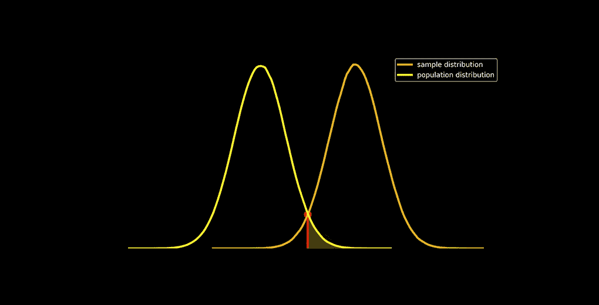

# 对于数据科学，您应该从头开始了解 p 值的所有内容

> 原文：<https://medium.com/analytics-vidhya/everything-you-should-know-about-p-value-from-scratch-for-data-science-f3c0bfa3c4cc?source=collection_archive---------0----------------------->

# 概观

*   什么是 p 值？在数据科学中用在什么地方？又该如何计算呢？
*   在这篇关于从零开始学习 p 值的文章中，我们回答了所有这些问题以及更多问题
*   本文从统计学和数据科学的角度来看 p 值。