# 卡格勒的演变:2019 年 ML & DS 调查

> 原文：<https://medium.com/analytics-vidhya/evolution-of-a-kaggler-2019-ml-ds-survey-1903610ab67a?source=collection_archive---------18----------------------->

在过去的 3 年里，Kaggle 发起了一项调查，以了解数据科学和机器学习的现状。我今年对数据的处理方式是看看这个行业在过去几年里发生了怎样的变化，并了解我们的发展方向！

**注意:**有些问题不是每年都问的，有些问题在不同年份有不同的分类，所以不是每个问题都进行了分析，有些问题只展示了 2018 年和 2019 年之间的变化。

**方法:**并不是每个回答者都会被问到每个问题，每年回答者的数量都不一样，所以我能做的最好的分析方法就是按照用户的百分比来分解回答。

# 我们是谁

## 年龄

54%的受访者年龄在 30 岁以下。有趣的是注意到年龄组的相对一致性，尽管在进入 Kaggle 竞争之前似乎有更多经验丰富的退伍军人，比去年增加了 6%。

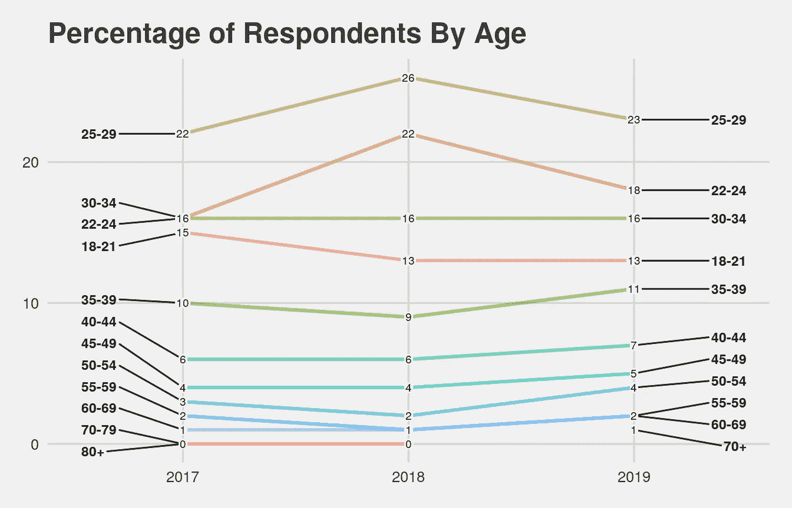

## 性别

在过去的三年里，性别细分基本保持不变。女性受访者的比例仍然低于我的期望，如果我们看看担任技术职务的女性人数 ，这个比例就更低了 [**。**](https://www.dataquest.io/blog/women-data-science-gender-gap/)

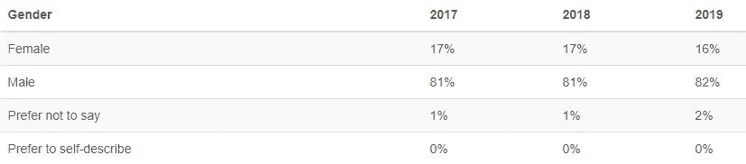

## 国家

美国(16%)和印度(24%)占受访者的大多数。与去年相比，美国受访者的比例下降了 4%，印度上升了 6%。考虑到 [**分析目前仅占印度 IT 部门全部工作岗位的 20%多一点**](https://analyticsindiamag.com/analytics-data-science-industry-in-india-study-2019-by-aim-praxis-business-school/) ，印度处于领先地位就不足为奇了。

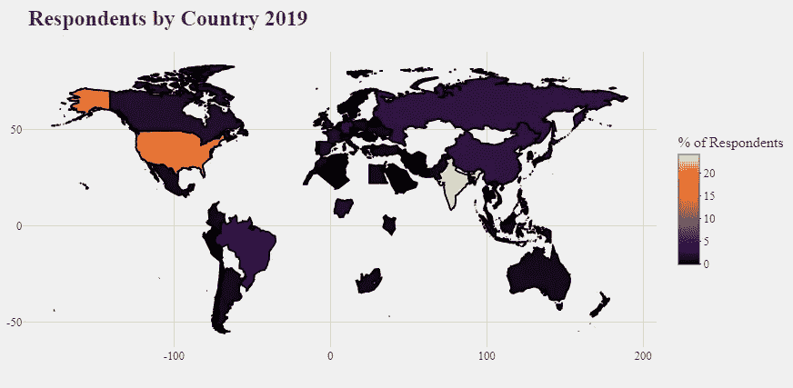

## 教育

绝大多数被调查者正在接受/已经完成中学后教育。考虑到 50%以上的被调查者年龄在 30 岁以下，他们所达到的教育水平令人印象深刻！

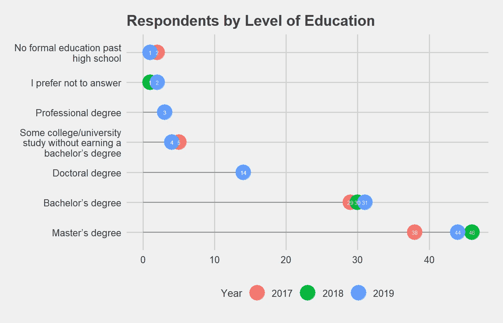

## 编码经验

我们看到，从 2017 年到 2018 年，拥有不到一年编码经验的受访者人数大幅增加。有趣的是，超过一半的受访者对编码相当陌生。这可能是因为科技行业以外的工作对编码技能的需求增加，正如这里的**所报道的那样，或许受访者所属的各种职位头衔也进一步支持了这一点。**

**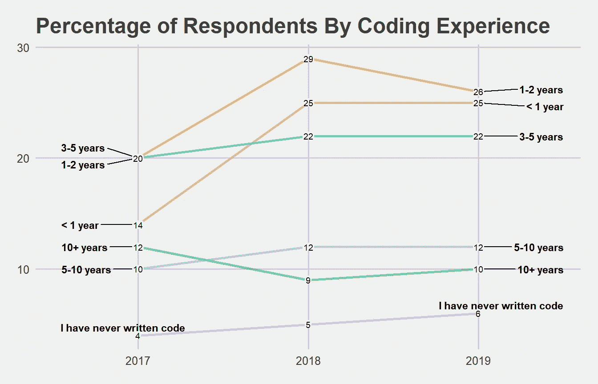******

# **我们如何工作**

## **职称**

**毫不奇怪，2019 年 42%的受访者要么是学生，要么是数据科学家。排在第三位的软件开发人员/工程师角色值得关注，因为这些角色通常必须与数据科学家合作，以启动和运行 ML 服务和产品。**

**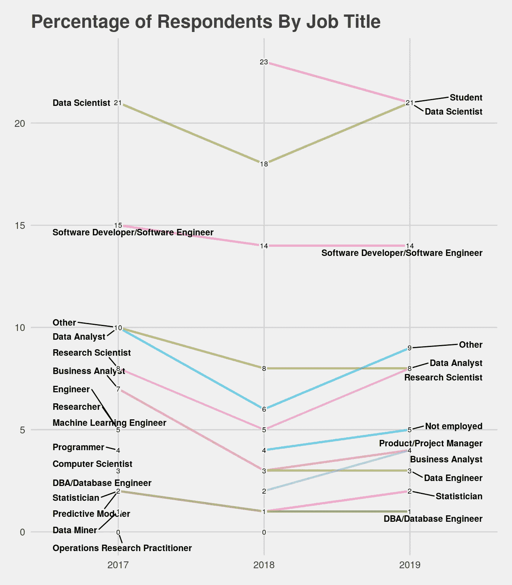**

## **使用 ML**

**2019 年，公司已建立良好的 ML 方法的受访者增加了 6%，最近开始使用 ML 方法的受访者增加了 3%。看看什么行业最欢迎 ML，ML 正在解决什么问题，这将是一件有趣的事情！也许下一个问题能给我们一点线索！ [**这里有一些今天如何使用 ML/DS 的用例**](https://www.marktechpost.com/2018/07/14/5-incredible-ways-that-machine-learning-is-being-used-today/) 。**

**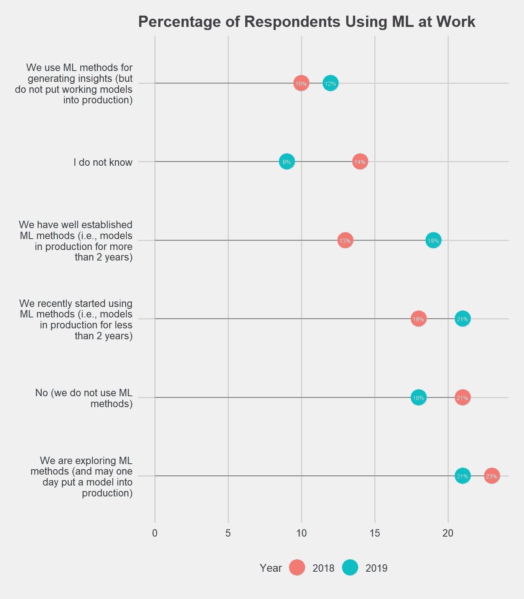**

## **活动**

**绝大多数受访者都在分析数据以影响决策，这并不奇怪。值得注意的是，36%的受访者承担了构建/运行 ML 服务的任务，比去年增加了 12%，在构建原型以探索应用 ML 的新途径的受访者中也看到了类似的增长。似乎许多受访者在工作中戴着一顶以上的帽子，并且必须有相当多的工具包，我们将进一步探讨这一点。**

**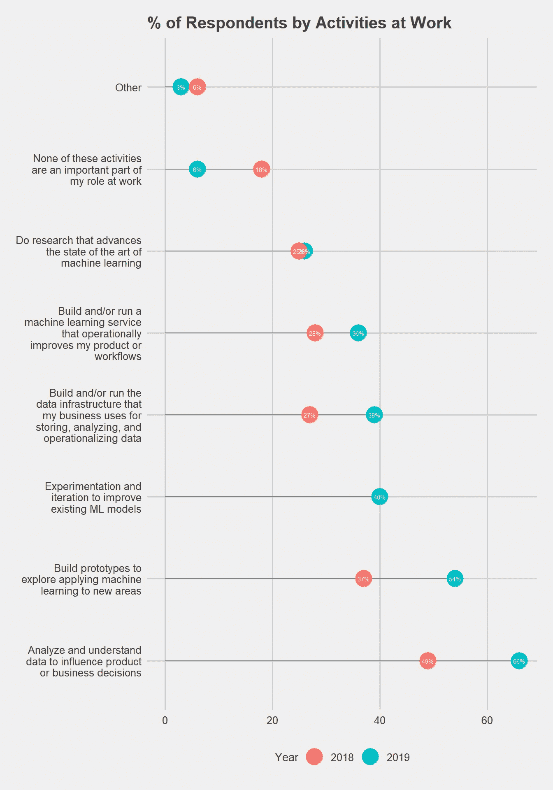**

## **编程语言**

**考虑到 Kaggle 上可用的语言，前三种编程语言已经领先一段时间了！随着对 [**实时数据分析**](/@Intersog/how-c-is-used-in-big-data-development-d7a03b02ab20) 需求的增加，C/C++似乎将在未来几年争夺第三的位置。**

**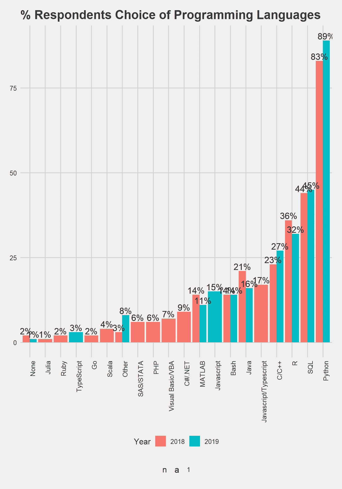******

# **我们如何学习**

## **最喜欢的媒体来源**

**当被问及受访者通过哪些来源来获取数据科学主题的最新信息时，Kaggle 的受访者比例大幅上升。YouTube 今年的人气也出现了爆炸式增长，增长了 29%。**

**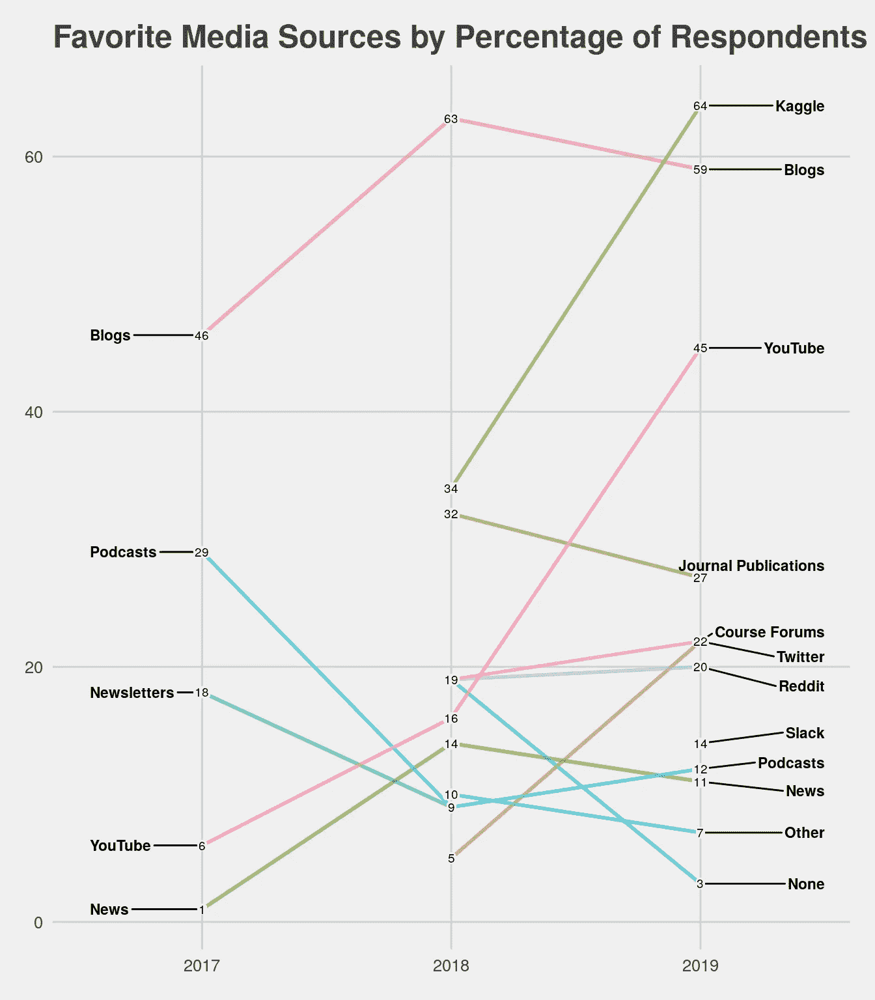**

## **学习平台**

**Coursera 无疑是用户的首选程序。我很惊讶地看到 Udemy 高达 29%，但有如此多的课程以浓缩的方式迎合学习特定的东西(最终没有测试)，也许这就是受访者转向提高技能的地方。这对 DataCamp 也有意义。**

**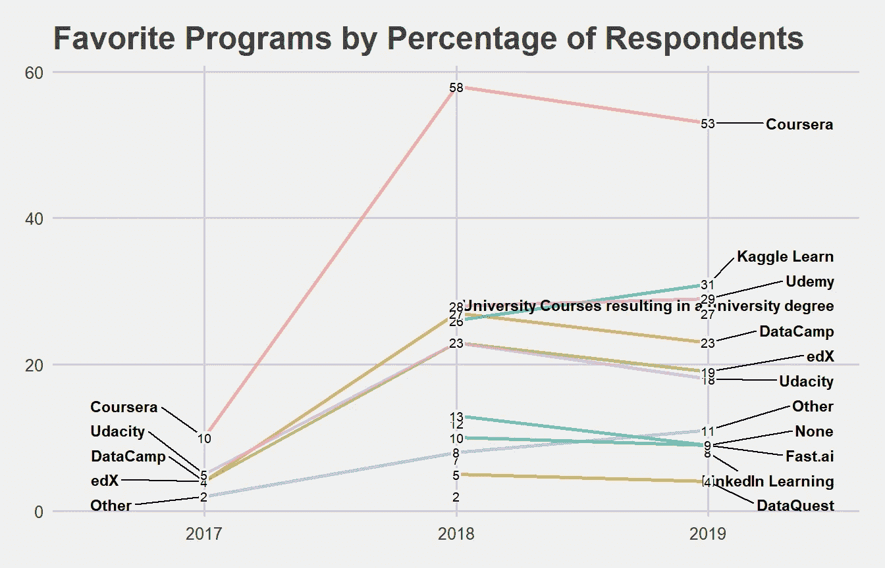**

## **为 ML/DS 学习的第一语言**

**SQL 和 Python 继续攀升。在我们注意到相当多的回答者需要建立/运行 ML 服务和明显需要使用数据库的能力后，SQL 就有意义了！**

**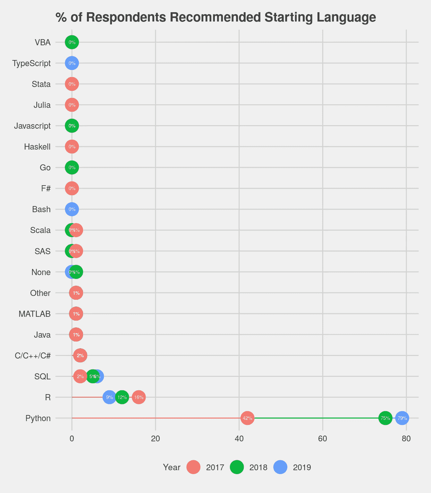******

# **我们如何分析**

## **主要分析工具**

**这将是未来几年值得关注的有趣数字，因为基于云的数据软件旨在涵盖 ML/DS 的所有方面。大量受访者继续使用可靠的电子表格。这将是一个有趣的问题，问受访者为什么他们选择一个工具而不是另一个(速度/方便/理解等)。)**

**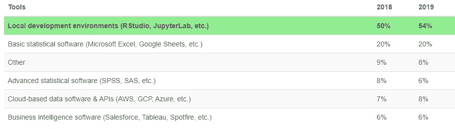**

## **IDE 的**

**朱庇特显然是这里的赢家。MATLAB、Notepad++和 Visual Studio 似乎在 2019 年损失最大。**

**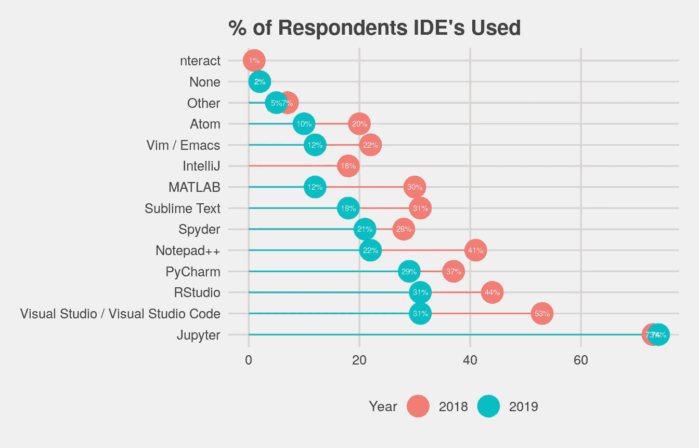******

## **数据可视化**

**鉴于 Python 是最受欢迎的编程语言，Matplotlib 和 Seaborn 占据前两位是有道理的。**

**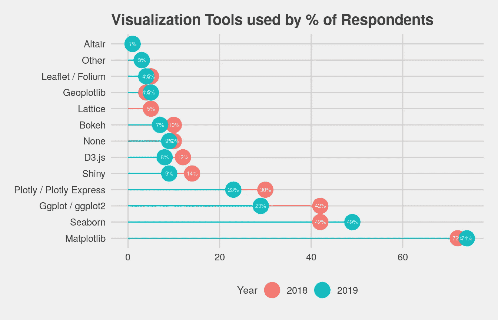******

# **我们的 ML 工具包**

## **使用的 ML 框架**

**Scikit-Learn 占据首位，而 Keras 和 TensoFlow 正在争夺第二名，尽管 Tensorflow 比 2018 年下降了 11%。LightGMB 和 PyTorch 也在寻求发展。**

**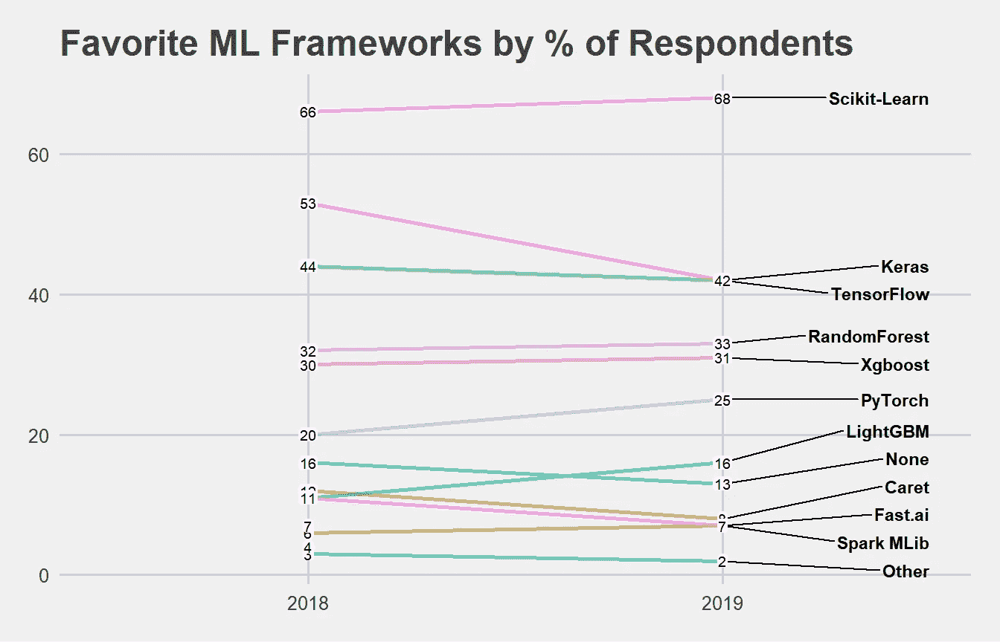**

## **使用的 ML 产品**

**尽管我们看到本地开发环境的使用在增加，但使用 ML 产品的受访者比例的下降是出乎意料的。我们还看到云产品正在普及，我们将在后面的章节中探讨这一点。**

**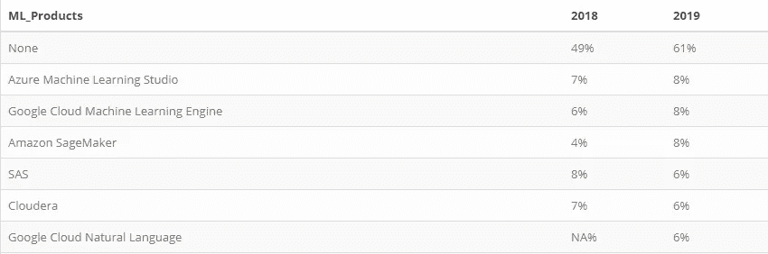**

## **使用的 AutoML**

**AutoML 的影响力越来越大，超过四分之一的受访者已经或正在以某种方式使用 AutoML。看看是否有特定的受访者子集(可能按职位)比其他人更有可能使用 AutoML，或者 AutoML 是否比其他人更容易在某些行业/公司规模中实施，这将是一件有趣的事情。AutoML 使 ML/DS 大众化的能力可能意味着在未来几年里，按职位划分的用户比例将发生变化。**

**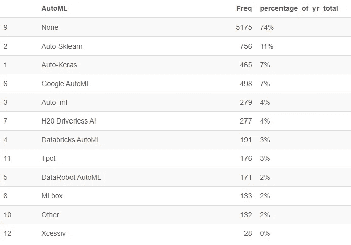******

# **在云端和更远处**

## **使用的云平台**

**GCP 似乎在追逐亚马逊的风头。这将是一个有趣的问题，问受访者为什么他们选择一个平台而不是另一个，因为这些公司继续争夺云优势。**

**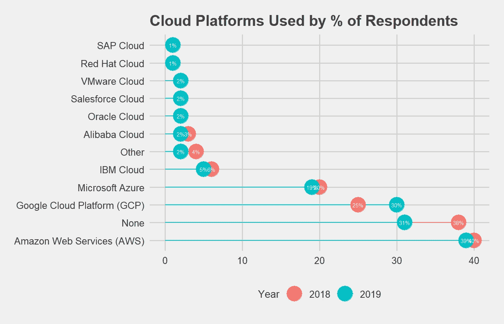**

## **使用的大数据产品**

**GCP 的崛起可能与 BigQuery 等整合相关。**data bricks 也经历了一些令人难以置信的增长(目前估值为 6.2 亿英镑)，因此这绝对是一个值得关注的领域！****

****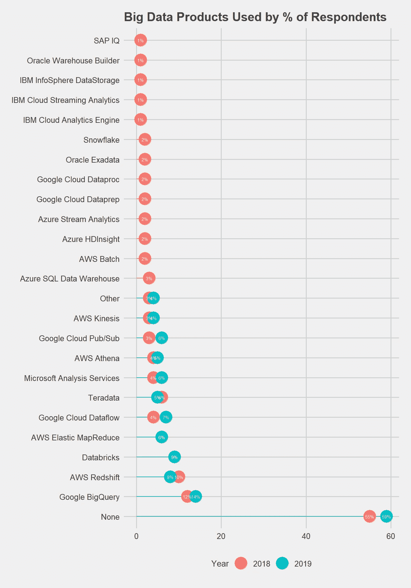****

## ****用过的笔记本****

****谷歌 Colab 看起来将以比去年增长 13%的速度争夺榜首。虽然大多数受访者尚未使用 AutoML，但让快速完成 ML/DS 任务变得更容易并能够共享工作似乎是一种日益增长的需求。许多受访者喜欢 Google Colab，尤其是像 Kaggle 比赛这样的事情，这并不奇怪…****

****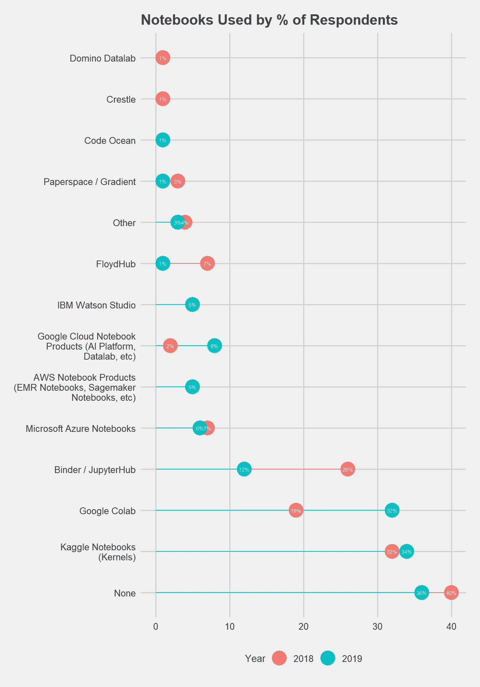****

## ****使用的关系数据库****

****SQL 是数据库的同义词，所以在顶部看到 MySQL/PostgreSQL 并不奇怪。SQL 数据库的云版本似乎也越来越受欢迎。****

****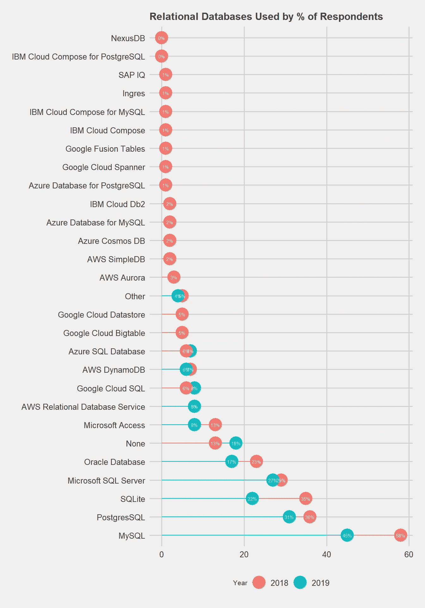****

# ****结束语****

****毫无疑问，ML/DS 的前景正在改变和发展。毫无疑问，接下来的五年将会非常激动人心。我想我最好奇的是，是否会有越来越多的用户将 ML/DS 融入到他们的工作中，以及在云竞赛中是否会有明显的赢家。****

****[链接到 Kaggle 内核:一个 Kaggler 的进化](https://www.kaggle.com/strangemane/evolution-of-a-kaggler)(感谢支持票和反馈！)****

****感谢阅读。****

****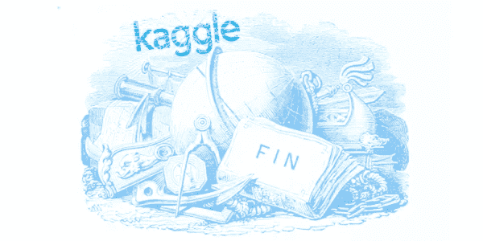****