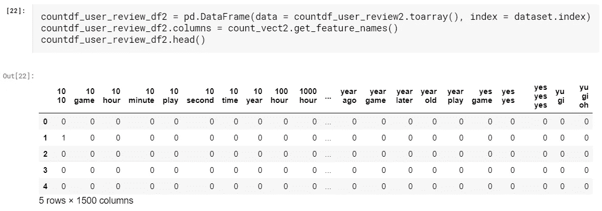
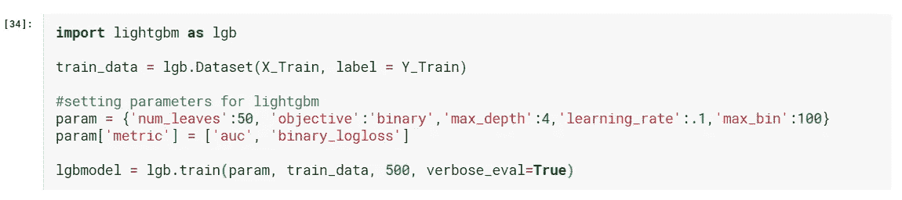

# 自然语言处理的发展——第一部分——词汇袋，TF-IDF

> 原文：<https://medium.com/analytics-vidhya/evolution-of-nlp-part-1-bag-of-words-tf-idf-9518cb59d2d1?source=collection_archive---------6----------------------->

## 情感分类的 NLP 基础入门

这是一系列博客中的第一篇，我试图谈论过去几年中自然语言处理*任务建模技术的变化。从最基础的单词袋开始，我们接触到了当前的艺术水平(State 变形金刚！我将尝试简单介绍一下算法本身，然后我们直接进入编码！我们将看到这一系列的帖子，NLP 在这些年里发生了多大的变化，以及如何快速入门或赶上最新的变化。我希望你喜欢这次旅行；)*

*在这篇文章中，我们将重点关注使用简单的词袋和基于 TF-IDF 的模型，再加上系综决策树来获得最高的准确度分数！*

*你也可以找到这个关于 Kaggle 内核的教程—[NLP 的进化—第 1 部分—单词包，TF-IDF](https://www.kaggle.com/jainkanishk95/evolution-of-nlp-part-1-bag-of-words-tf-idf) 的完整代码！*

# *理解数据*

*我在这里使用了 [JantaHack NLP Hackathon](https://datahack.analyticsvidhya.com/contest/janatahack-nlp-hackathon/True/#ProblemStatement) 数据集。该数据集主要由 2015 年至 2019 年期间收集的不同类型游戏的 **Steam 用户评论**组成。这里的目标是根据用户评论来预测用户推荐还是不推荐游戏。所以，我们的目标本质上是**情感分类。这将是我们整个系列的任务！***

*综合训练和测试数据有 25000 多条评论。我们将只关注使用 *user_review* 进行预测。*

**

*[用于我们分析的完整数据集—图片来自作者](https://www.kaggle.com/jainkanishk95/evolution-of-nlp-part-1-bag-of-words-tf-idf)*

*让我们开始吧！对于这一系列教程，我将只使用评论，没有其他专栏。实际上，执行 EDA 可以更好地理解数据。*

# *使用单词包、N-Grams、TF-IDF*

*下面的方法基本上涵盖了所有尝试 NLP 的人最先使用的一些工具。而且，随着时间的推移，出现了很多很多的库，比如 SpaCy 和 NLTK，它们极大地简化了这种方法的使用。还有像 Textblob 这样的库，它们站在强大的 NLTK 的肩膀上，提供了一个更好更快的接口来执行许多 NLTK 操作等等。*

*我将试着对这些方法和库做一个快速的概述，但是，我建议去每个库的网站(附在下面)了解它们的完整功能。*

# *第一步。预处理*

*清理用户评论！*

1.  ***decontracted** 函数会将一般短语的简短形式转换成它们的较长版本*
2.  ***lemmatize_with_postag** 函数将单词还原为它们的基本形式。我在这里使用了 TextBlob 库的实现，它构建在 NLTK 之上。请随意尝试其他功能。主要思想是减少额外的词汇——这不仅有助于计算，也有助于减少对某些关键词的过度拟合。还有其他类似词干化的方法，但一般不如词干化。*
3.  *进一步清理删除链接，标点符号等。*

**

*[预处理前后—图片来自作者](https://www.kaggle.com/jainkanishk95/evolution-of-nlp-part-1-bag-of-words-tf-idf)*

# *第二步。为 ML 构建数据*

## *使用计数矢量器(单词袋)*

*简而言之，单词包表示某个单词在评论中出现的次数，不管它的顺序如何。要做到这一点，首先我们要为评论中出现的所有单词(或标记)创建一个字典(或词汇表)。词汇表中的每个标记随后被转换为一个列，它的***行【j】***指示— *“该标记在****review【j】****中出现了多少次？”**

*我在下面使用了一个 scikit-learn 实现，但是也有其他库可以很好地处理这个问题。*

**

*[使用词汇袋后的最终数据集——图片来自作者](https://www.kaggle.com/jainkanishk95/evolution-of-nlp-part-1-bag-of-words-tf-idf)*

*列名代表单词，行代表单个句子。如果句子中存在该标记，则相应列将具有值 1，否则为 0。*

## *使用 N-gram*

*然而，有时重要的是单词的组合，而不仅仅是单词本身。示例—“不好”和“好”对于“好”令牌具有相同的标志。因此，在我们的语料库中找到这些可能影响评论整体意义的短语变得很重要。这就是我们所说的 N-grams
然而，寻找这些的成本随着词汇大小(v)的增加而多项式增长，因为本质上我们正在寻找潜在的 **𝑂(𝑉*𝑉)** 更坏的短语组合(其中 v 是词汇量)。*

*在我们的实现中，我们限制为 2 和 3 克。我们进一步选择总共前 3000 个特征，根据它们在数据中的出现进行排序。*

**

*[使用 N 元单词袋后的最终数据集—图片来自作者](https://www.kaggle.com/jainkanishk95/evolution-of-nlp-part-1-bag-of-words-tf-idf)*

*与前面的想法相同，但是，这次我们在句子中寻找特定的 n-gram 序列。*

## *使用 TF-IDF(术语频率-逆文档频率)*

*现在，如果您想知道什么是术语频率，它是一个词在文档中的相对频率，给出为(术语实例数/总实例数)。逆文档频率是包含该术语的文档的相对计数，以 log(文档数/包含该术语的文档数)的形式给出。每个单词对其出现的文档的总体重要性等于 **TF * IDF***

*这将为您提供一个矩阵，其中每一列代表词汇表中的一个单词(至少在一个文档中出现的所有单词)，每一行代表一篇评论，如前所述。这样做是为了降低评论中频繁出现的词的重要性，从而降低它们在评论的总体评分中的重要性。*

*幸运的是，scikit-learn 为您提供了一个内置的 **TfIdfVectorizer** 类，它可以用几行代码生成 TF-IDF 矩阵。*

**

*[使用 TF-IDF 后的最终数据集—图片来自作者](https://www.kaggle.com/jainkanishk95/evolution-of-nlp-part-1-bag-of-words-tf-idf)*

*同样，行构成句子，单个标记代表列。如果单词出现在句子中，基于上面讨论的方法，计算 TFIDF 得分并填入相应的列，否则值为 0。*

*类似于**计数矢量器**，我们在这里也使用 n 元语法。*

**

*[使用 N-grams TF-IDF 后的最终数据集—图片来自作者](https://www.kaggle.com/jainkanishk95/evolution-of-nlp-part-1-bag-of-words-tf-idf)*

# *第三步。建模*

*让我们首先尝试一下只有 TF-IDFs 的数据集。*

## *使用 LGBM 进行培训*

*在很多任务中，我使用了轻量级 GBM，因为它的高精度和速度，以及其他基于树的集合模型。请随意在此进行实验。XGBoost 是一个不错的选择！*

**

*[初始化和训练灯光 GBM —图片来自作者](https://www.kaggle.com/jainkanishk95/evolution-of-nlp-part-1-bag-of-words-tf-idf)*

**

*[TF-IDF 数据集上 LightGBM 的结果—图片来自作者](https://www.kaggle.com/jainkanishk95/evolution-of-nlp-part-1-bag-of-words-tf-idf)*

> *使用 TF-IDF 方法——结合单词标记和 n-grams，我们得到大约 83.3%的分数*

***现在，让我们用 CountVectorizer 数据集检查结果***

******

***[单词袋数据集上 LightGBM 的结果—图片来自作者](https://www.kaggle.com/jainkanishk95/evolution-of-nlp-part-1-bag-of-words-tf-idf)***

> ***使用单词袋方法——结合单词标记和 n-grams，我们得到了大约 82.7%的分数***

## ***准确度— 83.3%***

***这是我们的基线分数！基于一袋话和 TF-IDF，这是我们能得到的最好的。让我们尝试更强大的技术来进一步改进它！希望它能帮助你更好地理解 TF-IDF 和计数矢量器以及它在 Python 中的实现。***

***有很好的在线资源，尤其是在**数据营**，那里的在线互动课程涵盖了我们在本笔记本中讨论的相同技术。请随意查看它们以获得更多的理解！在本系列的[第二部分——递归神经网络](/@jainkanishk001/evolution-of-nlp-part-2-recurrent-neural-networks-af483f708c3d)中再见。***