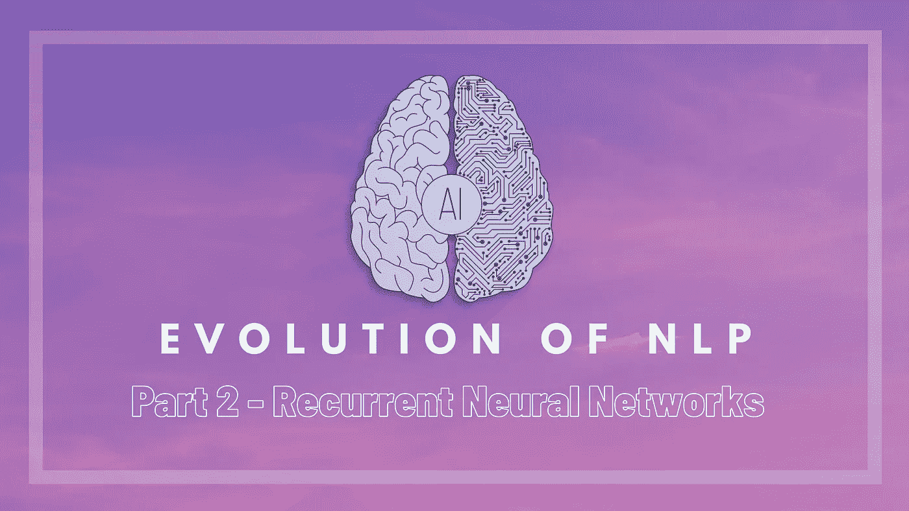

# 自然语言处理的发展——第二部分——递归神经网络

> 原文：<https://medium.com/analytics-vidhya/evolution-of-nlp-part-2-recurrent-neural-networks-af483f708c3d?source=collection_archive---------9----------------------->

## 用于自然语言处理情感分类的深度学习介绍

在[第一部分](/@jainkanishk001/evolution-of-nlp-part-1-bag-of-words-tf-idf-9518cb59d2d1)中，我们探讨了 TF-IDF，词袋以及用于文本分类的集成决策树方法。请随意查看，看看我们的基线得分。这一次我们尝试使用一种新的方法——RNN。