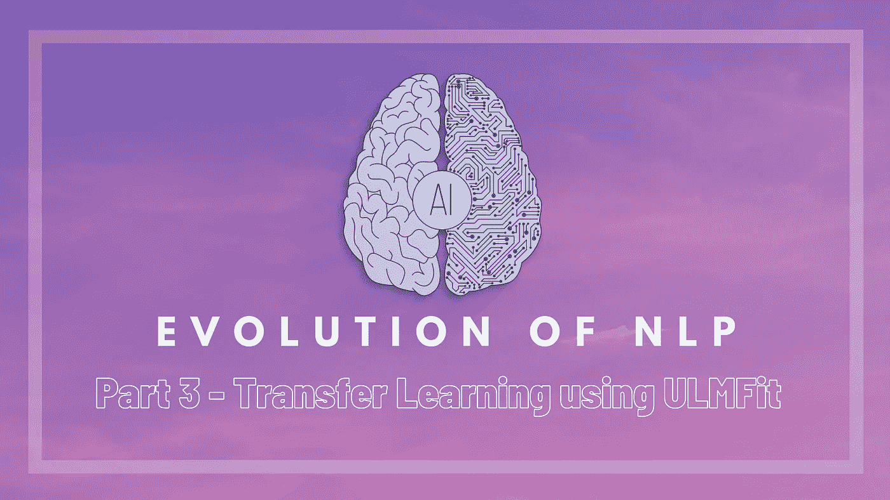

# 自然语言处理的发展——第三部分——利用 ULMFit 进行迁移学习

> 原文：<https://medium.com/analytics-vidhya/evolution-of-nlp-part-3-transfer-learning-using-ulmfit-267d0a73421e?source=collection_archive---------20----------------------->

## 使用 fast.ai 进行自然语言处理的迁移学习介绍

这是展示 NLP 建模方法改进的系列文章的第三部分。我们已经看到了传统技术的使用，如[单词袋，TF-IDF](/analytics-vidhya/evolution-of-nlp-part-1-bag-of-words-tf-idf-9518cb59d2d1) ，然后转移到 [RNNs 和 lstm](/analytics-vidhya/evolution-of-nlp-part-2-recurrent-neural-networks-af483f708c3d)。这一次，我们将研究接近 NLP 的一个关键转变…