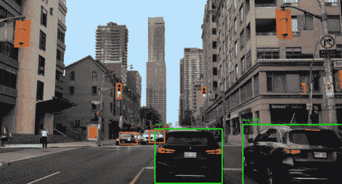
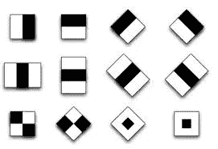
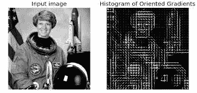
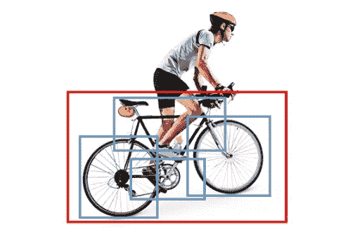
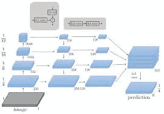
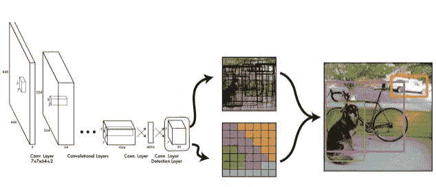
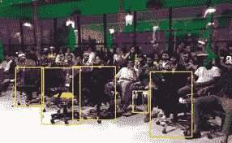

# 目标检测的发展

> 原文：<https://medium.com/analytics-vidhya/evolution-of-object-detection-582259d2aa9b?source=collection_archive---------1----------------------->

计算机视觉已经取得了相当大的进步，但在匹配人类感知的精度方面仍然面临挑战。然而，看到我们已经走了多远总是好的。检测和识别图像中未知数量的单个对象的任务，称为*对象检测*，仅在几年前还被认为是一个极其困难的问题，现在已经是可行的，甚至已经被像 [**【谷歌】**](https://cloud.google.com/vision/docs/drag-and-drop) 和 [**IBM**](https://www.ibm.com/watson/services/visual-recognition/) **这样的公司产品化。**

在这个故事中，我们将回顾对象检测的历史，从“传统对象检测时期(2014 年之前)”到“基于深度学习的检测时期(2014 年之后)”。

## **传统物体检测时代:**

时光倒流 20 年，我们将见证“冷兵器时代的智慧”。由于当时缺乏有效的图像表示，早期的大多数对象检测算法都是基于手工制作的特征构建的。

**维奥拉·琼斯探测器:**

由 Paul Viola 和 Michael Jones 在 2001 年开发的这个对象识别框架允许实时检测人脸。它使用滑动窗口来遍历图像中所有可能的位置和比例，以查看是否有任何窗口包含人脸。滑动窗口本质上搜索“类哈尔”特征(以提出哈尔小波概念的阿尔弗雷德·哈尔命名)。

类似哈尔的特征。

因此，haar 小波被用作图像的特征表示。为了加快检测速度，它使用了*积分图像*，使得每个滑动窗口的计算复杂度与其窗口大小无关。作者使用的另一个提高检测速度的技巧是使用 Adaboost 算法进行*特征选择*，该算法从大量随机特征池中选择一小组对人脸检测最有帮助的特征。该算法还使用了*检测级联，这是一种*多阶段检测范式，通过在背景窗口上花费更少的计算而在人脸目标上花费更多的计算来减少其计算开销。

**生猪检测器:**

Hog 最初由 N. Dalal 和 B. Triggs 在 2005 年提出，是对当时的尺度不变特征变换和形状上下文的改进。HOG 使用一种叫做*块*(类似于滑动窗口)的东西，这是一种密集的像素网格，其中梯度由块内像素强度变化的幅度和方向组成。猪因其在行人检测中的应用而广为人知。为了检测不同大小的对象，HOG 检测器会多次重新缩放输入图像，同时保持检测窗口的大小不变。

**基于可变形零件的模型(DPM):**

DPM 最初由 P. Felzenszwalb 在 2008 年提出，作为 HOG 检测器的扩展。后来，R. Girshick 做了各种改进。检测一辆“汽车”的问题可以通过检测它的窗户、车身和车轮来分解为一个“*分而治之”*策略。DPM 使用这种策略。训练过程包括学习分解对象的适当方式，而推理包括组合不同对象部分的检测。

DPM 检测器由一个根滤波器和多个部分滤波器组成。在 DPM 中开发了弱监督学习方法，其中所有配置(大小、位置等。)可以作为潜在变量被自动学习。为了提高检测精度，R. Girshick 为此使用了多示例学习的特例，以及其他一些重要的技术，如“硬负挖掘”、“包围盒回归”和“上下文启动”。后来，他甚至使用了一种实现级联架构的技术，这种技术在不牺牲精度的情况下实现了 10 倍以上的加速。

## 深度学习时代:

不幸的是，随着手工制作功能的性能变得饱和，对象检测在 2010 年后达到了一个平台期。然而，在 2012 年，世界见证了卷积神经网络的重生，深度卷积网络成功地学习了图像的鲁棒和高级特征表示。2014 年，具有 CNN 特征的区域(RCNN)用于物体检测的提议打破了物体检测的僵局。在这个深度学习时代，物体检测分为“两阶段检测”和“一阶段检测”两个流派。

**RCNN:**

它从通过选择性搜索提取一组对象建议(对象候选框)开始。然后，每个建议被重新调整为固定大小的图像，并输入到预先训练的 CNN 模型中以提取特征。最后，使用线性 SVM 分类器来预测每个区域中对象的存在，并识别对象类别。

> 虽然 RCNN 比传统方法好得多，但它有几个缺点。对大量重叠提议(来自一幅图像的超过 2000 个框)的冗余特征计算导致了极其缓慢的检测速度。选择性搜索算法也是一种固定算法。因此，在那个阶段没有学习发生。这可能导致产生坏的候选区域提议。

**SPPNet:**

2014 年，K. He 等人提出了空间金字塔池网络。传统上，在卷积层和全连接层的过渡处，只有一个汇集层，甚至没有汇集层。在 SPPNet 中，它建议使用不同规模的多个池层。此外，以前的 CNN 模型需要固定大小的输入。SPPNet 中的空间金字塔池(SPP)层使 CNN 能够生成固定长度的表示，而不管感兴趣的图像/区域的大小，而无需重新缩放。

上图说明了这个过程。我们看到，输入图像仅通过卷积网络进入 SPPNet 一次。选择性搜索用于生成区域提议，就像在 R-CNN 中一样。在最后一个卷积层，由每个区域提议限定的特征图进入 SPP 层，然后进入 FC 层。

> 与 R-CNN 相比，SPPNet 仅在 conv 层处理图像一次，而 R-CNN 在 conv 层处理图像的次数与区域提议的次数一样多。然而，缺点包括:训练仍然是多阶段的，SPPNet 仅微调其完全连接的层，而完全忽略所有先前的层。

**快速 RCNN:**

与 R-CNN 模型相比，快速 R-CNN 模型使用整个图像作为特征提取的 CNN 输入，而不是每个提议的区域。对图像应用选择性搜索，并且假设它生成 n 个建议区域，它们的不同形状指示不同形状的感兴趣区域(ROI)。快速 R-CNN 引入了 RoI pooling，它使用 CNN 输出和 RoI 作为输入，输出从每个建议区域提取的特征的串联，并在类别预测期间馈入全连接层，全连接层输出的形状再次转换为 n×q，我们使用 softmax 回归(q 是类别的数量，n 是建议区域的数量)。在边界框预测期间，完全连接的层输出的形状再次被变换为 n×4。这意味着我们预测每个建议区域的类别和边界框。

“快速 R-CNN”比 R-CNN 更快的原因是因为我们不必每次都将所有区域提议馈送给卷积神经网络。相反，每个图像只进行一次卷积运算，并从中生成特征图。

> 虽然 Fast-RCNN 成功地结合了 R-CNN 和 SPPNet 的优点，但其检测速度仍然受到建议检测的限制

**更快的 RCNN:**

2015 年，S. Ren 等人在快速 RCNN 之后不久提出了更快的 RCNN 检测器。它是第一个端到端的，也是第一个接近实时的深度学习对象检测器。上述所有算法(R-CNN、SPPNet 和 Fast R-CNN)都使用选择性搜索来找出区域建议。选择性搜索是一个缓慢而耗时的过程，会影响网络的性能。更快的 R-CNN 消除了选择性搜索算法，并让网络学习区域建议。

类似于快速 R-CNN，图像作为输入被提供给卷积网络，该网络提供卷积特征图。不是在特征图上使用选择性搜索算法来识别区域提议，而是使用单独的网络来预测区域提议。然后，使用 RoI 池层对预测的区域提议进行整形，然后使用 RoI 池层对提议区域内的图像进行分类，并预测边界框的偏移值。

作为更快的 R-CNN 模型的一部分，区域提议网络与模型的其余部分一起被训练。此外，更快的 R-CNN 目标函数包括对象检测中的类别和边界框预测，以及区域提议网络中锚框的类别和边界框预测。最后，区域建议网络可以学习如何生成高质量的建议区域，这减少了建议区域的数量，同时保持了对象检测的精度。

> 虽然快速 RCNN 突破了快速 RCNN 的速度瓶颈，但在后续检测阶段仍然存在计算冗余。后来，各种各样的改进被提出，包括 RFCN 和轻型头 RCNN

**特征金字塔网络(FPN):**

2017 年，T.-Y. Lin 等人提出了特征金字塔网络。如果我们深入研究更快的 RCNN，我们会发现它大多无法捕捉图像中的小对象。为了解决这个问题，可以使用一个简单的图像金字塔将图像缩放到不同的大小，并将其发送到网络。一旦在每个尺度上检测到检测，可以使用不同的方法组合所有的预测。

在 FPN 之前，大多数基于深度学习的检测器仅在网络的顶层运行检测。虽然 CNN 更深层的特征有利于类别识别，但不利于定位对象。FPN 开发了一种具有横向连接的自上而下的体系结构，用于在所有尺度上构建高级语义。由于 CNN 通过其前向传播自然地形成特征金字塔，FPN 在检测具有各种尺度的对象方面显示出巨大的进步。

> FPN 现已成为许多最新探测器的基本构件。

**你只看一次(YOLO):**

所有先前的对象检测算法都使用区域来定位图像中的对象。该网络不查看完整的图像，而是查看图像中包含该对象的概率较高的部分。

YOLO 在全图像上训练，直接优化检测性能。有了 YOLO，单个 CNN 同时预测多个边界框和这些框的类别概率。它还可以同时预测图像中所有类别的所有边界框。*它*将输入图像划分成一个 S × S 的网格。如果一个物体的中心落入一个网格单元，该网格单元负责检测该物体*。*每个网格单元预测 B 个边界框和这些框的置信度得分。这些置信度得分反映了模型对盒子包含对象的置信度，以及它认为它预测的盒子有多准确。

每个边界框由 6 个数字(pc，bx，by，bh，bw，c)表示，其中 pc 是存在于边界框中的对象的置信度；bx，by，bh，bw 代表包围盒本身；c 是包含类别概率的向量。我们还通过探索训练数据来定义*锚盒*，以选择代表不同类别的合理的高/宽比。锚定框可以有多个边界框。对于(每个网格单元的)每个锚定框，我们计算逐元素乘积 pc*c[i]并提取包含某个类别的框的概率得分。与最大分数相关联的类连同分数本身一起被分配给锚定框。

然后，我们可以通过使用概率得分的阈值来去除得分低的盒子。然而，我们仍然得到许多盒子。因此，我们使用一种称为非极大值抑制(NMS)的方法，当几个框相互重叠并检测到相同的对象时，我们只选择一个框。

> 尽管其检测速度有了很大的提高，但与两级检测器相比，YOLO 的定位精度有所下降，尤其是对于一些小物体。YOLO 的后续版本(YOLO V2，YOLO V3 和最新的 YOLO V4)和后者提出的 SSD(单次多盒探测器)已经更加重视这个问题。

**单次多盒探测器(SSD):**

SSD 是 W. Liu 等人在 2015 年提出的。然后在 2016 年 11 月，C. Szegedy 等人发表了关于 [SSD:单次多盒检测器](https://arxiv.org/abs/1512.02325?source=post_page)的论文，该论文在对象检测任务的性能和精度方面创下了新纪录。它是一个一步到位的物体探测器，就像 yolo 一样。SSD 的主要贡献是引入了多参考和多分辨率检测技术，显著提高了一级检测器的检测精度，特别是对于一些小物体..在 YOLO 和更快的 RCNN 之后发布，对于 300x300 输入大小的图像，本文在 59fps 下实现了 74.3 mAP。这个网络叫做 SSD300。类似地，SSD512 实现了 76.9%的 mAP，超过了更快的 R-CNN 结果。

它从*基础网络开始提取特征地图*。标准预训练网络用于高质量图像分类，并且在任何分类层之前被截断。在他们的论文中，C. Szegedy 等人使用了 VGG16 网络。可以使用像 VGG19 和 ResNet 这样的其他网络，并且应该产生良好的结果。然后*多尺度特征层*是在基本网络之后添加的一系列卷积滤波器。这些层的尺寸逐渐减小，以便预测多种尺度的探测。然后*非最大值抑制*用于消除重叠的框，并为每个检测到的对象只保留一个框。

**RetinaNet:**

发现在密集一级检测器的训练中存在极端的类不平衡问题。尽管单级检测器速度快且简单，但据信这是其性能不如两级检测器的主要原因**。RetinaNet 中引入了一个名为“焦点损失”的新损失函数，其中“容易”的阴性样本会产生较低的损失，因此检测器在训练期间会将更多的注意力放在困难、错误分类的样本上。焦点损失使一级检测器能够达到与两级检测器相当的精度，同时保持非常高的检测速度。**

以**[ResNet](https://towardsdatascience.com/review-resnet-winner-of-ilsvrc-2015-image-classification-localization-detection-e39402bfa5d8)+[FPN](https://towardsdatascience.com/review-fpn-feature-pyramid-network-object-detection-262fc7482610)为骨干进行特征提取，加上两个用于分类和包围盒回归的特定任务子网，RetinaNe 实现了最先进的性能，并优于更快的 R-CNN 等知名的两级检测器。**

**目前就这些。**

**我们简要讨论了目标检测的发展，这是计算机视觉中一个非常具有挑战性、高度复杂且高度发展的领域。每年，新的算法都不断超越以前的算法。今天，有太多的预先训练好的模型用于物体检测。目标检测也在许多有趣的领域得到了应用，包括*跟踪目标*(如在足球世界杯的一场比赛中跟踪一个球)*自动闭路电视监控*、*人物检测*(用于智能视频监控框架中)*车辆检测*等。它还在自动驾驶中得到了应用，这是现代最有趣和最值得期待的创新之一。**

****

## **参考资料:**

1.  **20 年来的物体探测:一项调查→[https://arxiv.org/pdf/1905.05055.pdf](https://arxiv.org/pdf/1905.05055.pdf)**
2.  **RCNN→[https://arxiv.org/pdf/1311.2524.pdf](https://arxiv.org/pdf/1311.2524.pdf)**
3.  **快速 RCNN→[https://arxiv.org/pdf/1504.08083.pdf](https://arxiv.org/pdf/1504.08083.pdf)**
4.  **更快的 RCNN→[https://arxiv.org/pdf/1506.01497.pdf](https://arxiv.org/pdf/1506.01497.pdf)**
5.  **Yolo → Coursera 吴恩达深度学习专业化。**
6.  **HOG→[https://www . learnopencv . com/histogram-of-oriented-gradients/](https://www.learnopencv.com/histogram-of-oriented-gradients/)**
7.  **SSD→[https://arxiv.org/abs/1512.02325](https://arxiv.org/abs/1512.02325)**
8.  **FPN→[https://Jonathan-hui . medium . com/understanding-feature-pyramid-networks-for-object-detection-fpn-45b 227 b 9106 c](https://jonathan-hui.medium.com/understanding-feature-pyramid-networks-for-object-detection-fpn-45b227b9106c)**
9.  **spp net→[https://arxiv.org/abs/1406.4729](https://arxiv.org/abs/1406.4729)**