# 用机器学习进化运输行业

> 原文：<https://medium.com/analytics-vidhya/evolving-the-transportation-industry-with-machine-learning-saturn-cloud-c8b18035871d?source=collection_archive---------24----------------------->


机器学习正被用于各种行业，以提高效率并降低做生意的成本。看到它在交通领域的应用会非常有趣，因为这是一个我们每天都在互动的领域——当然，除了《新冠肺炎时报》。我们将深入研究它是如何被应用的，并建立一个简单的机器学习模型来说明它的应用。

我们将看到它在以下领域的应用:

*   无人驾驶汽车
*   假冒零件检测
*   缺陷检测
*   预测性维护
*   改善客户体验
*   投诉管理
*   有针对性的活动
*   交通管理
*   事故严重性预测

## 无人驾驶汽车

自动驾驶汽车越来越被证明比人类驾驶的汽车更好。尤其是在危急和危及生命的情况下。背后的原因是他们能够在瞬间做出决定，不像人类会因为震惊而犹豫不决。自动驾驶汽车是通过深度学习的进步实现的，如物体检测和实时图像识别。深度学习的另一个方面在这一驱动中发挥了关键作用——没有双关语——是图像分割。图像分割已经实现了对象的像素级识别。这意味着道路上的项目及其轮廓将被单独识别。


[由 Freepik](https://www.freepik.com/free-photos-vectors/car)

然而，人们一直对自动驾驶汽车的判断提出质疑，尤其是在危及生命的情况下。例如，在不幸的情况下，汽车必须决定是撞上老人还是年轻人，它应该救谁的命？精神食粮。尽管如此，通过减少事故，自动驾驶汽车在使道路运输更加安全方面具有巨大的潜力。这些车的优点是它们在你使用的过程中不断学习和改进。这意味着您将获得更好的体验。这些车辆的制造商也一直在努力改进这些车辆，以使它们更安全，并改善我们的体验。

## 假冒零件检测

汽车中的假零件导致汽车维护成本的增加以及事故风险的增加。检测市场上假零件的能力可以降低运营成本，从公交公司到个体司机。这可以通过收集真假零件的图像来实现。此后，可以训练一个深度学习模型来区分真假汽车零件。


[来源](https://www.freepik.com/free-photos-vectors/vintage)

## 缺陷检测

世界上大多数地方都使用铁路系统。这个系统的缺陷可能会危及生命，尤其是因为火车可能会偏离轨道。空中系统或无人机可以用来监控这些铁路线的缺陷。这些系统将使用模式识别和图像识别来发现这些线上的缺陷。因此，由于早期检测，生命得以保留，固定铁轨的成本得以降低。

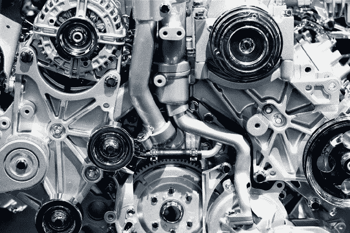

[来源](https://www.freepik.com/free-photos-vectors/vintage)

## 预测性维护

在火车、汽车或飞机上及早发现问题可以节省很多钱。与纠正性维护相反，早期问题检测也导致预防性维护。这意味着我们可以预见问题，并在问题发生前解决它们。这样做的好处是更容易计划和预算开支。这方面的一个典型例子是发动机维护。

## 改善客户体验

运输行业的大多数参与者从他们的客户那里收集大量数据。这些数据从他们的购票历史到他们的旅行目的地。例如，可以利用这些数据根据客户以前的旅行历史推荐他们可以去的新地方，或者确定客户何时可能再次旅行。在这个过程中，服务提供商可以向客户提供折扣和礼券。有了关于顾客旅行时喜欢的地方的信息，人们还可以推荐他们到达一个新国家后可以去的地方。

## 投诉管理

在所有行业中，快速响应客户投诉对留住客户起着巨大的作用。例如，在航空运输中，你解决客户投诉的速度将在他们决定未来是否乘坐你的飞机时发挥巨大作用。也就是说，机器学习可以用来确定高优先级的投诉，从而立即解决它们。一个快乐的顾客会与朋友或在社交媒体上分享这种体验，这样可以提高你的品牌知名度。

## 有针对性的活动

向所有客户传播通用信息的时代已经一去不复返了。如今，根据客户的个人资料和独特特征来锁定客户是一种新的规范。运输行业的参与者也可以利用这一点，对他们的客户进行聚类，并根据客户所属的聚类发送有针对性的消息。可以基于诸如他们何时旅行、他们旅行到哪里以及他们停留的持续时间之类的因素来对客户进行聚类。


[来源](https://www.freepik.com/free-vector/social-strategy-concept-illustration_6450145.htm)

## 交通管理

交通拥挤是世界上许多大城市的一个大问题。这些交通堵塞对经济有巨大的影响，因为在这些延误中损失了时间。通过关联从传感器和摄像头获得的数据，机器学习系统可以用来建议驾车者使用最短的路线到达他们的目的地。这可以通过天气数据和检测道路上是否发生事故的能力来增强。

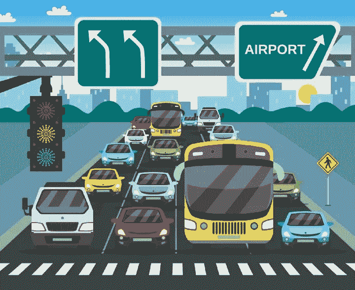

[来源](https://www.freepik.com/)

## 事故严重性预测

使用以前收集的事故数据，我们可以建立一个模型，预测不同目的地事故的严重程度。这些信息可用于政策制定。通过这样做，可以立即处理预测会发生更多致命事故的区域。显然我们根本不希望发生任何事故，但在政策制定中优先考虑发生更多致命事故的领域才是合乎逻辑的。

我们可以在这里找到 2005 年至 2015 年[发生在英国的事故。数据集的标签描述可以在](https://www.kaggle.com/silicon99/dft-accident-data)[这里](https://drive.google.com/file/d/1eZuLWvFItLOSyAQ86D2CYKM4mdYutfhd/view?usp=sharing)找到。我们将使用该数据集建立一个模型，预测事故的严重程度。在数据集中，1 代表致命事故，2 代表严重事故，3 代表轻微事故。由于数据集相当大，我们将使用土星云和 Dask 来处理它。

我们从进口熊猫和熊猫开始。

```
import pandas as pdimport numpy as np
```

接下来，我们在土星云上创建一个局部星团。

```
from dask.distributed import Clientfrom dask.distributed import Clientclient = Client()client
```

如您所见，我们有一个包含 8 个工作线程、64 个内核和 535GB 内存的集群，所有这些都来自土星云。计算能力将足以完成这项任务。


接下来，我们导入 dask.dataframe，以便使用 dask 加载事故数据框。Matplotlib 和 seaborn 将用于可视化。

```
import dask.dataframe as ddimport matplotlib.pyplot as pltimport seaborn as sns
```

在我们加载数据集之前，我们必须设置数据类型。通常，Dask 会推断出数据类型，但是隐式地声明它们是一种很好的做法，这样可以避免以后出现问题。还需要注意的是，Dask 不会加载整个文件——它只加载数据的一个样本，并使用它来推断数据类型。

```
data_types ={‘Accident_Index’: str,‘Location_Easting_OSGR’:float,‘Location_Northing_OSGR’: float,‘Longitude’: float,‘Latitude’:float,‘Police_Force’: object,‘Accident_Severity’:object,‘Number_of_Vehicles’:float,‘Number_of_Casualties’:float,‘Date’:object,‘Day_of_Week’:object,‘Time’:object,‘Local_Authority_(District)’: object,‘Local_Authority_(Highway)’: object,‘1st_Road_Class’: object,‘1st_Road_Number’: object,‘Road_Type’:object,‘Speed_limit’:float,‘Junction_Detail’: object,‘Junction_Control’: object,‘2nd_Road_Class’: object,‘2nd_Road_Number’: object,‘Pedestrian_Crossing-Human_Control’: object,‘Pedestrian_Crossing-Physical_Facilities’:object,‘Light_Conditions’: object,‘Weather_Conditions’: object,‘Road_Surface_Conditions’: object,‘Special_Conditions_at_Site’: object,‘Carriageway_Hazards’:object,‘Urban_or_Rural_Area’: object,‘Did_Police_Officer_Attend_Scene_of_Accident’: object}
```

我们现在准备读取事故 CSV 文件。

```
df = dd.read_csv(“Accidents0515.csv”,dtype = data_types)
```

接下来，我们可以检查数据集中的任何空值。注意 compute()在最后的使用。这是因为 Dask 中的操作仅在调用 compute 方法后执行。

```
df.isnull().sum().compute()
```

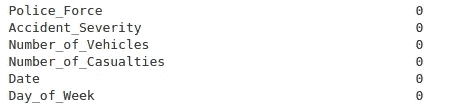

就像在熊猫里面，我们可以通过调用 head 函数来检查头部。

```
df.head()
```

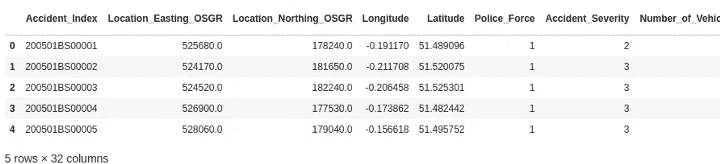

事故严重程度的快速可视化清楚地向我们表明，数据是高度不平衡的。我们注意到大多数事故都是轻微的。现在，在构建我们的机器学习模型时，这将带来巨大的挑战。这是因为将会有很少的类来训练模型以预测致命和严重的事故。当我们进入机器学习部分时，这是一个我们必须处理的问题。

```
plt.figure(figsize=(8,6))plt.title(‘Accident Severity Plot’)sns.countplot(x=’Accident_Severity’, data=df.compute())
```

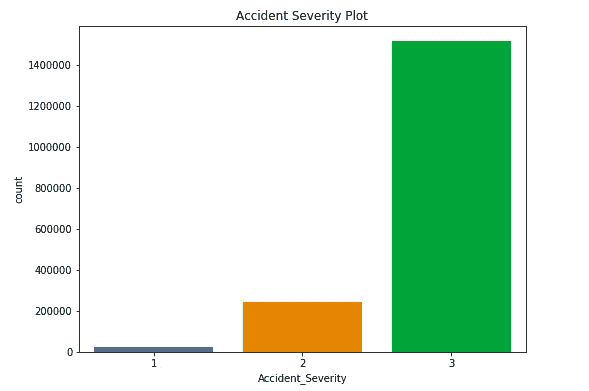

看看平均有多少辆车卷入了一场事故也是很有趣的。

```
df[‘Number_of_Vehicles’].describe().compute()
```

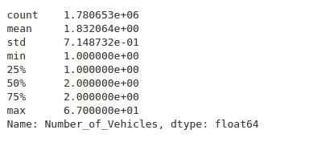

我们意识到平均一次事故涉及两辆车。伤亡人数呢？

```
df[‘Number_of_Casualties’].describe().compute()
```

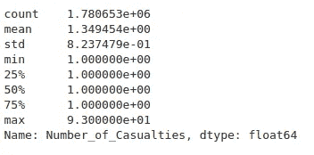

我们看到每起事故都至少有一人伤亡。现在我们来看看路口在这些事故中扮演的角色。

```
plt.figure(figsize=(12,6))plt.title(‘Junction Detail Plot’)sns.countplot(x=’Junction_Detail’, data=df.compute())
```

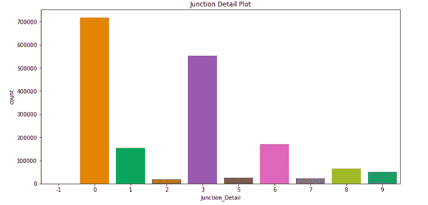

我们注意到，大多数事故发生在没有交叉路口的地方，或者交叉路口在 20 米以内，并且在 T 形或交错路口。这些事故发生的道路类型呢？接下来让我们来看看。

```
plt.figure(figsize=(12,6))plt.title(‘Road Type Plot’)sns.countplot(x=’Road_Type’, data=df.compute())
```

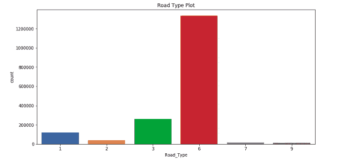

显然，大多数事故发生在单行道上。

该数据集还包含关于车辆和伤亡信息的额外文件。对所有这些数据的全面探索性分析本身就是一个整体。因此，我们将在这里停下来，继续构建机器学习模型。

为了构建模型，我们首先创建包含特性和目标的变量。在这种情况下，我们的目标是事故严重性，而特征是进行预测时将涉及的所有列。我们声明特征为 X，目标为 y。

```
y = df[‘Accident_Severity’].compute()X = df[[‘Police_Force’,’Number_of_Vehicles’,’Number_of_Casualties’,’1st_Road_Class’,’Road_Type’,’Speed_limit’,’Pedestrian_Crossing-Physical_Facilities’,\‘Junction_Control’,’Junction_Detail’,’Pedestrian_Crossing-Physical_Facilities’,’Light_Conditions’,’Weather_Conditions’,’Road_Surface_Conditions’,\‘Road_Surface_Conditions’,’Special_Conditions_at_Site’,’Carriageway_Hazards’,’Urban_or_Rural_Area’,’Did_Police_Officer_Attend_Scene_of_Accident’]].compute()
```

我们将使用 dask_ml 来构建模型。

```
from dask_ml.model_selection import train_test_split
```

接下来，我们将数据集分成训练集和测试集。我们使用 33%的数据进行测试，其余的用于训练。然后，我们创建 RandomForestClassifier 的一个实例，并使其适合数据集。设置 n_jobs=-1 表示该进程应该使用所有可用的 CPU。如果你正在土星云上工作，这将工作得很好。但是，由于这些数据非常大，并且取决于您的计算机处理能力，您可能会发现您的计算机冻结。我们将展示如何在 Satun Cloud 上使用 Dask 进行并行计算，以使这一过程更加高效。

```
X_train, X_test, y_train, y_test = train_test_split( X, y, test_size=0.33)from sklearn.ensemble import RandomForestClassifierforest = RandomForestClassifier(verbose=1,n_jobs=-1)forest.fit(X_train,y_train)
```

现在，我们可以根据我们的模型进行预测，并评估其性能。

```
predictions = forest.predict(X_test)from sklearn.metrics import classification_report, confusion_matrix,accuracy_scoreaccuracy_score(predictions, y_test)confusion_matrix(predictions, y_test)print(classification_report(predictions, y_test))
```

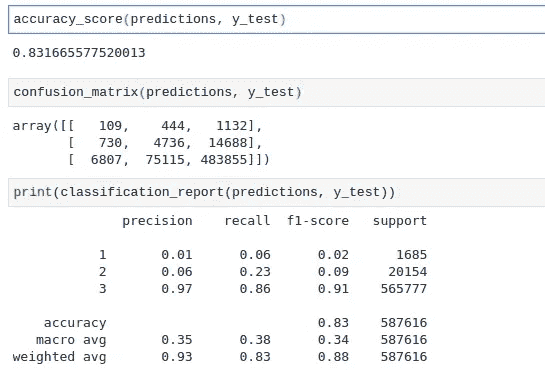

你现在已经成功创建了一个准确率为 83%的模型，对吗？不对。如果你仔细观察这个模型，你会注意到类 3 的精度是 97%，而其他类的精度很低。这是由于这个数据集中的大多数条目都属于那个类。对于我们所做的任何预测，我们会注意到类别将是 3，因为这是模型已经学会预测的唯一类别。这个数据是不平衡的。有许多处理不平衡数据的技术，但这超出了本文的范围。然而，我们将执行欠采样以平衡类。

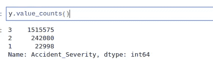

下面，我们使用 [imblearn](https://imbalanced-learn.readthedocs.io/en/stable/api.html) 包来平衡数据。

```
from imblearn.under_sampling import NearMissunderSample = NearMiss()X_resampled,y_resampled = underSample.fit_resample(X.values,y.values)pd.Series(y_resampled).value_counts()
```

请注意，现在类平衡了，记录的数量减少了。这是因为我们做了欠采样。如果我们进行过采样，记录的数量就会增加。

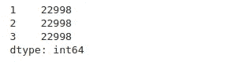

[Joblib](https://joblib.readthedocs.io/en/latest/) 是 Scikit-learn 用于单机并行的包。接下来，我们从重新采样的数据中创建测试和训练集。最后，我们创建一个 RandomForestClassifier 的实例。

```
import joblibX_train, X_test, y_train, y_test = train_test_split(X_resampled, y_resampled, test_size=0.33)forest2 = RandomForestClassifier(verbose=1)
```

现在，我们可以使用 Dask 来并行运行我们的计算。

```
from sklearn.externals.joblib import parallel_backendwith parallel_backend(‘dask’):forest2.fit(X_train,y_train)predictions2 = forest2.predict(X_test)accuracy_score(predictions2, y_test)confusion_matrix(y_test,predictions2)print(classification_report(y_test,predictions2))
```

我们注意到整体准确率已经下降到 69%。但是，其他类的整体精度和召回率有所提高。

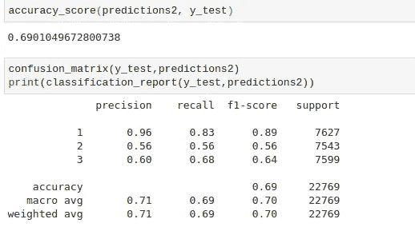

那么现在，你可能会问，预测事故严重程度的最重要特征是什么？好吧，我们一起来了解一下。

```
importances_rfc = forest2.feature_importances_importances_rfc_df = pd.DataFrame(importances_rfc, index=X.columns, columns=[‘Importance’])importances_rfc_df = importances_rfc_df.sort_values(by=’Importance’, ascending=False)importances_rfc_df = importances_rfc_df[importances_rfc_df[‘Importance’] > 0]importances_rfc_df.head()
```

我们创建了一个包含最重要要素的数据框，如下所示。

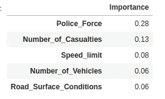

现在让我们用 Seaborn 来想象一下。

```
plt.figure(figsize=(8,8))plt.xticks(rotation=60, fontsize = 15)sns.barplot(y=importance_df.index, x=importance_df[‘Importance’])
```

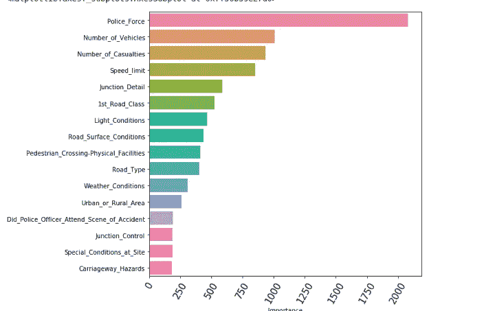

## 最后的想法

我相信这篇文章已经给了你一些背景知识，让你知道机器学习在哪里以及如何应用于交通领域。显然，我们建立的模型不是世界上最好的。当然，这种模式还可以改进。提高其性能的一个明显方法是将事故数据集与车辆和伤亡数据合并。你也可以尝试不同的分类器。例如， [LGBMClassifier](https://lightgbm.readthedocs.io/en/latest/pythonapi/lightgbm.LGBMClassifier.html) 被认为可以很好地处理标签编码数据，就像我们在这篇文章中看到的那样。尝试不同的分类器并进行一些参数调整肯定会提高模型的准确性。

查看这个[ [视频](https://www.youtube.com/watch?v=dcTQkaAR9BQ&feature=youtu.be)，看看我是如何使用土星云来完成这个分析的。

[](https://www.udemy.com/course/data-science-bootcamp-in-python/?referralCode=9F6DFBC3F92C44E8C7F4) [## Python 中的数据科学训练营

### 学习 Python 的数据科学，NumPy，Pandas，Matplotlib，Seaborn，Scikit-learn，Dask，LightGBM，XGBoost，CatBoost 等等…

www.udemy.com](https://www.udemy.com/course/data-science-bootcamp-in-python/?referralCode=9F6DFBC3F92C44E8C7F4)