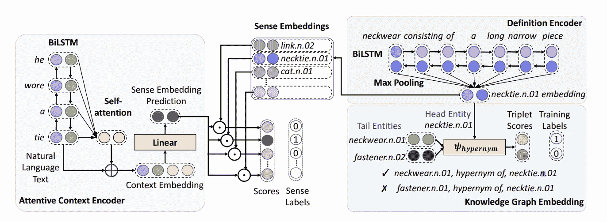
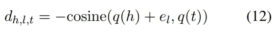
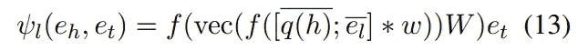
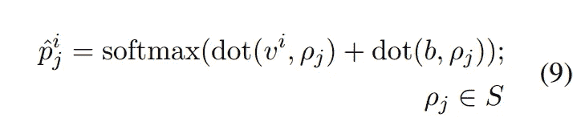
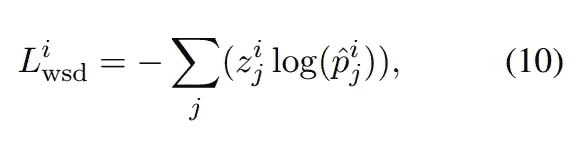
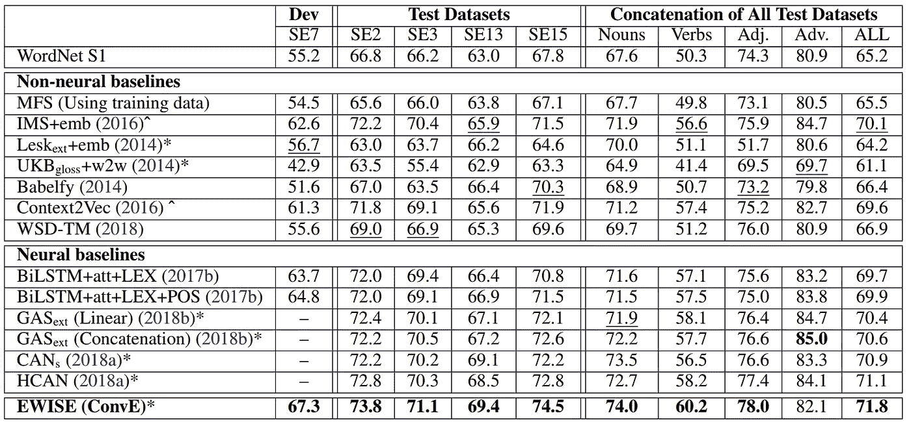
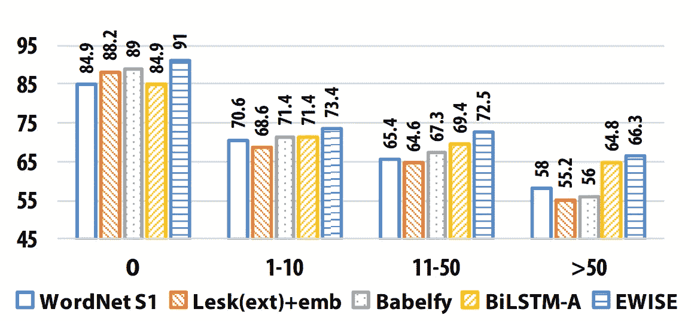

# EWISE:一种新的词义消歧方法

> 原文：<https://medium.com/analytics-vidhya/ewise-a-new-approach-to-word-sense-disambiguation-c57c5dfa3a87?source=collection_archive---------19----------------------->

自然语言处理是一项艰巨的任务，而英语的纯粹复杂性更是雪上加霜。因此，在这个领域，我们解决了许多子任务，以更接近真正自然的解释。一个这样的子任务是词义消歧或简称为 WSD。本文探讨了这个问题，并根据 Kumar，Jat 等人最近在 ACL 2019 中发表的杰出论文描述了一种解决这个问题的新方法:*使用词义定义嵌入进行零炮词义消歧。*

***什么是词义消歧？***

根据使用的上下文，单词具有不同的含义和不同的意图，即使它们是相同的单词。这些“难”字通常被称为同音异义词。举以下例子:

> 马拉松之后，他感觉不太舒服。
> 
> 农夫从井里抓起水桶。

两个句子都使用了“嗯”这个词，但在每个场景中，它们显然有不同的含义。

词义消歧(WSD)表示基于上下文线索将单词与其正确定义相关联的任务。

***相关工作—有哪些方法可以解决这个问题？***

WSD 是一个经过充分探索的问题，并且存在许多解决它的方法。

第一种是监督和半监督方法，将定义视为离散的标签。一种这样的监督方法是 [context2vec](https://www.aclweb.org/anthology/K16-1006/) ，它也使用双向 LSTMs 来学习通用上下文嵌入函数。这种模型和其他监督模型对于不包括在训练数据集中的单词不能很好地工作，因此看不见的和不常用的单词不能被破译。

另一种方法是基于无监督的知识。一种这样的无监督方法是[增强型 Lesk WSD](https://www.aclweb.org/anthology/C14-1151/) ，它使用 WordNet 通过单词相似度函数来确定单词上下文和每个定义之间的共享单词数。然而，最大重叠试探法的表现不如监督方法。

***相关工作—我们可以利用哪些相关方法来改进这些现有解决方案？***

WordNet 是一个大型英语词典数据库，不仅包含单词、词性标签和同义词的各种定义，还包含不同单词之间的语义关系，其格式便于机器利用和使用。

为了克服不能获得罕见和未见过的词的嵌入的问题，我们需要找到一种方法来预测这些罕见词与常见词的嵌入。论文[学习动态计算单词嵌入](https://arxiv.org/abs/1706.00286)通过 LSTM 网络和访问字典数据帮助我们做到了这一点。

使用上述方法，我们可以创建定义嵌入，但是在 WSD 中，我们仍然需要有效地将输入句子连接到嵌入输出。我们可以利用[中的工作，使用输出嵌入来改进语言模型](https://www.aclweb.org/anthology/E17-2025/)，并使用 word2vec 表单的更新规则来有效地将输入和输出模型的权重绑定在一起。

# EWISE:包含意义嵌入的扩展 WSD

EWISE 是解决 WSD 的最新方法，克服了上述所有缺点。这种方法将连续的意义嵌入空间作为目标而不是离散的来学习，从而实现了广义的零触发学习。换句话说， **EWISE 能够识别可见和不可见单词的定义映射。**

## 体系结构

威斯建筑

上面的架构图有三个主要阶段:注意力上下文编码、定义编码和知识图嵌入。

*EWISE 中的定义编码*获取一个定义，并利用现有的句子表示模型(如 InferSent 和 USE)来创建该定义的压缩表示。然而，这些基线编码不足以推广到新单词。

WordNet 的*知识图*用于训练编码器的参数。该图包含意义的节点和这些意义之间的关系。这些定义是在具有多达 18 种连接它们的关系的意义集上训练出来的。

使用两种方法中的一种来计算边之间的分数， *TransE 和 ConvE* ，由下面的等式描述:

修正 TransE 方程计算知识图中两种意义嵌入的不相似性。q(*):通过定义编码器的意义嵌入，h:头节点知识图，t:知识图的尾节点，e_l:待学习的链接分数

修改了 ConvE 方程，对知识图中两个意义嵌入之间的联系进行评分。q(*):通过定义编码器的 sense 嵌入，h:头节点，t:尾节点，e_l:待学习的链接分数，e_t:待学习的尾分数，w: 2D 卷积滤波器，W:线性变换(即全连接层)，f:校正线性单元(ReLU)，vec:矢量化版本，x_bar: 2D 整形

现在，不同的感觉被连接起来，它们的边缘被评分，这些可以被扩展以创建一个更大的和本质上连续的感觉嵌入空间。

注意上面的两个阶段还没有涉及到实际的输入句子。这就是这种方法如此强大的原因。意义嵌入的训练完全独立于句子输入，因此即使任意输入也能够被分类。

注意力上下文编码是输入发挥作用的地方。该编码器通过利用双向 LSTM 为输入生成上下文相关的表示。单词被表示为句子的向前和向后版本的连接。例如:

> 输入句子:他打了一条领带
> 
> 向后:铁甲穿何
> 
> BiLSTM 表示:[何，铁]；[穿了，a]；【甲，穿了】；[铁，何]

这种表示之后是自我关注层，在[瓦斯瓦尼等人(2017](https://arxiv.org/pdf/1706.03762.pdf) )中有更详细的描述，以及一个完全连接的层，以投射到意义嵌入的空间。

在训练期间，该表示乘以在库存中的每个意义嵌入，并且选择具有最高分数的一个作为标签。因为这是一个监督设置，我们可以使用平均交叉熵损失来调整模型，以选择正确的映射。

全连接层之后的 Softmax 层计算有义嵌入概率。v_i:给定输入单词的意义嵌入；b:偏向；学生:感知库存

一批中所有标注单词的交叉熵损失函数最小化。z_ij:库存 S 中目标(即正确)感觉的一个热表示

## 结果

该模型的评估是基于它与其他先进方法的比较，以及它对罕见和未见过的词进行概括的能力。

将 EWISE 在不同测试数据集上的整体和部分语音 F1 分数与其他最新模型进行比较

EWISE 在所有类别和所有词性标签上击败了所有其他模型，除了副词，其 F1 得分仅次于 GAS。

基于训练集中标注词出现频率的不同模型 F1 得分比较

频率=0 的最左侧类别表示 EWISE 的零炮学习能力。换句话说，对于以前从未见过的单词，它可以获得 91 分的 F1 分，明显高于其对手。它在所有频率桶中的表现也是最好的，对于罕见的单词也是如此。这证明了该模型对未见过的单词的词义进行分类的能力。

## 结论

总之，EWISE 是一种解决 WSD 问题的新方法，它利用词义嵌入和输入的独立训练来将其可用性扩展到看不见的和罕见的单词。EWISE 始终优于所有其他最新的 WSD 模型，并证明该模型具有零触发学习能力。

【https://www.aclweb.org/anthology/P19-1568/】纸 : [纸](https://www.aclweb.org/anthology/P19-1568/)

**代码** : [https://github.com/malllabiisc/EWISE](https://github.com/malllabiisc/EWISE)