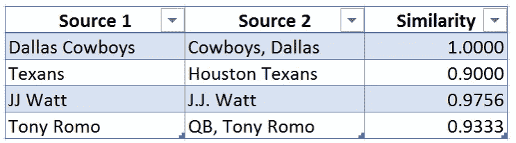
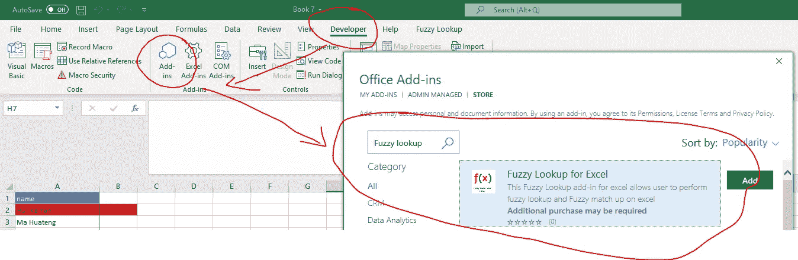
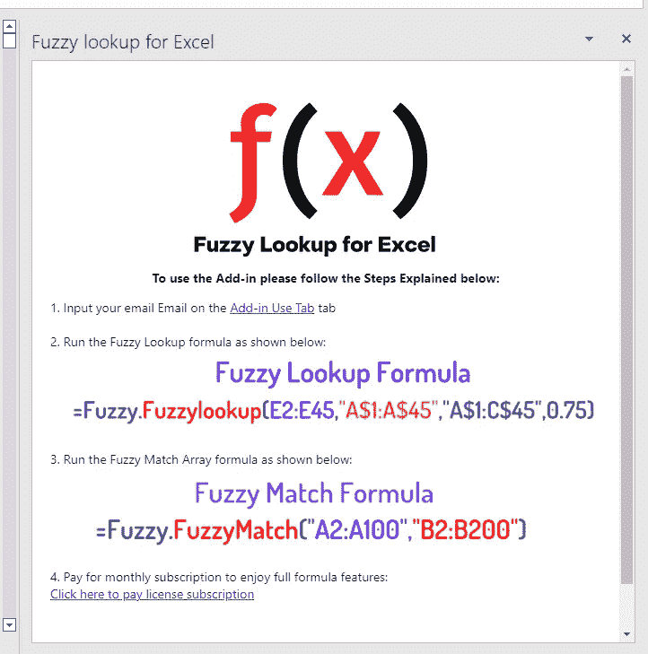
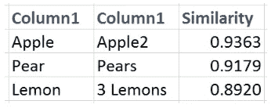

# Excel 近似匹配-模糊匹配

> 原文：<https://medium.com/analytics-vidhya/excel-approximate-match-fuzzy-match-up-7cf5abda2764?source=collection_archive---------5----------------------->

## [深入分析。](/@benabrin/excel-approximate-match-fuzzy-match-up-7cf5abda2764?source=friends_link&sk=d111cd27d29168f4ec9844d979556641)

## **用于匹配姓名或相似文本的强大 excel 工具。**

[点击此处查看【excel 模糊查找](https://appsource.microsoft.com/en-us/product/office/WA200004933?src=office&corrid=8b64d25b-56d9-05ec-1c43-4e86f4e7abbb&omexanonuid=&referralurl=&ClientSessionId=8b9653ab-6c78-45da-a06c-59525216c203)

你有没有尝试过在 Excel 中使用 VLOOKUP 却屡屡受挫的经历

当它不返回任何匹配时。由微软开发并免费提供的模糊查找是一个 Excel 附件，它接受输入，搜索它能找到的最佳匹配，并返回最佳匹配以及相似性评级。

模糊查找利用高级数学来计算它找到的内容与您的搜索条目匹配的概率，这意味着该工具即使在字符(数字、字母、标点符号)不完全匹配时也能工作。可以把它看作是 VLOOKUP 的一个更强大的版本，它更灵活，甚至更容易使用。

**使用*模糊匹配数组公式*** 比较两列文本的相似度

模糊匹配数组公式允许快速比较两列中的文本

模糊匹配数组让我能够快速理解杂乱无章的客户数据，并得出结论，否则可能需要几个小时才能发现。为了说明模糊查找的主要功能，下面是该工具识别为相似的几个示例(相似性得分从 0 到 1，1 表示可能的最高相似性):

您可以看到左边的每个条目在技术上与右边的相应条目不同，但是模糊查找认识到它们有可能真正表示相同的东西。模糊查找返回每一对的概率分数，这意味着您可以快速整理、编辑和比较类似这样的列表。

如果您有一个没有以一致的方式输入的名称的大列表，或者如果一些条目是缩写的而另一些不是，这个工具是有用的。

# 使用模糊查找查找相似文本

*注意:这不是对模糊查找工具设置的“深入探究”。这是一个使用该工具在两个列表之间进行简单比较的快速入门指南。*

1.  通过访问此处的[链接安装最新版本的模糊查找。或者，您也可以通过单击 excel Developer 选项卡，然后单击加载项，然后在 office 加载项上搜索模糊查找来进行搜索](https://appsource.microsoft.com/en-us/product/office/WA200004933?src=office&corrid=0cfd1681-bbcf-7341-06c2-d6a7751e67ab&omexanonuid=&referralurl=&ClientSessionId=689d4c89-164e-47c6-a266-1466a0d6075f)

2.确认任务栏上有模糊查找插件，然后单击它

3.按照以下步骤使用加载项

6.选择您希望模糊查找使用的相似性阈值(我发现 0.75 是一个很好的起点):

7.选择一个单元格作为即将创建的模糊查找表的插入点，然后在模糊查找工具上选择“执行”以完成比较并检查结果。

**其他提示和用途**

1.  请始终使用您希望将数据附加到表格中的 excel 工作表。
2.  如果您正在处理一个产生重复结果的大型列表(如果您搜索的多个实体的最佳匹配是相同的，则会发生这种情况)，请对相似性进行排序(从低到高)并将条件格式应用于具有重复项的列。当您遇到重复时，您可以决定是要保留这些结果，还是删除它们并手动搜索更好的匹配。
3.  模糊查找对于大型列表非常有用，对于难以阅读的条目(如长串随机文本或数字)是一个完美的选择。