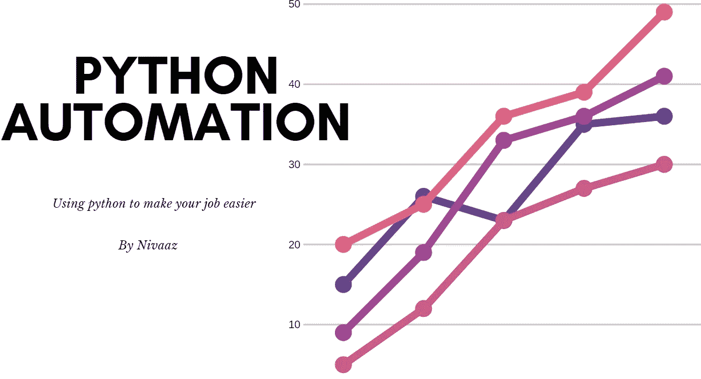

# 使用 Python 实现 Excel 自动化

> 原文：<https://medium.com/analytics-vidhya/excel-automation-using-python-de70cf253a1a?source=collection_archive---------1----------------------->

当我暑假完成电气工程实习的时候。我的同事问我是否知道如何在 Excel 中为他编写宏或重命名一些 *(597)* 文档。

***我之前真的编过宏吗？*** *没有，不过我在 VBA 试过一次。结局不太好。*

***我之前用 python 编程过吗？没有，但我很确定我知道如何把它当作计算器使用。***