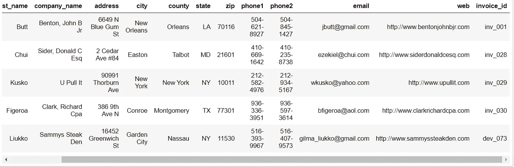

# 如何做一个熊猫数据框列的 Excel 包含？

> 原文：<https://medium.com/analytics-vidhya/excel-contains-on-pandas-dataframe-column-303f3522d925?source=collection_archive---------11----------------------->

## 这篇文章将帮助你使用 Str 来检查 Pandas Dataframe 列中的值列表。包含熊猫的概念。

Contains 是一个 excel 函数，当使用某个值调用该函数时，会返回该值出现的情况。使用 python 的 pandas 库也可以达到同样的效果，但是一次只能有一个值。在这篇博客中，我将展示如何为多个值实现这一点。


锡德·巴拉钱德朗在 [Unsplash](https://unsplash.com?utm_source=medium&utm_medium=referral) 上拍摄的照片

熊猫是自然界、python 开发者和数据科学家遇到的下一个最好的东西。因此，在一个晴朗的夏日午后，我接到一个任务，检查 Dataframe 列中是否存在 multiple，然后将所有结果连接到一个 Dataframe 中，然后生成结果 excel book。

然后我开始了对代码的探索。


照片由[雅各布·欧文斯](https://unsplash.com/@jakobowens1?utm_source=medium&utm_medium=referral)在 [Unsplash](https://unsplash.com?utm_source=medium&utm_medium=referral) 上拍摄

在 100 片铬之后。我决定自己编码。因此，与每个人分享，以帮助他们节省大量的时间和内存。就像办公室的安迪说的**“金枪鱼我是表演者表演我应该”**
所以**“金枪鱼我是开发者代码我应该”**


# **导入库和 Excel 表。**

您可以从[这里](https://www.briandunning.com/sample-data/)下载样本数据集。

请在 CSV 中创建一个名为“invoice_id”的列。加载之前，使用一些样本创建它。我的发票列格式是“inv_001 到 inv_500”，中间有一些值，比如以格式“dev_Number”、“sau_Number”、“shu_Number”开头。

```
import pandas as pd
masterdata_df=pd.read_csv(r"PATH OF YOUR EXCEL\us-500\us-500.csv")
masterdata_df.shape

Out:(500, 13)
```

## 让我给你展示一下。isin 和 contains。

**包含在熊猫身上**

无论“inv”出现在 invoice_id 列的什么地方，它都告诉我们相同的行数。在我们的例子中，它发生在 360 行。

```
masterdata_df[masterdata_df['invoice_id'].str.contains('inv')].shape
Out:(360, 13)
```

**是大熊猫的故乡。**

它与 invoice_id 列中的“inv_001”完全匹配。

```
masterdata_df[masterdata_df[‘invoice_id’].isin([‘inv_001’])].shape
Out:(1, 13)
```

你也可能会想我可以传递多个值吗答案是**可以**

```
masterdata_df[masterdata_df['invoice_id'].isin(['inv_001','dev_073','dev_074'])].shape
OUT:(3, 13)
```

## 但是你的脑海中可能会再次出现一个问题…我能在包含……的情况下做同样的事情吗？答案是否定的。

```
masterdata_df[masterdata_df['invoice_id'].str.contains('inv','dev_073','dev_074')].shape
```

尝试一下，您将得到一个错误，如**类型错误:&不支持的操作数类型:**的‘str’和‘int’

# **所以现在我们来解决这个问题**

**创建过滤器列表**

```
contains_filter=['inv_001','inv_028','inv_029','inv_030','dev_073','dev_074','dev_075','sau_014','sau_015','shu_011','shu_012','shu_013']I have added some extra rows starting with dev,sau and shu.
```

**让我们检查列表的长度，并编写一个小的 for 循环。**

```
len(contains_filter)
Out:12for i in range(len(contains_filter)):
    print(contains_filter[i])
Out:inv_001
inv_028
inv_029
inv_030
dev_073
dev_074
dev_075
sau_014
sau_015
shu_011
shu_012
shu_013
```

**让我们创建一个空的数据帧**

```
final_df = pd.DataFrame()
df1 = pd.DataFrame()
```


照片由[卢卡·布拉沃](https://unsplash.com/@lucabravo?utm_source=medium&utm_medium=referral)在 [Unsplash](https://unsplash.com?utm_source=medium&utm_medium=referral) 上拍摄

**现在让我们编写最后的循环，并将结果追加到最终的数据帧中。**

```
for i in range(len(contains_filter)):
                     df1 =masterdata_df[masterdata_df['invoice_id'].
                       str.contains(contains_filter[i])]
                     final_df=final_df.append(df1,ignore_index=True)
```

我很抱歉缩进(仍在学习 TDS ),但这两行都将成为循环。

让我们检查最终数据帧的形状或最终结果集中的行数。

```
final_df.shape
Out:final_df.shape
```

**样本结果**

```
final_df.head()
```



结果的示例截图。

# **结论**

我们能够在熊猫专栏上做一个多重包含。希望这段代码能帮助你，节省大量的时间。

快乐编码。


[米 PHAM](https://unsplash.com/@phammi?utm_source=medium&utm_medium=referral) 在 [Unsplash](https://unsplash.com?utm_source=medium&utm_medium=referral) 上拍照