# 适用于所有人的 Excel 函数、提示和快捷方式

> 原文：<https://medium.com/analytics-vidhya/excel-functions-tips-and-shortcuts-for-everyone-f2c01ec3bd72?source=collection_archive---------14----------------------->

# 概观

了解如何使用 VLOOKUP、索引和匹配、清理和修剪、文本转列功能，并探索数据透视表，包括其众多的数据报告功能。此外，还讨论了错误检测、单元格引用和通配符使用的技巧。最后，我分享了一些你优化使用 Microsoft Excel 的快捷方式。

# 纵向查找函数

VLOOKUP 和 HLOOKUP 都来自同一个查找函数家族，这些函数可以用于根据特定值对表中的数据进行分类和提取。VLOOKUP 和 HLOOKUP 的语法相似，唯一的区别是 V 代表垂直方向，只能用于垂直方向的数据分类，而 H 代表水平方向，只能用于水平方向的数据分类。VLOOKUP 语法和参数解释如下:

> =VLOOKUP(查找值，查找表，列索引，[范围查找])

***lookup_value:*** 要搜索的值。

***lookup _ table****:*用于查找 lookup_value 的数组/数据表。**注意**:查找值应该总是在 lookup_tabbe 中的第一列，并按字母或数字排序，这样 VLOOKUP 才能正常工作。

***col _ index****:*必须返回匹配值的 *lookup_table* 中的列号。第一列是 1。

***range_lookup*** (可选) *:* 输入 FALSE 进行**精确匹配查找**。为**范围查找/近似匹配**输入 TRUE。如果省略此参数，则默认值为 TRUE。

查找功能可用于选择与查找值最接近的值，称为**范围查找**，或选择查找值的精确匹配，称为**精确匹配查找。**

例如，我们可以使用如下所示的范围查找，根据身高(矮、中等和高)对非洲足球运动员进行分类。

> =VLOOKUP(C2，港币 6 元:港币 9.2 元，TRUE)

值 2(第三个参数)告诉 VLOOKUP 函数从黄色表的第二列(备注)返回同一行中的值。

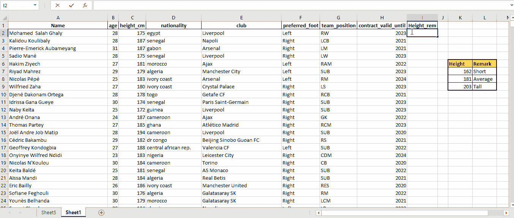

精确查找可用于查找查找值的精确匹配，在这种情况下，我们将查找具有唯一 ID: 550 的玩家的姓名。

> =VLOOKUP(550，A1:F1236，2，FALSE)

值 2(第三个参数)告诉 VLOOKUP 函数从表的第二列(名称)返回同一行中的值。

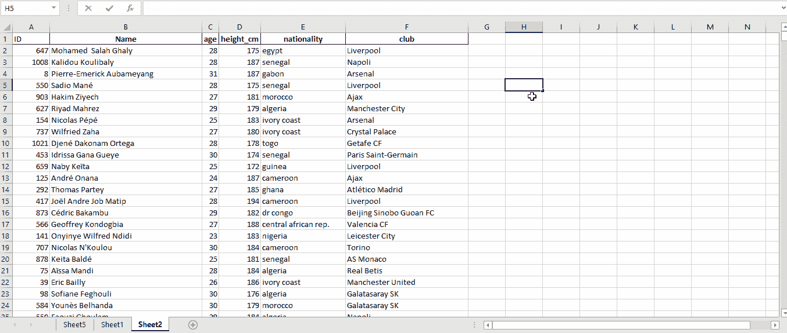

# 索引和匹配

INDEX 函数根据列号和行号返回表格中某个单元格的值，而 MATCH 函数返回表格中某个单元格的行号或列号。当索引和匹配函数结合使用时，它们可以基于水平和垂直条件在表上查找值。简单地说，它们就像 VLOOKUP 和 HLOOKUP 的组合。

基本的**索引**语法如下:

> =INDEX(数组，行数，[列数])

*数组:*这通常是一系列单元格或表格。

*row_num:* 值的行号。如果数组包含一行，则这是可选的。

*col_num:* 值的列号。如果数组包含一列，则这是可选的。

例如，我们可以确定第 6 行中玩家的姓名。

> =索引(A1:A22，6)

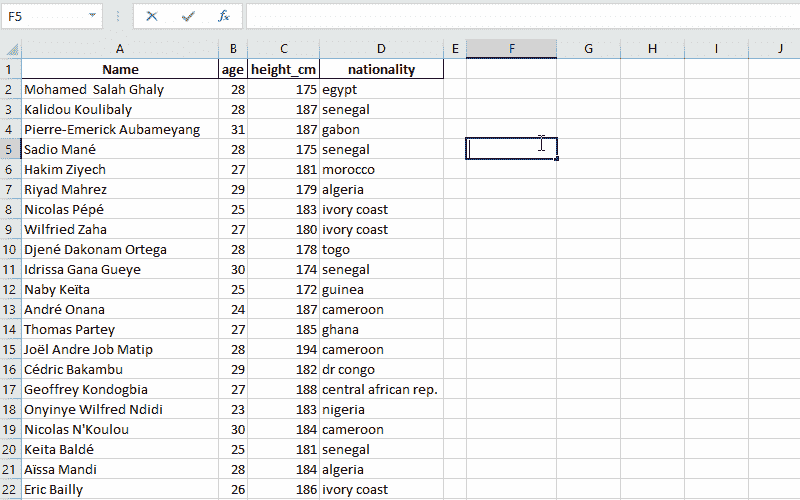

**匹配**的语法如下:

> =MATCH(查找值，查找范围，[匹配类型])

*lookup_value* :查找数组中要查找的值。

*lookup_range:* 被搜索的单元格/表格的范围。

*匹配类型:* **0** 为精确匹配， **1** 为小于匹配类型， **-1** 为大于匹配类型。这可以省略，默认选项是小于匹配类型。

匹配函数的一个例子是定位“维尔弗雷德·萨哈”在表上的行位置，在这种情况下， *lookup_value* 是“维尔弗雷德·萨哈”。

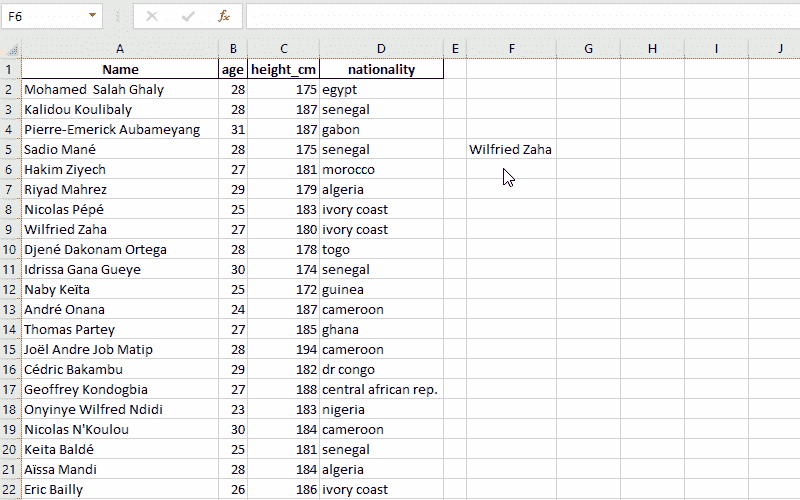

总之，INDEX 需要数字位置来查找表上的值，MATCH 帮助找到这些位置。

索引和匹配的结合使用可以用来找到一个球员的国籍。

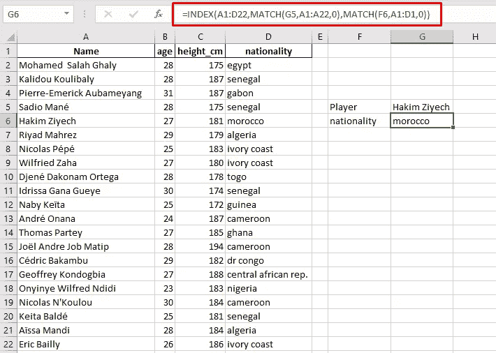

> =INDEX(A1:D22，MATCH(G5，A1:A22，0)，MATCH(F6，A1:D1，0))

第一个匹配公式返回 6 作为索引的行号，第二个匹配公式返回 4 作为索引的列号。因此，该索引返回“摩洛哥”作为“哈基姆·齐耶什”的国籍。

# 清洁+修剪

Trim 和 clean 函数是 Excel 中有趣的清理函数，尤其是结合使用时。

Clean 函数删除换行符和其他不可打印的字符。CLEAN()的应用如下所示:

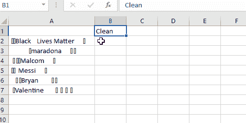

清洁()

而 Trim 功能会删除单词之间的双空格/多余空格，但不会删除单空格。TRIM()的应用如下所示:

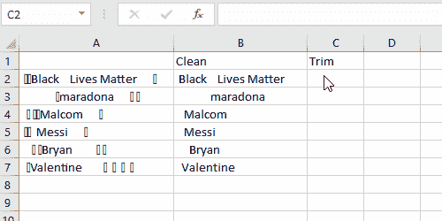

修剪()

修剪和清洁功能可以如下图所示进行组合:

> =修剪(清洁(A2))

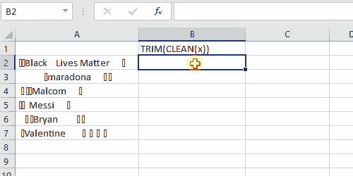

修剪(清洁(x))

# 文字分列

这个函数用于根据分隔符将一个单元格中的文本拆分成几列，它还可以用来清理数据，因为我们经常遇到的大多数数据集都处于混乱状态。

例如，我们可以使用这个函数将足球运动员的名字分成*名* & *姓。*

步骤 1:突出显示您想要拆分/解析的列

第二步:单击功能区中的“数据”选项卡，然后在“数据工具”组中查找并单击“文本到列”。然后会弹出“将文本转换为列向导”。

第 3 步:对于向导的第一步，选择“分隔的”> >单击[下一步]。

步骤 4:分隔符是一个符号或空格，用于分隔您希望拆分的数据。例如，如果您的单元格显示“阿德巴约，拉赫曼”，您将选择“逗号”作为分隔符。在本例中，分隔符是“空格”。选择数据中的分隔符。

步骤 5:选中“将连续分隔符视为一个”旁边的框。>>点击【下一步】。

步骤 6:在“列数据格式”下，选择“常规”

第 7 步:点击“目的地”文本框最右边的箭头/电子表格图标。选择要粘贴分割数据的位置，然后按[Enter]。

第八步:点击【完成】

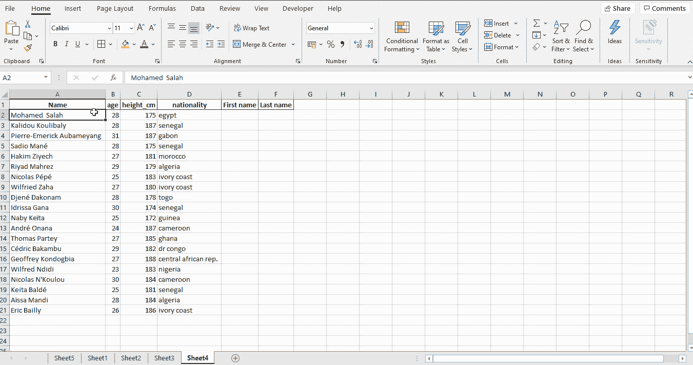

# 数据透视表

我相信数据透视表是 Excel 中分析的核心，也是在 Excel 上进行 swift 分析的最足智多谋的工具之一，它的深入分析和灵活性简直令人惊叹。此外，我的报告和总结工具不能在这里解释它的所有功能(也许另一篇文章)，所以，我将简单地解释如何创建一个数据透视表，你可以探索它的有趣功能。

> “数据透视表是 Excel 中分析的核心”

步骤 1:选择表格上的任意位置

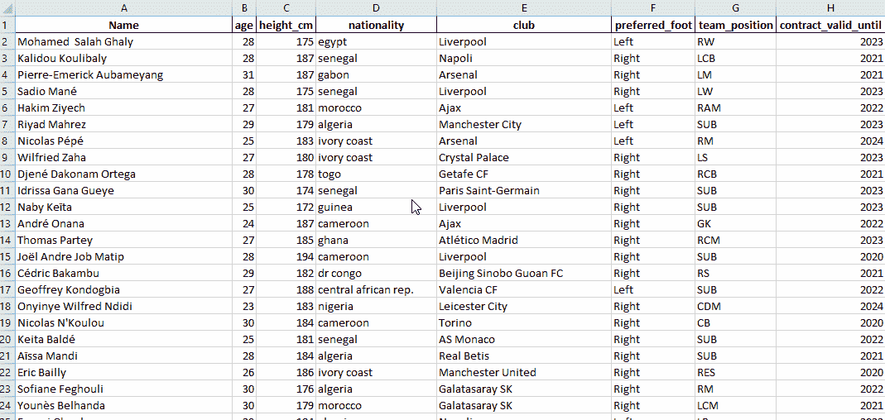

步骤 2:创建数据透视表

数据透视表位于 excel 功能区上。从**插入>到>数据透视表。**

接下来，我们创建数据透视表。在“创建数据透视表”窗口中，您会注意到表格的整个范围被自动选中。

还可以灵活地在现有工作表或新工作表中形成数据透视表。在这种情况下，我们在一个新的工作表中形成它:

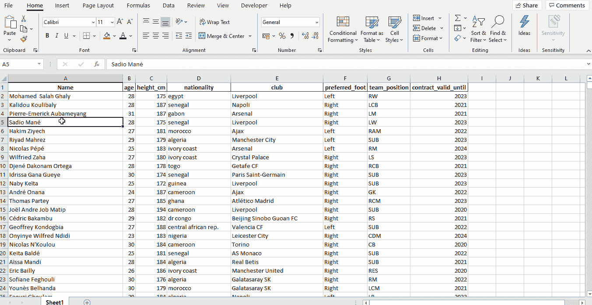

步骤 3:浏览数据透视表字段

**解析 A:** 探究非洲足球运动员的年龄分布。

将“**年龄”**特征拖放到*行*和*值*部分，然后通过“**值字段设置”**编辑汇总为“计数”，如下图所示。

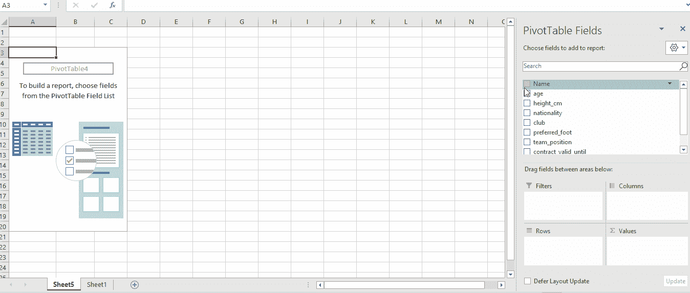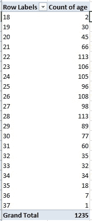

年龄分布

**分析 B:** 根据非洲球员目前所在的足球俱乐部对他们进行分组，并根据他们喜欢的足球进行筛选。

将"**俱乐部"**和"**名称**"特征拖至*行*部分

将“ **preferred_foot** 特征拖到*过滤器*部分

如下图所示，在首选脚之间切换。

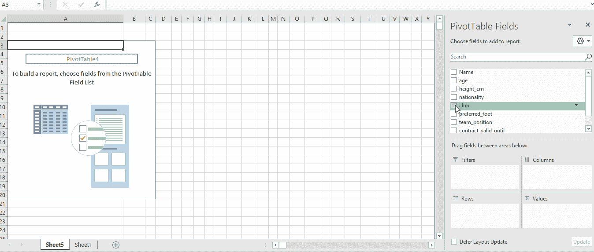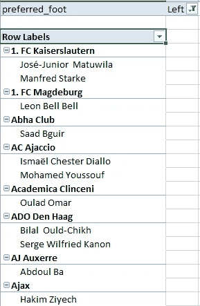

# 技巧

下表显示了 Microsoft excel 中最常见错误的解释。另一个未包括的错误是“N/A”错误，这通常是在执行查找函数时常见的，它意味着查找不正确或找不到。

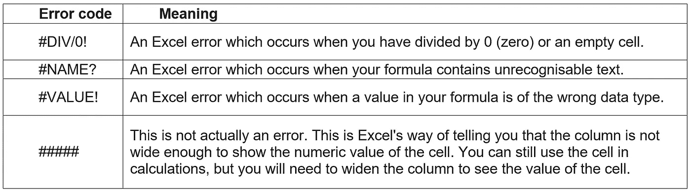

来源:Coursera

**切换单元格引用**

**F4** :在编辑栏中键入单元格引用后，立即使用 **F4** 来更改单元格引用的类型。例如，相对引用 **B4** ，如果你按下 **F4** 一次，你将得到绝对引用 **$B$4** ，再次按下它将得到 **B$4** (行绝对，列相对)，再次得到 **$B4** (列绝对，行相对)，再次按下它将使你回到初始相对引用 **B4** 。

**使用通配符**

Excel 中有 3 种常用的通配符，但只有 2 种被广泛使用。需要注意的是，通配符只适用于文本。两个通配符是代表零个或多个字符的星号(*)和问号(？)表示任何单个字符。比如，“ ***P？t"*** 会匹配 ***坑******锅******放******宠物*** (以及 ***Pnt*** 等不正确的词)但不会匹配 ***怜惜*** 。星号( ***** )将匹配任意数量的字母。例如，我们可以使用 **=COUNTIFS(Players_name，" B*")** 来计算名字以" B "开头的球员，比如**本杰明·泰特赫**和**伯纳德·凯尔**。

# 快捷指令

**Ctrl+T** :创建表格

**选项卡:**接受 Excel 在提示中建议的函数。

**F2:** 在编辑模式下显示公式，并显示公式中所有参数的颜色编码的引用单元格。

**F4:** 在相对和绝对参照之间切换。

**F9:** 重新计算所有打开的工作簿中的公式。

**Shift+F9:** 仅重新计算活动工作表中的公式。

**F5:** 显示转到对话框

**Shift + CTRL +！**(数字)或 **+ $** (货币)或 **+ %** (百分比) **:** 改变单元格格式

**Shift + F2:** 插入/编辑注释

**CTRL + B (CMD + B)** :将选择更改为**粗体**文本

**CTRL+Z | CMD + Z:** 撤销

**CTRL +Y | CMD+Y:** 重做

**CTRL+；| CMD+；—** 今天的日期

**Ctrl+A (CMD+A)** :全选

**Ctrl+。** : 在桌角间移动

**Shift + Space:** 选择整行

**CTRL + Space:** 选择整列

**CTRL + Tab | CMD + ~:** 转到下一个工作簿

**CTRL + A | CMD + A:** 选择整个工作表(或连续数据集)

**CTRL+N | CMD+N:** 创建新工作簿或新文件

**CTRL+O | CMD+O:** 打开对话框，选择一个已有的文件(工作簿)

**CTRL+W | CMD+W:** 关闭当前工作簿

**CTRL+S | CMD+S:** 快速保存文件

**CTRL + ~ (CTRL + `):** 显示工作表中的公式

**CTRL + PgUp (CMD + PgUp):** 转到上一页。

**CTRL + PgDn (CMD + PgDn):** 转到下一张。

**CTRL +箭头键(CMD+箭头键):**转到一行、一列中的第一个/最后一个单元格。

**CTRL + SHIFT +箭头键**:增加选择到最后一个有数据的单元格

**CTRL+Home (CMD+Home):** 选择第一个非空白单元格。

**CTRL + End (CMD+End):** 转到最后一个非空白单元格。

**CTRL+SHIFT+L(CMD+SHIFT+F):**添加或删除过滤器

**CTRL + X | CMD + X** :剪切选择

**CTRL + C | CMD + C** :复制选择

**CTRL + V | CMD + V** :粘贴数据(来自之前的剪切/复制动作)

**CTRL + F2** :打开打印预览窗口

**CTRL + F3 | CMD + F3:** 命名单元格或单元格区域

**Ctrl+Shift+F3 | Cmd+Shift+F3**:从选择中创建名称。如果要一次创建多个命名区域，可以使用“从选区创建名称”工具。首先，选择范围，包括标题，然后激活工具。您可以选择名称的来源，通常是顶行或左列，但也可以使用底行或右列。

希望你学到了新的东西，如果你有任何问题，请随时在 [LinkedIn](https://www.linkedin.com/in/salamadekunleadedokun) 上联系我。

谢谢大家！