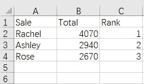

# Excel 分组和聚合

> 原文：<https://medium.com/analytics-vidhya/excel-grouping-aggregation-a5b1f2384943?source=collection_archive---------16----------------------->

# 一、普通全除法

下面的 2019 年产品销售表记录了每个销售人员的某个产品的销售明细。任务是按销售额列出前三名销售人员。

下面是 Excel 数据:

预期结果:

Excel 数据表在处理这项任务时很有用，但很难使用。它很有用，因为该特性可以设法获取合计，对它们进行排序，找到前三名销售人员，并复制相关记录作为期望的结果。但是当原始数据量很大或者要计算的秩很多时，手工处理所有操作是不方便的。

然而，SPL 遵循直觉思维，以循序渐进的方式处理这项任务:

脚本执行后，只需要将结果粘贴到 Excel 中，就可以得到预期的表格。

SPL 脚本通过剪贴板与 Excel 交互。它将待分析的数据复制并粘贴到剪贴板，在 esProc designer 中编辑并执行脚本，然后将结果粘贴到 Excel。

# II 与“其他记录”合并分组

有时候是我们关注的原始详细数据中的一部分，我们只是汇总了其他所有的数据。基于上例中的 Excel 数据，我们想计算每种水果的总销售额，并汇总所有蔬菜的销售数量。

预期结果:

分组基础太具体，无法使用数据透视表处理。你必须用 VBA 写一个宏来使用这个程序根据特定的值对数据进行分组。很复杂也很难。

SPL 使用枚举值处理这种类型的分组:

然后将剪贴板内容传递到 Excel 中，以获得所需的结果。

# III 通过提供缺失值进行对齐分组

数据透视表不会为分组基础中缺少的值创建分组。当我们使用数据透视表按日期对几个月没有销售记录的销售表进行分组时，我们会得到以下结果:

由于某些月份没有相应的数据，因此没有相应的组。结果是没有规律的。但是我们想要的是这个:

数据透视表不能做到这一点。在 VBA 也很难做到这一点。

SPL 通过定义分组基础来处理这种类型的:

# IV 按间隔分组

下面是学生成绩表。评分尺度是这样的:≤60 为 a C，> 60 & < 90 为 B，≥90 为 a，任务是统计各层次的学生。

预期结果:

定义分数区间后，您可以使用 pseg 函数来划分学生分数，然后对每个组进行计数。

SPL 剧本:

# 五.按重叠条件分组

下表列出了 2019 年部分国家的 GDP。任务是计算发达国家、发展中国家和金砖国家的平均 GDP。

2019 年部分国家 GDP 数字(单位:十亿美元):

预期结果:

发展中国家和金砖国家有着共同的价值观。为了处理具有重叠条件的分组任务，SPL 提供了枚举功能，以灵活的方式定义枚举条件。

SPL 剧本:

