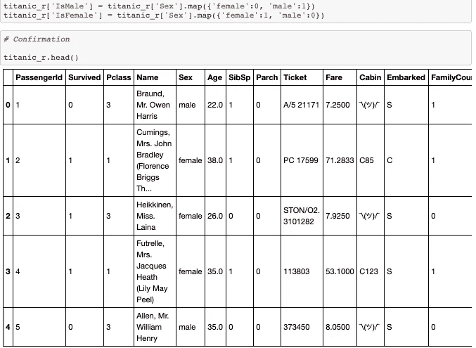

# Python 中的 Excel

> 原文：<https://medium.com/analytics-vidhya/excel-in-python-591a3cfe8094?source=collection_archive---------8----------------------->

我最近一头扎进了数据科学的世界。没有太多编程语言的经验，学习 Python 本身就是一个挑战。事实上，我对学习 Python 的恐惧实际上推迟了我对数据科学的探索。即使在开始我的数据科学之旅后，我也花了一段时间才真正接受 Python。毕竟，当我可以在 Excel 中做我需要做的所有事情时，为什么要经历学习 Python 的所有痛苦呢？

我来自一个传统的金融背景，我的大部分工作是通过一个复杂的电子表格网络完成的，其中充满了数据透视表、vlookups、sumifs、条件语句等等。如果你和我有相似的背景，你可能会理解我对电子表格的感情和执着。

从某种意义上说，这是一个合理的观点。毕竟 Excel 有什么做不到的？我去过许多大公司，在这些公司里，与分析、报告和计划相关的大部分繁重工作都是通过我称之为“Excel 生态系统”来完成的。其他功能，如 Hyperion Essbase、SmartView、PowerPivot、PowerBI，以及 Excel 上的许多非常酷的功能，使处理数据和完成工作成为可能。在我的领域中，Excel、Alteryx 和 Tableau 可以说是“神圣的三位一体”。

所以问题依然存在。为什么是 Python？

以下是一些最终说服我在 Python 中出类拔萃的原因！

*   它是业内专家使用的头号编程语言。想象一下去一个外国旅行，那里的人说的语言和你完全不同。你将如何在周围导航？你将如何与其他人交谈？同样的原则也适用于数据科学领域。如果你不会说 Python，你将会迷失，被所有正在发生的伟大的创造力和令人敬畏的事情所遗忘。更不用说，如果你想成为一名数据科学家，几乎所有的雇主都要求对 Python 有一定程度的精通。

*   Python 比 Excel 有更多的灵活性。例如，想象在 Python 和 Excel 中运行一个线性回归模型。在 Python 中，您可以做几乎所有您需要的事情，从 EDA、训练/测试分割、交叉验证、特征工程、缩放、拟合模型、生成预测和创建可视化，所有这些都在几行 Python 代码中完成。虽然在 Excel 中可以做到这一点，但这样做肯定需要更多的时间和精力。

将岭正则化应用于训练/测试分割、缩放和可视化的示例

*   好消息！你仍然可以通过熊猫用 Python 做“类似 Excel”的事情。如果你习惯于用行和列来组织数据，那么熊猫就是你的新朋友！过滤行、转换列、条件语句、分组等很多你在 Excel 中可以做到的功能，你也可以通过熊猫在 Python 中执行同样的操作！

熊猫数据帧示例

*   你听说过 Scikit-Learn 吗？这是一个与 Python 兼容的惊人的机器学习库。只需几行代码，您就可以导入和实例化各种回归(OLS、岭、拉索、Enet)和分类(逻辑、knn、决策树、随机森林、梯度/Ada boost、SVM)模型。此外，您还可以导入数据预处理工具，如 StandardScaler、PolynomialFeatures 和，以及有用的建模工具，如 train_test_split、cross_val_score、GridSearchCV 和 Pipeline。

到目前为止，学习 Python 是一次非常棒的经历。虽然在开发最佳实践和提高代码效率方面，我还有很多需要学习的地方，但是将 Python 作为我可以用来成为更好的数据科学家的工具之一感觉棒极了。

如果您正在考虑开始您的数据科学之旅，但您对 Python 不确定，请相信我，它是一种非常棒的编程语言，您会被仅仅通过尝试就能学到的东西所震惊。无论你有什么犹豫，我希望我能给你一点希望和动力去尝试一下！