# Excel 分组后计算

> 原文：<https://medium.com/analytics-vidhya/excel-post-grouping-calculations-b7525890ce55?source=collection_archive---------43----------------------->

介绍一个简单的代码来处理 Excel 分组的难题

照片由 [Pexels](https://www.pexels.com/photo/person-holding-blue-and-clear-ballpoint-pen-590022/?utm_content=attributionCopyText&utm_medium=referral&utm_source=pexels) 的 [Lukas](https://www.pexels.com/@goumbik?utm_content=attributionCopyText&utm_medium=referral&utm_source=pexels) 拍摄

Excel 支持对数据进行分组和聚合，并提供数据透视表来执行多维分析。但是 Excel 的方法和操作过于简单，无法处理复杂的任务或方便地管理它们。这些任务包括获取每个子集的排名，以及按集合进行过滤和排序。在这篇文章中，我们将给出后分组计算的例子，分析它，并提供 SPL 代码解决方案。SPL(结构化过程语言)是专用数据计算引擎 esProc 使用的语言。用它来处理结构化计算很方便。

# 一、组内排序

下面是学生成绩表。我们想得到每个科目的排名。为此，我们需要首先按主题对记录进行分组，然后对每个组进行排序。

下面是 Excel 数据:

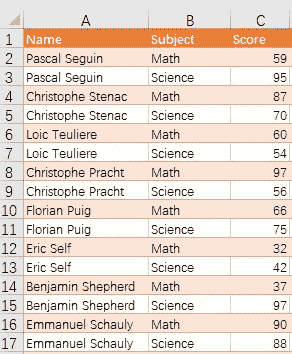

预期结果:

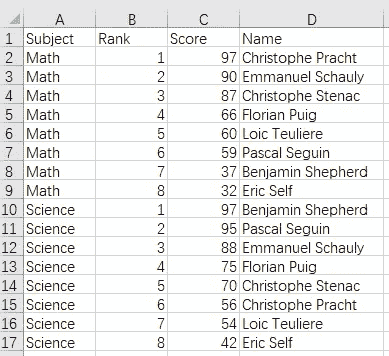

SPL 脚本通过剪贴板与 Excel 交互。我们在 esProc designer 中编辑一个 SPL 脚本，将待分析的 Excel 数据粘贴到剪贴板，执行脚本，然后将结果粘贴到 Excel。

SPL 以一种简单的方式提供逐步编码:

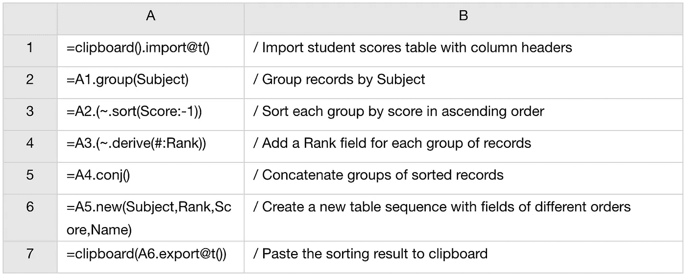

然后，我们只需将结果粘贴到 Excel 中，以获得所需的表格。

要获得仅包含每个科目前 3 分的记录，我们只需使用 top 函数从每个组中获得合格的记录。

预期结果:

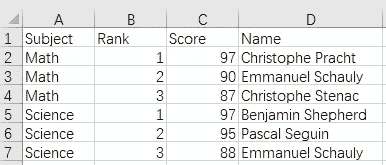

SPL 使用 top 函数获得前 3 名得分的记录:

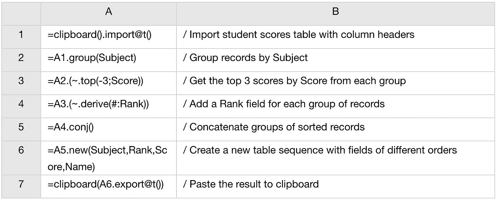

然后，我们只需将结果粘贴到 Excel 中，以获得所需的表格。

# II 按次骨料分类

另一个场景是根据子集合对组进行排序，例如根据学生分数表，根据学生的总分数对学生进行排名。预期结果如下:

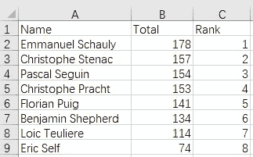

为此，SPL 使用 groups 函数对记录进行分组，同时计算每个组的总数:

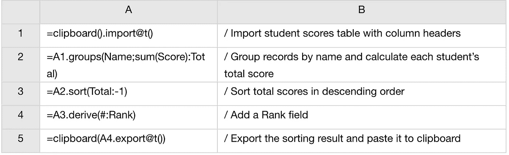

# III 组内过滤

这次要找成绩不理想的同学。由于各科考试的难度不同，以不及格来衡量考试是不合适的。相反，我们需要找到那些每科分数低于平均水平的学生。

预期结果:

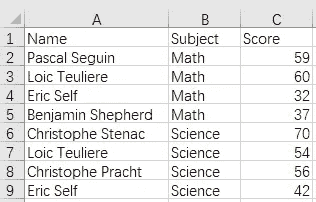

于是我们把记录按科目分组，计算各科平均分，找出成绩低于平均分的学生。

SPL 剧本:

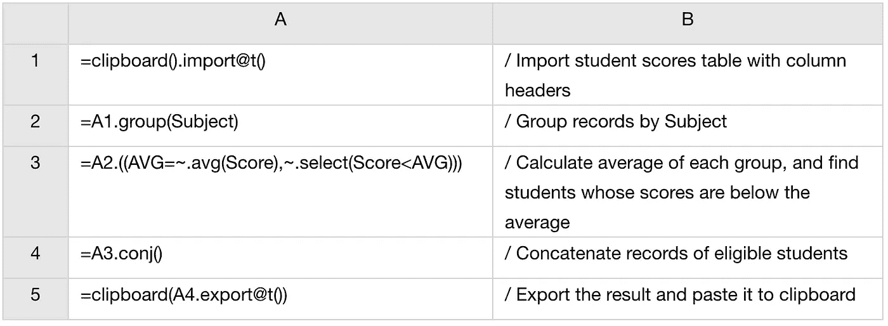

# IV 按子集合过滤

在另一个场景中，我们希望按姓名对记录进行分组，计算每组的总分，并查找总分低于平均总分的学生。

预期结果:

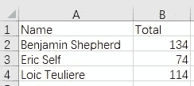

为了执行一个操作，过滤这里的小计，我们使用 groups 函数来分组记录，计算小计，得到平均总数，并找到符合条件的学生。

SPL 剧本:

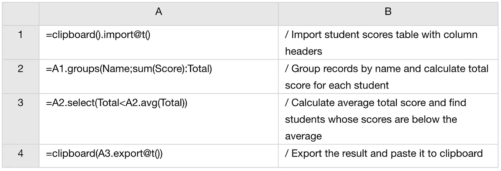

# 五.组内百分比计算

以下 Excel 表格存储了 2019 年部分国家的 GDP 值。任务是按洲对记录进行分组，并计算每个国家占其洲 GDP 的百分比。

以下是 2019 年 GDP 表(单位:十亿美元):

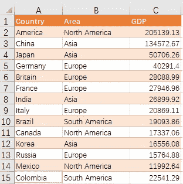

预期结果:

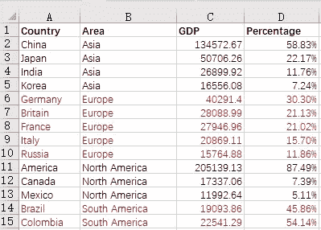

我们可以将记录按区域分组，将各大洲的 GDP 总量相加，然后计算每个国家的 GDP 在每个组中所占的百分比。

SPL 剧本:

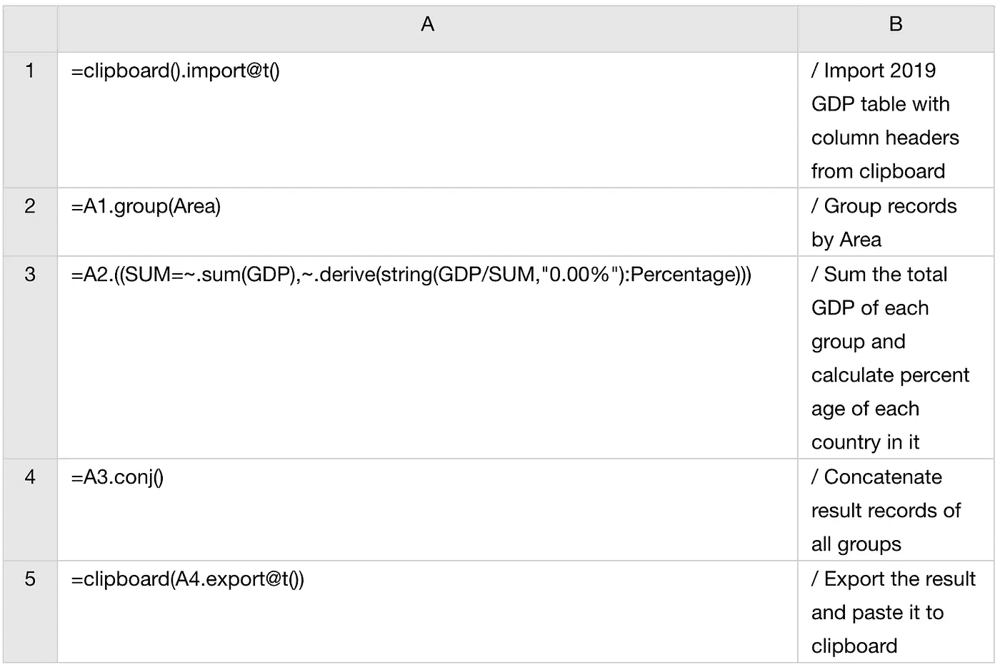

# VI 计算每组的百分比

我们来看看如何计算各大洲的 GDP 占全球总量的百分比。

预期结果:

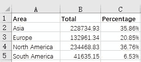

这里我们还使用 groups 函数对记录进行分组，计算每个大洲的 GDP，然后得到每个大洲的 GDP 在全球总量中所占的百分比。

SPL 剧本:

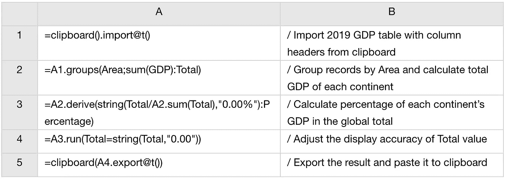