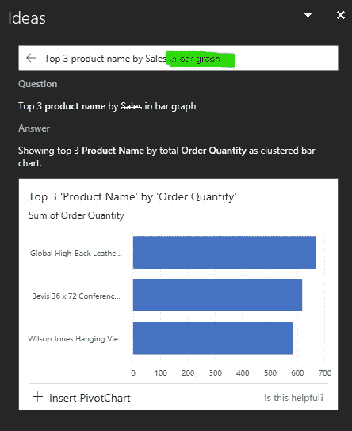

# Excel QuickBytes# 5:见解的想法

> 原文：<https://medium.com/analytics-vidhya/excel-quickbytes-5-ideas-for-insights-686830a0de59?source=collection_archive---------21----------------------->

[*【QuickBytes】*](https://www.vivran.in/my-blog/categories/quickbytes)*是一个系列文章，介绍具有指数收益的简单且易于实现的技术*

微软 365(以前被称为 Office 365)用户比普通的微软 Office 用户有一些额外的优势。有一些很酷的功能和公式只有微软 365 才有。Excel 中的一个这样的功能是 Ideas。

很有 Excel 中机器学习和人工智能的味道。当被调用时，它分析数据表，并以汇总表格和可视化的形式呈现不同的见解。

它以秒为单位展示了一些关于数据表的有趣见解:

只需点击一下，它就可以帮助创建格式良好的视觉效果和数据透视表:

我们可以问一些问题:

并且可以定义输出类型:

我们可以定义字段的范围和默认计算:

取消选中我们希望从分析范围中排除的所有字段。

*Not 值*用于将列声明为类别或文本字段。

# 如何激发创意？

选择数据表中的任意位置>主页>意见

> *提示:将你的数据表转换成 Excel 表格(选择数据> CTRL+T)以获得最佳结果*

试试看。值得你花时间！

另外，请参见:[电源 BI 见解](https://www.vivran.in/post/power-bi-quickbytes-explaining-change-with-insights)、[、 *QuickBytes* 、](https://www.vivran.in/my-blog/categories/quickbytes)

*我写一下*[*MS Excel*](https://www.vivran.in/my-blog/categories/excel)*[*权力查询*](https://www.vivran.in/my-blog/categories/powerquery)*[*权力毕*](https://www.vivran.in/my-blog/categories/powerbi)*[*权力中枢*](https://www.vivran.in/my-blog/categories/power-pivot)*[*DAX*](https://www.vivran.in/my-blog/categories/dax)****

***[@imVivRan](https://twitter.com/imvivran)***