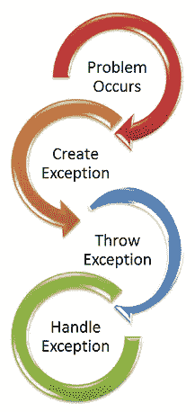

# 异常处理

> 原文：<https://medium.com/analytics-vidhya/exception-handling-3bfdec867bc0?source=collection_archive---------20----------------------->


错误有时是由于没有遵循正确的语言语法，有时是由于其他原因，有时也是用户为了处理错误而产生的。错误处理增加了代码的健壮性，防止了可能导致程序以不受控制的方式退出的潜在故障。

由于没有遵循语言的正确语法而导致的错误被称为语法错误或解析错误。



```
**if** a<3**SyntaxError:** invalid syntax
```

错误也可能发生在运行时，这些被称为异常。例如，当我们想打开某个不存在的文件时(FileNotFoundError)，用零除一个数时(ZeroDivisionError)，等等。由于运行时发生错误，python 创建了一个异常对象。如果处理不当，它会持久化对该错误的回溯，以及一些关于错误发生原因的详细描述。

```
**dir**(__builtins__)
```

# 尝试，除了和最后

Python 有如此多的内置异常，当程序出错时会输出一个错误。当这些错误发生时，它会导致程序停止并把它传递给调用进程，直到它被处理，否则我们的程序将崩溃。

例如，如果函数 school_info 调用函数 teacher_info，后者调用另一个函数 student_info，并且函数 student_info 中出现异常，如果它没有在 student_info 中处理，那么它将传递给 teacher_info，然后传递给 school_info。如果从来没有处理一个错误信息是分裂出来的，我们的程序来了一个突然意外停止。

# 在 Python 中捕获异常

异常可以通过 try except 和 finally block 来处理，这些关键操作会引发保存在 try 子句中的异常，处理异常的代码写在 except 子句中。让我们看一个例子:

```
**import** sys 
**list**=['boy', 'cat',0 ,14.3]
**for** entry **in** **list**:

    **try**:
        **print**("the entry is:" , entry)
        r=1/int(entry)
    except:
        **print**("Hey a " , sys.exc_info() [0],"exception occured")
        **print**("next entry please!!!")
        **print**("***********************************************************************************")
**print**("the recipocal of the entry is ",r)**out**[]: the entry **is**: boyHey a  <**class** '**ValueError**'> **exception** **occured**
**next** **entry** **please**!!!
***********************************************************************************
**the** **entry** **is**: **cat**
**Hey** **a**  <**class** '**ValueError**'> **exception** **occured**
**next** **entry** **please**!!!
***********************************************************************************
**the** **entry** **is**: 0
**Hey** **a**  <**class** '**ZeroDivisionError**'> **exception** **occured**
**next** **entry** **please**!!!
***********************************************************************************
**the** **entry** **is**: 14.3
**the** **recipocal** **of** **the** **entry** **is**  0.07142857142857142
```

# 捕捉特殊异常

在上面提到的例子中，我们没有提到 except 子句中的任何异常，这不是一个很好的编码实践，因为它将捕获所有的异常并以相同的方式处理它们，所以我们可以指定 except 子句将捕获哪个异常。Try 可以有多个 except 子句来对它们进行不同的处理，但是在出现异常的情况下，只会执行一个子句。

```
**import** sys 
list=['boy', 'cat',0 ,14.3]
**for** entry **in** list:

    **try**:
        print("the entry is:" , entry)
        r=1/int(entry)
    **except**(ValueError):
        print("Hey a ValueError exception occured")
    **except**(ZeroDivisionError):
        print("Hey a ZeroDivisionError exception occured")
    **except**:
        print("some error occur")
print("the recipocal of the entry is ",r)out[]: the entry **is**: boyHey a ValueError exception occured
the entry **is**: cat
Hey a ValueError exception occured
the entry **is**: 0
Hey a ZeroDivisionError exception occured
the entry **is**: 14.3
the recipocal of the entry **is**  0.07142857142857142
```

# 引发异常

在 python 编程中，当运行时出现相应的错误时，会引发异常，但是我们可以使用关键字 raise 强制引发异常。我们也可以有选择地将值传递给异常，以阐明异常发生的原因。

```
**raise** KeyboardIntrruptraise MemoryError
```

引发异常的示例如下:

```
**try**:
    num=**int**(input("enter a positive integer"))

    **if** num<=0 :
        **raise** ValueError("error:entered a negative number")
**except** ValueError **as** e:
    **print**(e)out[]:enter a positive **integer**-10error:entered a negative number
```

# 尝试…最终

try 可以有可选的 finally 子句。无论发生什么情况，都会执行该命令，并且基本上是为了释放外部资源而生成的。

```
**try**:
    f=**open**("sample.txt",'w')
**finally**:
    f.close()
```

*********************************************************************************************

> 感谢您阅读文章！