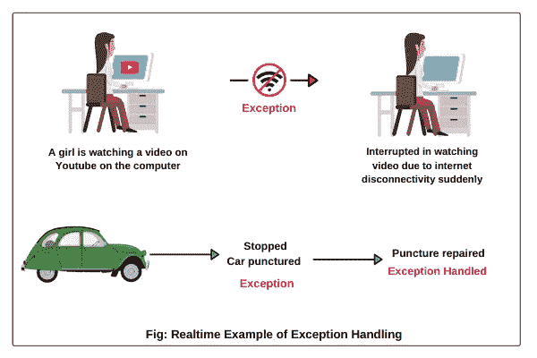

# Python 中的异常处理

> 原文：<https://medium.com/analytics-vidhya/exception-handling-in-python-881a4fec70c3?source=collection_archive---------13----------------------->

来源:- [科学技术易](https://www.google.com/search?q=exception+handling&sxsrf=ALeKk01x8D6M0N6a0-NSf4lc16C2VM0cPQ:1596631324024&source=lnms&tbm=isch&sa=X&ved=2ahUKEwjI_56Xi4TrAhXt63MBHa9JCuYQ_AUoAnoECBQQBA&biw=1366&bih=625#imgrc=9_pLlr28E8oTGM)

> 什么是异常和异常处理？

假设你正在从家到办公室的路上，但是在中途你的车被扎破了，所以你的车会停下来。这种情况被称为异常。现在机械师会来修理你的车，你将到达办公室，修理爆胎的过程被称为异常处理。

> 不使用异常处理有多危险？