# 汇率预测(第一部分):EDA 和数据可视化

> 原文：<https://medium.com/analytics-vidhya/exchange-rate-prediction-part-1-276b6cd5338?source=collection_archive---------2----------------------->

## 这部分是数据科学的开始，使用 EDA 清理和结构化数据集的可见性，然后是可视化和假设测试。

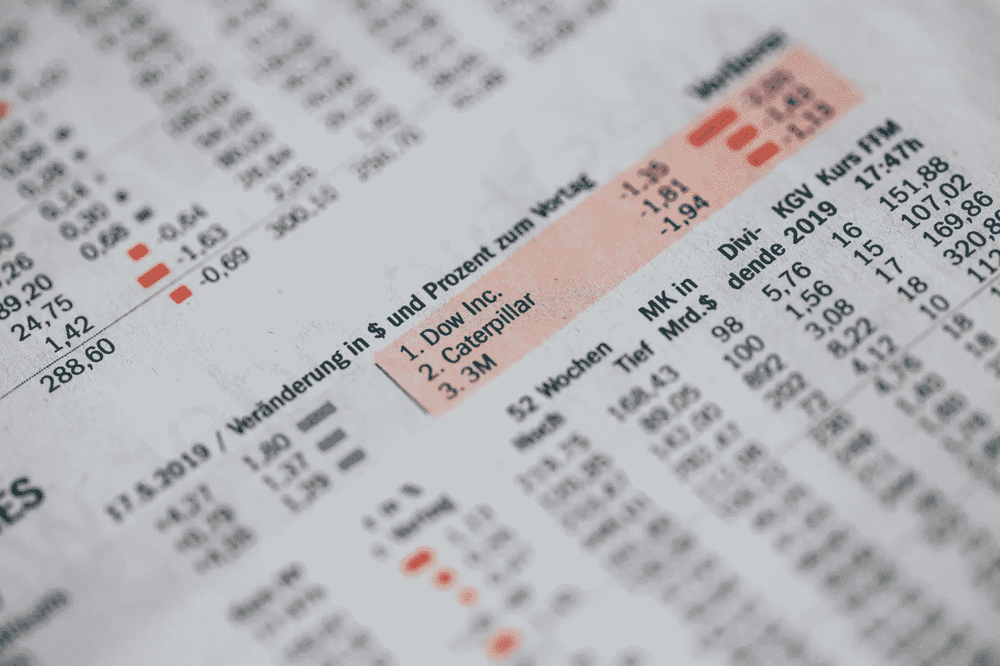

来源:https://unsplash.com/photos/2VMcpbUR6w8

只是一些**的免责声明**在潜入之前:

1.这个项目是构建和开发的系列之一，目的是从长远来看提高我的数据科学技能，包括技术和分析。
2。然而，我没有接受过正式的培训，也没有更高的数据科学学位。这些都是自学，从在线课程、中级阅读到日常练习。

因此，非常感谢您的反馈！

# 目录

我们开始吧！这是一个端到端项目，分为 3 个部分，涵盖以下几个部分:

1.  **第一部分**:解释性数据分析(EDA) &数据可视化(奖励:假设检验)
2.  **第二部分:**用 4 个回归模型进行机器学习
3.  第三部分:机器学习(续)与 ARIMA

作为开始，本文将涵盖项目的第一部分，所以请在接下来的几天里继续关注其他两部分！如果你想看完整的库，向下滚动到末尾，看看我的 Github 链接；)

# 介绍

汇率是每个人关注的日常话题之一，尤其是在当前全球经济受到严重影响的新冠肺炎形势下。因此，我对分析过去的汇率模式非常感兴趣，以便能够预测未来的价值。如果你和我一样感兴趣，你可以从 Kaggle 访问这个数据集[来进行你自己的探索。](https://www.kaggle.com/brunotly/foreign-exchange-rates-per-dollar-20002019)

# A.解释性数据分析(EDA)

首先，让我们导入两个基本的 Python 库，Pandas 和 Numpy，并读取数据:

```
import pandas as pd
import numpy as npdf = pd.read_csv("Foreign_Exchange_Rates.csv")
```

为了简单地理解我们的数据集，使用 **df.head()** 查看前 5 行，使用 **df.columns** 查看变量:

```
df.head()
print(df.columns)
```

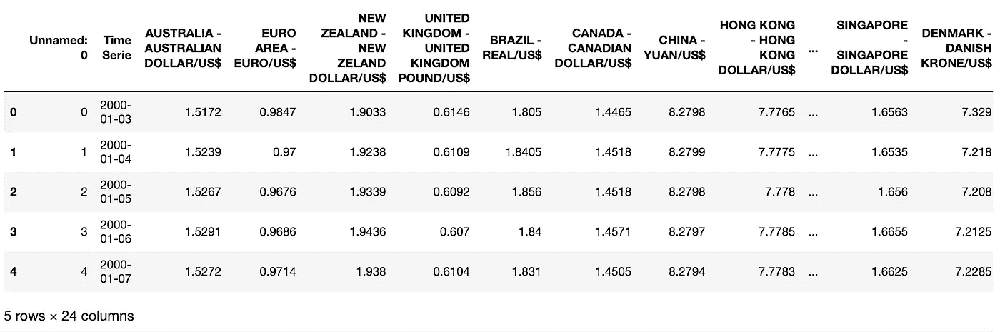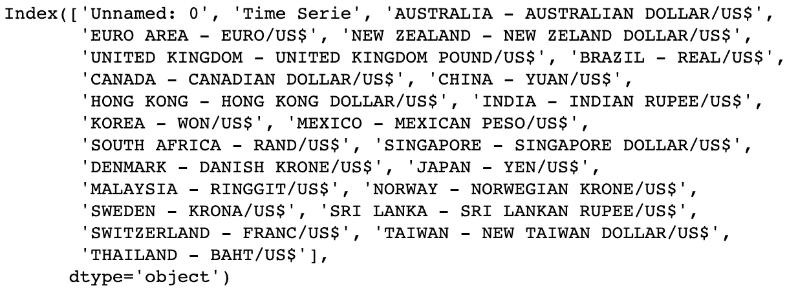

乍一看，我看到了一个不常见的名为“未命名:0”的变量，应该将其删除。

```
df = df.drop(columns=df.columns[0])
```

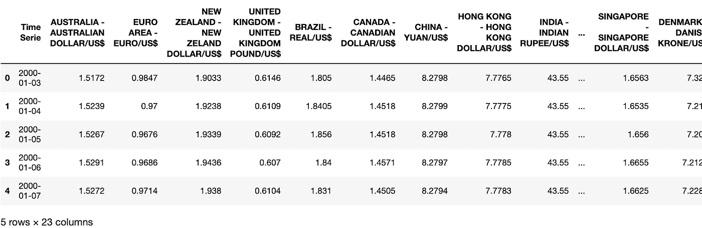

接下来，列名似乎太混乱了，以后很难调用，所以我将它们标准化为“国家货币/美元”(例如 AUD/USD)。

```
new_col_names = ['Time Series', 'aud', 'eur', 'nzd', 'gbp', 'brl', 'cnd', 'cny', 'hkd', 'idr', 'krw', 'mxn', 'zar', 'sgd', 'dkk', 'jpy', 'myr', 'nok', 'sek', 'lkr', 'chf', 'twd', 'thb']df.columns = new_col_namesdf.columns = map(str.upper, df.columns)
df.rename(columns=lambda x:x+'_USD', inplace=True)
df.rename(columns={'TIME SERIES_USD':'Time Series'}, inplace=True)
```

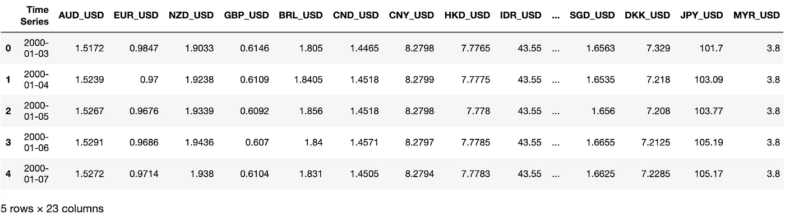

如您所见，我用新的国家货币代码创建了一个新列表，将它们大写，并在每个列名中添加了“_USD”。这就对了，一个更新鲜的数据集值得一看！

再次查看整个数据集，有一些名为“ND”的异常值。所以我用 **np.nan** 将它们替换为“nan”值，然后一次性删除所有“NaN”值。如果使用 **df.isna()没有找到“NaN”值。sum()** ，我们准备好了！

```
df = df.replace('ND', np.nan)
df = df.dropna().reset_index(drop=True)
df.isna().sum()
```

# B.数据可视化

让我们以一种更具视觉吸引力的方式来看看数据集吧！

首先，我们需要通过调用 **df.dtypes** 和 **pd.to_numeric** 进行类型转换来确保值是数值而不是对象。

```
df.dtypesfor col in df.columns[1:]:
    df[col] = pd.to_numeric(df[col], errors='coerce')
```

使用循环的**将更改一次应用到所有列，而不是再次重复该过程。**错误**函数中的参数可以设置为“忽略”(原样返回无效值)或“强制”(以 NaN 形式返回无效值)。**

由于目前的日期格式是 YYYY-MM-DD，这在图表中相对来说比较拥挤，所以我将添加另一个格式为 YYYY-MM 的列，并在替换中使用它。

```
df['Time Series'] = pd.to_datetime(df['Time Series'])
df['month'] = df['Time Series'].dt.month
df['year'] = df['Time Series'].dt.year
df['month_year'] = df['Time Series'].dt.to_period('M')
```

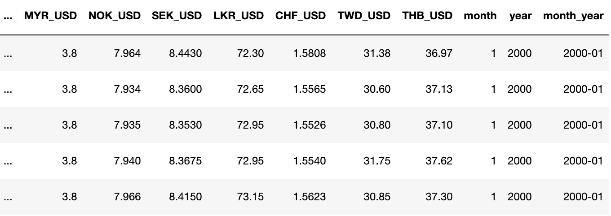

**pd.to_datetime** 将值从 object 转换为 datetime，然后我们用 **.dt.month** 和 **.dt.year** 提取月份和年份。最后，我们使用 **.dt.to_period('M')** 创建了一个名为“month_year”的新列。您可以参考此[文档](https://pandas.pydata.org/pandas-docs/stable/reference/api/pandas.DatetimeIndex.to_period.html)了解全部细节。

为了简单起见，让我们先把澳元/美元的汇率形象化。

```
df['AUD_USD'].count()
```

通过使用**。count()** ，我们知道每一列都有 **5k+值**。这是一个巨大的数字！因此，我们将取每个月的平均利率，假设平均值代表整个月。Groupby 来救援了！

```
df_groupby_aud = df.groupby('month_year').AUD_USD.mean().reset_index()
```

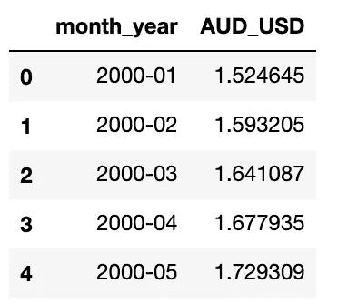

让我们为我们的第一个可视化图表导入 Matplotlib 库！

```
from matplotlib import pyplot as pltx = df_groupby_aud['month_year'].astype(str)
y = df_groupby_aud['AUD_USD']plt.figure(figsize=(8,4))
plt.plot(x, y)
plt.title("Exchange Rate: AUD/USD")
plt.xlabel("Month")
plt.ylabel("Exchange Rate")
plt.show()
```

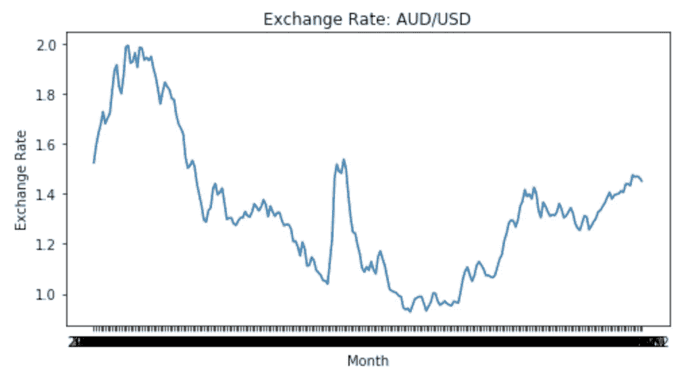

好的，我们现在可以看到澳元/美元的模式。让我们用不止一种汇率来升级我们的图表。

```
groupby_all = df.groupby('month_year').apply(lambda x: pd.Series
           ({
              'AUD_mean': x['AUD_USD'].mean(),
              'EUR_mean': x['EUR_USD'].mean(),
              'NZD_mean': x['NZD_USD'].mean(),
              'SGD_mean': x['SGD_USD'].mean(),
              'GBP_mean': x['GBP_USD'].mean(),
              'JPY_mean': x['JPY_USD'].mean(),
              'CHF_mean': x['CHF_USD'].mean()
                                             })).reset_index()groupby_all = pd.DataFrame(groupby_all)groupby_all['USD_mean'] = [1 for i in range(240)]
groupby_all.head()
```

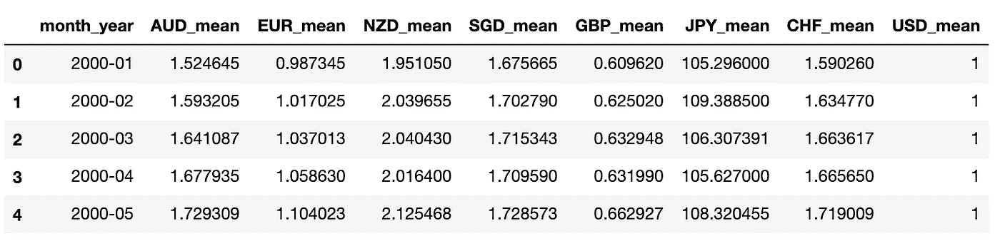

为了对多列进行 groupby，我们使用 **lambda** 对一系列列应用函数(在本例中为**)。mean()** )，然后转换回 DataFrame 更方便使用。

我之所以创建 USD_mean 这一列并加上值 1，是为了直观地说明所有汇率相对于基线的差异。列表理解是创建这种列表最简单的方法。

```
y_all = groupby_all[['AUD_mean', 'EUR_mean', 'NZD_mean', 'SGD_mean', 'GBP_mean', 'CHF_mean','USD_mean']]
labels = ["AUD_mean", "EUR_mean", "NZD_mean", "SGD_mean", "GBP_mean", "CHF_mean", "USD_mean"]
x_ticks = list(range(1, 240, 12))
x_ticklabels = [x for x in range(2000, 2021)]plt.figure(figsize=(20,10))
ax = plt.subplot()plt.plot(x, y_all)
ax.set_xticks(x_ticks)
ax.set_xticklabels(x_ticklabels)
plt.legend(labels)
plt.title("Exchange Rate: Top Countries/USD")
plt.xlabel("Year")
plt.ylabel("Exchange Rate")plt.show()
```

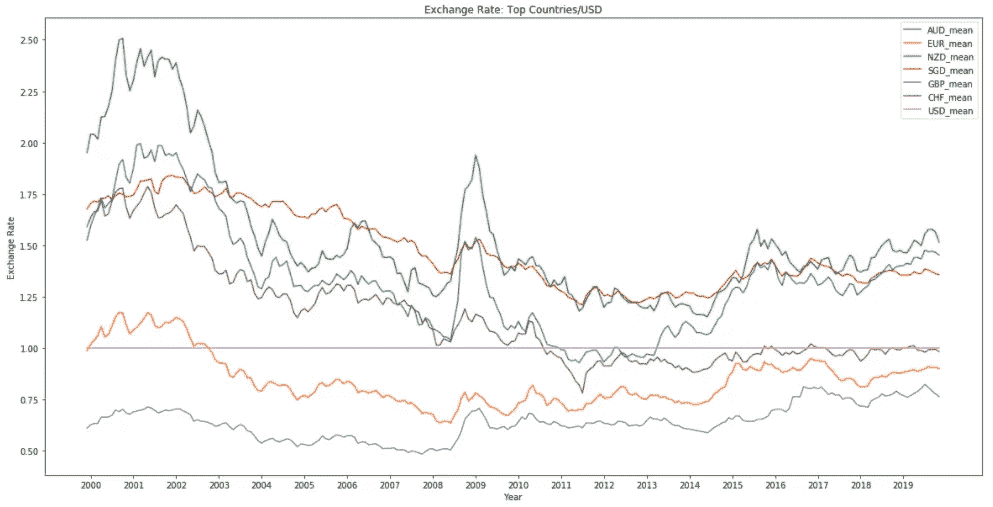

给你！！可以看出，所有汇率相对于美元基线的模式都非常相似。这样的峰值出现在 2008 年到 2010 年之间，这可以用 2008 年的大衰退来解释。

除了 Matplotlib，还有其他几个可视化库，如 **Plotly 或 Bokeh** ，它们提供了更多的交互选项。如果您热衷于探索，请查看我的 Github 的完整代码。下面是一个使用散景的简单图表:

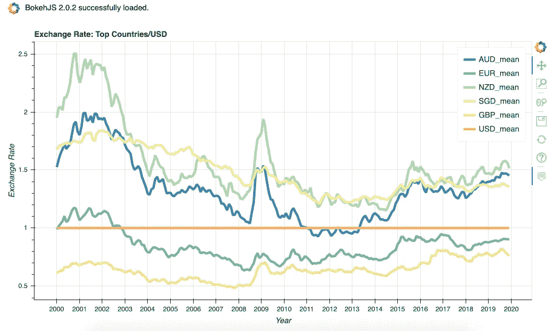

# C.假设检验

老实说，我仍然在与假设检验背后的大量不同元素、理论和功能进行斗争。

这就是为什么我决定在这个项目中练习一下，问自己数据集中的这些变量是否彼此不同。

让我们在这个例子中使用 AUD_mean 和 SGD_mean。我使用这两个变量的原因是，我在上面的图表中看到了**的相对差异。所以这个测试是为了**打消或者反驳**我之前的假设。**

**H0(零假设)**:AUD 的均值与 SGD 的均值相同。
**【H1(替代假设)**:AUD 的均值与 SGD 的均值显著不同。

然而，在进行假设检验之前，我们需要了解一些先决条件和过程:

1.  从每个群体中取出样本数据集
2.  检验每个样本集的正态性和两个样本集的相关性
3.  选择要使用的正确假设检验

对于 1。任务，问题是“我们应该从每个群体中提取多少数据？”。如果你记得，我们有超过 5k+值(人口)的每个变量。为了确定样本大小，我们可以依靠**功效分析。**

但首先，让我们准备本部分的数据集:

```
aud_sgd = df.loc[:,['AUD_USD', 'SGD_USD']]aud = np.array(aud_sgd.iloc[:,0])
sgd = np.array(aud_sgd.iloc[:,1])
```

然后，我们导入 **statsmodels** 库进行功耗分析:

```
import statsmodels.stats.power as smsn = sms.TTestPower().solve_power(effect_size=0.3, power=0.9, alpha=0.05)print(n)
```

有关全部细节，请参考此处的本文档[。简而言之， **TTestPower** 是成对样本 t 检验的统计功效计算。我们知道这些变量是成对的(或在某种程度上有联系)，因为它们被美元汇率所除。**。solve_power()** 是一个包含 3 个核心参数的函数:效果大小、功效和 alpha(又名显著性水平):](https://www.statsmodels.org/stable/generated/statsmodels.stats.power.TTestIndPower.solve_power.html)

1.  **效应大小**:通俗地说，就是指两组的差异(如两组的均值差异)除以其中一组的标准差。如果没有足够的数据进行计算，我们可以在稍后测试正态性时使用 0.3 到 0.8 范围内的效应大小，以找到最佳的效应大小。
2.  **功效**:是我们应该拒绝零假设的概率。人们普遍认为，功效应该是 0.8 或 0.9，这取决于你希望自己找到显著差异的几率有多大。
3.  **α:**是我们愿意接受的错误率，往往设定为 0.05 或 0.01。简而言之，阿尔法值为 0.05 意味着我们愿意接受我们的结果有 5%的可能性是由于偶然性/随机性。

如果我的解释似乎有点难以理解，我建议你看看不同的材料，以真正理解这个概念，其中之一是这个文档[这里](http://meera.snre.umich.edu/power-analysis-statistical-significance-effect-size)。

在运行功效分析之后，我们发现每个变量的样本大小是 118。然后，我们使用这个数字从每个总体中随机生成样本集:

```
aud_sample = np.random.choice(aud, size=118)
sgd_sample = np.random.choice(sgd, size=118)
```

第一步完成！

继续第二步，我们需要检验每个样本集的正态性以及两者的相关性。简而言之，要求两个样本集**正态分布**和**互不相关**。

```
from scipy.stats import shapiro, pearsonrstat, p1 = shapiro(aud_sample)
stat, p2 = shapiro(sgd_sample)
print(p1)
print(p2)stat, p3 = pearsonr(aud_sample, sgd_sample)
print(p3)
```

关于 H0 和 H1 每次测试的细节，请参考这个快速[小抄](https://machinelearningmastery.com/statistical-hypothesis-tests-in-python-cheat-sheet/)。

回到我们的例子，如果我们使用 0.3 的效应大小，结果表明“非正态分布”。由于我增加了效应大小，最终达到 0.8(样本大小为 18)，样本集呈正态分布，用于假设检验。对于皮尔逊检验，它们是相互独立的。

```
from scipy.stats import ttest_ind
tstat, pval = ttest_ind(aud_sample, sgd_sample)
print(pval)
```

最后，让我们导入 scipy 库进行假设检验。我们寻找的答案是 AUD 和 SGD 样本集的均值是否相等。如果 pval <0.05, we can reject the null hypothesis saying that they are different.

However, it turned out that my assumption from the chart that their means are different has been rejected, as the pval > 0.05！

好了，这是这个项目的第一部分的总结！唷，真的读了很久？！

我希望你喜欢我的第一篇媒体文章，并随时在这里或我的 Github 上发表评论！请务必关注**我关于**机器学习**的下两个部分**，看看**我是如何计算 2020 年的预测汇率的！**

我们连线吧！

github:[https://github.com/andrewnguyen07](https://github.com/andrewnguyen07)
领英:[www.linkedin.com/in/andrewnguyen07](http://www.linkedin.com/in/andrewnguyen07)

谢谢！