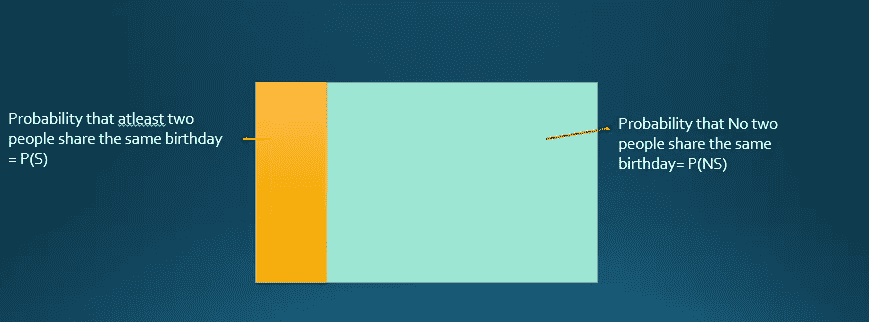

# 激动于统计学中的生日问题！！🍰 🍬

> 原文：<https://medium.com/analytics-vidhya/excited-about-birthday-problems-in-statistics-96c0d1772b12?source=collection_archive---------19----------------------->

## 当有生日的时候，我们享受很多，但是我没有想到在概率上会有被称为生日悖论的专用问题。

理查德·伯顿在 [Unsplash](https://unsplash.com?utm_source=medium&utm_medium=referral) 上拍摄的照片

## 你为什么要学习和理解生日问题？

*   概率和高级统计是你的数据科学之旅的基础，所以如果你很好地掌握了这些概念，它会给你很大的帮助。
*   这些生日问题被用作面试问题，以检查对概率概念的深刻理解。
*   生日问题的实时应用被黑客以加密攻击的形式使用。
*   最终解决这些问题是有趣的&它们似乎给出了令人惊讶的结果，因为我们的直觉思维不能够轻易解决或思考这些问题。

# 什么类型的问题是生日悖论的一部分？

## 假设在一次生日聚会中有 23 个随机的人，那么:-

> 至少两个人同一天生日的概率是多少？

## 或者——让我们试着用另一种方式来描述它

> 有人至少和别人分享的概率是多少？

*让我们考虑在图中整个区域代表概率空间的全部结果。让我们假设橙色代表两个人同一天生日的概率。那么我们可以说:-*

## 概率(至少两个人同一天生日)+概率(没有两个人同一天生日)= 1

## P(S)+P(NS)=1

**这个问题可以通过使用补码方法轻松解决:-**

概率(至少两个人同一天生日)= 1-概率(没有两个人同一天生日)

# 假设:-

1.  )一年有 365 天，2 月 29 日没有生日，所以闰年不会被考虑。
2.  一个人在一年中的任何一天出生的机会都是均等的，尽管有些人的生日比其他人的更有可能发生。

# 接近和计算的时间:-

让我们找出在 23 个人的房间里没有人同一天生日的概率。

*   第一个人可以在一年中的任何一天出生，所以他有 365 种可能的方式，所以概率= 365/365
*   由于生日不匹配，剩下 364 个可能的日期，所以概率= 364/365
*   第三个人可以在剩下的 363 天中的任何一天出生，所以
    概率= 363/365
*   第四个人可以在剩下的 363 天中的任何一天出生，所以概率= 362/365………………………。

# 概率(没有两个人共享生日)=

> = (365/365)*(364/365)*(363/365)……..(343/365)
> 
> = (365*364*363*…343)/365²³

# 用阶乘符号简化:-

> = (365!/342!*365²³) = 0.492703

# 概率(至少两个人同一天生日)

> = 1–0.492703 =0.507297

> 一个房间里有 23 个人—概率约为 50.7%
> 一个房间里有 50 个人—概率约为 97%
> 一个房间里有 75 个人—概率约为 99.97%

在这么多生日日期(一年 365 天)中，一个小组只需要 75 个人，并且有 99.97%的概率至少有两个人过同一天生日，这难道不令人惊讶吗？

# 这就是概率的力量😃 😄

由[阿洛拉·格里菲斯](https://unsplash.com/@aloragriffiths?utm_source=medium&utm_medium=referral)在 [Unsplash](https://unsplash.com?utm_source=medium&utm_medium=referral) 上拍摄的照片

# 如果你喜欢这篇文章，请点击👏按钮背书。这将有助于其他媒体用户搜索它。

随时欢迎反馈😅