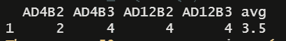

# 排除 R 中多列平均值计算中的值

> 原文：<https://medium.com/analytics-vidhya/excluding-values-in-multi-column-mean-calculations-in-r-7776c2588414?source=collection_archive---------28----------------------->


只是另一个争论数据的帖子

# 任务

我有每人一行的数据，其中人们报告了他们在特定时间段内的饮酒量。这些列是不同的时间段，但参与者也可以提供其他不同编码的答案:

*   意味着他们根本不喝酒
*   `0`表示他们当时没有饮料
*   `-999`指的是他们在那个时间段确实喝了酒，但他们不记得喝了多少。

有趣的部分来了。我们想估算出`-999`的典型个人均值。在实践中，这意味着如果一个人报告他们在时间段内喝了酒，但不记得喝了多少，我们建议他们喝任何对他们来说典型的酒。

然而，我们想要估算的平均值需要排除`-999`、`0`和`NA`。

# 图书馆

我将使用下面的库来完成这个任务。

```
# Read in the .csv file 
library(readr) 
# Chains using the pipe 
library(dplyr) 
# Other functions 
library(purrr)
```

# 数据

我完成这个任务所用的数据最初有`2,348`个变量和大约`500`个观测值。因为原始数据是保密的，所以我创建了这个数据的假版本。这个假数据被储存在[这里](https://github.com/lsouthard/Excluding-values-in-multiple-column-mean-calculations/blob/main/fakedata.csv)。

```
#Read in the data
fd.df <- read.csv("fakedata.csv", header = T, sep = ",", 
                  na.strings = "NA")#preview the data
head(fd.df)
```

确保您的数据确实是 1 行/人总是一个好主意。我通过`ResponseID`检查了重复项，以确保:

```
fd.df$ResponseId[duplicated(fd.df$ResponseId)]
```


`character(0)`已返回，因此没有重复项。

# 该功能

我将创建一个执行以下操作的函数:对于数据帧中右索引`fd.df[2:121]`内的所有列，按行取平均值，只要它大于`0`而不是`NA`。为此，我们首先需要确保所有内容都以数字形式读入。这在从`mutate_at()`开始的第二行中完成。这里，所有应该以这种方式计算的列(索引`[2:121]`)也以“AD”开始。因此，我提取所有以“AD”开头的列，并使它们成为数字(`as.numeric()`)，让它识别任何`NA`值都是实数(`na.rm = T`)。我使用了`starts_with()`来展示不同的功能。

```
final.df <- fd.df %>% 
   mutate_at(vars(starts_with("AD")), as.numeric, na.rm = T) %>%
   mutate(avg = apply(.[2:121],1, function(.) mean(.[.>0], 
                      na.rm =T)))
```

对于以`mutate()`开始的第三行代码:`(.)`指的是整个数据帧，但是我在这里指定了我希望函数应用的索引:`(.[2,121]`如果数据帧中有其他数据，比如 ID 号，这是必需的。`1`指的是行方向。如果这是我的目标的话，我可以在列上加上一个`2`。这是使用`group_by(ResponseID)`的一种优雅的替代方式，也是一种选择。

接下来，我告诉`apply()`我想(应用)使用一个函数，只要数据帧中的值大于 0，这个函数就是数据帧`(.)`的`mean()`，我想保留我的`NA`值(`(.[.>0], na.rm =T` )。使用任何大于 0 的值也将排除我的`-999`,我想以后估算。

# 估算平均值

我将把这行代码添加到上面的代码: `mutate_at(vars(starts_with("AD")), ~if_else(. == -999, avg, .))`中，它将显示为:

```
final.df <- fd.df %>% 
   mutate_at(vars(starts_with("AD")), as.numeric, na.rm = T) %>% 
   mutate(avg = apply(.[2:121],1, function(.) mean(.[.>0], 
                      na.rm =T)))%>% 
mutate_at(vars(starts_with("AD")), ~if_else(. == -999, avg, .))
```

## 我们来分析一下。

*   我们正在用`mutate_at()`做同样的事情，只是为了展示功能。你也可以用索引来做这件事。
*   我之所以保存了一个名为`avg`的列，是因为我可以检查以确保接下来一切正常。
*   现在，我的第四行代码如下所示:对于所有以“AD”开头的列(也称为 index 2，121)，将下面的`if_else()`语句应用于整个 dataframe(用`~`表示)。
*   `if_else()`语句如下:如果数据帧中的任何地方(由`(.)`表示)也等于`-999`，则替换为`avg`。如果不是，保持不变(再次用`(.)`表示)。

输出将成功地保留所有其他数据(如 ID、人口统计、联系信息等)，并且只处理`starts_with()`中指定的列和/或您给出的索引。

# 检查它是否工作

在我的所有代码中，我总是鼓励检查以确保你的函数/代码按照你期望的方式工作。在这个例子中，我最初使用的是`rowMeans()`，它没有忽略小于 0 的值。如果我放弃这次数据检查，我就不会发现这一点。

对于这个检查，我想要一个我以前知道值为`-999`的列。我知道使用以下代码选择列`AD1B3`:

```
check.df <- fd.df %>% 
   mutate_at(vars(starts_with("AD")), as.numeric, na.rm = T) %>% 
   mutate(avg = apply(.[2:121],1, function(.) mean(.[.>0], 
                      na.rm =T))) %>% 
   select(2:121, avg) %>% 
   select_if(~min(., na.rm = TRUE) < 0)
```

当我运行这个代码时，第一行有`-999`和其他值，这很好。否则，我可能需要想出一个更好的方法来检查我到底想要什么(欢迎建议)。


如果我在第 1 行的`check.df`上运行相同的代码，使用`slice(1)`和`select_if`删除值为`0`或`NA`的所有列(因为这两个值都不应该计入我的平均值)，我可以计算出`avg`列应该是什么:

```
check.df <- fd.df %>% 
   mutate_at(vars(starts_with("AD")), as.numeric, na.rm = T) %>% 
   mutate(avg = apply(.[2:121],1, function(.) mean(.[.>0], 
                      na.rm =T))) %>% 
   select(2:121, avg) %>% 
   slice(1) %>% 
   select_if(~max(., na.rm = TRUE) > 0)
```



现在，我可以看到 3.5 是正确的平均值。

我已经将我处理过的数据保存到一个名为`final.df`的数据帧中。首先，我检查了一下，以确保 means 的`apply()`函数实际上排除了我希望它排除的所有值。

```
final.df %>% 
   select(2:121, avg) %>% 
   slice(1) %>% 
   select_if(~max(., na.rm = TRUE) > 0)
```

这是将要打印的内容:


我从我的`check.df`数据帧中知道`AD1B3`是`-999`，现在被替换为`avg`中的值。一切看起来都很好！

我真的希望我的 apply 函数在`if_else()`语句中工作，这样一旦我知道它工作了，我就可以运行它而不保存`avg`列。此外，我是第一次使用`apply()`功能，所以任何优化它的方法都是受欢迎的。

*原载于 https://github.com*[](https://github.com/lsouthard/Excluding-values-in-multiple-column-mean-calculations/blob/main/README.md)**。**