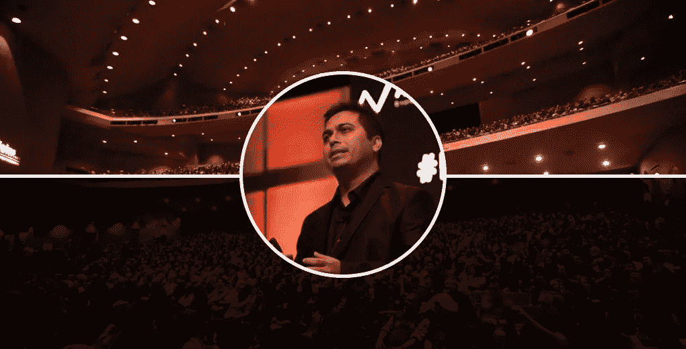
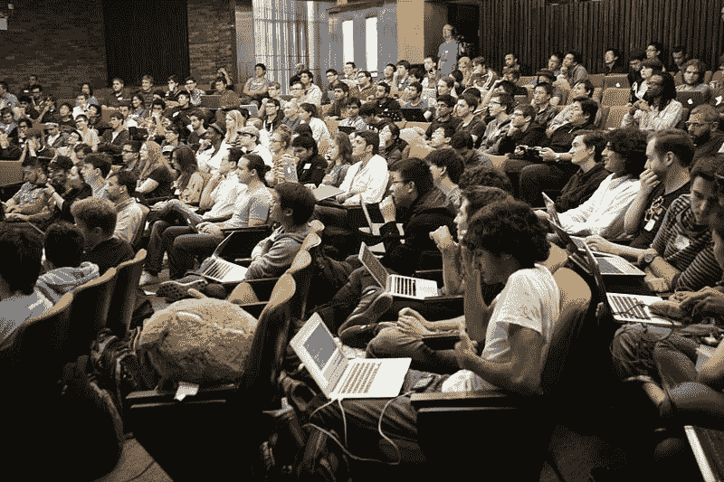

# 独家专访 Sonny Laskar——ka ggle 大师和分析专家 Vidhya Hackathon

> 原文：<https://medium.com/analytics-vidhya/exclusive-interview-with-sonny-laskar-kaggle-master-and-analytics-vidhya-hackathon-expert-486b8c3b376?source=collection_archive---------2----------------------->

# 介绍

破解数据科学竞赛的关键是什么？你如何利用这段经历打入数据科学行业？我们经常遇到有抱负的数据科学家提出的这些问题，他们想知道如何在数据科学领域成名。

有谁能比 Kaggle 大师和分析 Vidhya 黑客马拉松专家更好地回答这些问题并提供对数据科学世界的深入见解呢？女士们先生们，我很高兴向大家介绍桑尼·拉斯卡！

Sonny 是 IIM 印多尔的 MBA 研究生，他认为是这个地方开启了他的数据科学之旅。因此，如果你想知道是否有可能从非数据科学领域转向数据科学，这篇文章就是为你准备的。

我发现桑尼是一个非常平易近人的人，你很快就会看到，他的回答非常有趣，知识渊博，经验丰富。尽管在行业中担任高级职务，但 Sonny 喜欢参加数据科学竞赛和黑客马拉松，并定期登上竞赛排行榜的前列。

Sonny 在该领域的数据工程方面也拥有丰富的经验。你可以想象，我们可以从他身上学到很多东西。我有机会就各种数据科学主题向他请教，并为您带来了这篇文章。

# 我们在交谈中谈到了各种数据科学话题:

*   Sonny 的背景和他在数据科学领域的第一个角色
*   数据科学竞赛和行业项目的区别
*   Sonny 的数据科学竞赛框架和方法
*   他对有抱负的数据科学家的建议是

还有更多！从桑尼的知识和思维过程中可以学到很多东西。享受讨论！

# Sonny Laskar 的背景和在数据科学中的第一个角色

# Pranav Dar:您目前是 Microland 的自动化和分析副总监，在 av 的黑客马拉松比赛中 4 次获得前 3 名，并在 Kaggle 比赛中获得亚军。这真是一段旅程！

# 您的数据科学之旅是如何开始的，从哪里开始的？

Sonny Laskar :我的数据科学之旅始于我在 IIM·印多尔攻读 MBA 的时候。分析是每个有志之士的必争之地。早期讨论的话题之一是基于[塔吉特如何在一个少女的父亲发现](https://www.forbes.com/sites/kashmirhill/2012/02/16/how-target-figured-out-a-teen-girl-was-pregnant-before-her-father-did/)之前发现她怀孕了。这让我非常好奇，我开始深入数据科学的世界。

我已经广泛地与数据打交道，但主要是围绕工程问题和商业智能。当时，没有什么严肃的机器学习的东西在印度的组织中流行。

> *“2014 年初，我在德克萨斯大学奥斯汀分校呆了两个月，他们对数据的成熟程度让我感到惊讶。我参观了戴尔在奥斯汀的总部，他们是如何利用社交媒体数据来增强产品定位的，这令人惊叹。到最后，我完全相信我需要在这方面努力。”*

# PD:你的职业生涯并不是从数据科学开始的。前 6 年左右的时间花在了数据仓库和基础设施上。

# 那么，当您进入数据科学领域时，您面临着什么样的挑战？你是如何克服它们的？

**SL:**2007 年，我在 IT 基础设施领域开始了我的职业生涯。在最初的六年里，我主要致力于构建大规模的数据仓库应用程序(每年处理大约 10TB 的数据)。焦点更多地集中在 ETL 和 BI 上。仪表板和数据集市是所有这些努力的主要成果。这就是我们所说的“描述性分析”。

到 2014 年至 2015 年，“预测分析”在美国已经得到了很多关注和采用。从那时起，印度的许多组织开始重点关注“预测分析”。我们已经在处理万亿字节的数据，并且非常精通工程方面的事情。

我能够很好地理解数据科学的基础，因为我的数学和统计概念很强，并且我有相当多的编程经验。

> *我从 R 语言开始，因为它是学术界流行的编程语言，通过练习编写代码和复制其他工作来提高我的理解。*

在读 MBA 期间，我对许多统计和数据科学方法有了一个大致的了解。由于 MBA 期间的重点更多地放在商业上，这使得我无法掌握行业所需的技术技能。在拿到 MBA 学位后，我开始每天花大约 4-5 个小时编写代码，并在此基础上进行构建。

我过去已经用 Bash、Javascript、PHP 和 Perl 编写了足够多的代码。所以，学习曲线对我来说并不太陡。**我还投资购买了云订阅服务，这样我就可以处理大量数据。我认为，当你相信这笔钱从长远来看是有帮助的时候，它是值得投资的。**

> 耐心、毅力实践是我生活中做任何事情的经验法则，这也是我在这里应用的。

# 行业经验与数据科学竞赛

# PD:我们经常从招聘经理那里听到有抱负的数据科学家如何参加黑客马拉松和竞赛，并努力在他们向行业角色转变的过程中弥合差距。

# 你在这两方面都有经验——你在数据科学方面拥有丰富的经验，并且在黑客马拉松中表现出色。在行业与黑客马拉松的辩论中，你有什么经验？

**SL:** 数据科学越来越受到市场工作人员的关注。事实上，通过一些培训来理解基本概念是非常容易的(多亏了 MOOCs)。这导致供应过剩，然后招聘人员需要一些方法来过滤。

**最好的工作方式之一是通过参加数据科学竞赛来建立信誉。**

> *就像生活中的大多数事情一样，竞争也有利弊。在比赛公布之前，有许多准备工作要做。这项工作有时极其复杂、耗时，并且需要多领域的理解。*

类似地，比赛以排行榜分数结束，没有任何关于获胜者解决方案的视图。对于许多第一次进入数据科学的人来说，这些是灰色地带，当他们加入这个行业时，会产生很多问题。

在过去的一年里，我至少进行了 100 次面对面的采访，我可以清楚地看到这种挣扎。数据科学家不应该只是设计一个机器学习模型来预测一些事情。在许多组织中，会议室中的讨论以数据科学家的任务结束，例如“让我们建立一个模型来预测 X”。

一个好的数据科学家可能会得出结论，许多这样的 X 用例根本不应该用机器学习来解决！在现实世界中，数据科学团队预计不会很大。他们可能会参与许多任务，这些任务要么没有价值，要么可以在不使用机器学习的情况下轻松解决。

如果他们觉得可以通过机器学习来解决这个问题，那么必须进行一系列的讨论，以了解哪些数据可以帮助他们解决这个问题。

> ***“不像比赛，没人给你两个。csv 文件称为培训和测试和一个很好的书面评估指标。*** *几乎 80%的努力都投入到了定义问题、获取和处理数据上。剩下的 20%的精力用于纯粹的建模和部署。”*

参与竞争有助于解决一些问题:

1.  处理数据和特征工程
2.  构建不同类型的模型并获得最佳分数

这些都是非常重要的活动，因此招聘人员使用“竞争”作为一个很好的过滤器来关注一小组候选人。

总而言之，以下是关注竞争的人在进入该行业时面临的主要问题:

*   建立**商业敏锐性**以理解问题陈述如何帮助实现商业目标，以及哪些数据推动了商业目标的实现
*   拥有**解决问题的态度**
*   理解生产部署的**软件工程**方面
*   **讲故事**:能够将结果传达给非技术人员

# 数据科学黑客马拉松和竞赛

# PD:自从数据科学在过去 5 年中开始成为主流以来，多种竞争一直在跨平台同时发生。您如何挑选和选择要参加的数据科学黑客马拉松或竞赛？

**SL:** 早在 2016 年，我就迷上了数据科学竞赛。以前尽可能多的参加比赛！最近，随着增量学习的减少，我的个人兴趣有点停滞不前。现在我只有在有时间和一个非常有趣的问题的情况下才参与。

我也试着和我的 Kaggle 大师朋友 [Sudalai Rajkumar (SRK)](https://www.analyticsvidhya.com/blog/2019/01/datahack-radio-tips-crack-data-science-competitions-kaggle-grandmaster/) 一起参加线下黑客马拉松。我通常基于三个因素参与:

*   **问题的新颖性:**如果问题陈述对我来说是新的，来自现有的或新的领域，而我在这方面可能没有足够的经验，我会尝试使用数据，因为它可以帮助我建立对该问题/领域的一些认识
*   数据量:我喜欢数据量非常大的问题。我喜欢在拥有 500 GB RAM 和 64 核处理器的机器上运行模型时获得的快感。这很有趣！
*   多种方法方案:如果有多种技术我可以尝试。事实上，我们的第一次 Kaggle 竞赛需要我们同时进行文本分析&图像分析和一种清晰的方法来合并这两者

# PD:初学者应该如何参与这些数据科学黑客马拉松？他们应该首先尝试哪种比赛？

SL: 对于初学者来说，知道基本的构建模块是很重要的。

> *“我强烈建议他们不要参加任何数据集大、问题陈述复杂的竞赛。”*

他们应该从相对容易的数据科学竞赛开始。以下是有抱负的数据科学家在最初几周应该做的事情:

*   **理解好数据**。不要直接进入运行 *xgb.train*
*   阅读哪些**转换**对您的问题&模型有效:
*   特征工程是关键，你对特征工程的早期学习将来自其他人的代码。所以，建立一种逐行阅读他人代码的习惯，并复制它。问自己一些问题，比如作者为什么这么做，这有什么帮助？
*   Kaggle 内核是一个阅读的好地方
*   **在 Analytics Vidhya 上，参与者上传他们的代码，初学者应该阅读这些代码**
*   熟悉使用不同算法建立模型的**过程**

# PD:有抱负的数据科学家应该如何应对竞赛？

当我们参加许多比赛时，我们意识到我们总是遵循一套共同的步骤。我们应该试着用它来创建一个模板，我们可以在每场比赛中轻松地修改它。这让生活变得更简单。

我遵循以下流程:

*   使用所有功能和基本功能工程构建一个简单的基础模型
*   在 excel 表格中记录每个变化和分数，以跟踪进度
*   手动调整超参数(不要花太多时间),得到一些像样的东西
*   返回到数据理解并完全重做特征
*   探索数据，构建可视化图以查看模式等。
*   阅读讨论、内核等。
*   重复所有这些步骤

# 数据科学行业相关

# PD:您认为数据科学项目中经常被新人忽略的 3 个关键方面是什么？

**SL:** 有趣的问题。以下是我建议关注的内容:

*   **将模型投入生产**
*   **了解 SQL 的重要性**
*   **学习为大数据编写高效代码**

# PD: AutoML 在行业中的地位越来越重要。在接下来的 2-3 年里，我们可以期待看到数据科学的其他趋势是什么？

**SL:** AutoML 将最终自动化大部分模型构建&模型部署部分的工作。这将包括处理和使用特征工程(在很大程度上)。

> *“领域知识的重要性、逻辑推理和解决问题的态度是数据科学家应该擅长的。”*

我看到的其他主要趋势:

*   **图在机器学习中的应用:**大多数人不使用图。这是一个笑话！对于解决许多复杂问题来说，图是如此惊人的结构
*   **增强分析:**增强分析通过利用机器学习和自然语言来自动化数据准备并实现数据共享，从而自动化数据洞察
*   **自主系统:**自主系统就像无人驾驶汽车，可以自己做决定。这背后是强化学习。我们在 Microland 开发的产品之一是为“*自主 IT”*开发的，它将复制人类在出现问题时的行为，并学习实时复制这种行为

# 快速提问:桑尼对各种数据科学方面的看法

# PD:告诉我们你在数据科学工作中学到的 3 件事。

**SL:** 太多了，无法一一列举下来！但以下是我的三大选择:

*   领域知识是关键
*   成为“多面手”很有帮助
*   总是跳出框框思考

# PD:你最喜欢的机器学习/深度学习算法是哪个，为什么？

SL:我使用 Xgboost & Lightgbm 来完成我的大部分任务。他们几乎每次都工作。对于深度学习，带 TensorFlow 的 Keras 在我看来很完美。

# PD:你会选择哪位数据科学专家参加高风险的数据科学竞赛？

**SL:苏达莱·拉杰库玛(SRK)** 任何一天！

# PD:你对试图获得第一个数据科学职位的人有什么建议？

根据我的经验，这里有一些建议:

*   不要试图同时学习两种语言。掌握你喜欢的任何一种。忽略所有你听到的类似“语言 X 比语言 Y 好”等新闻。
*   建立一个体面的 Github 简介，包括你试图解决的所有不同类型的问题
*   拿一个**开放问题**来说，你可以从中获取数据，并围绕它构建一些数据科学应用
*   最后，**参加比赛**登顶！

# 结束注释

我非常喜欢在这次采访中与桑尼·拉斯卡互动。他的知识、他的思维过程以及他表达和构建思想的方式是我们都可以学习的。

你从这次面试中学到了什么？您希望我们采访其他数据科学领域的领导者吗？请在下面的评论区告诉我！

*原载于 2019 年 5 月 30 日*[*https://www.analyticsvidhya.com*](https://www.analyticsvidhya.com/blog/2019/05/exclusive-interview-sonny-laskar-kaggle-master-analytics-vidhya-hackathon-expert/)*。*