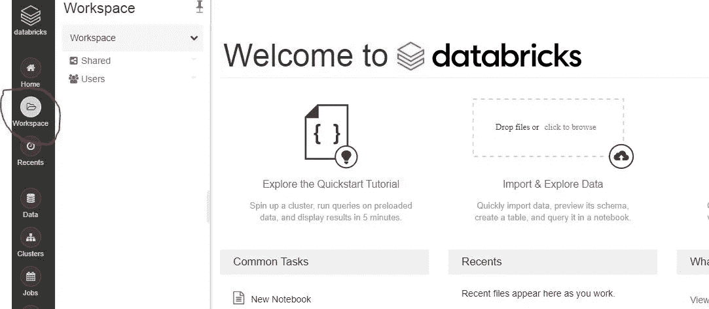
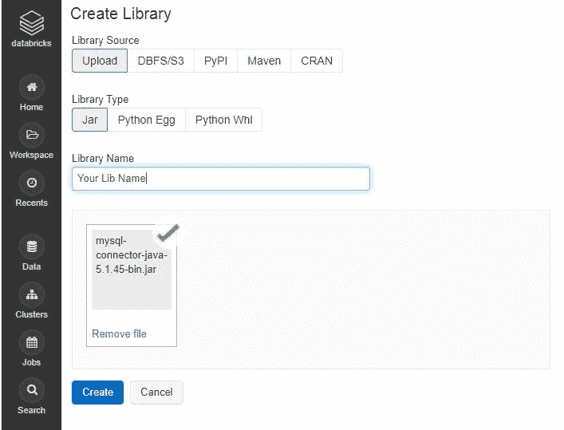
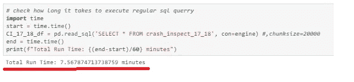
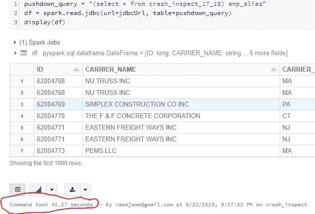

# MySQL 查询执行速度提高 10 倍——简单的 PySpark 教程，带数据块

> 原文：<https://medium.com/analytics-vidhya/execute-mysql-queries-10x-faster-simple-pyspark-tutorial-with-databricks-a39164550749?source=collection_archive---------4----------------------->

如今许多公司都使用 Apache Spark。对于那些不使用 Spark 的人来说，您在执行查询上花费了过多的时间。学习它会让你在工业上更有优势。此外，在您的本地机器上安装 Spark 可能非常复杂，除非您有一个非常昂贵和强大的系统，否则不值得麻烦地尝试安装(相信我！).幸运的是，Databricks 公司提供了 Spark 基础设施，没有所有复杂的安装问题…..而且可以免费使用！下面是开始的步骤！

# **1。下载 JDBC 驱动**

一个 **JDBC 驱动程序**是一个软件组件，它使得一个 [Java](https://en.wikipedia.org/wiki/Java_(programming_language)) 应用程序能够与一个 [d](https://en.wikipedia.org/wiki/Database) 数据库([https://en.wikipedia.org/wiki/JDBC_driver](https://en.wikipedia.org/wiki/JDBC_driver))进行交互

在 jupyter notebook 中运行这两个命令(如果您是 linux 用户，也可以在 bash 中运行它们):

I)为 MySQL
下载必要的 JDBC 驱动！wget[https://dev . MySQL . com/get/Downloads/Connector-J/MySQL-Connector-Java-5 . 1 . 45 . tar . gz](https://dev.mysql.com/get/Downloads/Connector-J/mysql-connector-java-5.1.45.tar.gz)

ii)提取 JDBC 驱动 JAR 文件
！塔尔 zxvf mysql-connector-java-5.1.45.tar.gz

# **2。创建数据块账户**

[](https://databricks.com/try-databricks?_ga=2.119219724.466172152.1600626235-1555438613.1599863553) [## 尝试数据块

### 为业务选择一个平台数据团队的协作环境，共同构建解决方案无限…

databricks.com](https://databricks.com/try-databricks?_ga=2.119219724.466172152.1600626235-1555438613.1599863553) 

I)填写表格

ii)选择“社区版”

iii)当您完成身份验证并进入主屏幕时，选择“工作区”。



iv)然后点击“创建”,然后点击“库”

v)随意命名库，然后放入 jar 文件并点击“创建”



vi)在下一页上，单击“在所有群集上自动安装”

# 3.创建一个集群

集群是数据块计算资源的集合。

I)在侧边栏中，单击**集群**按钮。

二)1。在群集页面上，单击'**创建群集'**

iii)为其命名，保留所有默认设置，然后单击“创建集群”

# 4.创建笔记本

笔记本是在 Apache Spark 集群上运行计算的单元的集合。要在工作区中创建笔记本:

一、在工具条中，点击**工作区**按钮。

二。在工作区文件夹中，选择:**创建>笔记本**。

三。在创建笔记本对话框中，输入名称并在语言下拉列表中选择 **Python** (假设您是 Python 用户)

四。点击**创建**。笔记本打开，顶部有一个空单元格。

# **5。MySQL-PySpark 连接示例**

在笔记本中，用您的 MySql 凭证填写以下模板

I)创建 JDBC 网址

```
 jdbcHostname = "<hostname>"
jdbcDatabase = "employees"
jdbcPort = 3306
jdbcUrl = "jdbc:mysql://{0}:{1}/{2}?user={3}&password={4}".format(jdbcHostname, jdbcPort, jdbcDatabase, username, **password)**
```

ii)将查询下推到数据库引擎

```
pushdown_query = "(select * from employees where emp_no < 10008) emp_alias"
df = spark.read.jdbc(url=jdbcUrl, table=pushdown_query)
display(df)
```

就是这样！您刚刚使用 PySpark SQL 执行了您的查询！轻松点。

# **6。我的例子-快 10 倍！**

检查这两个查询的运行时间。一个在 PySpark SQL 中，一个在 MySQL 中

MySQL-7.56 分钟



PySpark SQL- 45.27 秒



**感谢阅读！如果这个教程对你有帮助，请喜欢它，也请跟随我。干杯！**

# **来源和其他参考资料**

[https://neptune.ai/blog/apache-spark-tutorial](https://neptune.ai/blog/apache-spark-tutorial)

[https://medium . com/@ wesmelton/how-to-use-JDBC-MySQL-SQL-drivers-with-data bricks-Apache-spark-774544 aa 856](/@wesmelton/how-to-use-jdbc-mysql-sql-drivers-with-databricks-apache-spark-774544aa856)

[https://docs . data bricks . com/getting-started/quick-start . html](https://docs.databricks.com/getting-started/quick-start.html)

[https://docs . databricks . com/data/data-sources/SQL-databases . html](https://docs.databricks.com/data/data-sources/sql-databases.html)