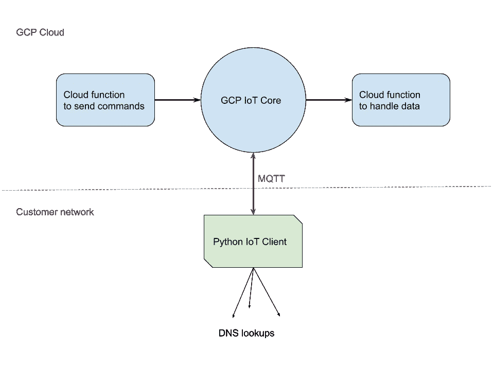
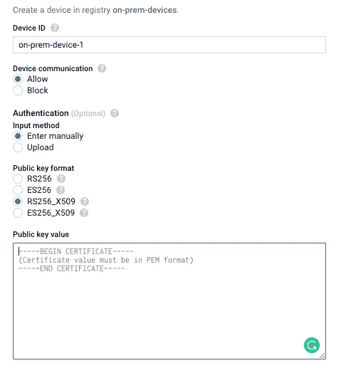
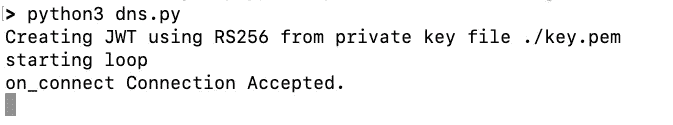
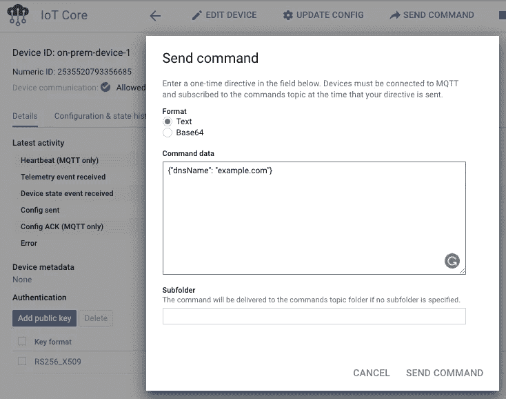
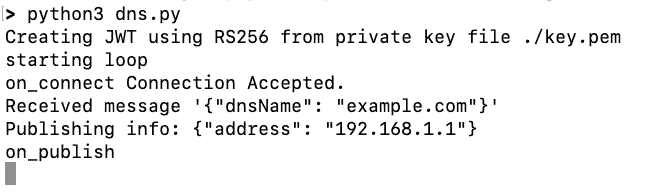
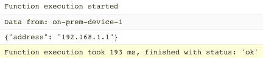

# 使用 GCP 物联网核心设备在本地执行命令

> 原文：<https://medium.com/analytics-vidhya/executing-commands-on-prem-using-gcp-iot-core-devices-c9f0c7f89d56?source=collection_archive---------24----------------------->


谷歌云平台标志。来源:谷歌

在 SaaS 的一些沉思中，我偶然发现了这个问题。如果客户希望他们的本地设备与您在 GCP 运行的 SaaS 通信，您会如何做？

对 GCP 来说，显而易见的答案是服务账户。然而，在 GCP 每个项目你被限制为 100 个服务账户，所以这不会扩展得很好。那么，我们还能使用什么来认证大量设备，并与 GCP 很好地合作呢？当然是物联网核心！

物联网核心是一项完全托管的服务(无服务器)，允许您将全球数百万台设备安全连接到 GCP。虽然它旨在用于收集遥测数据并将其反馈到中央位置的小型设备，但它也可以用于向设备发送命令并获得响应。

我决定对它进行测试，并用 python 创建一个小型物联网客户端，它可以接收 DNS 名称，在网络中进行查找，并将结果返回给物联网核心。因此，这种情况下的“命令”是 DNS 查找。一个简单的概念验证，看看物联网核心是否能够胜任任务。基本架构如下所示:



架构图

# 正在设置

首先，我遵循了 [GCP 物联网核心入门文档](https://cloud.google.com/iot/docs/how-tos/getting-started)。一旦我设置好了，我就按照“[创建注册表和设备](https://cloud.google.com/iot/docs/how-tos/devices)”文档进行操作。我创建了一个名为“本地设备”的注册表。它位于“美国中部 1”地区，使用“MQTT”协议。我还创建了一个名为“on-prem-devices-telemetry”的发布/订阅主题，以接收来自设备的遥测数据。

下一步是添加我的设备。要添加设备，您需要证书对其进行鉴定。所以我使用“openssl”生成了所需的密钥:

```
openssl req -x509 -nodes -newkey rsa:2048 \
-keyout ./key.pem \
-out crt.pem \
-days 365 \
-subj "/CN=unused"
```

生成证书后，我使用 Web UI 添加了一个“设备”。“公钥值”是文件“crt.pem”的内容



GCP“添加设备”用户界面

既然这个设备是在 GCP 制造的，我需要为这个设备本身编写代码。幸运的是，Google 有关于如何发布到 MQTT 的很好的文档，我可以跟随。他们的示例代码定期发送遥测数据，还处理定期重新认证，这超出了本文的范围。所以我调整了代码，让它更容易理解。它现在从 IoT 接收命令，进行 DNS 查找，然后将结果发布回 IoT。看起来像这样:

这将把设备连接到 GCP 物联网核心，并等待命令。一旦收到包含 DNS 名称的命令，它将对该名称进行 DNS 查找，并将地址发布回物联网核心。与 google 的例子不同，这段代码不会向 IoT 发布数据，除非您向它发送一个命令。它也不处理生产中需要的重新认证。尽管缺少一些细节，但它确实证明了这样一个概念，即您可以向运行在客户网络上的设备发送经过验证的命令，并接收返回的响应，所有这些都是以安全的方式进行的。

# 运行代码

要运行该示例，您可能需要在您的环境中安装“pyjwt”和“paho-mqtt”库。我在我的环境中使用 pip3:

```
pip3 install pyjwt
pip3 install paho-mqtt
```

然后，您需要将 Python 文件(dns.py)放在与前面生成的私钥相同的目录中。你还需要下载谷歌的根 CA 文件，可以在他们的[文档](https://cloud.google.com/iot/docs/how-tos/mqtt-bridge#downloading_mqtt_server_certificates)中找到，或者直接从[这里](https://pki.goog/roots.pem)下载，并把它放在同一个目录中。编辑“项目标识”变量以包含您的 GCP 项目标识。如果名称不同，您可能还需要调整“注册表 id”和“设备 id”变量。有了它，我们可以测试它:

使用 Python 3 运行“dns.py ”,它将连接到 GCP 物联网核心:



在 CLI 中运行的 dns.py 的输出

一旦连接上，你就可以开始发送命令了。你可以连接一个云功能，将命令发送到一个特定的设备。然而，更简单的方法是只在物联网核心 UI 中发送命令。



GCP“发送命令”用户界面

在这里，我们发送一个 DNS 名称为“example.com”的命令。这将被发送到本地运行的 Python 代码。它将接收命令并查找该 DNS 名称。然后将响应发布回物联网核心。Python 代码的输出如下所示:



收到命令后的 dns.py 输出

Python 发布响应后，物联网核心会将其发送到名为“现场设备遥测”的发布/订阅主题。我创建了一个云函数来监听主题并打印发送给它的任何数据。云函数代码如下所示:

```
exports.eventDataPubSub = (event, context) => {
  console.log(`Data from: ${event.attributes.deviceId}`)
  const pubsubMessage = event.data;
  console.log(Buffer.from(pubsubMessage, 'base64').toString());
};
```

Python 代码发布其数据后的日志如下所示:



发布响应后的云函数日志

# 结论

可以使用物联网来验证客户网络中运行的设备，并向该设备发送命令。在本例中，我们运行了一个简单的 python 程序，该程序在本地网络上执行 DNS 查找，并将其连接到 GCP 物联网核心。物联网核心为我们处理所有的加密和认证。因此，我们可以安全地将 DNS 名称发送到客户的网络，并取回其 IP 地址。

虽然这个例子本身没有太大的价值，但是我们可以将这个概念应用到其他事情上。例如，您可以挂钩 Python 代码将命令转发给[木偶螺栓](https://puppet.com/docs/bolt/latest/bolt.html)。然后，您可以使用 Puppet Bolt 在网络设备上执行脚本、CLI 命令和任务。