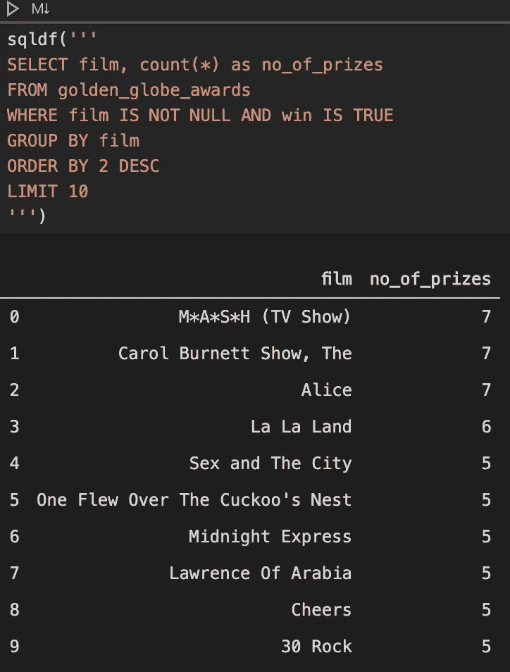
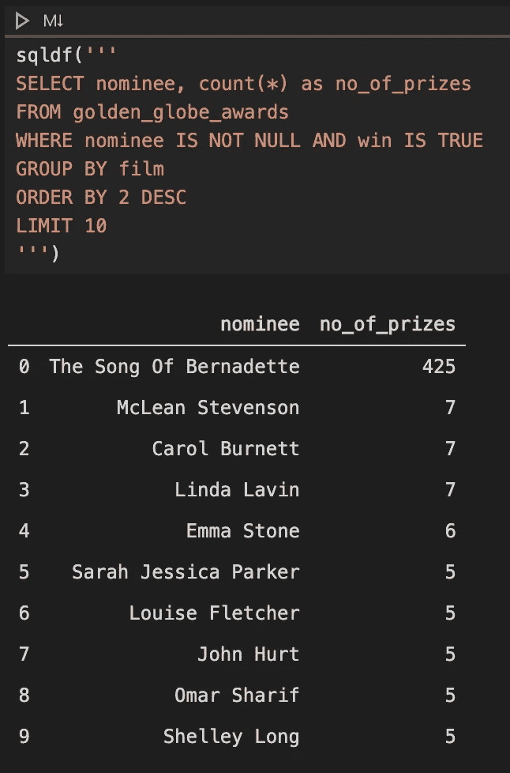

# 对 Pandas 数据帧执行普通 SQL

> 原文：<https://medium.com/analytics-vidhya/executing-plain-sql-over-pandas-dataframes-a2e328e816c1?source=collection_archive---------11----------------------->

有时当使用 Pandas 时，很难像在关系数据库中那样操作数据。一些简单的操作，比如连接或复合过滤器，用 Pandas 库执行起来不是很直观或者太痛苦。

用熊猫加入例子

有一个包叫`pandasql`。它允许我们在 Pandas 数据帧上执行普通的 SQL，从而解决了我们几乎所有的问题。

这是一个非常简单的工具，只需加载你的数据框架，用库工具查询它，就像它是一个表一样。

它使用 SQLite 语法，该语法非常完整，可以处理您在普通关系数据库环境中需要的许多函数。

你甚至可以用它做临时桌子！

由于 SQL 是一种人们更习惯使用的语言，可以称之为“通用”语言，现在您可以使用这个简单的技巧来扩展使用`pandas`的工作范围。

*Obs。:我所有的例子都是用 Jupyter 笔记本做的，出于演示的目的，我并不关心将* `*sqldf*` *函数返回给另一个变量，但是当使用* `*pandasql*` *函数时，您可以自由地继续使用 pandas 数据帧，因为函数的返回是一个转换后的数据帧。*

本例中使用的笔记本可以在[这里](https://github.com/ap3xx/python-contributions/blob/master/pandas/pandasql.ipynb)找到。

请随意访问我的其他资源库，我贴出了许多片段和个人项目，可以帮助你！

关注我这里接收每周的提示和投稿，主要是关于数据工程的。

感谢阅读:)