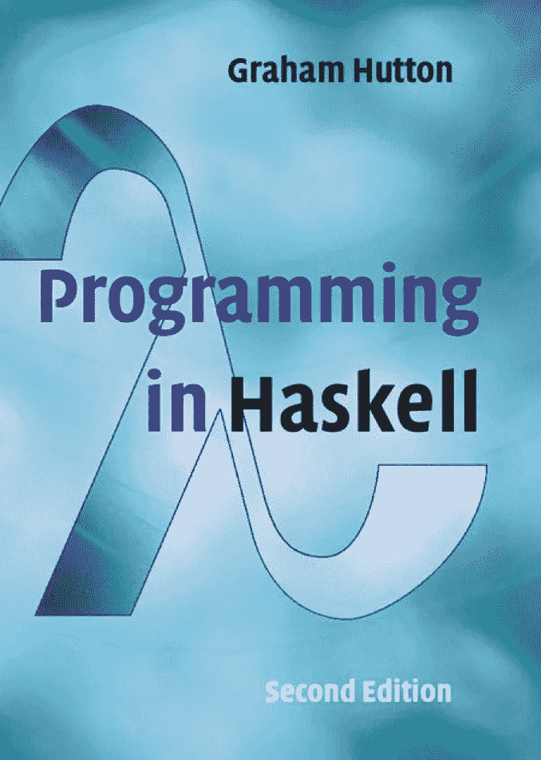
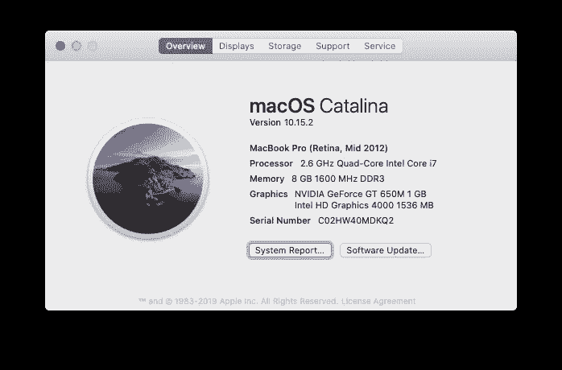

# Haskell 编程练习(1)

> 原文：<https://medium.com/analytics-vidhya/exercises-of-chapter-1-682ad72d25c8?source=collection_archive---------11----------------------->


## 做第一章绪论的练习



在这台 mac 上测试的代码

更改终端提示符和 ghci 提示符。让 ghci 支持多行。

```
% export PS1="👍 "
👍 cat ~/.ghci     
:set prompt "λ: "
:set +m
:set prompt-cont " | "
👍 ghci
GHCi, version 8.2.1: [http://www.haskell.org/ghc/](http://www.haskell.org/ghc/)  :? for help
Loaded GHCi configuration from /Users/zhijunsheng/.ghci
λ:
```

1.  对`double (double 2)`的结果给出另一种可能的计算。

```
λ: double x = x + x
λ: double 2 + double 2
8
λ: double (double 2)
8
```

2.显示`sum [x] = x`为任意数字`x`。

```
λ: sum [5]
5
λ: sum [1024]
1024
```

3.定义一个函数`product`，它产生一系列数字的乘积，并使用您的定义显示`product [2,3,4] = 24`。

```
λ: let
 | product' :: Num a => [a] -> a
 | product' [] = 1
 | product' [n] = n
 | product' (n:ns) = n * product' ns
 | 
λ: product' []
1
λ: product' [7]
7
λ: product' [2,3,4]
24
```

另一种实现多行的方法是使用:{ and :}，就像这样:

```
𝜆: :{
Prelude| prod :: Num a => [a] -> a
Prelude| prod [] = 1
Prelude| prod [n] = n
Prelude| prod (n:ns) = n * prod ns
Prelude| 
Prelude| :}
𝜆: prod []
1
𝜆: prod [7]
7
𝜆: prod [2,3,4]
24
```

4.应该如何修改函数`qsort` b 的定义，以便它产生一个列表的反向排序版本？

```
λ: let
 | qsort :: Ord a => [a] -> [a]
 | qsort [] = []
 | qsort (x:xs) = qsort larger ++ [x] ++ qsort smaller
 |                where smaller = [y | y <- xs, y <= x]
 |                      larger = [y | y <- xs, y > x]
 | 
λ: qsort "Golden Thumb"
"uonmlhedbTG "
λ: qsort [3,5,1,0,-2,9]
[9,5,3,1,0,-2]
λ: qsort "Good morning"
"rooonnmigdG "
```

5.将`qsort`原定义中的`≤`替换为`<`会有什么影响？提示:考虑例子`qsort [2,2,3,1,1]`。

```
λ: let
 | qsort :: Ord a => [a] -> [a]
 | qsort [] = []
 | qsort (x:xs) = qsort smaller ++ [x] ++ qsort larger
 |                where smaller = [y | y <- xs, y < x]
 |                      larger = [y | y <- xs, y > x]
 | 
λ: qsort "Good morning"
" Gdgimnor"
λ: qsort [2,2,3,1,1]
[1,2,3]
λ: qsort "Good morning"
" Gdgimnor"
```

结果列表中没有重复。

[编程中的 Haskell 练习题(1)](/analytics-vidhya/exercises-of-chapter-1-682ad72d25c8?source=friends_link&sk=548cbffc0d042d36b29c4aa9466cd44e)

[编程中的 Haskell 练习(二)](/@zhijunsheng/programming-in-haskell-exercises-2-2c2afbc73bc9?sk=107d6c9f8fd970b92f6f3ad161b3b3fc)

[编程中的 Haskell 练习(三)](/@zhijunsheng/programming-in-haskell-exercises-3-9a3255f1e07e?sk=d66930454ef4ae1d5b23af40f85e2593)