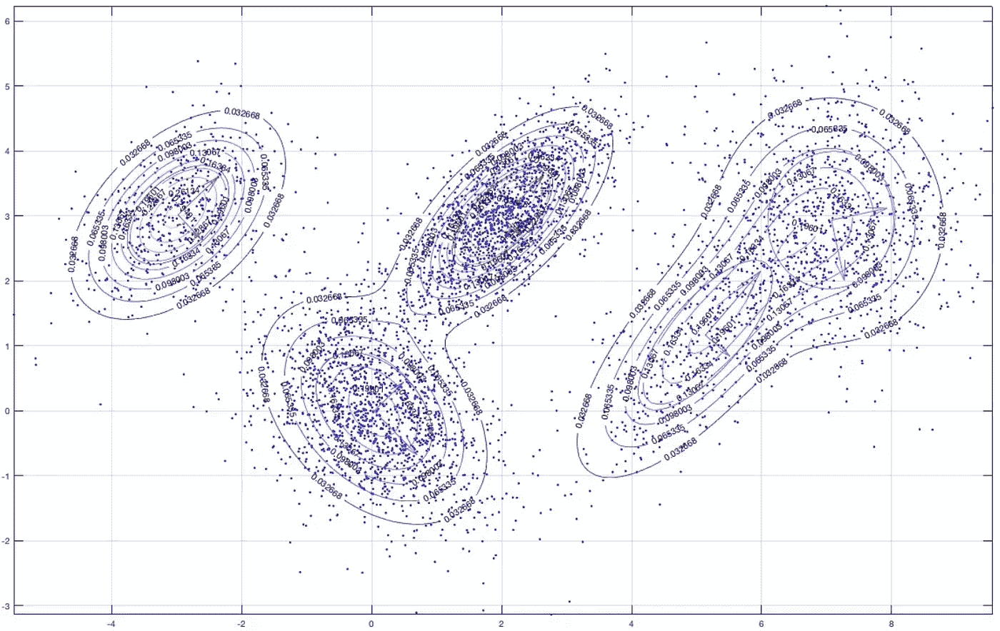

# 逐步期望最大化算法

> 原文：<https://medium.com/analytics-vidhya/expectation-maximization-algorithm-step-by-step-30157192de9f?source=collection_archive---------3----------------------->

## 高斯混合模型、贝叶斯推理、硬聚类与软聚类

来源:[赛德克](http://georgepavlides.info/expectation-maximization-gaussian-mixtures-vectorized-matlab-octave-approach/)

由于 EM 算法涉及到对贝叶斯推理框架(先验、似然和后验)的理解，我想在这篇文章中一步一步地介绍该算法，作为贝叶斯推理的回顾和应用示例。

## 问题设置

假设我们在ℝᵈ有 **n 个训练数据点**(即每个数据点 x 有 d 个属性)，我们知道它们是由一个**高斯混合模型(GMM)** 生成的。现在我们的任务是估计最有可能产生这些数据点的 GMM。

这个问题的一个简单版本是假设数据点 x1 是由混合模型的一个高斯分量产生的。换句话说，它要么属于一个集群，要么不属于。这被认为是**硬聚类**。

一个更柔和的版本，或者更精确的版本，是假设数据点 x 是由高斯分量以某种概率产生的。它被认为是**软聚类**，将是我演示的一个。

因为我想练习用一般术语思考这些算法，所以我将抽象地设置这个问题。

假设我们要估计的 GMM 有以下参数-

1.  **K 个分量** — K 个高斯分布在这个混合模型中，
2.  每个高斯 j(并且 j = 1，2，… K)由其自身的 **μ** 和 **𝜎** 定义，如下所示

注意:我没有放单位矩阵，但是这不应该影响我们如何理解它

请注意:

*   μ是ℝᵈ中的向量，就像随机变量 x 一样；
*   𝜎(以及𝜎)是一个定标员；
*   x-μ表示向量范数，即这两个向量之间的距离，因此也是一个标量

3.每个高斯分量都有一个**混合** **权重 P** ，表示该分量的似然性。我们也可以将其视为生成数据点的第一步。我们首先掷出一个不公平的 K 边骰子，并确定我们将从哪个高斯分量中抽取数据点。

组件 j 的“出现”遵循具有 K 个概率参数的多项式分布

4.让我们把所有要估计的参数记为θ

## 最大似然估计

本质上，最大似然估计寻找的是最大化观察我们所观察到的可能性的参数。在这种情况下，我们可以用公式表示如下所示的似然方程，最大化它将为我们提供每个高斯分量的最佳参数。

我们通常取这种可能性的对数，即对数可能性，因此乘积成为对数项的和。

然而，考虑到要估计的参数数量，这可能非常复杂。因此，这种方法的替代方法是 EM 算法。

## 初始化

就像在 k-means 聚类中，我们为每个聚类初始化一个代表，我们需要初始化θ。

## 电子步骤(期望)

给定所有定义(初始化)的参数，然后我们可以计算**每个数据点 I 属于高斯分量 j 的后验概率**，换句话说，给定所有观察到的数据点，每个分量的权重是多少？

**先验**为 P(j)，属于分量 j 的数据点的**似然**为 P(Xn|j)。所有高斯分量的似然性之和，即观察到我们所观察到的事物的似然性，是我们之前定义的 P(X |θ),并且是这个后验概率方程中的分母。

## m 步(最大化)

在 E-step 中，我们估计了属于高斯分量 j 的每个数据点的后验概率。由于一个数据点可以属于多个聚类，因此它们也可以被视为软计数。

这样，我们就可以重新估计所有的参数，使我们观察到的可能性最大化。

首先，我们想要在给定 P(j|i)的情况下重新估计先验 P(j)。

分子是我们的软计数；对于分量 j，我们将所有数据点的“软计数”相加，即后验概率。

接下来，我们将使用 MLE 来估计高斯分量参数μ 和𝜎。我们不是直接最大化下面的似然函数，而是最大化它的对数形式。

这是我们之前指定的可能性函数

让我们将可能性的对数表示为 l，它是所有观察到的数据点和参数的函数。

注意，先验 Pj 被替换为我们刚刚基于后验概率 P(j|i)估计的先验。

如果您分别根据μ 和𝜎对此方程求导，并求解两者，那么您将得出以下估计值，这些估计值很直观，因为它们可以被解读为某种形式的加权平均值。

## 循环

我们将用新估计的参数继续 E 步，然后 M 步，如此等等，直到结果收敛，即对数似然开始变平(不再显著增加)。

## 附加注释

应该注意，EM 算法仅保证局部最优。换句话说，不同的初始化参数可能导致不同的最优值。因此，带有一些洞察力的初始化可以帮助避免不太喜欢的最佳结果。例如，我们可以使用 k-means 来决定代表μs，并使用全局变量作为开始𝜎。